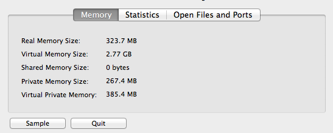

# Why does my Java process consume more memory than Xmx?

June 18, 2013 by Vladimir Šor Filed under: *Memory Leaks*

Some of you have been there. You have added *-Xmx* option to your startup scripts and sat back relaxed knowing that there is no way your Java process is going to eat up more memory than your fine-tuned option had permitted. And then you were in for a nasty surprise. Either by yourself when checking a process table in your development / test box or if things got really bad then by operations who calls you in the middle of the night telling that the 4G memory you had asked for the production is exhausted. And that the application just died.

So what the heck is happening under the hood? Why is the process consuming more memory than you allocated? Is it a bug or something completely normal? Bear with me and I will guide you through what is happening.

First of all, part of it can definitely be a malicious native code leaking memory. But in 99% of the cases it is completely normal behaviour by the JVM. What you have specified via the *-Xmx* switches is limiting the memory consumed by **your application** heap.

Besides heap there are other regions in memory which your application is using under the hood – namely permgen and stack sizes. So in order to limit those you should also specify the *-XX:MaxPermSize* and *-Xss* options respectively. In short, you can predict **your application** memory usage with the following formula

```
Max memory = [-Xmx] + [-XX:MaxPermSize] + number_of_threads * [-Xss]
```

But besides the memory consumed by **your application, the JVM itself also needs some elbow room**. The need for it derives from several different reasons:

- Garbage collection. As you might recall, Java is a garbage-collected language. In order for the garbage collector to know which objects are eligible for collection, it needs to keep track of the object graphs. So this is one part of the memory lost to this internal bookkeeping. [G1](https://plumbr.io/handbook/garbage-collection-algorithms-implementations#g1) is especially known for its excessive appetite for additional memory, so be aware of this.
- JIT optimization. Java Virtual Machine optimizes the code during runtime. Again, to know which parts to optimize it needs to keep track of the execution of certain code parts. So again, you are going to lose memory.
- Off-heap allocations. If you happen to use off-heap memory, for example while using direct or mapped [ByteBuffers](http://docs.oracle.com/javase/7/docs/api/index.html?java/nio/ByteBuffer.html) yourself or via some clever 3rd party API then voila – you are extending your heap to something you actually cannot control via JVM configuration.
- JNI code. When you are using native code, for example in the format of [Type 2](http://en.wikipedia.org/wiki/JDBC_driver#Type_2_Driver_-_Native-API_Driver) database drivers, then again you are loading code in the native memory.
- Metaspace. If you are an early adopter of Java 8, you are using metaspace instead of the good old permgen to store class declarations. This is unlimited and in a native part of the JVM.

You can end up using memory for other reasons than listed above as well, but I hope I managed to convince you that there is a significant amount of memory eaten up by the JVM internals. But is there a way to predict how much memory is actually going to be needed? Or at least understand where it disappears in order to optimize?

As we have found out via painful experience – it is not possible to predict it with reasonable precision. The JVM overhead can range from anything between just a few percentages to several hundred %. Your best friend is again the good old trial and error. So you need to run your application with loads similar to production environment and measure it.

Did you know that 20% of Java applications have memory leaks? Don’t kill your application – instead find and fix leaks with [Plumbr](https://plumbr.io/memory-leak) in minutes.

Measuring the additional overhead is trivial – just monitor the process with the OS built-in tools ([top](http://linux.about.com/od/commands/l/blcmdl1_top.htm) on Linux, [Activity Monitor](http://en.wikipedia.org/wiki/Activity_Monitor) on OS X, [Task Manager](http://en.wikipedia.org/wiki/Windows_Task_Manager) on Windows) to find out the real memory consumption. Subtract the heap and permgen sizes from the real consumption and you see the overhead posed.

Now if you need to reduce to overhead you would like to understand where it actually disappears. We have found [vmmap](https://developer.apple.com/library/mac/documentation/darwin/reference/manpages/man1/vmmap.1.html) on Mac OS X and [pmap](http://linux.die.net/man/1/pmap) on Linux to be a truly helpful tools in this case. We have not used the [vmmap port](http://technet.microsoft.com/en-us/sysinternals/dd535533.aspx) to Windows by ourselves, but it seems there is a tool for Windows fanboys as well.

The following example illustrates this situation. I have launched my Jetty with the following startup parameters:

```
-Xmx168m -Xms168m -XX:PermSize=32m -XX:MaxPermSize=32m -Xss1m
```

Knowing that I have 30 threads launched in my application I might expect that my memory usage does not exceed 230M no matter what. But now when I look at the [Activity Monitor](http://en.wikipedia.org/wiki/Activity_Monitor) on my Mac OS X, I see something different



The real memory usage has exceeded 320M. Now digging under the hood how the process with the help of the [vmmap](https://developer.apple.com/library/mac/documentation/darwin/reference/manpages/man1/vmmap.1.html) <pid> output we start to understand where the memory is disappearing. Lets go through some samples:

The following says we have lost close to 2MB that is lost to memory-mapped rt.jar library.

```
mapped file            00000001178b9000-0000000117a88000 [ 1852K] r--/r-x SM=ALI  /Library/Java/JavaVirtualMachines/jdk1.7.0_21.jdk/Contents/Home/jre/lib/rt.jar
```

Next section explains that we are using ~6MB for a particular Dynamic Library that we have loaded

```
__TEXT                 0000000104573000-0000000104c00000 [ 6708K] r-x/rwx SM=COW  /Library/Java/JavaVirtualMachines/jdk1.7.0_21.jdk/Contents/Home/jre/lib/server/libjvm.dylib
```

And here we have threads no 25-30 each allocating 1MB for their stacks and stack guards

```
Stack 000000011a5f1000-000000011a6f0000 [ 1020K] rw-/rwx SM=ZER thread 25
Stack 000000011aa8c000-000000011ab8b000 [ 1020K] rw-/rwx SM=ZER thread 27
Stack 000000011ab8f000-000000011ac8e000 [ 1020K] rw-/rwx SM=ZER thread 28
Stack 000000011ac92000-000000011ad91000 [ 1020K] rw-/rwx SM=ZER thread 29
Stack 000000011af0f000-000000011b00e000 [ 1020K] rw-/rwx SM=ZER thread 30
STACK GUARD 000000011a5ed000-000000011a5ee000 [ 4K] ---/rwx SM=NUL stack guard for thread 25
STACK GUARD 000000011aa88000-000000011aa89000 [ 4K] ---/rwx SM=NUL stack guard for thread 27
STACK GUARD 000000011ab8b000-000000011ab8c000 [ 4K] ---/rwx SM=NUL stack guard for thread 28
STACK GUARD 000000011ac8e000-000000011ac8f000 [ 4K] ---/rwx SM=NUL stack guard for thread 29
STACK GUARD 000000011af0b000-000000011af0c000 [ 4K] ---/rwx SM=NUL stack guard for thread 30
```

I hope I managed to shed some light on the tricky task of predicting and measuring the actual memory consumption. If you enjoyed the content – subscribe to our [RSS feed](http://plumbr.io/blog/feed) or start [following us on Twitter](https://twitter.com/intent/follow?region=follow_link&screen_name=javaplumbr) to be notified on future posts of interest.

### 

## ADD COMMENT


- Name

  

- E-mail

  


## COMMENTS

Perhaps this article should be updated with all latest information.

It seems that all jar files on all classloaders are also part of RSS memory on Linux.
That adds some MBs to the memory consumption of the Java process too when running an application that has a lot of jar dependencies.
jar files are mmapped and the memory can be shared with other processes, but it still adds up to the RSS memory of the Java process.
I’m making this conclusion based on some pmap outputs from some java processes.

Here are examples of other parameters on JDK8 to control out-of-heap memory limits:
`-XX:InitialCodeCacheSize=64M -XX:CodeCacheExpansionSize=1M -XX:CodeCacheMinimumFreeSpace=1M -XX:ReservedCodeCacheSize=200M-XX:MinMetaspaceExpansion=1M -XX:MaxMetaspaceExpansion=8M -XX:MaxMetaspaceSize=200M-XX:MaxDirectMemorySize=96M-XX:CompressedClassSpaceSize=256M-Xss1024K`

This is an example from an app with -Xmx1445M -Xms1445M . The total consumption goes to about 2048M with these values in one case.

It should be noted that Metaspace allocation in Java 8 doesn’t work like it did in previous JVMs.
I believe that you shouldn’t set the initial value for Metaspace since the JVM is not doing any preallocation based on that value (http://docs.oracle.com/javase/8/docs/technotes/guides/vm/gctuning/considerations.html#sthref66).

I haven’t come up with a proper equation to explain all of the RSS memory consuption of a Java process.
It would be nice if you could do more research on that subject.
The reason why I’ve had to dig in this is that on CloudFoundry there is an OOM killer (because it’s running the process in a Linux cgroups container which limits memory with OOM killer) when you step over the bounds.
Therefore it would be nice to be able to properly calculate and limit the memory consumption of a Java process without leaving too much safe boundaries (since that amount of memory would be “wasted” and you are paying for it).

Lari HotariApril 22, 2015

[Reply](https://plumbr.io/blog/memory-leaks/why-does-my-java-process-consume-more-memory-than-xmx?replytocom=1162#respond)

One note about the parameters I used to limit RSS memory:
-XX:MinMetaspaceExpansion=1M and -XX:CodeCacheExpansionSize=1M settings seem to reduce resident memory usage over time without doing the MALLOC_* parameter tuning. Perhaps because it helps reduce malloc memory fragmentation.

Lari HotariApril 22, 2015

[Reply](https://plumbr.io/blog/memory-leaks/why-does-my-java-process-consume-more-memory-than-xmx?replytocom=1163#respond)

The malloc / glibc parameter tuning is for Linux of course.

I’ve also used malloc_info for debugging the statistics on malloc allocations. It gives a nice XML report.

It’s easy to call malloc_info by JNA:
https://github.com/lhotari/java-buildpack-diagnostics-app/blob/907d204f21d011f0272c9d47cac9375e5395574b/src/main/groovy/io/github/lhotari/jbpdiagnostics/MallocInfo.java#L20-L28

Lari HotariApril 21, 2015

[Reply](https://plumbr.io/blog/memory-leaks/why-does-my-java-process-consume-more-memory-than-xmx?replytocom=1157#respond)

That’s pretty neat to use it for own code. Any success stories about using output of malloc_info in Java app to solve performance issues?

Vladimir ŠorApril 22, 2015

[Reply](https://plumbr.io/blog/memory-leaks/why-does-my-java-process-consume-more-memory-than-xmx?replytocom=1159#respond)

Currently I’m just gathering some history data with malloc_info just to be able to do analysis of malloc statistics later on. I’m not very familiar with the data it gives and there isn’t proper documentation about it either. the malloc_info source code seems to be the authorative source. https://github.com/bminor/glibc/blob/2959eda9272a033863c271aff62095abd01bd4e3/malloc/malloc.c#L4996-L5169
An important piece of information about mmap stats has been missing, that was added by https://github.com/bminor/glibc/commit/4d653a59ffeae0f46f76a40230e2cfa9587b7e7e , but that won’t be available in the Linux distributions that are most common. malloc_stats contains the mmap stats, but the problem is that it’s written to stderr.

Lari HotariApril 22, 2015

There is also the malloc fragmentation that causes extensive memory use.

Here are some settings to deal with malloc fragmentation:
`# tune glibc memory allocation, optimize for low fragmentation# limit the number of arenasexport MALLOC_ARENA_MAX=2# disable dynamic mmap threshold, see M_MMAP_THRESHOLD in "man mallopt"export MALLOC_MMAP_THRESHOLD_=131072export MALLOC_TRIM_THRESHOLD_=131072export MALLOC_TOP_PAD_=131072export MALLOC_MMAP_MAX_=65536`

Lari HotariApril 21, 2015

[Reply](https://plumbr.io/blog/memory-leaks/why-does-my-java-process-consume-more-memory-than-xmx?replytocom=1156#respond)

Can you also provide some insights about what should be observed and measured before one should use such values, and why exactly these values?

Vladimir ŠorApril 22, 2015

[Reply](https://plumbr.io/blog/memory-leaks/why-does-my-java-process-consume-more-memory-than-xmx?replytocom=1158#respond)

There is an explanation and measurement data about MALLOC_ARENA_MAX on the Heroku website https://devcenter.heroku.com/articles/testing-cedar-14-memory-use .

btw. MALLOC_ARENA_MAX doesn’t work for Ubuntu 10.04 since it had a bug in it’s first implementation. It was fixed in glibc 2.16 and the fix has been back ported to glibc 2.15. I’ve gathered a lot of links to a CloudFoundry Java Buildpack pull request I have made: https://github.com/cloudfoundry/java-buildpack/pull/160 .

—

The reason I’m setting MALLOC_MMAP_THRESHOLD and others is to disable the dynamic mmap threshold in malloc:
https://github.com/bminor/glibc/blob/2959eda9272a033863c271aff62095abd01bd4e3/malloc/malloc.c#L2934-L2943
The values I’ve given might not be optimal, but they are a starting point.

The benefit of using mmap allocations in malloc is that when the memory is released, it can be fully returned to the operating system with munmap. However there is a cost in this and that’s why there are tunable parameters for controlling this.
Docs for M_MMAP_THRESHOLD (and the rational for dynamic mmap threshold) is explained in the source code:
https://github.com/bminor/glibc/blob/2959eda9272a033863c271aff62095abd01bd4e3/malloc/malloc.c#L922-L1009

In the docs there is the assumption:
“This allows us to satisfy requirement 1) under the assumption that long
lived allocations are made early in the process’ lifespan, before it has
started doing dynamic allocations of the same size (which will
increase the threshold).”
I believe that the dynamic mmap threshold algorithm isn’t good for Java applications and leads to a situation where mmap isn’t used when it should be used for memory allocation made in the Java JVM itself. If you look at the algorithm source code, the threshold grows higher when larger blocks of memory are freed. The maximum limit is 64MB on 64bit.
For some reason I’ve noticed that the problem is worse with the Java 8 runtime.

The malloc parameters are also explained in the “man mallopt” man page (http://man7.org/linux/man-pages/man3/mallopt.3.html) .

Here is some information about malloc heap fragmentation https://www.ibm.com/developerworks/community/blogs/kevgrig/entry/linux_native_memory_fragmentation_and_process_size_growth?lang=en .

—

There is also the malloc arenas (controlled with MALLOC_ARENA_MAX) that split the allocation (per thread) into multiple arenas to reduce thread contention in memory allocation. This doesn’t benefit Java either since Java doesn’t do a lot of concurrent allocations by using malloc. Multiple arenas make the fragmentation problem worse.
Default number of arenas is 8 * cpu core count on 64 bit processes. There are recommendations to use 2 or 4 are the MALLOC_ARENA_MAX value for Java processes.

Hadoop has MALLOC_ARENA_MAX=4 in it’s startup scripts:
https://github.com/apache/hadoop/blob/b30ca8ce0e0d435327e179f0877bd58fa3896793/hadoop-common-project/hadoop-common/src/main/bin/hadoop-functions.sh#L807

Lari HotariApril 22, 2015

What about the Code Cache? I don’t think it’ll fit inside one of the mentioned memory regions, and for complex applications we sometimes set it as high as 256m to not get the “hey your code cache is too small, I won’t do JIT anymore” message.

Stefan SeidelJune 18, 2013

[Reply](https://plumbr.io/blog/memory-leaks/why-does-my-java-process-consume-more-memory-than-xmx?replytocom=970#respond)

Unfortunately I do not know any readily available documentation which would state in plain English where that code cache region resides. But it is outside of heap, that sure, so it also contributes to JVM overhead. Thanks for noting this 🙂

iNikemJune 18, 2013

[Reply](https://plumbr.io/blog/memory-leaks/why-does-my-java-process-consume-more-memory-than-xmx?replytocom=971#respond)

I think that you are wrong about PermGen.

The PermGen area is inside of heap, so if you define 500MB for heap, it includes the permgen area (64MB by default).

Edit: you are right, i had read a couple of articles about it and they weren’t clear.

ManuelJune 18, 2013

[Reply](https://plumbr.io/blog/memory-leaks/why-does-my-java-process-consume-more-memory-than-xmx?replytocom=966#respond)

No, you are on the wrong track. Permgen is a separate region in memory and is not residing inside the heap.

Ivo MägiJune 18, 2013

[Reply](https://plumbr.io/blog/memory-leaks/why-does-my-java-process-consume-more-memory-than-xmx?replytocom=967#respond)

Ok, the plot in this article made me think mistakenly …

https://plumbr.eu/blog/what-is-a-permgen-leak

Thanks.

ManuelJune 18, 2013

And the defaults are also both platform and JVM vendor/version specific, so very dangerous conclusions again

Ivo MägiJune 18, 2013

[Reply](https://plumbr.io/blog/memory-leaks/why-does-my-java-process-consume-more-memory-than-xmx?replytocom=969#respond)