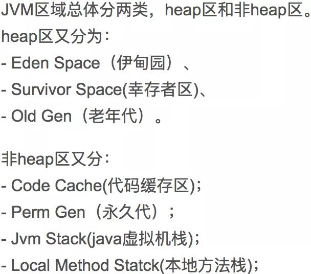

# 注意，Code Cache打满可导致应用性能降低


[Java笔记虾](https://javazhiyin.blog.csdn.net/) 2019-10-21 17:33:00  742  收藏

点击上方“后端技术精选”，选择“置顶公众号”

技术文章第一时间送达！


> 作者：猿码道
>
> juejin.im/post/5aebf997f265da0ba76f99db

## 0 问题描述

一个应用在运行一段时间后，随着访问量不断增加，突然处理能力下降。但是从流量，jstack，gc上看基本正常。感觉好像突然从 “健康状态” 进入了 “虚弱状态”。

## 1 排查问题

**1.在JVM日志里，可以发现如下log：**

```javascript
Java HotSpot(TM) 64-Bit Server VM warning: CodeCache is full. Compiler has been disabled.


Java HotSpot(TM) 64-Bit Server VM warning: Try increasing the code cache size using -XX:ReservedCodeCacheSize=.


...


“CompilerThread0” java.lang.OutOfMemoryError: requested 2854248 bytes for Chunk::new. Out of swap space?
```

说明CodeCache已经满了。而且导致这个时候JIT就会停止，JIT一旦停止，就不会再起来了，可以想象一下，如果很多代码没有办法去JIT的话，性能就会比较差。

**2.使用如下命令检查一下Code Cache的值：**

```javascript
jinfo -flag ReservedCodeCacheSize
```

## 2 解决问题

**1.一个可行的方法，就是扩大Code Cache空间：**

使用 `-XX:ReservedCodeCacheSize=` 指定一个更大的空间，来支持更多的JIT编译；

**2.此外，另一个可行的方法，启用Code Cache的回收机制：**

> - 通过在启动参数上增加：-XX:+UseCodeCacheFlushing 来启用；
> - 打开这个选项，在JIT被关闭之前，也就是CodeCache装满之前，会在JIT关闭前做一次清理，删除一些CodeCache的代码；
> - 如果清理后还是没有空间，那么JIT依然会关闭。这个选项默认是关闭的；

## 3 背景知识

### 3.1 JIT即时编译

在Java中提到“编译”，自然很容易想到 javac 编译器将.java文件编译成为.class文件的过程，这里的 javac 编译器称为前端编译器，其他的前端编译器还有诸如Eclipse，JDT中的增量式编译器ECJ等。

相对应的还有 后端编译器，它在程序运行期间将字节码转变成机器码（现在的Java程序在运行时基本都是 解释执行加编译执行），如HotSpot虚拟机自带的JIT（Just In Time Compiler）编译器（分Client端和Server端）。

Java程序最初是仅仅通过解释器解释执行的，即对字节码逐条解释执行，这种方式的执行速度相对会比较慢，尤其当某个方法或代码块运行的特别频繁时，这种方式的执行效率就显得很低。

于是后来 在虚拟机中引入了JIT编译器（即时编译器），当虚拟机发现某个方法或代码块运行特别频繁时，达到某个阈值，就会把这些代码认定为“Hot Spot Code”（热点代码），为了提高热点代码的执行效率，在运行时，虚拟机将会把这些代码编译成与本地平台相关的机器码，并进行各层次的优化，完成这项任务的正是JIT编译器。

现在主流的商用虚拟机（如：Sun HotSpot、IBM J9）中几乎 都同时包含解释器和编译器，三大商用虚拟机之一的JRockit是个例外，它内部没有解释器，因此会有启动相应时间长之类的缺点，但它主要是面向服务端的应用，这类应用一般不会重点关注启动时间。

解释器与编辑器二者各有优势：

> - 当程序需要迅速启动和执行时，解释器可以首先发挥作用，省去编译的时间，立即执行；
> - 当程序运行后，随着时间的推移，编译器逐渐会发挥作用，把越来越多的代码编译成本地代码后，可以获取更高的执行效率；
> - 解释执行可以节约内存，而编译执行可以提升效率；

运行过程中会被即时编译器编译的“热点代码”有两类：

> - 被多次调用的方法；
> - 被多次调用的循环体；

### 3.2 Code Cache

Java代码在执行时一旦被编译器编译为机器码，下一次执行的时候就会直接执行编译后的代码，也就是说，**编译后的代码被缓存了起来。****缓存编译后的机器码的内存区域就是codeCache。**这是一块独立于Java堆之外的内存区域。**除了JIT编译的代码之外，Java所使用的本地方法代码（JNI）也会存在codeCache中。**



**Code Cache是JVM用于存储经过JIT C1/C2编译优化后的代码。**因为是存在内存中的，所以肯定得限制大小，Code Cache的最大大小可通过 jinfo -flag ReservedCodeCacheSize 来获取，通常在64 bit机器上默认是48m。

**不同版本的JVM、不同的启动方式codeCache的默认大小也不同：**


### 3.3 分层编译

JVM提供了一个参数-Xcomp，可以使JVM运行在纯编译模式下，所有方法在第一次被调用的时候就会被编译成机器代码。加上这个参数之后，随之而来的问题是启动时间变得很长，差不多是原来的2倍还多。

除了纯编译方式和默认的mixed之外，从JDK6u25开始引入了一种分层编译的方式。

Hotspot JVM内置了2种编译器，分别是 client方式启动时用的C1编译器 和 server方式启动时用的C2编译器 。

> - C2编译器在将代码编译成机器码之前，需要收集大量的统计信息以便在编译的时候做优化，因此编译后的代码执行效率也高，代价是程序启动速度慢，并且需要比较长的执行时间才能达到最高性能；
> - C1编译器的目标在于使程序尽快进入编译执行阶段，因此编译前需要收集的统计信息比C2少很多，编译速度也快不少。代价是编译出的目标代码比C2编译的执行效率要低。

尽管如此，C1编译的执行效率也比解释执行有巨大的优势。分层编译方式是一种折衷方式，在系统启动之初执行频率比较高的代码将先被C1编译器编译，以便尽快进入编译执行。随着时间推进，一些执行频率高的代码会被C2编译器再次编译，从而达到更高的性能。

通过以下JVM参数开启分层编译模式：

```javascript
-XX:+TieredCompilation 
```

**在JDK8中，当以server模式启动时，分层编译默认开启。**需要注意的是，分层编译方式只能用于server模式中，如果需要关闭分层编译，需要加上启动参数 `-XX:-TieredCompilation；`如果以client模式启动，`-XX:+TieredCompilation` 参数将会被忽略。

### 3.4 Code Cache 满了怎么办

随着时间推移，会有越来越多的方法被编译，codeCache使用量会逐渐增加，直至耗尽。当Code Cache用满了后，会打印下面的日志：

在JDK1.7.0_4之前，你会在jvm的日志里看到这样的输出：

```javascript
Java HotSpot(TM) 64-Bit Server VM warning: CodeCache is full. Compiler has been disabled.


Java HotSpot(TM) 64-Bit Server VM warning: Try increasing the code cache size using -XX:ReservedCodeCacheSize=.


...


“CompilerThread0” java.lang.OutOfMemoryError: requested 2854248 bytes for Chunk::new. Out of swap space?
```

> - JIT编译器被停止了，并且不会被重新启动，此时会回归到解释执行；
> - 被编译过的代码仍然以编译方式执行，但是尚未被编译的代码就 只能以解释方式执行了。

针对这种情况，JVM提供了一种比较激进的codeCache回收方式：`Speculative flushing`。

**在JDK1.7.0_4之后这种回收方式默认开启**，而之前的版本需要通过一个启动参数来开启：`-XX:+UseCodeCacheFlushing`。

在Speculative flushing开启的情况下，当codeCache将要耗尽时：

> - 最早被编译的一半方法将会被放到一个old列表中等待回收；
> - 在一定时间间隔内，如果old列表中方法没有被调用，这个方法就会被从codeCache充清除；

很不幸的是，在JDK1.7中，当codeCache耗尽时，Speculative flushing释放了一部分空间，但是**从编译日志来看，JIT编译并没有恢复正常**，并且系统整体性能下降很多，出现大量超时。

在Oracle官网上看到这样一个Bug：http://bugs.java.com/bugdatabase/view_bug.do?bug_id=8006952 由于codeCache回收算法的问题，当codeCache满了之后会导致编译线程无法继续，并且消耗大量CPU导致系统运行变慢。Bug里影响版本是JDK8，但是从网上其他地方的信息看，JDK7应该也存在相同的问题，并且没有被修复。

所以，目前来看，开启UseCodeCacheFlushing会导致问题，如下：

> - Code Cache满了时紧急进行清扫工作，它会丢弃一半老的编译代码；
> - Code Cache空间降了一半，方法编译工作仍然可能不会重启；
> - flushing可能导致高的cpu使用，从而影响性能下降；

### 3.6 Code Cache 调优

以client模式或者是分层编译模式运行的应用，**由于需要编译的类更多（C1编译器编译阈值低，更容易达到编译标准），所以更容易耗尽codeCache。**当发现codeCache有不够用的迹象（通过上一节提到的监控方式）时，可以通过启动参数来调整codeCache的大小。

```javascript
 -XX:ReservedCodeCacheSize=256M
```

那具体应该设置为多大合适，根据监控数据估算，例如单位时间增长量、系统最长连续运行时间等。如果没有相关统计数据，一种推荐的设置思路是设置为当前值（或者默认值）的2倍。

需要注意的是，这个**codeCache的值不是越大越好**。对于32位JVM，能够使用的最大内存空间为4g。这个4g的内存空间不仅包括了java堆内存，还包括JVM本身占用的内存、程序中使用的native内存（比如directBuffer）以及codeCache。如果将codeCache设置的过大，即使没有用到那么多，JVM也会为其保留这些内存空间，导致应用本身可以使用的内存减少。对于64位JVM，由于内存空间足够大，codeCache设置的过大不会对应用产生明显影响。

**在JDK 8中，提供了一个启动参数`-XX:+PrintCodeCache`在JVM停止的时候打印出codeCache的使用情况。****其中max_used就是在整个运行过程中codeCache的最大使用量。**可以通过这个值来设置一个合理的codeCache大小，在保证应用正常运行的情况下减少内存使用。

### 3.7 问题解决

问题的前因后果都弄清楚了，也就好解决了。**上面提到过纯编译方式和分层编译方式都可以解决或缓解启动后负载过高的问题**，那么我们就有2种选择：

> - 采用分层编译方式，并修改codeCache的大小为256M；
> - 采用纯编译方式，并修改codeCache的大小为256M；

经过一段时间运行发现，在**启动后负载控制方面，纯编译方式要好一些**，启动之后负载几乎不上升，而 **分层编译方式启动后负载会有所上升，但是不会很高，也会在较短时间内降下来。**

但是启动时间方面，分层编译比原来的默认启动方式缩短了大概10秒（原来启动需要110-130秒），而纯编译方式启动时间比原来多了一倍，达到了250秒甚至更高。所以看起来分层编译方式是更好的选择。

然而JDK 7在codeCache的回收方面做的很不好。即使我们将codeCache设置为256M，线上还是轻易达到了设置的报警阈值200M。而且一旦codeCache满了之后又会导致系统运行变慢的问题。所以我们的目标指向了JDK 8。

测试表明，JDK 8对codeCache的回收有了很明显的改善。不仅codeCache的增长比较平缓，而且当使用量达到75%时，回收力度明显加大，codeCache使用量在这个值上下浮动，并缓慢增长。**最重要的是，JIT编译还在正常执行，系统运行速度也没有收到影响。**

### 3.8 运行时查看Code Cache

如果想在运行时查看code cache的大小，需要写段代码，**目前只能通过JMX来获取到Code Cache区域的使用状况**，代码类似如下：

```javascript
import java.io.File;


 


import javax.management.MBeanServerConnection;


import javax.management.ObjectName;


import javax.management.remote.JMXConnector;


import javax.management.remote.JMXConnectorFactory;


import javax.management.remote.JMXServiceURL;


 


import com.sun.tools.attach.VirtualMachine;


 


public class CodeCacheUsage {


 


    private static final String CONNECTOR_ADDRESS = "com.sun.management.jmxremote.localConnectorAddress";


 


    public static void main(String[] args) throws Exception {


        if(args.length != 1) {


            System.err.println("Must enter one arg: pid");


            System.exit(0);


        }


        VirtualMachine vm = VirtualMachine.attach(args[0]);


        JMXConnector connector = null;


        try {


            String connectorAddress = vm.getAgentProperties().getProperty(CONNECTOR_ADDRESS);


 


            if (connectorAddress == null) {


                String agent = vm.getSystemProperties().getProperty("java.home")


                                        + File.separator


                                        + "lib"


                                        + File.separator + "management-agent.jar";


                vm.loadAgent(agent);


 


                connectorAddress = vm.getAgentProperties().getProperty(CONNECTOR_ADDRESS);


            }


 


            JMXServiceURL url = new JMXServiceURL(connectorAddress);


            connector = JMXConnectorFactory.connect(url);


            MBeanServerConnection mbeanConn = connector.getMBeanServerConnection();


            ObjectName name = new ObjectName("java.lang:type=MemoryPool,name=Code Cache");


            System.out.println(mbeanConn.getAttribute(name, "Usage"));


        } finally {


            if(connector != null)


                connector.close();


            vm.detach();


        }


    }


}
```

传入pid，执行上面的代码后，会输出类似下面的信息：

```javascript
javax.management.openmbean.CompositeDataSupport(compositeType=javax.management.openmbean.CompositeType(name=java.lang.management.MemoryUsage,items=


(


(itemName=committed,itemType=javax.management.openmbean.SimpleType(name=java.lang.Long)),


(itemName=init,itemType=javax.management.openmbean.SimpleType(name=java.lang.Long)),


(itemName=max,itemType=javax.management.openmbean.SimpleType(name=java.lang.Long)),


(itemName=used,itemType=javax.management.openmbean.SimpleType(name=java.lang.Long))


)),


contents={committed=50331648, init=2555904, max=50331648, used=48281152})
```

上面的信息显示Code Cache区域初始化的时候为2555904，最大为50331648，已占用了50331648，使用了48281152。