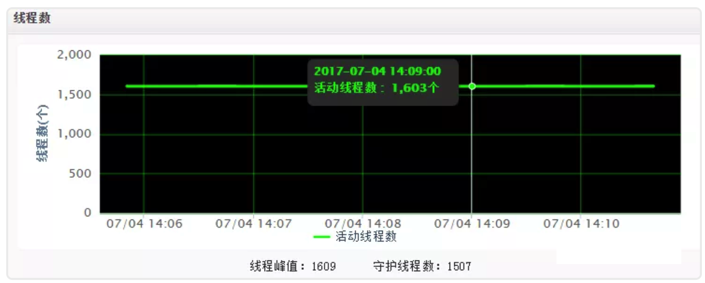
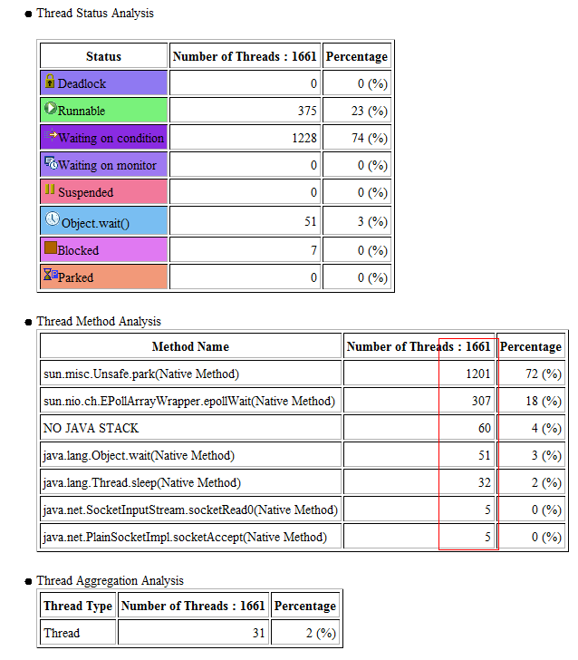
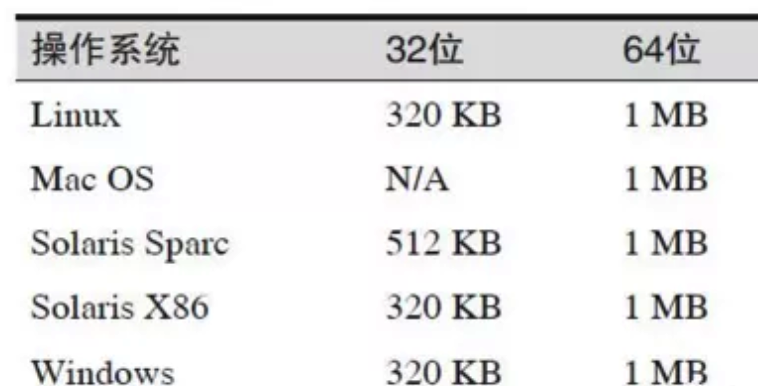
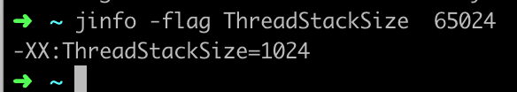
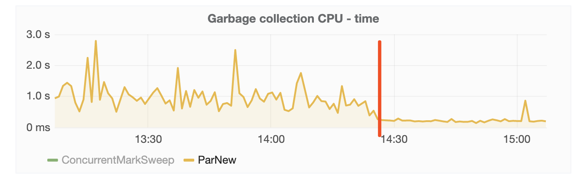

Java服务器可以跑多少个线程以及Docker下GC线程数的问题


**Rico**10月 16, 2019

*bookmark*BOOKMARK

- [Java](https://hogwartsrico.github.io/tags/Java/)

*share*SHARE

[分享到微博](http://service.weibo.com/share/share.php?appkey=&title=Java服务器可以跑多少个线程以及Docker下GC线程数的问题&url=http://hogwartsrico.github.io/2019/10/16/JavaThread/index.html&pic=http://hogwartsrico.github.io/img/favicon.png&searchPic=false&style=simple)[分享到 Twitter](https://twitter.com/intent/tweet?text=Java服务器可以跑多少个线程以及Docker下GC线程数的问题&url=http://hogwartsrico.github.io/2019/10/16/JavaThread/index.html&via=Rico)[分享到 Facebook](https://www.facebook.com/sharer/sharer.php?u=http://hogwartsrico.github.io/2019/10/16/JavaThread/index.html)

## 一台服务器能跑多少java线程?

这个问题来自一次线上报警如下图，超过了配置阈值。



打出jstack文件，通过IBM Thread and Monitor Dump Analyzer for Java工具查看如下：



共计1661个线程，和监控数据得出的吻合。但这个数量应该是大了，**我们都知道线程多了，就会有线程切换，带来性能开销**。

那么一台java服务器到底可以跑多少个线程呢？跟什么有关系？现整理如下。

每个线程都有一个**线程栈空间**通过-Xss设置，查了一下我们服务器的关于jvm内存的配置

-Xms4096m

-Xmx4096m

-XX:MaxPermSize=1024m

只有这三个，并没有-Xss 和-XX:ThreadStackSize的配置，因此是走的默认值。几种JVM的默认栈大小



可以通过如下命令打印输出默认值的大小，**命令：jinfo -flag ThreadStackSize** ；例如



不考虑系统限制，可以通过如下公式计算，得出最大线程数量

**线程数量=（机器本身可用内存-JVM分配的堆内存）/Xss的值**，比如我们的容器本身大小是8G,堆大小是4096M,走-Xss默认值，可以得出 最大线程数量：4096个。

根据计算公式，得出如下结论：

结论1：jvm堆越大，系统创建的线程数量越小。

结论2：**当-Xss的值越小，可生成线程数量越多。**

我们知道操作系统分配给每个进程的内存大小是有限制的，比如32位的Windows是2G。因此**操作系统对一个进程下的线程数量是有限制的，不能无限的增多**。经验值：3000-5000左右（我没有验证）。

刚才说的是不考虑系统限制的情况，那如果考虑系统限制呢，主要跟以下几个参数有关系

/proc/sys/kernel/pid_max 增大，线程数量增大，pid_max有最高值，超过之后不再改变，而且32，64位也不一样

/proc/sys/kernel/thread-max 系统可以生成最大线程数量

max_user_process（ulimit -u）centos系统上才有，没有具体研究

/proc/sys/vm/max_map_count 增大，数量增多

线程是非常宝贵的资源，我们要严格控制线程的数量，象上面我们的截图情况，显然线程数量过多。这个是跟我们自己配置了fixed大小的线程池有关系。京东有自己的rpc框架jsf，里面可以针对每个服务端口设置线程大小。

## Java应用容器化后GC的问题以及解决方案

在docker容器下，应用获取到的主机信息(CPU核数、内存大小等)，都是物理机的信息，JVM在启动时根据系统CPU核数确定GC线程数量。

线上应用启动了53个GC线程，而容器本身只分配了4C，大量线程间的资源竞争和上下文切换，可能导致GC变慢。

JVM在docker环境中，获取到的CPU信息是宿主机的（容器中/proc目录并未做隔离，各容器共享，CPU信息保存在该目录下），并不是指定的六核心，宿主机是八十核心，因此创建的垃圾回收线程数远大于docker环境的CPU资源，导致每次新生代回收线程间竞争激烈，耗时增加

### 解决方案

#### 临时方案

修改JVM启动参数:

4C8G容器：

```
-XX:ParallelGCThreads=4 -XX:ConcGCThreads=2
```

ParallelGCThreads值建议等于CPU核数, ConcGCThreads值建议等于(ParallelGCThreads+3)/4

`-XX:ParallelGCThreads=n` 设置垃圾收集器在并行阶段使用的线程数
`-XX:ConcGCThreads=n` 并发垃圾收集器使用的线程数量

##### -XX：ConcGCThreads

标志`-XX：ConcGCThreads=<value>`(早期JVM版本也叫-XX:ParallelCMSThreads)定义并发CMS过程运行时的线程数。比如value=4意味着CMS周期的所有阶段都以4个线程来执行。尽管更多的线程会加快并发CMS过程，但其也会带来额外的同步开销。因此，对于特定的应用程序，应该通过测试来判断增加CMS线程数是否真的能够带来性能的提升。

如果还标志未设置，JVM会根据并行收集器中的-XX：ParallelGCThreads参数的值来计算出默认的并行CMS线程数。该公式是ConcGCThreads = (ParallelGCThreads + 3)/4。因此，对于CMS收集器， -XX:ParallelGCThreads标志不仅影响“stop-the-world”垃圾收集阶段，还影响并发阶段。

总之，有不少方法可以配置CMS收集器的多线程执行。正是由于这个原因,建议第一次运行CMS收集器时使用其默认设置, 然后如果需要调优再进行测试。只有在生产系统中测量(或类生产测试系统)发现应用程序的暂停时间的目标没有达到 , 就可以通过这些标志应该进行GC调优

**并发和并行的区别**
并发（Concurrent），在操作系统中，是指一个时间段中有几个程序都处于已启动运行到运行完毕之间，且这几个程序都是在同一个处理机上运行。

并发不是真正意义上的“同时进行”，只是CPU把一个时间段划分成几个时间片段（时间区间），然后在这几个时间区间之间来回切换，由于CPU处理的速度非常快，只要时间间隔处理得当，即可让用户感觉是多个应用程序同时在进行。如：打游戏和听音乐两件事情在同一个时间段内都是在同一台电脑上完成了从开始到结束的动作。那么，就可以说听音乐和打游戏是并发的。

并行：

并行（Parallel），当系统有一个以上CPU时，当一个CPU执行一个进程时，另一个CPU可以执行另一个进程，两个进程互不抢占CPU资源，可以同时进行，这种方式我们称之为并行(Parallel)。

其实决定并行的因素不是CPU的数量，而是CPU的核心数量，比如一个CPU多个核也可以并行。


这种临时方案也有缺点，因为一些第三方框架也会根据获取到的CPU数量调整框架的线程数量，为了根本上解决此问题，需要JVM可以正确的获取到容器限制的CPU数量、内存大小等。

#### 永久方案

oracle在JDK 1.8u131开始对Docker容器进行支持，以解决上述问题，并且在JDK1.8u191版本进行了完善，因此升级JDK版本到1.8u191之后的版本即可解决问题

https://www.jianshu.com/p/040a1315bce5

https://www.oracle.com/technetwork/java/javase/8u191-relnotes-5032181.html

oracle官方针对容器的支持在后续的JDK9 JDK10 和JDK11均得到了支持

因此所有应用均升级到JDK8最新的update即可解决问题

### 效果



> **This blog is under a CC BY-NC-SA 3.0 Unported License**
> **本文链接：**http://hogwartsrico.github.io/2019/10/16/JavaThread/