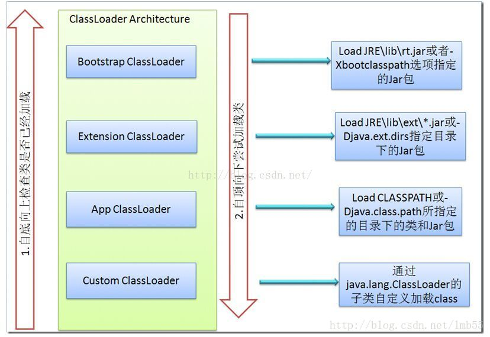
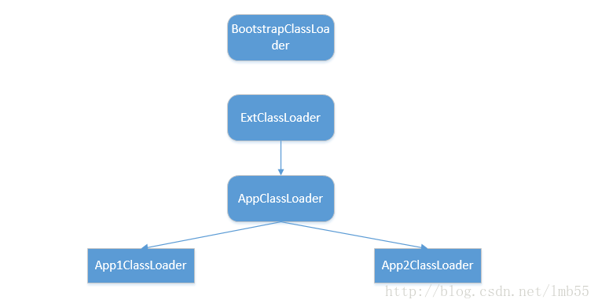
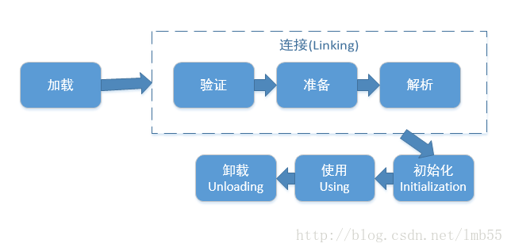
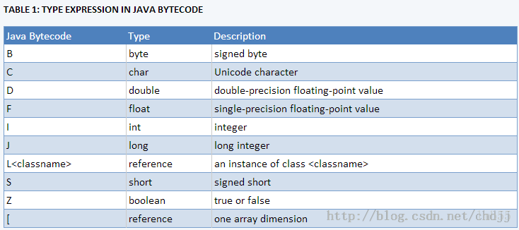
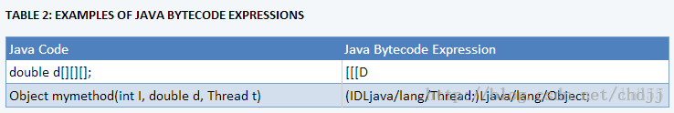

# 【深入理解JVM】ClassLoader类加载机制


[May的博客](https://blog.csdn.net/lmb55) 2016-03-13 22:53:59  2041  收藏 3

分类专栏： [JVM/性能调优](https://blog.csdn.net/lmb55/category_7478747.html) 文章标签： [类文件加载](https://so.csdn.net/so/search/s.do?q=类文件加载&t=blog&o=vip&s=&l=&f=&viparticle=) [classloader](https://www.csdn.net/tags/MtjaAgxsNDU0OTAtYmxvZwO0O0OO0O0O.html) [双亲委派](https://www.csdn.net/tags/MtTaEg0sMzYyOTktYmxvZwO0O0OO0O0O.html) [虚拟机](https://www.csdn.net/tags/MtTaEg0sMDc3NzQtYmxvZwO0O0OO0O0O.html) [字节码](https://www.csdn.net/tags/MtTaEg0sMzA5MTEtYmxvZwO0O0OO0O0O.html)

版权

Java程序并不是一个原生的可执行文件，而是由许多独立的类文件组成，每一个文件对应一个Java类。此外，这些类文件并非立即全部装入内存的，而是根据程序需要装入内存。ClassLoader专门负责类文件装入到内存。

**在class文件中描述的各种信息，最终都需要被加载到虚拟机中之后，才能被运行和使用。虚拟机把描述类的数据从class文件加载到内存，并对数据进行校验，转换，解析和初始化，最终形成可以被虚拟机直接使用的Java类型，这就是虚拟机的类加载机制**。

总结起来ClassLoader的作用：

> (1)加载class文件进入JVM
> (2)审查每个类应该由谁加载，采用双亲委托机制
> (3)将class字节码重新解析成JVM要求的对象格式

### **1、JVM的四种类加载器**

类加载器：**通过一个类的全限定名来获取描述此类的二进制字节流，实现这个动作的代码模块称为“类加载器”**。



从上图我们就可以看出类加载器之间的父子关系(注意不是类的集继承关系)。

> Bootstrap ClassLoader：BootStrap 是最顶层的类加载器，它是由C++编写并且已经内嵌到JVM中了，主要用来读取Java的核心类库JRE/lib/rt.jar。
>
> Extension ClassLoader：负责加载java平台中扩展功能的一些jar包，包括$JAVA_HOME中jre/lib/*.jar或-Djava.ext.dirs指定目录下的jar包。
> App ClassLoader（System ClassLoader）：负责记载classpath中指定的jar包及目录中class。
>
> Custom ClassLoader：属于应用程序根据自身需要自定义的ClassLoader，如tomcat、jboss都会根据j2ee规范自行实现ClassLoader。
>
> 
>
> 如果我们要实现自己的类加载器，不管是直接继承ClassLoader还是继承URLclassLoaderlei ,它的父加载器都是AppClassLoader，因为不管调用哪个父类构造器，创建的对象都必须最终调用getSystemClassLoader（）作为父类加载器，而该方法获取的正是AppClassLoader。
>
> 如果应用中没有定义其他的类加载器，那么除了java.ext.dirs下的类是由ExtClassLoader来加载，其他的都是由AppClassLoader来加载。

下面问题就来了，**JVM有四种类型的类加载器，java是如何区分一个类该由哪个类加载器来完成呢**？

在这里java采用了**双亲委托机制**，这个机制简单来讲，就是“**类装载器有载入类的需求时，会先请示其Parent使用其搜索路径帮忙载入，如果Parent 找不到，那么才由自己依照自己的搜索路径搜索类”**。具体流程如下：

> 1、”A类加载器”加载类时，先判断该类是否已经加载过了；
>
> 2、如果还未被加载，则首先委托其”A类加载器”的”父类加载器”去加载该类，这是一个向上不断搜索的过程，当A类所有的”父类加载器”(包括bootstrap classloader)都没有加载该类，则回到发起者”A类加载器”去加载；
>
> 3、如果还加载不了，则抛出ClassNotFoundException。

### **2、ClassLoader抽象类的几个关键方法**：

> loadClass()
> 此方法负责加载指定名字的类，ClassLoader的实现方法为先从已经加载的类中寻找，如没有则继续从parent ClassLoader中寻找，如仍然没找到，则从System ClassLoader中寻找，最后再调用findClass方法来寻找，如要改变类的加载顺序，则可覆盖此方法
>
> findLoadedClass()
> 此方法负责从当前ClassLoader实例对象的缓存中寻找已加载的类，调用的为native的方法。
>
> findClass()
> 此方法直接抛出ClassNotFoundException，因此需要通过覆盖loadClass或此方法来以自定义的方式加载相应的类。
>
> findSystemClass()
> 此方法负责从SystemClassLoader中寻找类，如未找到，则继续从Bootstrap ClassLoader中寻找，如仍然为找到，则返回null。
>
> defineClass()
> 此方法负责将二进制的字节码转换为Class对象
>
> resolveClass()
> 此方法负责完成Class对象的链接，如已链接过，则会直接返回。
>
> Class.forName()与ClassLoader.loadClass()
> 这两方法都可以通过一个给定的类名去定位和加载这个类名对应的 java.lang.Class 类对象，区别如下：
>
> 1. 初始化
>    Class.forName()会对类初始化，而loadClass()只会装载或链接。ClassLoader.loadClass()加载的类对象是在第一次被调用时才进行初始化的。可以利用上述的差异。比如，要加载一个静态初始化开销很大的类，就可以选择提前加载该类(以确保它在classpath下)，但不进行初始化，直到第一次使用该类的域或方法时才进行初始化。
> 2. 类加载器可能不同
>    Class.forName(String)方法(只有一个参数)，使用调用者的类加载器来加载, 也就是用加载了调用forName方法的代码的那个类加载器。当然，它也有个重载的方法，可以指定加载器。相应的，ClassLoader.loadClass()方法是一个实例方法(非静态方法)调用时需要自己指定类加载器,那么这个类加载器就可能是也可能不是加载调用代码的类加载器（调用代码类加载器通getClassLoader0()获得）

### **3、类的加载过程**

类的加载要经过三步：装载（Load），链接（Link），初始化（Initializ）。其中链接又可分为校验（Verify），准备（Prepare），解析（Resolve）三步。


**三个阶段**：

> (1)第一阶段：找到class文件并把这个文件包含的字节码加载到内存
>
> (2)第二阶段：字节码验证，class类数据结构分析以及相应内存分配，符号表的链接。
>
> (3)第三阶段：类中静态属性初始化赋值以及静态代码块的执行


**总结起来，类从被加载到虚拟机内存开始，到卸载出内存为止，其生命周期包括：加载（loading），验证（verification），准备(preparation)，解析(resolution)，初始化(initialization)，使用(using)，卸载（unloading）**。

**3.1 加载**

ClassLoader就是用来装载的。通过指定的className，找到二进制码，生成Class实例，放到JVM中。
在加载阶段，虚拟机需要完成以下三件事（虚拟机规范对这三件事的要求并不具体，因此虚拟机实现与具体应用的灵活度相当大）：

> 1，通过一个类的全限定名获取定义这个类的二进制流
> 可以从jar包、ear包、war包中获取，可以从网络中获取（Applet），可以运行时生成（动态代理），可以通过其它文件生成（Jsp）等。
>
> 2，将这个字节流代表的静态存储结构转化为方法区的运行时数据结构。
>
> 3，在Java堆中生成一个代表这个类的java.lang.Class对象，作为方法区这些数据的访问入口。

在抽象类ClassLoader中没有定义如何去加载，如何去找到指定类并加载到内存中需要子类中去实现，即实现findClass()方法。如在URLClassLoader中通过一个URLClassPath类帮组取得要加载的class文件字节流，而这个URLClassPath定义了到哪里去找这个class文件，如果找到这个class文件，再读取byte字节流通过调用defineClass方法来创建类对象。

**JVM加载Class文件到内存的两种方式：**

(1)隐式加载：在代码中不通过调用ClassLoader来加载需要的的类，而是通过JVM自动加载需要的类到内存方式。如我们类继承或类中引用其他类的时候，JVM在解析当前这个类的时候发现引用类不在内存中就会去自动的将这些类加载进入到内存。

(2)显示加载：在代码中通过调用ClassLoader类来加载类。如this.getClass().getClassLoader().loadClass()或者Class.forName()或者我们自己实现的findClass()方法。

比如：数组类的 Class 对象不是由类加载器创建的，而是由 Java 运行时根据需要自动创建。数组类的类加载器由 Class.getClassLoader() 返回，该加载器与其元素类型的类加载器是相同的；如果该元素类型是基本类型，则该数组类没有类加载器。

**3.2 链接**

**链接就是把load进来的class合并到JVM的运行时状态中**。可以把它分成三个主要阶段：

**3.2.1 校验**
对二进制字节码的格式进行校验，以确保格式正确、行为正确。这一阶段主要是为了确保Class文件的字节流中包含的信息复合当前虚拟机的要求，并且不会危害虚拟机自身的安全。主要验证过程包括：

> 1.文件格式验证：验证字节流文件是否符合Class文件格式的规范，并且能被当前虚拟机正确的处理。
>
> 2.元数据验证：是对字节码描述的信息进行语义分析，以保证其描述的信息符合Java语言的规范。
>
> 3.字节码验证：主要是进行数据流和控制流的分析，保证被校验类的方法在运行时不会危害虚拟机。
>
> 4.符号引用验证：符号引用验证发生在虚拟机将符号引用转化为直接引用的时候，这个转化动作将在解析阶段中发生。

**3.2.2 准备**
准备类中定义的字段、方法和实现接口所必需的数据结构。比如会为类中的静态变量赋默认值(int等:0, reference:null, char:’\u0000’)。
准备阶段正式为类变量分配内存并设置初始值。这里的初始值并不是初始化的值，而是数据类型的默认零值。这里提到的类变量是被static修饰的变量，而不是实例变量。关于准备阶段为类变量设置零值的唯一例外就是当这个类变量同时也被final修饰，那么在编译时，就会直接为这个常量赋上目标值。

如：
pirvate static int size = 12;
那么在这个阶段，size的值为0，而不是12。 final修饰的类变量将会赋值成真实的值。

**3.2.3 解析**
虚拟机将常量池内的符号引用替换为直接引用的过程。装入类所引用的其他所有类，虚拟机将常量池中的符号引用替换为直接引用。可以用许多方式引用类：超类、接口、字段、方法签名、方法中使用的本地变量。

**3.3 初始化**
到初始化阶段，才真正开始执行类中定义的java程序代码；

**在准备阶段，变量已经赋过一次系统要求的初始值，在初始化阶段，则是根据程序员通过程序的主观计划区初始化类变量和其他资源**。

类初始化前，它的直接父类一定要先初始化（递归），但它实现的接口不需要先被初始化。类似的，接口在初始化前，父接口不需要先初始化。

**有且只有4种情况必须立即对类进行初始化**：

1，遇到new（使用new关键字实例化对象）、getstatic（获取一个类的静态字段，final修饰符修饰的静态字段除外）、putstatic（设置一个类的静态字段，final修饰符修饰的静态字段除外）和invokestatic（调用一个类的静态方法）这4条字节码指令时，如果类还没有初始化，则必须首先对其初始化

2，使用java.lang.reflect包中的方法对类进行反射调用时，如果类还没有初始化，则必须首先对其初始化

3，当初始化一个类时，如果其父类还没有初始化，则必须首先初始化其父类

4，当虚拟机启动时，需要指定一个主类（main方法所在的类），虚拟机会首选初始化这个主类
除了上面这4种方式，所有引用类的方式都不会触发初始化，称为被动引用。如：通过子类引用父类的静态字段，不会导致子类初始化；通过数组定义来引用类，不会触发此类的初始化；引用类的静态常量不会触发定义常量的类的初始化，因为常量在编译阶段已经被放到常量池中了。

### **附录一：Java字节码（Java bytecode)**

为了保证WORA，JVM使用Java字节码这种介于Java和机器语言之间的中间语言。字节码是部署Java代码的最小单位。

在解释Java字节码之前，我们先通过实例来简单了解它。这个案例是一个在开发环境出现的真实案例的总结。

> 现象：一个一直运行正常的应用突然无法运行了。在类库被更新之后，返回下面的错误。

```
Exception in thread "main" java.lang.NoSuchMethodError: com.nhn.user.UserAdmin.addUser(Ljava/lang/String;)V  

at com.nhn.service.UserService.add(UserService.java:14)  
at com.nhn.service.UserService.main(UserService.java:19)  1234
```

应用的代码如下，而且它没有被改动过：

```
 // UserService.java  
public void add(String userName) {  
    admin.addUser(userName);  
} 1234
```

更新后的类库的源代码和原始的代码如下：

```
    // UserAdmin.java - Updated library source code  
    public User addUser(String userName) {  
        User user = new User(userName);  
        User prevUser = userMap.put(userName, user);  
        return prevUser;  
    }  
    // UserAdmin.java - Original library source code  
    public void addUser(String userName) {  
        User user = new User(userName);  
        userMap.put(userName, user);  
    }  1234567891011
```

简而言之，之前没有返回值的addUser()被改修改成返回一个User类的实例的方法。不过，应用的代码没有做任何修改，因为它没有使用addUser()的返回值。咋一看，com.nhn.user.UserAdmin.addUser()方法似乎仍然存在，如果存在的话，那么怎么还会出现NoSuchMethodError的错误呢？

> 原因：上面问题的原因是在于应用的代码没有用新的类库来进行编译。换句话来说，应用代码似乎是调了正确的方法，只是没有使用它的返回值而已。不管怎样，编译后的class文件表明了这个方法是有返回值的。你可以从下面的错误信息里看到答案。

```
java.lang.NoSuchMethodError:com.nhn.user.UserAdmin.addUser(Ljava/lang/String;)V  1
```

NoSuchMethodError出现的原因是“com.nhn.user.UserAdmin.addUser(Ljava/lang/String;)V”方法找不到。注意一下”Ljava/lang/String；”和最后面的“V”。在Java字节码的表达式里，”L;”表示的是类的实例。这里表示addUser()方法有一个java/lang/String的对象作为参数。在这个类库里，参数没有被改变，所以它是正常的。最后面的“V”表示这个方法的返回值。在Java字节码的表达式里，”V”表示没有返回值（Void）。综上所述，上面的错误信息是表示有一个java.lang.String类型的参数，并且没有返回值的com.nhn.user.UserAdmin.addUser方法没有找到。

因为应用是用之前的类库编译的，所以返回值为空的方法被调用了。但是在修改后的类库里，返回值为空的方法不存在，并且添加了一个返回值为“Lcom/nhn/user/User”的方法。因此，就出现了NoSuchMethodError。

注：这个错误出现的原因是因为开发者没有用新的类库来重新编译应用。不过，出现这种问题的大部分责任在于类库的提供者。这个public的方法本来没有返回值的，但是后来却被修改成返回User类的实例。很明显，方法的签名被修改了，这也表明了这个类库的后向兼容性被破坏了。因此，这个类库的提供者应该告知使用者这个方法已经被改变了。

我们再回到Java字节码上来。Java字节码是JVM很重要的部分。JVM是模拟执行Java字节码的一个模拟器。Java编译器不会直接把高级语言（例如C/C++）编写的代码直接转换成机器语言（CPU指令）；它会把开发者可以理解的Java语言转换成JVM能够理解的Java字节码。因为Java字节码本身是平台无关的，所以它可以在任何安装了JVM（确切地说，是相匹配的JRE）的硬件上执行，即使是在CPU和OS都不相同的平台上（在Windows PC上开发和编译的字节码可以不做任何修改就直接运行在Linux机器上）。编译后的代码的大小和源代码大小基本一致，这样就可以很容易地通过网络来传输和执行编译后的代码。

Java class文件是一种人很难去理解的二进文件。为了便于理解它，JVM提供者提供了javap，反汇编器。使用javap产生的结果是Java汇编语言。在上面的例子中，下面的Java汇编代码是通过javap -c对UserServiceadd()方法进行反汇编得到的。

```
    public void add(java.lang.String);  
      Code:  
       0:   aload_0  
       1:   getfield        #15; //Field admin:Lcom/nhn/user/UserAdmin;  
       4:   aload_1  
       5:   invokevirtual   #23; //Method com/nhn/user/UserAdmin.addUser:(Ljava/lang/String;)V  
       8:   return  1234567
```

invokeinterface:调用一个接口方法在这段Java汇编代码中，addUser()方法是在第四行的“5:invokevitual#23″进行调用的。这表示对应索引为23的方法会被调用。索引为23的方法的名称已经被javap给注解在旁边了。invokevirtual是Java字节码里调用方法的最基本的操作码。在Java字节码里，有四种操作码可以用来调用一个方法，分别是：invokeinterface，invokespecial，invokestatic以及invokevirtual。操作码的作用分别如下：

> invokespecial: 调用一个初始化方法，私有方法或者父类的方法
> invokestatic:调用静态方法
> invokevirtual:调用实例方法

Java字节码的指令集由操作码和操作数组成。类似invokevirtual这样的操作数需要2个字节的操作数。

用更新的类库来编译上面的应用代码，然后反编译它，将会得到下面的结果。

```
    public void add(java.lang.String);  
      Code:  
       0:   aload_0  
       1:   getfield        #15; //Field admin:Lcom/nhn/user/UserAdmin;  
       4:   aload_1  
       5:   invokevirtual   #23; //Method com/nhn/user/UserAdmin.addUser:(Ljava/lang/String;)Lcom/nhn/user/User;  
       8:   pop  
       9:   return  12345678
```

你会发现，对应索引为23的方法被替换成了一个返回值为”Lcom/nhn/user/User”的方法。在上面的反汇编代码里，代码前面的数字代码什么呢？

它表示的是字节数。大概这就是为什么运行在JVM上面的代码成为Java“字节”码的原因。简而言之，Java字节码指令的操作码，例如aload_0，getfield和invokevirtual等，都是用一个字节的数字来表示的（aload_0=0x2a,getfield=0xb4,invokevirtual=0xb6)。由此可知Java字节码指令的操作码最多有256个。

aload_0和aload_1这样的指令不需要任何操作数。因此，aload_0指令的下一个字节是下一个指令的操作码。不过，getfield和invokevirtual指令需要2字节的操作数。因此，getfiled的下一条指令是跳过两个字节，写在第四个字节的位置上的。十六进制编译器里查看字节码的结果如下所示。

> 2a b4 00 0f 2b b6 00 17 57 b1

表一：Java字节码中的类型表达式在Java字节码里，类的实例用字母“L;”表示，void 用字母“V”表示。通过这种方式，其他的类型也有对应的表达式。下面的表格对此作了总结。



下面的表格给出了字节码表达式的几个实例。

表二：Java字节码表达式范例



### **附录二 Class文件格式**

在讲解Java class文件格式之前，我们先看看一个在Java Web应用中经常出现的问题。

> 现象：当我们编写完jsp代码，并且在Tomcat运行时，Jsp代码没有正常运行，而是出现了下面的错误。

```
Servlet.service() for servlet jsp threw exception org.apache.jasper.JasperException: Unable to compile class for JSP Generated servlet error:  

The code of method _jspService(HttpServletRequest, HttpServletResponse) is exceeding the 65535 bytes limit"  123
```

> 原因：在不同的Web服务器上，上面的错误信息可能会有点不同，不过有有一点肯定是相同的，它出现的原因是65535字节的限制。这个65535字节的限制是JVM规范里的限制，它规定了一个方法的大小不能超过65535字节。

下面我会更加详细地讲解这个65535字节限制的意义以及它出现的原因。

Java字节码里的分支和跳转指令分别是”goto”和”jsr”。

```
goto [branchbyte1] [branchbyte2]  
jsr [branchbyte1] [branchbyte2]  
12
```

这两个指令都接收一个2字节的有符号的分支跳转偏移量做为操作数，因此偏移量最大只能达到65535。不过，为了支持更多的跳转，Java字节码提供了”goto_w”和”jsr_w”这两个可以接收4字节分支偏移的指令。

```
goto_w [branchbyte1] [branchbyte2] [branchbyte3] [branchbyte4]  
jsr_w [branchbyte1] [branchbyte2] [branchbyte3] [branchbyte4]  
12
```

有了这两个指令，索引超过65535的分支也是可用的。因此，Java方法的65535字节的限制就可以解除了。不过，由于Java class文件的更多的其他的限制，使得Java方法还是不能超过65535字节。

为了展示其他的限制，我会简单讲解一下class 文件的格式。

Java class文件的大致结构如下：

```
    ClassFile {  
        u4 magic;  
        u2 minor_version;  
        u2 major_version;  
        u2 constant_pool_count;  
        cp_info constant_pool[constant_pool_count-1];  
        u2 access_flags;  
        u2 this_class;  
        u2 super_class;  
        u2 interfaces_count;  
        u2 interfaces[interfaces_count];  
        u2 fields_count;  
        field_info fields[fields_count];  
        u2 methods_count;  
        method_info methods[methods_count];  
        u2 attributes_count;  
        attribute_info attributes[attributes_count];}  1234567891011121314151617
```

之前反汇编的UserService.class文件反汇编的结果的前16个字节在十六进制编辑器中如下所示：
ca fe ba be 00 00 00 32 00 28 07 00 02 01 00 1b

**通过这些数值，我们可以来看看class文件的格式**。

> magic：class文件最开始的四个字节是魔数。它的值是用来标识Java class文件的。从上面的内容里可以看出，魔数 的值是0xCAFEBABE。简而言之，只有一个文件的起始4字节是0xCAFEBABE的时候，它才会被当作Java class文件来处理。
>
> minor_version,major_version:接下来的四个字节表示的是class文件的版本。UserService.class文件里的是0x00000032，所以这个class文件的版本是50.0。JDK 1.6编译的class文件的版本是50.0，JDK 1.5编译出来的class文件的版本是49.0。JVM必须对低版本的class文件保持后向兼容性，也就是低版本的class文件可以运行在高版本的JVM上。不过，反过来就不行了，当一个高版本的class文件运行在低版本的JVM上时，会出现java.lang.UnsupportedClassVersionError的错误。
>
> constant_pool_count,constant_pool[]:在版本号之后，存放的是类的常量池。这里保存的信息将会放入运行时常量池(Runtime Constant Pool)中去，这个后面会讲解的。在加载一个class文件的时候，JVM会把常量池里的信息存放在方法区的运行时常量区里。UserService.class文件里的constant_pool_count的值是0x0028，这表示常量池里有39(40-1)个常量。
>
> access_flags:这是表示一个类的描述符的标志；换句话说，它表示一个类是public,final还是abstract以及是不是接口的标志。
>
> fields_count,fields[]:当前类的成员变量的数量以及成员变量的信息。成员变量的信息包含变量名，类型，修饰符以及变量在constant_pool里的索引。
>
> methods_count,methods[]:当前类的方法数量以及方法的信息。方法的信息包含方法名，参数的数量和类型，返回值的类型，修饰符，以及方法在constant_pool里的索引，方法的可执行代码以及异常信息。
>
> attributes_count,attributes[]:attribution_info结构包含不同种类的属性。field_info和method_info里都包含了attribute_info结构。

javap简要地给出了class文件的一个可读形式。当你用”java -verbose”命令来分析UserService.class时，会输出如下的内容：

```
    Compiled from "UserService.java"  
    public class com.nhn.service.UserService extends java.lang.Object  
      SourceFile: "UserService.java"  
      minor version: 0  
      major version: 50  
      Constant pool:const #1 = class        #2;     //  com/nhn/service/UserService  
    const #2 = Asciz        com/nhn/service/UserService;  
    const #3 = class        #4;     //  java/lang/Object  
    const #4 = Asciz        java/lang/Object;  
    const #5 = Asciz        admin;  
    const #6 = Asciz        Lcom/nhn/user/UserAdmin;;// … omitted - constant pool continued …  
    {  
    // … omitted - method information …  
    public void add(java.lang.String);  
      Code:  
       Stack=2, Locals=2, Args_size=2  
       0:   aload_0  
       1:   getfield        #15; //Field admin:Lcom/nhn/user/UserAdmin;  
       4:   aload_1  
       5:   invokevirtual   #23; //Method com/nhn/user/UserAdmin.addUser:(Ljava/lang/String;)Lcom/nhn/user/User;  
       8:   pop  
       9:   return  LineNumberTable:  
       line 14: 0  
       line 15: 9  LocalVariableTable:  
       Start  Length  Slot  Name   Signature  
       0      10      0    this       Lcom/nhn/service/UserService;  
       0      10      1    userName       Ljava/lang/String; // … Omitted - Other method information …  
    }  12345678910111213141516171819202122232425262728
```

javap输出的内容太长，我这里只是提出了整个输出的一部分。整个的输出展示了constant_pool里的不同信息，以及方法的内容。

关于方法的65565字节大小的限制是和method_info struct相关的。method_info结构包含Code,LineNumberTable,以及LocalViriable attribute几个属性，这个在“javap -verbose”的输出里可以看到。Code属性里的LineNumberTable，LocalVariableTable以及exception_table的长度都是用一个固定的2字节来表示的。因此，方法的大小是不能超过LineNumberTable，LocalVariableTable以及exception_table的长度的，它们都是65535字节。

许多人都在抱怨方法的大小限制，而且在JVM规范里还说名了”这个长度以后有可能会是可扩展的“。不过，到现在为止，还没有为这个限制做出任何动作。从JVM规范里的把class文件里的内容直接拷贝到方法区这个特点来看，要想在保持后向兼容性的同时来扩展方法区的大小是非常困难的。

如果因为Java编译器的错误而导致class文件的错误，会怎么样呢？或者，因为网络传输的错误导致拷贝的class文件的损坏呢？

为了预防这种场景，Java的类装载器通过一个严格而且慎密的过程来校验class文件。在JVM规范里详细地讲解了这方面的内容。

> 注意：我们怎样能够判断JVM正确地执行了class文件校验的所有过程呢？我们怎么来判断不同提供商的不同JVM实现是符合JVM规范的呢？

为了能够验证以上两点，Oracle提供了一个测试工具TCK(Technology Compatibility Kit)。这个TCK工具通过执行成千上万的测试用例来验证一个JVM是否符合规范，这些测试里面包含了各种非法的class文件。只有通过了TCK的测试的JVM才能称作JVM。

和TCK相似，有一个组织JCP(Java Community Process;[http://jcp.org](http://jcp.org/))负责Java规范以及新的Java技术规范。对于JCP而言，如果要完成一项Java规范请求(Java Specification Request, JSR)的话，需要具备规范文档，可参考的实现以及通过TCK测试。任何人如果想使用一项申请JSR的新技术的话，他要么使用RI提供许可的实现，要么自己实现一个并且保证通过TCK的测试。