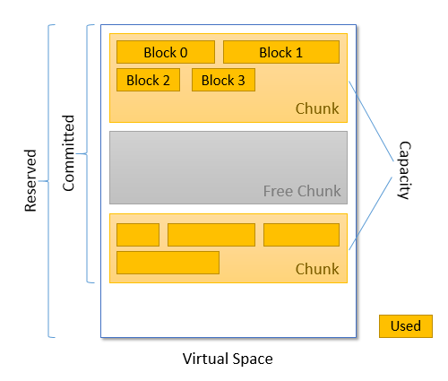

偶尔发现tomcat中有一个 hs_err_pid8706.log 的日志，网上查了一下，当jvm出现致命错误时会写如该文件(但是期间也没发生什么问题，估计是停止重启的时候产生的)，

其中有如下这样一段gc相关记录日志，其中有一段关于 Metaspace的，  

[](javascript:void(0);)

```
Heap:
 PSYoungGen      total 204288K, used 50381K [0x000000076d400000, 0x000000077af80000, 0x00000007c0000000)
  eden space 197632K, 22% used [0x000000076d400000,0x000000076feb59c0,0x0000000779500000)
  from space 6656K, 99% used [0x000000077a000000,0x000000077a67dc08,0x000000077a680000)
  to   space 11264K, 0% used [0x0000000779500000,0x0000000779500000,0x000000077a000000)
 ParOldGen       total 470016K, used 146509K [0x00000006c7c00000, 0x00000006e4700000, 0x000000076d400000)
  object space 470016K, 31% used [0x00000006c7c00000,0x00000006d0b13588,0x00000006e4700000)
 Metaspace       used 87890K, capacity 94498K, committed 94720K, reserved 1134592K
  class space    used 9454K, capacity 9950K, committed 9984K, reserved 1048576K
```

[](javascript:void(0);)

看上面的红色部分，代表元数据的内存情况，但是不知道这个里面的 used ，capacity ，committed ，reserved 具体都代表什么意思。

java网站(https://docs.oracle.com/javase/8/docs/technotes/guides/vm/gctuning/considerations.html )的解释如下：

## Class Metadata

Java classes have an internal representation within Java Hotspot VM and are referred to as class metadata. In previous releases of Java Hotspot VM, the class metadata was allocated in the so called permanent generation. In JDK 8, the permanent generation was removed and the class metadata is allocated in native memory. The amount of native memory that can be used for class metadata is by default unlimited. Use the option `MaxMetaspaceSize` to put an upper limit on the amount of native memory used for class metadata.

Java Hotspot VM explicitly manages the space used for metadata. Space is requested from the OS and then divided into chunks. A class loader allocates space for metadata from its chunks (a chunk is bound to a specific class loader). When classes are unloaded for a class loader, its chunks are recycled for reuse or returned to the OS. Metadata uses space allocated by `mmap`, not by `malloc`.

If `UseCompressedOops` is turned on and `UseCompressedClassesPointers` is used, then two logically different areas of native memory are used for class metadata. `UseCompressedClassPointers` uses a 32-bit offset to represent the class pointer in a 64-bit process as does `UseCompressedOops` for Java object references. A region is allocated for these compressed class pointers (the 32-bit offsets). The size of the region can be set with `CompressedClassSpaceSize` and is 1 gigabyte (GB) by default. The space for the compressed class pointers is reserved as space allocated by `mmap` at initialization and committed as needed. The `MaxMetaspaceSize` applies to the sum of the committed compressed class space and the space for the other class metadata.

Class metadata is deallocated when the corresponding Java class is unloaded. Java classes are unloaded as a result of garbage collection, and garbage collections may be induced in order to unload classes and deallocate class metadata. When the space committed for class metadata reaches a certain level (a high-water mark), a garbage collection is induced. After the garbage collection, the high-water mark may be raised or lowered depending on the amount of space freed from class metadata. The high-water mark would be raised so as not to induce another garbage collection too soon. The high-water mark is initially set to the value of the command-line option `MetaspaceSize`. It is raised or lowered based on the options `MaxMetaspaceFreeRatio` and `MinMetaspaceFreeRatio`. If the committed space available for class metadata as a percentage of the total committed space for class metadata is greater than `MaxMetaspaceFreeRatio`, then the high-water mark will be lowered. If it is less than `MinMetaspaceFreeRatio`, then the high-water mark will be raised.

Specify a higher value for the option `MetaspaceSize` to avoid early garbage collections induced for class metadata. The amount of class metadata allocated for an application is application-dependent and general guidelines do not exist for the selection of `MetaspaceSize`. The default size of `MetaspaceSize` is platform-dependent and ranges from 12 MB to about 20 MB.

Information about the space used for metadata is included in a printout of the heap. A typical output is shown in [Example 11-1, "Typical Heap Printout"](https://docs.oracle.com/javase/8/docs/technotes/guides/vm/gctuning/considerations.html#typical_heap_printout).

Example 11-1 Typical Heap Printout  

[](javascript:void(0);)

```
Heap
  PSYoungGen      total 10752K, used 4419K
    [0xffffffff6ac00000, 0xffffffff6b800000, 0xffffffff6b800000)
    eden space 9216K, 47% used
      [0xffffffff6ac00000,0xffffffff6b050d68,0xffffffff6b500000)
    from space 1536K, 0% used
      [0xffffffff6b680000,0xffffffff6b680000,0xffffffff6b800000)
    to   space 1536K, 0% used
      [0xffffffff6b500000,0xffffffff6b500000,0xffffffff6b680000)
  ParOldGen       total 20480K, used 20011K
      [0xffffffff69800000, 0xffffffff6ac00000, 0xffffffff6ac00000)
    object space 20480K, 97% used 
      [0xffffffff69800000,0xffffffff6ab8add8,0xffffffff6ac00000)
  Metaspace       used 2425K, capacity 4498K, committed 4864K, reserved 1056768K
    class space   used 262K, capacity 386K, committed 512K, reserved 1048576K
```

[](javascript:void(0);)

In the line beginning with `Metaspace`, the `used` value is the amount of space used for loaded classes. The `capacity` value is the space available for metadata in currently allocated chunks. The `committed` value is the amount of space available for chunks. The `reserved` value is the amount of space reserved (but not necessarily committed) for metadata. The line beginning with `class space` line contains the corresponding values for the metadata for compressed class pointers.

 全英文，看不太明白，继续搜索了一下，发现有这样一篇博客，https://stackoverflow.com/questions/40891433/understanding-metaspace-line-in-jvm-heap-printout

 还配了一张图，如下。



 翻译了一下，大概理解为： 

used：加载的类的空间量。
capacity： 当前分配块的元数据的空间。
committed： 空间块的数量。
reserved：元数据的空间保留（但不一定提交）的量（提交，什么意思?）。

从操作系统中请求的空间被分成多个块，一个类加载器为其元数据分配元数据的空间(块被绑定到特定的类加载器)

Metaspace是从JVM进程的虚拟地址空间中分离出来的。JVM在启动时根据-XX：MetaspaceSize保留初始大小，该大小具有特定于平台的默认值。

[](javascript:void(0);)

```
[root@localhost ~]# java -XX:+PrintFlagsInitial|grep Meta
    uintx InitialBootClassLoaderMetaspaceSize       = 4194304                             {product}
    uintx MaxMetaspaceExpansion                     = 5452592                             {product}
    uintx MaxMetaspaceFreeRatio                     = 70                                  {product}
    uintx MaxMetaspaceSize                          = 18446744073709551615                    {product}
    uintx MetaspaceSize                             = 21810376                            {pd product}
    uintx MinMetaspaceExpansion                     = 340784                              {product}
    uintx MinMetaspaceFreeRatio                     = 40                                  {product}
     bool TraceMetadataHumongousAllocation          = false                               {product}
     bool UseLargePagesInMetaspace                  = false                               {product}
```

[](javascript:void(0);)

reserved 指的是元空间的总大小，空间被分成块，每个块只能包含与某一个类加载器关联的类元数据。

Metaspace由一个或多个虚拟空间组成。虚拟空间是由操作系统获得的连续地址空间。他们是按需分配的。

在分配时，虚拟空间预留(reserves)了操作系统的内存，但还没有提交。Metaspace reserved是所有虚拟空间的总大小。

虚拟空间中的分配单元是Metachunk 、当从虚拟空间分配新块时、相应的内存将committed, Metaspace committed是所有块的总大小。

块的大小可能不同,当类加载器被垃圾收集时, 所有属于它的Metachunks都将被释放。

免费的块在全局免费列表中维护，Metaspace capacity是所有分配(即非空闲块)块的总大小。

新块分配过程：
1：查找空闲列表中的有没有空闲块。
2：如果没有合适的空闲块，就从当前虚拟空间中分配一个新的块。
3: 如果当前虚拟空间已经耗尽，则预留(reserves)一个新的虚拟空间。

类元数据在一个块中分配,块不包含来自多个类加载器的数据，但是一个类加载器可能有几个块。Metaspace used是所有块的所有类元数据的总大小。

 

Metaspace空间的优化：  https://blog.csdn.net/bolg_hero/article/details/78189621

通过以下的几个参数对Metaspace进行控制

-XX:MetaspaceSize=N
这个参数是初始化的Metaspace大小，该值越大触发Metaspace GC的时机就越晚。随着GC的到来，虚拟机会根据实际情况调控Metaspace的大小，可能增加上线也可能降低。在默认情况下，这个值大小根据不同的平台在12M到20M浮动。使用java -XX:+PrintFlagsInitial命令查看本机的初始化参数，-XX:Metaspacesize为21810376B（大约20.8M）。

-XX:MaxMetaspaceSize=N
这个参数用于限制Metaspace增长的上限，防止因为某些情况导致Metaspace无限的使用本地内存，影响到其他程序。在本机上该参数的默认值为4294967295B（大约4096MB）。

-XX:MinMetaspaceFreeRatio=N
当进行过Metaspace GC之后，会计算当前Metaspace的空闲空间比，如果空闲比小于这个参数，那么虚拟机将增长Metaspace的大小。在本机该参数的默认值为40，也就是40%。设置该参数可以控制Metaspace的增长的速度，太小的值会导致Metaspace增长的缓慢，Metaspace的使用逐渐趋于饱和，可能会影响之后类的加载。而太大的值会导致Metaspace增长的过快，浪费内存。

-XX:MaxMetasaceFreeRatio=N
当进行过Metaspace GC之后， 会计算当前Metaspace的空闲空间比，如果空闲比大于这个参数，那么虚拟机会释放Metaspace的部分空间。在本机该参数的默认值为70，也就是70%。

-XX:MaxMetaspaceExpansion=N
Metaspace增长时的最大幅度。在本机上该参数的默认值为5452592B（大约为5MB）。

-XX:MinMetaspaceExpansion=N
Metaspace增长时的最小幅度。在本机上该参数的默认值为340784B（大约330KB为）。