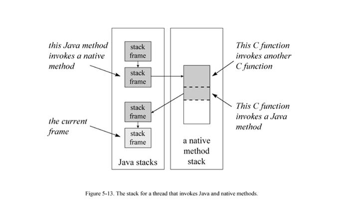

# JVM中的本地方法栈（Native Method Stacks）和Java虚拟机栈（Java Virtual Machine Stacks）

[uk8692](https://blog.csdn.net/uk8692) 2016-02-17 14:19:29  4835  收藏

文章标签： [java](https://www.csdn.net/tags/NtTaIg5sMzYyLWJsb2cO0O0O.html) [jvm](https://www.csdn.net/tags/MtTaEg0sMjUyNTEtYmxvZwO0O0OO0O0O.html) [虚拟机](https://www.csdn.net/tags/MtTaEg0sMDc3NzQtYmxvZwO0O0OO0O0O.html) [native](https://www.csdn.net/tags/MtjaIg3sNzI2Mi1ibG9n.html)

本地方法栈（Native Method Stacks）与虚拟机栈所发挥的作用是非常相似的，其区别不过是虚拟机栈为虚拟机执行Java方法（也就是字节码）服务，而本地方法栈则是为虚拟机使用到的Native方法服务。虚拟机规范中对本地方法栈中的方法使用的语言、使用方式与数据结构并没有强制规定，因此具体的虚拟机可以自由实现它。甚至有的虚拟机（譬如Sun HotSpot虚拟机）直接就把本地方法栈和虚拟机栈合二为一。与虚拟机栈一样，本地方法栈区域也会抛出StackOverflowError和OutOfMemoryError异常。

——以上摘自《深入理解Java虚拟机:JVM高级特性与最佳实践》作者： 周志明

In addition to all the runtime data areas defined by the Java Virtual Machine specification and described above, a running Java application may use other data areas created by or for native methods. When a thread invokes a native method, it enters a new world in which the structures and security restrictions of the Java Virtual Machine no longer hamper its freedom. A native method can likely access the runtime data areas of the virtual machine (it depends upon the native method interface), but can also do anything else it wants. It may use registers inside the native processor, allocate memory on any number of native heaps, or use any kind of stack.
前面提到的所有运行时数据区都是Java虚拟机规范中明确定义的，除此之外，对于一个运行中的Java程序而言，他还可能会用到一些本地方法相关的数据区。当某个线程调用一个本地方法时，他就进入了一个全新的并且不再受虚拟机限制的世界 ，本地方法可以通过本地方法接口 来访问虚拟机得运行时数据区，但不止于此，他还可以做任何他想做的事情。比如，他甚至可以直接使用本地处理器中的寄存器，或者直接从本地内存的堆中分配任意数量的内存等等。总之，他和虚拟机拥有同样的权限（或者说能力）。

Native methods are inherently implementation dependent. Implementation designers are free to decide what mechanisms they will use to enable a Java application running on their implementation to invoke native methods.
本地方法本质上是依赖于实现的，虚拟机实现的设计者可以自由地决定使用怎样的机制来让Java程序调用本地方法。

Any native method interface will use some kind of native method stack. When a thread invokes a Java method, the virtual machine creates a new frame and pushes it onto the Java stack. When a thread invokes a native method, however, that thread leaves the Java stack behind. Instead of pushing a new frame onto the threadís Java stack, the Java Virtual Machine will simply dynamically link to and directly invoke the native method. One way to think of it is that the Java Virtual Machine is dynamically extending itself with native code. It is as if the Java Virtual Machine implementation is just calling another (dynamically linked) method within itself, at the behest of the running Java program.
任何本地方法接口都会使用某种本地方法栈。当线程调用Java方法时，虚拟机会创建一个新的栈帧并压入java栈。然而当他调用的是本地方法时，虚拟机会保持Java栈不变 ，不再在线程的java栈中压入新的帧，虚拟机只是简单地动态连接并直接调用指定的本地方法。可以把这看做是虚拟机利用本地方法来动态扩展自己 。就如同Java虚拟机的实现在按照其中运行的Java程序的吩咐，调用属于虚拟机内部的另一个（动态连接的）方法。

If an implementationís native method interface uses a C-linkage model, then the native method stacks are C stacks. When a C program invokes a C function, the stack operates in a certain way. The arguments to the function are pushed onto the stack in a certain order. The return value is passed back to the invoking function in a certain way. This would be the behavior of the of native method stacks in that implementation.
如果某个虚拟机实现的本地方法接口是使用C连接模型的话，那个他的本地方法栈就是C栈。我们知道，当C程序调用一个C函数时，其栈操作都是确定的。传递 给该函数的参数已某个确定的顺序压入栈，他的返回值也以确定的方式传回调用者。同样，这就是改虚拟机实现中本地方法栈的行为。

A native method interface will likely (once again, it is up to the designers to decide) be able to call back into the Java Virtual Machine and invoke a Java method. In this case, the thread leaves the native method stack and enters another Java stack.
很可能本地方法接口需要回调Java虚拟机中的Java方法（这也是由设计者决定的），在这种情形下，该线程会保存本地方法栈的状态并进入到另一个Java栈。

Figure 5-13 shows a graphical depiction of a thread that invokes a native method that calls back into the virtual machine to invoke another Java method. This figure shows the full picture of what a thread can expect inside the Java Virtual Machine. A thread may spend its entire lifetime executing Java methods, working with frames on its Java stack. Or, it may jump back and forth between the Java stack and native method stacks.
图5-13描绘了这种情况，就是当一个线程调用一个本地方法时，本地方法又回调虚拟机中的另一个Java方法。这幅图展示了java虚拟机内部线程运行的全景 图。一个线程可能在整个生命周期中都执行Java方法，操作他的Java栈；或者他可能毫无障碍地在Java栈和本地方法栈之间跳转。

As depicted in Figure 5-13, a thread first invoked two Java methods, the second of which invoked a native method. This act caused the virtual machine to use a native method stack. In this figure, the native method stack is shown as a finite amount of contiguous memory space. Assume it is a C stack. The stack area used by each C-linkage function is shown in gray and bounded by a dashed line. The first C-linkage function, which was invoked as a native method, invoked another C-linkage function. The second C-linkage function invoked a Java method through the native method interface. This Java method invoked another Java method, which is the current method shown in the figure.
上图所示，该线程首先调用了两个Java方法，而第二个Java方法又调用了一个本地方法，这样导致虚拟机使用了一个本地方法栈。图中的本地方法栈显示为 一个连续的内存空间。假设这是一个C语言栈，期间有两个C函数，他们都以包围在虚线中的灰色块表示。第一个C函数被第二个Java方法当做本地方法调用， 而这个C函数又调用了第二个C函数。之后第二个C函数又通过 本地方法接口回调了一个Java方法（第三个Java方法）。最终这个Java方法又调用了一个Java方法（他成为图中的当前方法）。

As with the other runtime memory areas, the memory they occupied by native method stacks need not be of a fixed size. It can expand and contract as needed by the running application. Implementations may allow users or programmers to specify an initial size for the method area, as well as a maximum or minimum size.
就像其他运行时内存区一样，本地方法栈占用的内存区也不必是固定大小的，他可以根据需要动态扩展或者收缩。某些是实现也允许用户或者程序员指定该内存区的初始大小以及最大，最小值。