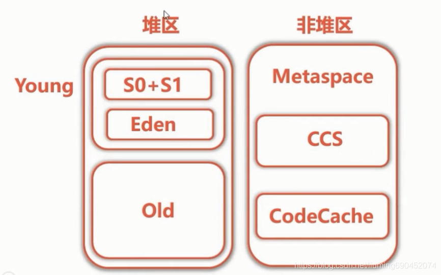
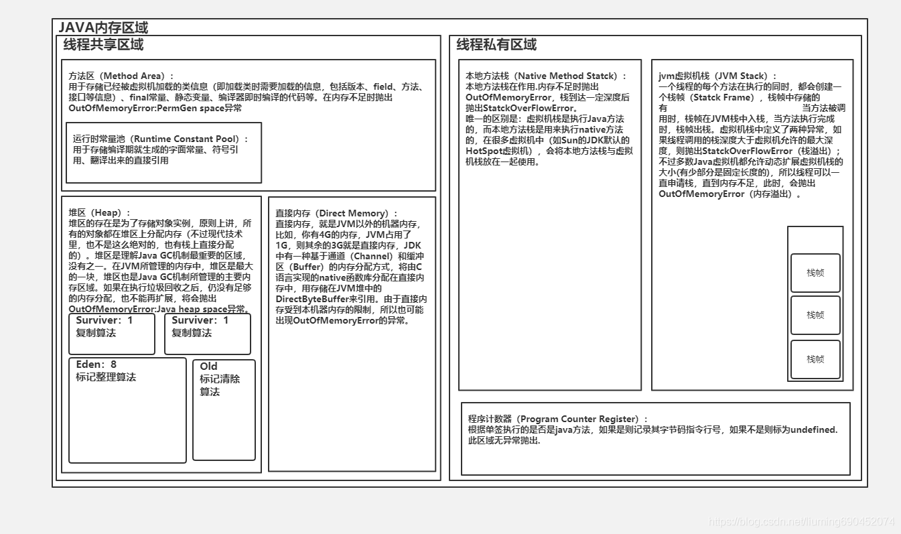

# JVM的内存结构 JDK1.8

[千百元](https://blog.csdn.net/liuming690452074) 2020-02-15 20:20:43  166  收藏

分类专栏： [性能监控与调优](https://blog.csdn.net/liuming690452074/category_9722675.html)

版权

 

# 堆区

##    young 区

 

###      S0+S1

​            S0,S1大小是一样的，在同一时间内，只有一个启用

###      Eden

 

##    Old区

 

 

 

# 非堆区

 

 

 

 

 

 

 

 根据VM规范，VM应该被划分为五块区域——即VM栈、堆、方法区、程序计数器、本地方法栈五个部分。如下图所示：

  方法区(Method Area)：该区域是所有线程共享的，主要用于存放类的信息，常量、静态变量、即时编译器编译后的代码等。垃圾回收器对这块区域的回收主要是针对常量池和类的卸载。

  java堆(Java Heap):该区域也是所有线程共享的，用于存放对象实例，绝大多数创建的对象都会被存放到这里（除了部分由于逃逸分析而在对外分配的对象，该部分只是在方法体被引用，故被分配到了栈上）。垃圾回收器最主要针对的对象，对这部分的回收效率影响了VM的整体性能。

  本地方法栈(Native Methiod Stack):该区域是每个线程锁独有的，主要用于VM的Native方法。这部分是有VM自行管理，程序员基本上不需要关系该部分。

  VM栈(VM Stack):该区域也是每个线程所独有的，与本地方法栈是类似的，唯一的区别是它为VM执行Java方法服务。该区域主要维护栈针（每调用一个方法，则VM就会创建一个栈针保护当前方法的状态，并将其压入栈中，当被调用的方法完成后，在将其出栈继续执行未完成的方法），有一定的深度，可能会抛出StackOverflowError和OutOfMemoryError。

  程序记数器:该区域也是每个线程所独有的，该区域主要是存放当前执行指令的地址。

  接下来给出基于JDK8的JVM的内存模型，如下图所示：

  与VM规范的划分并没有特别大的改动，只是结合了java的具体实现改变了部分内容的存放位置。

   下面给出Java堆内存的区域划分，如图所示：

   Eden:该区域是最主要的刚创建的对象的内存分配区域，绝大多数对象都会被创建到这里（除了部分大对象通过内存担保机制创建到Old区域，默认大对象都是能够存活较长时间的），该区域的对象大部分都是短时间都会死亡的，故垃圾回收器针对该部分主要采用标记整理算法了回收该区域。

  Surviver:该区域也是属于新生代的区域，该区域是将在Eden中未被清理的对象存放到该区域中，该区域分为两块区域，采用的是复制算法，每次只使用一块，Eden与Surviver区域的比例是8:1，是根据大量的业务运行总结出来的规律。

  Old:该区域是属于老年代，一般能够在Surviver中没有被清除出去的对象才会进入到这块区域，该区域主要是采用标记清除算法。

  总结：java堆的垃圾回收是垃圾回收器最主要的光顾对象，整体采用分代收集的策略，对不同区域结合其特点采用不同的垃圾收集算法。我们在编程中也应该关注这一块区域，尽量不适用大对象，尽可能的创建局部对象，使用过后确定废弃不用的对象及时断开引用，尽量避免使用循环的对象引用（可达性分析也是比较消耗资源的）等等。

最后附上JVM内存区域的图解https://www.processon.com/view/link/5b891cc9e4b0fe81b620b2c0

 