**一.JVM在新版本的改进更新以及相关知识**

 

**1.\**JVM在新版本的改进更新\****

图中可以看到运行时常量池是放在方法区的

　　**1.1对比：**

　　　　**JDK 1.7 及以往的 JDK 版本中**，Java **类信息、常量池、静态变量**都存储在 Perm（永久代）里。类的元数据和静态变量在类加载的时候分配到 Perm，当类被卸载的时候垃圾收集器从 Perm 处理掉类的元数据和静态变量。当然常量池的东西也会在 Perm 垃圾收集的时候进行处理。

　　　　**JDK 1.8 的对 JVM 架构的改造将类元数据放到本地内存中，另外，将常量池和静态变量放到 Java 堆里。HotSopt VM 将会为类的元数据明确分配和释放本地内存**。在这种架构下，类元信息就突破了原来 -XX:MaxPermSize 的限制，现在可以使用更多的本地内存。这样就从一定程度上解决了原来在运行时生成大量类的造成经常 Full GC 问题，如运行时使用反射、代理等。

　　**1.2注意：**

　　　　如果服务器内存足够，升级到 JDK 1.8 修改 JVM 参数最简单的办法就是将 -XX:PermSize 和 -XX:MaxPermSize 参数替换为 -XX:MetaspaceSize 和 -XX:MaxMetaspaceSize

　　　　1.8中-XX:PermSize 和 -XX:MaxPermSize 已经失效，取而代之的是一个新的区域 —— Metaspace（元数据区）。

　　　　使用JDK1.8以及之后的版本，不会再碰上“java.lang.OutOfMemoryError: PermGen space”这个错误了。

　　**1.3优势理解：**

　　　　permSize：原来的jar包及你自己项目的class存放的内存空间，这部分空间是固定的，启动参数里面-permSize确定，如果你的jar包很多，经常会遇到permSize溢出，且每个项目都会占用自己的permGen空间
　　　　改成metaSpaces，各个项目会共享同样的class内存空间，比如两个项目都用了fast-json开源包，在mentaSpaces里面只存一份class，提高内存利用率，且更利于垃圾回收

　　 **1.4区别**

　　　　元空间并不在虚拟机中，而是使用本地内存。因此，默认情况下，元空间的大小仅受本地内存限制

　　 **1.5参数来指定元空间的大小**　　　

　　　　-XX:MetaspaceSize，初始空间大小，达到该值就会触发垃圾收集进行类型卸载，同时GC会对该值进行调整：如果释放了大量的空间，就适当降低该值；如果释放了很少的空间，那么在不超过MaxMetaspaceSize时，适当提高该值。
　　　　-XX:MaxMetaspaceSize，最大空间，默认是没有限制的。

　　　　除了上面两个指定大小的选项以外，还有两个与 GC 相关的属性：
　　　　-XX:MinMetaspaceFreeRatio，在GC之后，最小的Metaspace剩余空间容量的百分比，减少为分配空间所导致的垃圾收集
　　　　-XX:MaxMetaspaceFreeRatio，在GC之后，最大的Metaspace剩余空间容量的百分比，减少为释放空间所导致的垃圾收集

 

　　　　关于matespace，参考：http://blog.csdn.net/double_name/article/details/51193638

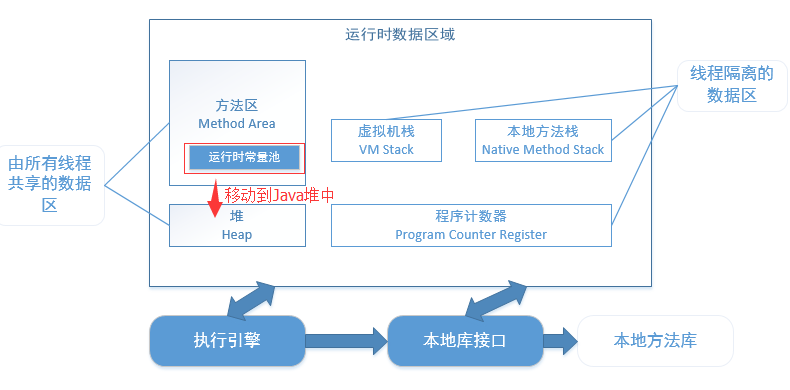

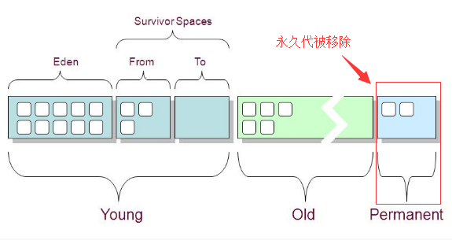

 

**2.GC机制中，JVM对内存的分区**

【需要说明：元数据区的大小限定于本地内存的大小，Eden、Survivor、Old区都是JVM管理下的堆中分配的内存区域】

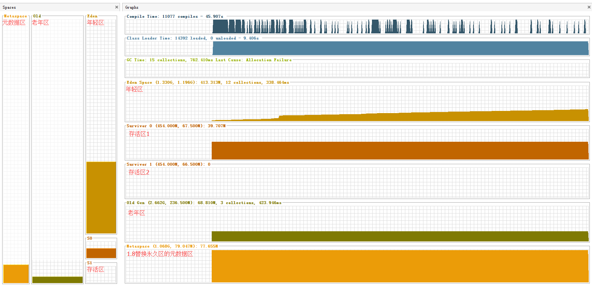

　　**2.1 GC是什么**

　　　　GC（GarbageCollection）是垃圾回收机制，在java中开发人员无法使用指针来自由的管理内存，GC是JVM对内存（实际上就是对象）进行管理的方式。GC使得Java开发人员摆脱了繁琐的内存管理工作，让程序的开发更有效率。

　　**2.2 GC的工作原理**

　　　　自己的话：对于程序员来说，分配对象使用new关键字；释放对象时，只要将对象所有引用赋值为null，让程序不能够再访问到这个对象，我们称该对象为"不可达的"或者"不被引用"。GC将负责回收所有"不可达"对象的内存空间。

　　　　上图中

　　　　　　1》新new的对象都放在Eden区

　　　　　　2》Eden区满或者快满的时候进行一次清理，不被引用的对象直接被干掉；还有引用的对象，但是年龄比较大的，挪到S0区

　　　　　　3》下次Eden区快满的时候，会进行上一步的操作，并且将Eden和S0区的年纪大的对象放到S1区【原理上随时保持S0和S1有一个是空的，用来存下一次的对象】

　　　　　　4》下下次，Eden区快满的时候，会进行上一步操作，并且将Eden和S1区的年纪大的对象放到S0区【此时S1区就是空的】

　　　　　　5》直到Eden区快满，S0或者S1也快满的时候，这时候就把这两个区的年纪大的对象放到Old区

　　　　　　6》依次循环，直到Old区也快满的时候，Eden区也快满的时候，会对整个这一块内存区域进行一次大清洗，腾出内存，为之后的对象创建，程序运行腾地方。

　　**2.3 Minor GC、Major GC和Full GC**

　　　　清理Eden区和 Survivor区叫**Minor GC**。

　　　　清理Old区叫**Major GC**。

　　　　清理整个堆空间—包括年轻代和老年代叫**Full GC**。

　　　　参考：http://www.importnew.com/15820.html

　　

 **二.VisualVM的安装使用**

VisualVM 是一款免费的性能分析工具，JDK自带的，在JDK安装目录bin下启动【jvisualvm.exe】即可。

文档地址:http://visualvm.java.net/applications_window.html

**1.VisualVM 插件安装**

首次启动可以安装插件  工具-->插件

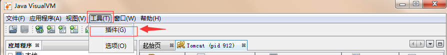

 **2.启动VisualVM**

 启动你的tomcat，跑起来一个项目之后，启动VisualVM

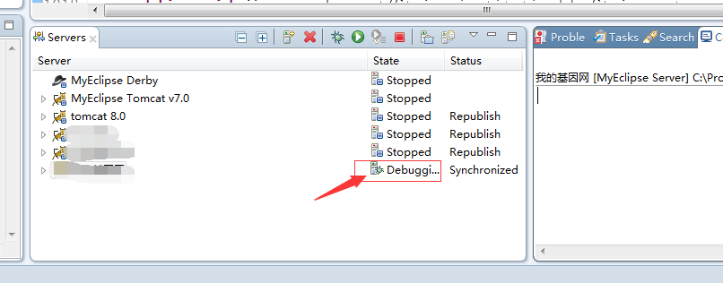

双击左侧Tomcat，右侧概述

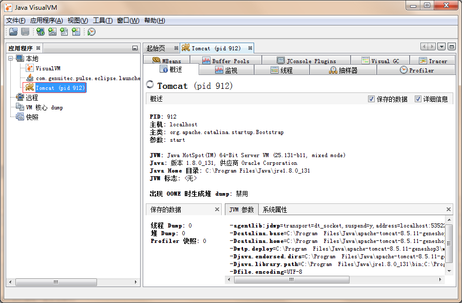

**3.JVM调优参数修改**

 上图中JVM参数，就是当前你本项目的JVM相关配置，同样的，你可以在Myecplise中Servers下双击部署本项目的Tomcat，

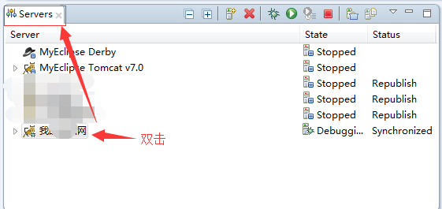

open launch configuration【打开发布配置】

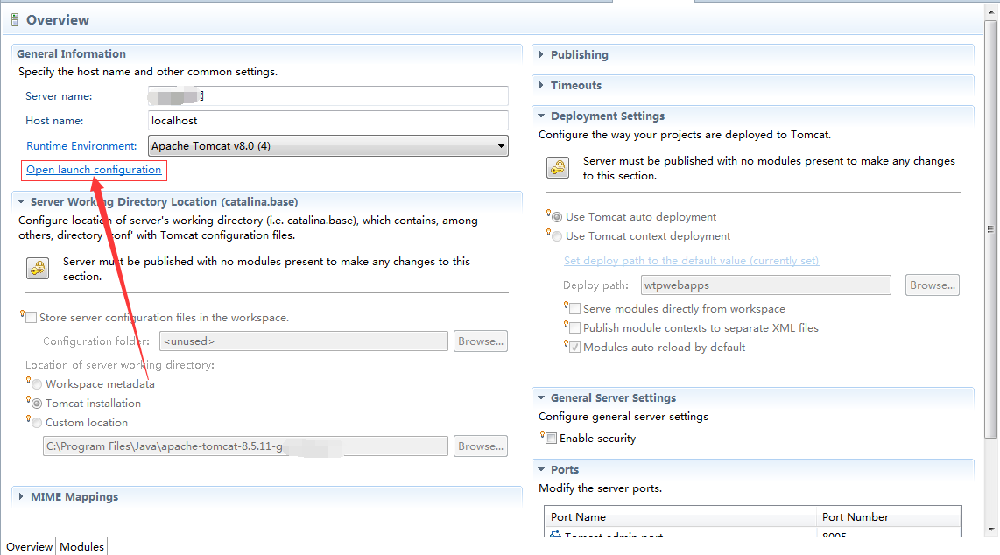

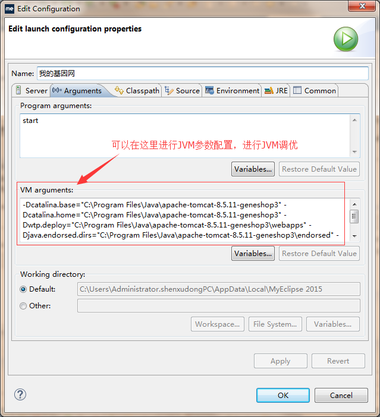

**4.监视标签，可以查看CPU/堆/Matespace/类/线程的大概情况**

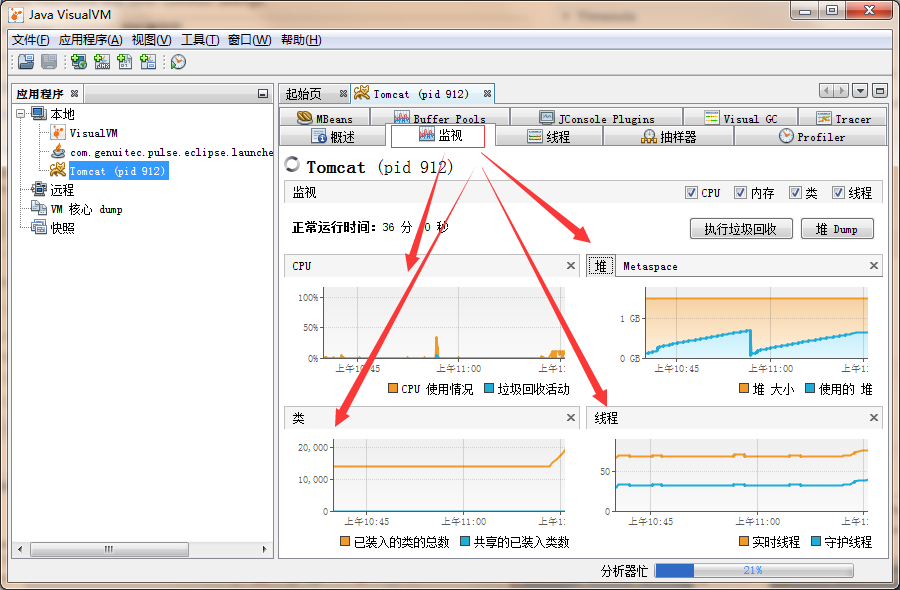

**5.Profiler 标签**

在 Profiler 标签，点击“内存”按钮将启动一个内存分析会话，等 VisualVM 收集和统计完相关性能数据信息，将会显示在性能分析结果。通过内存性能分析结果，我们可以查看哪些对象占用了较多的内存，存活的时间比较长等，以便做进一步的优化。

此外，我们可以通过性能分析结果下方的类名过滤器对分析结果进行过滤。

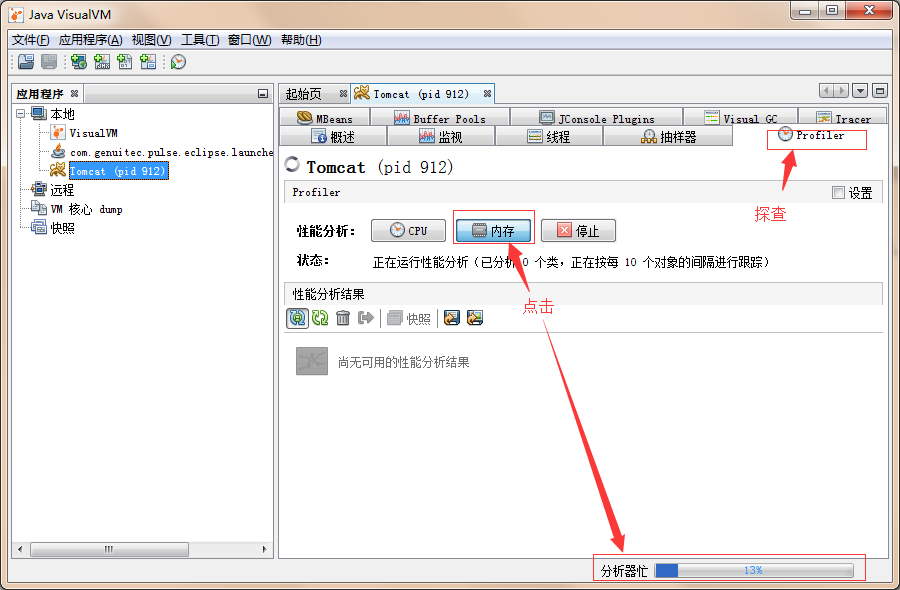

 

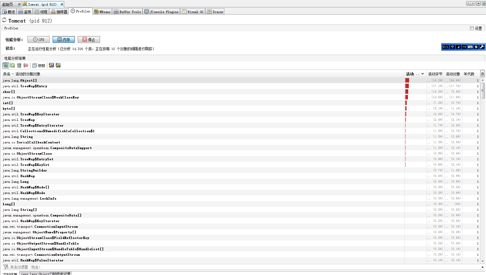

 **6.Visual GC标签**

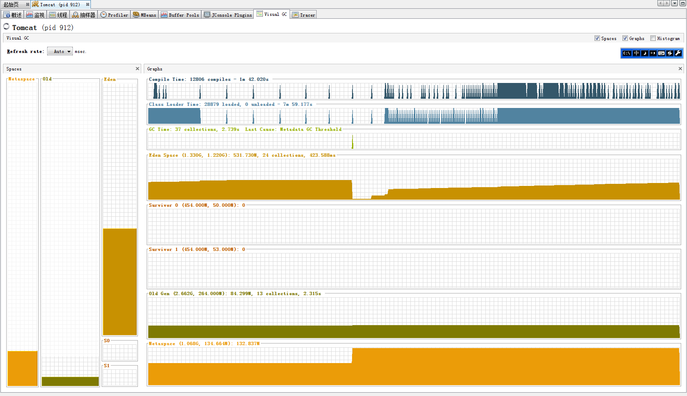

**7.线程标签**

**8.快照功能**

**9.导出功能**

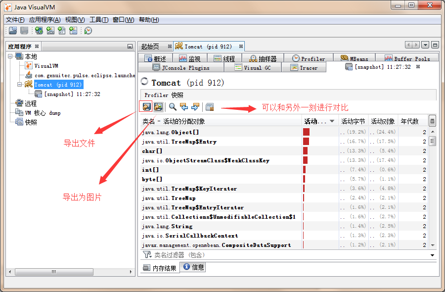