# 堆和非堆内存——个人修炼

[HaipyLi](https://www.zhihu.com/people/haipyli)

财务顾问

关注他

11 人赞同了该文章

堆、栈、运行时数据区

JVM在运行期间，其**运行时数据区**包括——堆、方法区、常量池（运行时常量池，也是方法区的组成部分）、栈（虚拟机栈）、本地方法栈、程序计数器等。运行时数据区指的是JVM运行时的数据区域划分。Java虚拟机是可以多线程并发执行的。对于一个CPU任意时刻，只能执行JVM中的一条线程（***线程是一个执行体，不会保存数据，程序计数器是线程的上下文\***）。这就意味着，JVM要想实现多线程，则每条线程必须有独立的程序计数器用来标记线程执行的指令的位置（线程切换后恢复到正确的执行位置）。所以——程序计数器是线程私有的，私有意味着各条线程之间的计数器互不影响。如下图所示，绿色区域的部分都是线程私有（线程隔离，随线程而生、随线程而灭——因为方法结束或者线程结束时，内存自然就跟随着回收了）的，而蓝色部分则是所有线程可以共享的数据区域。

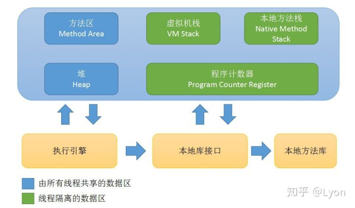

1、**堆内**存

**堆**是**运行时**数据区域，所有**类实例(**Instance，非静态成员变量也是存放在堆中**)**和**数组的内存**均从此处分配。堆是在Java虚拟机启动时创建的。Java堆是Java中垃圾收集器管理的主要区域，因此也被称为GC堆—Garbage Collected Heap。下面所说的程序计数器、Java虚拟机栈、本地方法栈通常只占很小一部分的内存空间，对与大多数应用来说，Java堆(Java Heap)才是JVM管理的内存空间中最大的一块。

　　堆内存是JVM中最大的一块，由新生代(**Young** Gen)和老年代(**Old** Gen)组成，而年轻代内存又被分成三部分，Eden空间/区、From 空间/区(**S0**)、To 空间/区(**S1**)，默认情况下年轻代按照8:1:1(E:S0:S1)的比例来分配。

　　堆的大小可以固定，也可以扩大和缩小。堆的内存不需要是连续空间。

2、**程序计数器**

**程序计数器(Program Counter Register)**：是一块较小的内存空间，它的作用可以看做是**当前线程所执行的字节码的行号指示器**。在虚拟机的概念模型里（*仅是概念模型，各种虚拟机可能会通过一些更高效的方式去实现*），字节码解释器工作时就是通过改变这个计数器的值来选取下一条需要执行的字节码指令，分支、循环、跳转、异常处理、线程恢复等基础功能都需要依赖这个计数器来完成。此内存区域是唯一一个在Java虚拟机规范中没有规定任何OutOfMemoryError情况的区域。**在任意时刻一条JVM线程只能执行一个方法的代码，方法可以是Java方法，或者是native方法**。

3、**Java虚拟机栈**

与程序计数器一样，**Java虚拟机栈（JVM Stacks）**也是**线程私有**的，用于存储当前线程运行字节码方法所需要的数据、指令、返回地址，它的生命周期与线程相同，**虚拟机栈和线程同时创建，用于存储栈帧。**栈描述的是Java方法执行的内存模型：（每个）方法执行时都会创建一个**栈帧(Stack Frame)**用于存储**局部变量表**、**操作数栈**、动态链接（*多态的表现*）、方法出口（*出栈：1. 返回指令，如：return；2. 异常退出*）等信息。（每一个）方法从被调用直至执行完成的过程，就对应着一个栈帧在**虚拟机栈**中从入栈（***入到栈帧\***）到出栈的过程。在活动线程中，只有当前栈帧（*位于栈顶的栈帧*）才是有效的，与这个栈帧相关联的方法称为当前方法。

Java虚拟机规范中Java虚拟机栈内存的大小既可以被实现成固定大小（*在编译程序代码的时候，栈帧中需要多大的局部变量表，多深的操作数栈都已经完全确定了，不受到程序运行期变量数据的影响，而仅仅取决于具体的虚拟机实现*），也可以根据计算动态拓展或收缩，当前大部分的JVM实现是支持动态拓展的。**Java虚拟机栈**可能发生的异常：

1. 线程请求分配的**栈容量** > Java虚拟机最大**栈容量**，则JVM会抛出StackOverFlowError异常。
2. 如果Java虚拟机栈可动态拓展，则如果在拓展的过程中无法申请到足够的内存，就会抛出OutOfMemoryError异常。

3.1、**局部变量表**

**局部变量表**存放了编译期可知的各种**基本数据类型**（值类型，boolean、byte、char、short、int、float、long、double）、**对象引用**（引用类型，它不是**对象本身**（对象都放在堆区），根据不同的虚拟机实现，它可能是一个指向对象起始地址的引用指针，也可能指向一个代表对象的句柄或者其他与此对象相关的位置。数组，类，接口，引用类型变量存在栈，对象存在堆，通过引用确定关系。）和**returnAddress类型**（为字节码指令jsr、jsr_w和ret服务的，它指向了一条字节码指令的地址）。

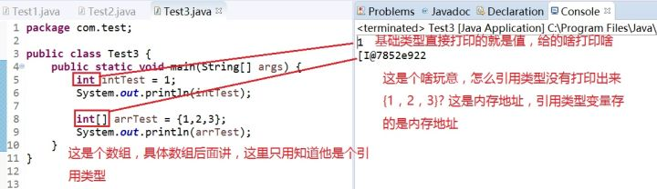

内存地址

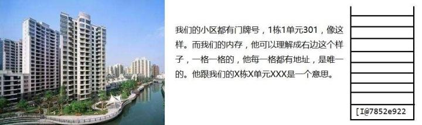

内存地址

地址就是找人找东西时候用的，内存地址就是让内存划分的空间有个标记，我通过这个标记可以找到内存。所以引用类型里面存的不是你定义给他的值，而是存的内存地址。那我定义的数组啊，数组跑哪去了？它在堆里面，而这个栈里面存的地址就是堆里面放的那个数组的地址。

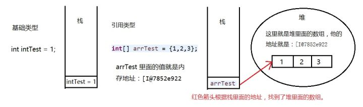

内存地址

红色箭头干的事，叫做：引用变量指向内存。堆里面的数据，只有当有引用变量指向它的时候，才能存在，如果没人指向堆里面的数据了，就会有一位亲切的清洁工阿姨把他当垃圾处理掉。所以**栈里面的变量，红色箭头，堆里面的数据这三个东西是一体的**，他们不能分开。他们在一起，才是定义了一个完整的引用类型。

64位长度（8字节）的long和double类型的数据会占用2个变量槽（Slot，4字节，局部变量表的容量以变量槽为最小单位），其余的数据类型只占用1个slot。**局部变量表**所需的内存空间在编译期完成分配，当进入一个方法时，这个方法需要在帧中分配多大的局部变量空间是完全确定的，在方法运行期间不会改变局部变量表的大小。

3.2、**操作数栈**

**操作数栈**被组织为单个单位长度为**一个JVM字**（*32位机，一个字为4字节；64位机，一个字为8字节*）的数组，该数组只能通过标准栈操作（*push和pop，先进后出，后进先出*）访问，该栈是被（逻辑上的）CPU的ALU唯一识别的操作数来源。

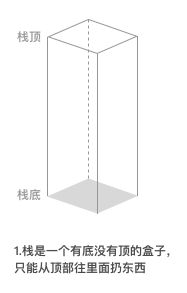内存地址

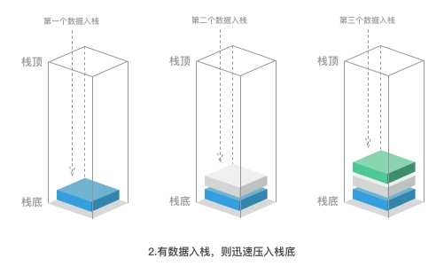入栈

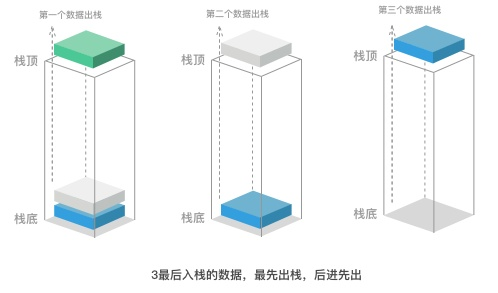出栈

例：如有分别存在局部变量表的a,b,c，要计算c=a+b，则使用4条指令：

　　1）读局部变量表[0]的值，压入操作数栈；

　　2）读局部变量表[1]的值，压入操作数栈；

　　3）弹出操作数栈栈顶值，再弹出操作数栈栈顶值，相加，把结果压入操作数栈；

　　4）弹出操作数栈栈顶值，写入局部变量区[2]。

4、**本地方法栈(Native Method Stacks)**

　　与虚拟机栈所发挥的作用是非常相似的，其区别不过是虚拟机栈为虚拟机执行Java方法（也就是字节码）服务，而本地方法栈则是为虚拟机使用到的Native方法服务。虚拟机规范中对本地方法栈中的方法使用的语言、使用方式与数据结构并没有强制规定，因此具体的虚拟机可以自由实现它。甚至有的虚拟机（*譬如Sun HotSpot虚拟机：Sun JDK和OpenJDK中所带的虚拟机，也是目前使用范围最广的Java虚拟机*）直接就把本地方法栈和虚拟机栈合二为一。与虚拟机栈一样，本地方法栈区域也会抛出StackOverflowError和OutOfMemoryError异常。

5、方法区(Method Area)

又叫静态区，与Java堆一样，是各个线程共享的内存区域，它用于存储已被JVM加载的类信息（*描述性信息，即元数据*）、常量（*文本字符串、声明为final的常量*）、静态（成员）变量、即时编译器编译后的代码等数据。虽然Java虚拟机规范把方法区描述为堆的一个逻辑部分，但是它却有一个别名叫做Non-Heap**（非堆**，Java7[含]之前也叫做永久代PermGen**）**。

Java虚拟机规范对方法区的限制十分宽松，除了和Java堆一样不需要连续的内存空间分配和可选择固定大小或可拓展内存以外，方法区也可以被垃圾回收器管理或不受其管理。

方法区（持久带）大小调节，在**jdk7**之前，可以使用如下参数来调节方法区的大小

　　-XX:PermSize：方法区初始大小

　　-XX:MaxPermSize：方法区最大大小

当方法区**（非堆）**无法满足内存分配需求（超出MaxPermSize）时，将抛出java.lang.OutOfMemoryError: PermGen异常。

**Jdk8**中已经将持久带移除了，用新出现的**元空间(Metaspace)**来代替原来的持久带。原来的-XX:PermSize（和-XX:MaxPermSize）这些参数在jdk8中将是无效的，在**jdk8**中，可以使用如下参数来调节触发FGC的阈值：

-XX:MetaspaceSize：触发FGC的初始阈值（默认20.8M）

-XX:MaxMetaspaceSize：触发FGC的最大阈值

一旦超过这个值就会触发GC

5.1、运行时常量池(Runtime **Constant Pool**)

运行时常量池是**方法区**的一部分，用于存放编译期生成的各种字面量和符号引用，这部分内容将在类加载后进入方法区的运行时常量池中存放。当虚拟机运行时，需要从常量池获得对应的符号引用，再在类创建或运行时解析、翻译到具体的内存地址之中。

字面量(Literal)，通俗理解就是Java中的常量，如文本字符串、声明为final的常量值等。

符号引用(Symbolic References)则是属于编译原理中的概念，包括了下面三类常量：

1. 类和接口的全限定名
2. 字段（*包含了成员变量，字段的范围更大*）的名称和描述符
3. 方法的名称和描述符

　　运行时常量池相对于Class文件常量池（*.class文件中每一个类或接口的常量池表(constant pool table)*）的另外一个重要特征是具备动态性，Java语言并不要求常量一定只有编译期才能产生，也就是并非预置入Class文件中常量池的内容才能进入方法区运行时常量池，运行期间也可能将新的常量放入池中，这种特性被开发人员利用得比较多的便是String类的intern()方法。

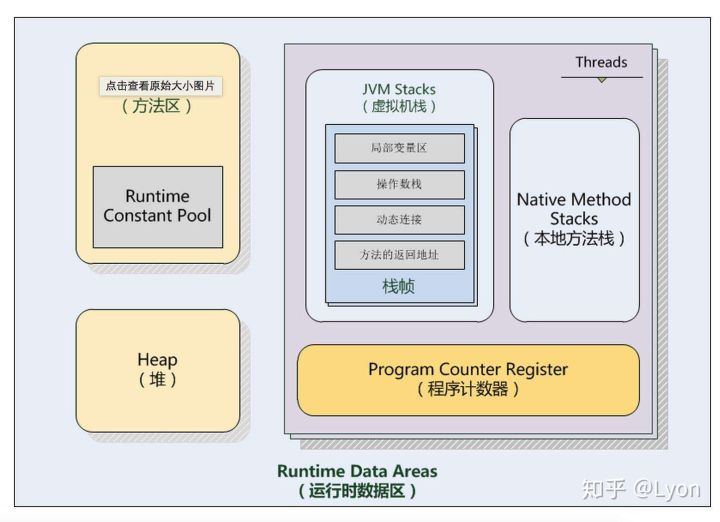

**堆、栈理解**

从操作系统中进程的内存结构说起了，例如linux中一个进程的虚拟内存分布：

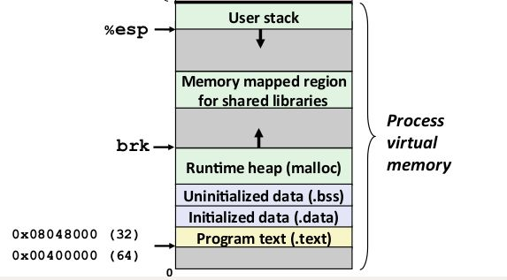

　　图中0号地址在最下边，越往上内存地址越大。以32位地址操作系统为例，一个进程可拥有的虚拟内存地址范围为0-2^32（0~4G）。内存分为两部分，一部分留给kernel使用(kernel virtual memory)，剩下的是进程本身使用，即图中的process virtual memory。普通Java程序使用的就是process virtual memory。上图中最顶端的一部分内存叫做user stack。这就是栈(stack)。中间有个runtime heap，就是堆(heap)。他们的名字和数据结构里的stack和heap几乎没啥关系。注意在上图中，栈(stack)是向下生长的; 堆(heap)是向上生长的。当程序进行函数（**即方法**）调用时，每个函数都在栈(stack)上有一个调用栈(call frame)。比如对于以下程序，

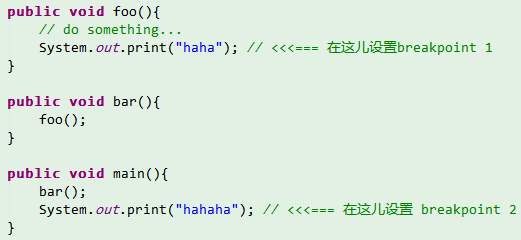

当程序运行到breakponit 1时，user stack里会有三个栈帧(frame)

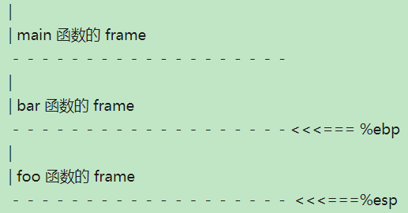

其中esp和ebp都是寄存器。**esp**指向栈(stack)的顶（因为栈向下生长，esp会向下走）; **ebp**指向当前栈帧(frame)的边界。

当程序继续执行到brekapoing 2的时候stack 大概是这样的：

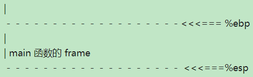

也就是说当一个函数（方法）执行结束后，它对应的调用栈(call frame)就被销毁了。(其实就是esp和ebp分别移动，但是内存地址中的数据只有在下一次写的时候才被覆盖。)那到底什么东西放在栈上，什么东西放在堆上了。最直白的解释：

**public void** foo(){
**int** i = 0; // <= i 的值存在stack上，foo()的call frame 里。
Object obj = **new** Object(); // object对象本身存在heap 里，foo()的call frame 里存该对象的地址。
}

　　metaspace，元数据空间，专门用来存元数据的，它是jdk8里特有的数据结构用来替代perm（持久带）。

元空间的特点：

- 充分利用了Java语言规范中的好处：类及相关的元数据的生命周期与类加载器的一致。
- 每个加载器有专门的存储空间
- 只进行线性分配
- 不会单独回收某个类
- 省掉了GC扫描及压缩的时间
- 元空间里的对象的位置是固定的
- 如果GC发现某个类加载器不再存活了，会把相关的空间整个回收掉

元空间的内存分配模型

- 绝大多数的类元数据的空间都从本地内存中分配
- 用来描述类元数据的类也被删除了
- 分元数据分配了多个虚拟内存空间
- 给每个类加载器分配一个内存块的列表。块的大小取决于类加载器的类型; sun/反射/代理对应的类加载器的块会小一些
- 归还内存块，释放内存块列表
- 一旦元空间的数据被清空了，虚拟内存的空间会被回收掉
- 减少碎片的策略

metaspace其实由两大部分组成：Klass Metaspace和NoKlass Metaspace。

Klass Metaspace就是用来存klass。这块内存大小可通过-XX:CompressedClassSpaceSize参数来控制，这个参数前面提到了默认是1G，

但是这块内存也可以没有，假如没有开启压缩指针(-XX:+UseCompressedClassPointers=false)就不会有这块内存，这种情况下klass都会存在NoKlass Metaspace里。

根据下面的指令：（windows用，Linux下把findstr改为grep）

D:\def>java -XX:+PrintFlagsInitial | findstr UseCompressedClassPointers

bool UseCompressedClassPointers = false {lp64_product}

　　判断没有开启压缩指针。

NoKlass Metaspace专门来存klass相关的其他的内容，比如method，constantPool等。

**JVM 参数**

MetaspaceSize

默认20.8M左右（x86下开启c2模式，*可以通过jinfo -flag MetaspaceSize pid得到这个值*），主要指Metaspace扩容时触发FullGC的初始阈值，也是最小阈值（*Metaspace由于使用不断扩容到-XX:MetaspaceSize参数指定的量，就会发生FGC；且之后每次Metaspace扩容都会发生FGC*）。注意这里并不是设置Metaspace的大小，而是设置其发生FGC的阈值。

但是触发FGC的阈值是不断变化的，与之对比的主要是指Klass Metaspace与NoKlass Metaspace两块committed的内存和。

如果Old区配置CMS垃圾回收，那么扩容引起的FGC也会使用CMS算法进行回收。

如果MaxMetaspaceSize设置太小，可能会导致频繁FGC，甚至OOM。

建议：1）MetaspaceSize和MaxMetaspaceSize设置一样大；2）具体设置多大，建议稳定运行一段时间后通过jstat -gc pid确认且这个值，对于大部分项目256m即可。

MaxMetaspaceSize

Metaspace扩容时触发FullGC的最大阈值（*并不会在jvm启动的时候就分配一块这么大的内存*）。默认基本是无穷大，但是我还是建议大家设置这个参数，因为很可能会因为没有限制而导致metaspace被无止境使用（一般是内存泄漏）而被OS Kill。

这个参数会限制metaspace（包括了Klass Metaspace以及NoKlass Metaspace）被committed的内存大小，会保证committed的内存不会超过这个值，

一旦超过就会触发GC，这里要注意和MaxPermSize的区别，MaxMetaspaceSize并不会在jvm启动的时候分配一块这么大的内存出来，而MaxPermSize是会分配一块这么大的内存的，如果MaxPermSize设置过大，就是一种赤裸裸的浪费。

CompressedClassSpaceSize

默认1G，这个参数主要是设置Klass Metaspace的大小，不过这个参数设置了也不一定起作用，前提是能开启压缩指针，

假如-Xmx超过了32G，压缩指针是开启不来的。如果有Klass Metaspace，那这块内存是和Heap连着的。

JVM是如何给元数据分配虚拟内存的空间，虚拟内存空间是如何分配的，以及类加载器的内存块是如何分配的。

**理解_mark和_klass指针**

JVM中，每个对象都有一个指向它自身类的指针，不过这个指针只是指向具体的实现类，而不是接口或者抽象类。

对于32位的JVM:

_mark：4字节常量

_klass：指向类的4字节指针，对象的内存布局中的第二个字段（_klass，在32位JVM中，相对对象在内存中的位置的偏移量是4，64位的是8）指向的是内存中对象的类定义。

64位的JVM：

_mark：8字节常量

_klass：指向类的8字节的指针

开启了指针压缩的64位JVM：

_mark：8字节常量

_klass：指向类的4字节的指针

**Java对象的内存布局**

类指针压缩空间(Compressed Class Pointer Space)

只有64位平台上启用了类指针压缩才会存在这个区域。对于64位平台，为了压缩JVM对象中的_klass指针的大小，引入了类指针压缩空间(Compressed Class Pointer Space)。

压缩指针后的内存布局

指针压缩概要

- 64位平台上默认打开
- 使用-XX:+UseCompressedOops压缩对象指针 "oops"指的是普通对象指针("ordinary" object pointers)。 Java堆中对象指针会被压缩成32位。使用堆基地址（如果堆在低26G内存中的话，基地址为0）
- 使用-XX:+UseCompressedClassPointers选项来压缩类指针
- 对象中指向类元数据的指针会被压缩成32位
- 类指针压缩空间会有一个基地址

**元空间和类指针压缩空间的区别**

- 类指针压缩空间只包含类的元数据，比如InstanceKlass, ArrayKlass仅当打开了UseCompressedClassPointers选项才生效。为了提高性能，Java中的虚方法表也存放到这里，这里到底存放哪些元数据的类型，目前仍在减少
- 元空间包含类的其它比较大的元数据，比如方法，字节码，常量池等。

**元空间的调优**

使用-XX:MaxMetaspaceSize参数可以设置元空间触发FGC的最大阈值，默认是没有上限的，也就是说系统内存上限是多少它就是多少。-XX:MetaspaceSize选项指定的是元空间触发FGC的初始阈值，如果没有指定的话，元空间会根据应用程序运行时的需要动态地调整大小。

**MaxMetaspaceSize的调优**

- -XX:MaxMetaspaceSize={unlimited}
- 元空间的大小受限于你机器的内存
- 限制类的元数据使用的内存大小，以免出现虚拟内存切换以及本地内存分配失败。如果怀疑有类加载器出现泄露，应当使用这个参数；32位机器上，如果地址空间可能会被耗尽，也应当设置这个参数。
- 元空间的初始大小是21M——这是GC的初始的高水位线，超过这个大小会进行Full GC来进行类的回收。
- 如果启动后GC过于频繁，请将该值设置得大一些
- 可以设置成和持久代一样的大小，以便推迟GC的执行时间

**CompressedClassSpaceSize的调优**

- 只有当-XX:+UseCompressedClassPointers开启了才有效
- -XX:CompressedClassSpaceSize=1G
- 由于这个大小在启动的时候就固定了的，因此最好设置得大点。
- 没有使用到的话不要进行设置
- JVM后续可能会让这个区可以动态的增长。不需要是连续的区域，只要从基地址可达就行；可能会将更多的类元信息放回到元空间中；未来会基于PredictedLoadedClassCount的值来自动的设置该空间的大小

**元空间的一些工具**

- jmap -permstat改成了jmap -clstats。它用来打印Java堆的类加载器的统计数据。对每一个类加载器，会输出它的名字，是否存活，地址，父类加载器，以及它已经加载的类的数量及大小。除此之外，驻留的字符串（intern）的数量及大小也会打印出来。
- jstat -gc，这个命令输出的是元空间的信息而非持久代的
- jcmd GC.class_stats提供类元数据大小的详细信息。使用这个功能启动程序时需要加上-XX:+UnlockDiagnosticVMOptions选项。

**提高GC的性能**

- Full GC中，元数据指向元数据的那些指针都不用再扫描了。很多复杂的元数据扫描的代码（尤其是CMS里面的那些）都删除了。
- 元空间只有少量的指针指向Java堆。这包括：类的元数据中指向java/lang/Class实例的指针;数组类的元数据中，指向java/lang/Class集合的指针。
- 没有元数据压缩的开销
- 减少了根对象的扫描（不再扫描虚拟机里面的已加载类的字典以及其它的内部哈希表）
- 减少了Full GC的时间
- G1回收器中，并发标记阶段完成后可以进行类的卸载

- 堆内存分配

1. JVM初始分配的堆内存由-Xms指定，默认是物理内存的1/64；
2. JVM最大分配的堆内存由-Xmx指定，默认是物理内存的1/4。

　　为什么Java堆会有一个最大值上限，操作系统并不会分配真正的物理内存，除非他们真的被使用了。并且，实际使用的虚拟内存空间实际上会比Java堆空间要大。如果你运行在一个32位系统上，一个过大的堆空间可能会限制classpath中能够使用的jar的数量，或者你可以创建的线程数。

　　另外一个原因是，一个受限的最大堆空间可以让你及时发现潜在的内存泄露问题。

在开发环境中，对应用程序的压力往往是不够的，如果你在开发环境中就拥有一个非常大得堆空间，那么你很有可能永远不会发现可能的内存泄露问题，直到进入产品环境。

1. 默认空余堆内存小于40%时，JVM就会增大堆直到-Xmx的最大限制；
2. 空余堆内存大于70%时，JVM会减少堆直到-Xms的最小限制。
3. 因此服务器一般设置-Xms、-Xmx 相等以避免在每次GC 后调整堆的大小。

　　垃圾回收器会尽可能的保证当前的的堆大小，而不是不停的增长堆空间。这会导致应用程序不停的创建和回收大量的对象，而不是获取新的堆空间，相对于初始(最小)堆空间。Java堆会尽量保持这样的堆大小，并且会不停的运行GC以保持这样的容量。因此，在生产环境中，最好是将堆的[最小值]和[最大值]设置成一样的。

1. 说明：如果-Xmx不指定或者指定偏小，应用可能会导致java.lang.OutOfMemory错误，此错误来自JVM，不是Throwable的，无法用try...catch捕捉。

- 申请一块内存的过程

1. JVM会试图为相关Java对象在Eden中初始化一块内存区域
2. 当Eden空间足够时，内存申请结束。否则到下一步(*Eden区已满*)
3. JVM试图释放在Eden中所有不活跃的对象（Age>=1）；释放后若Eden空间仍然不足以放入新对象，则试图将部分Eden中活跃对象放入Survivor区/OLD区

　　新生代GC(Minor GC)：指发生在新生代的垃圾收集动作，因为对象大多都具备朝生夕灭特性，所以Minor GC非常频繁，回收速度也比较快。

　　大对象直接进入老年代。所谓大对象是指需要大量连续空间的对象（比如说很长的字符串或者数组）。虚拟机提供了一个XX:PretenureSizeThreshold参数，令大于这个值的对象直接在老年代中分配。

　　长期存活的对象将进入老年代。虚拟机采用分代收集的思想管理内存，那内存回收时就必须能识别那些对象该放到新生代，那些该到老年代中。为了做到这点，虚拟机为每个对象定义了一个对象年龄Age，每经过一次新生代GC后任然存活，将对象的年龄Age增加1岁，当年龄到一定程度（默认为15）时，将会被晋升到年老代中，对象晋升年老代的年龄限定值，可通过-XX:MaxTenuringThreshold来设置。

1. Survivor区被用来作为Eden及OLD的中间交换区域，当OLD区空间足够时，Survivor区的对象会被移到Old区，否则会被保留在Survivor区
2. 当OLD区空间不够时，JVM会在OLD区进行完全的垃圾收集（0级）

老年代GC(Major GC)：指发生在年老代中的GC，出现Major GC后，经常会伴随至少一次的 Minor GC。Major GC的速度一般会比Minor GC慢10倍以上。

堆GC(Full GC)：对整个堆进行整理，包括年轻代(Young)、老年代(Tenured)和持久代(Perm)。

1. 完全垃圾收集后，若Survivor及OLD区仍然无法存放从Eden复制过来的部分对象，导致JVM无法在Eden区为新对象创建内存区域，则出现“OutOfMemoryError”。

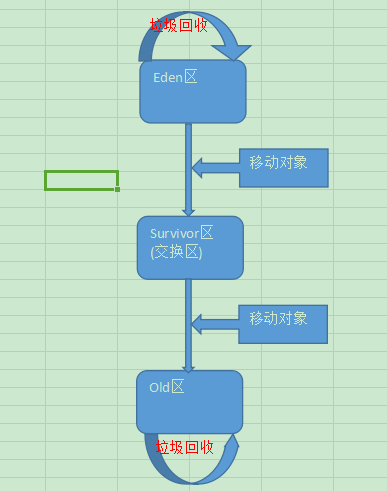

- 常见的Java内存溢出有以下三种：

\1. java.lang.OutOfMemoryError: Java heap space ----JVM Heap（堆）溢出

JVM在启动的时候会自动设置JVM Heap的值，其初始空间(即-Xms)是物理内存的1/64，最大空间(-Xmx)不可超过物理内存。

可以利用JVM提供的*-Xmn -Xms -Xmx*等选项可进行设置。Heap的大小是Young Generation 和Tenured Generaion 之和。

在JVM中如果98％的时间是用于GC，且可用的Heap size不足2％的时候将抛出此异常信息。

解决方法：手动设置JVM Heap（堆）的大小。

\2. java.lang.OutOfMemoryError: PermGen space ---- PermGen space溢出（JDK7以下）。

PermGen space的全称是Permanent Generation space(非堆内存)，是指内存的永久保存区域。

为什么会内存溢出，这是由于这块内存主要是被JVM存放Class和Meta信息的，Class在被Load的时候被放入PermGen space区域，它和存放Instance的Heap区域不同，sun的 GC不会在主程序运行期对PermGen space进行清理，所以如果你的APP会载入很多CLASS的话，就很可能出现PermGen space溢出。

解决方法：手动设置*MaxPermSize*大小

\3. java.lang.StackOverflowError ---- 栈溢出

栈溢出了，JVM依然是采用栈式的虚拟机，这个和C和Pascal都是一样的。函数的调用过程都体现在堆栈和退栈上了。

调用构造函数的“层”太多了，以致于把栈区溢出了。

通常来讲，一般栈区远远小于堆区的，因为函数调用过程往往不会多于上千层，而即便每个函数调用需要1K的空间(这个大约相当于在一个C函数内声明了256个int类型的变量)，那么栈区也不过是需要1MB的空间。通常栈的大小是1－2MB的。

通常递归也不要递归的层次过多，很容易溢出。

解决方法：修改程序。

发布于 2018-10-08

[Java 虚拟机（JVM）](https://www.zhihu.com/topic/19566470)