### 一、内存溢出和内存泄露

一种通俗的说法。
1、内存溢出：你申请了10个字节的空间，但是你在这个空间写入11或以上字节的数据，出现溢出。
2、内存泄漏：你用new申请了一块内存，后来很长时间都不再使用了（按理应该释放），但是因为一直被某个或某些实例所持有导致 GC 不能回收，也就是该被释放的对象没有释放。

下面具体介绍。

#### 1.1 内存溢出

java.lang.OutOfMemoryError，是指程序在申请内存时，没有足够的内存空间供其使用，出现OutOfMemoryError。
**产生原因**
产生该错误的原因主要包括：

1. JVM内存过小。
2. 程序不严密，产生了过多的垃圾。

**程序体现**
一般情况下，在程序上的体现为：

1. 内存中加载的数据量过于庞大，如一次从数据库取出过多数据。
2. 集合类中有对对象的引用，使用完后未清空，使得JVM不能回收。
3. 代码中存在死循环或循环产生过多重复的对象实体。
4. 使用的第三方软件中的BUG。
5. 启动参数内存值设定的过小。

**错误提示**
此错误常见的错误提示：
`tomcat:java.lang.OutOfMemoryError: PermGen space`
`tomcat:java.lang.OutOfMemoryError: Java heap space`
`weblogic:Root cause of ServletException java.lang.OutOfMemoryError`
`resin:java.lang.OutOfMemoryError`
`java:java.lang.OutOfMemoryError`

**解决方法**

1. 增加JVM的内存大小
   对于tomcat容器，找到tomcat在电脑中的安装目录，进入这个目录，然后进入bin目录中，在window环境下找到bin目录中的catalina.bat，在linux环境下找到catalina.sh。
   编辑catalina.bat文件，找到JAVA_OPTS（具体来说是 `set "JAVA_OPTS=%JAVA_OPTS% %LOGGING_MANAGER%"`）这个选项的位置，这个参数是Java启动的时候，需要的启动参数。
   也可以在操作系统的环境变量中对JAVA_OPTS进行设置，因为tomcat在启动的时候，也会读取操作系统中的环境变量的值，进行加载。
   如果是修改了操作系统的环境变量，需要重启机器，再重启tomcat，如果修改的是tomcat配置文件，需要将配置文件保存，然后重启tomcat，设置就能生效了。
2. 优化程序，释放垃圾
   主要思路就是避免程序体现上出现的情况。避免死循环，防止一次载入太多的数据，提高程序健壮型及时释放。因此，从根本上解决Java内存溢出的唯一方法就是修改程序，及时地释放没用的对象，释放内存空间。

#### 1.2 内存泄露

Memory Leak，是指程序在申请内存后，无法释放已申请的内存空间，一次内存泄露危害可以忽略，但内存泄露堆积后果很严重，无论多少内存，迟早会被占光。
在Java中，内存泄漏就是存在一些被分配的对象，这些对象有下面两个特点：
1）首先，这些对象是可达的，即在有向图中，存在通路可以与其相连；
2）其次，这些对象是无用的，即程序以后不会再使用这些对象。
如果对象满足这两个条件，这些对象就可以判定为Java中的内存泄漏，这些对象不会被GC所回收，然而它却占用内存。

关于内存泄露的处理页就是提高程序的健壮型，因为内存泄露是纯代码层面的问题。

#### 1.3 内存溢出和内存泄露的联系

内存泄露会最终会导致内存溢出。
相同点：都会导致应用程序运行出现问题，性能下降或挂起。
不同点：1) 内存泄露是导致内存溢出的原因之一，内存泄露积累起来将导致内存溢出。2) 内存泄露可以通过完善代码来避免，内存溢出可以通过调整配置来减少发生频率，但无法彻底避免。

### 二、一个Java内存泄漏的排查案例

某个业务系统在一段时间突然变慢，我们怀疑是因为出现内存泄露问题导致的，于是踏上排查之路。

#### 2.1 确定频繁Full GC现象

首先通过“虚拟机进程状况工具：jps”找出正在运行的虚拟机进程，最主要是找出这个进程在本地虚拟机的唯一ID（LVMID，Local Virtual Machine Identifier），因为在后面的排查过程中都是需要这个LVMID来确定要监控的是哪一个虚拟机进程。
同时，对于本地虚拟机进程来说，LVMID与操作系统的进程ID（PID，Process Identifier）是一致的，使用Windows的任务管理器或Unix的ps命令也可以查询到虚拟机进程的LVMID。
jps命令格式为：
`jps [ options ] [ hostid ]`
使用命令如下：
使用jps：`jps -l`
使用ps：`ps aux | grep tomat`

找到你需要监控的ID（假设为20954），再利用“虚拟机统计信息监视工具：jstat”监视虚拟机各种运行状态信息。
jstat命令格式为：
`jstat [ option vmid [interval[s|ms] [count]] ]`
使用命令如下：
`jstat -gcutil 20954 1000`
意思是每1000毫秒查询一次，一直查。gcutil的意思是已使用空间站总空间的百分比。
结果如下图：

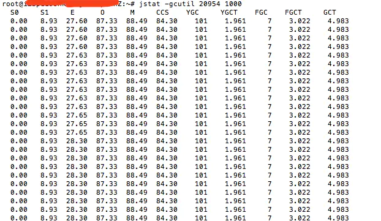 jstat执行结果

查询结果表明：这台服务器的新生代Eden区（E，表示Eden）使用了28.30%（最后）的空间，两个Survivor区（S0、S1，表示Survivor0、Survivor1）分别是0和8.93%，老年代（O，表示Old）使用了87.33%。程序运行以来共发生Minor GC（YGC，表示Young GC）101次，总耗时1.961秒，发生Full GC（FGC，表示Full GC）7次，Full GC总耗时3.022秒，总的耗时（GCT，表示GC Time）为4.983秒。

#### 2.2 找出导致频繁Full GC的原因

分析方法通常有两种：
1）把堆dump下来再用MAT等工具进行分析，但dump堆要花较长的时间，并且文件巨大，再从服务器上拖回本地导入工具，这个过程有些折腾，不到万不得已最好别这么干。
2）更轻量级的在线分析，使用“Java内存影像工具：jmap”生成堆转储快照（一般称为headdump或dump文件）。
jmap命令格式：
`jmap [ option ] vmid`
使用命令如下：
`jmap -histo:live 20954`
查看存活的对象情况，如下图所示：

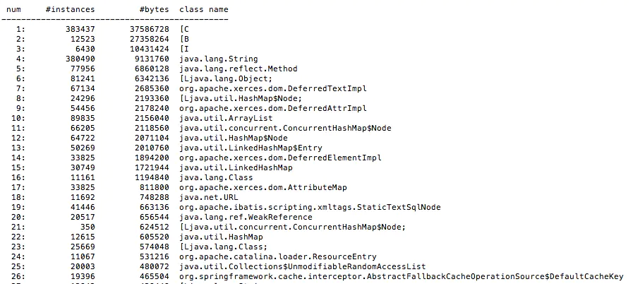 存活对象

按照一位IT友的说法，数据不正常，十有八九就是泄露的。在我这个图上对象还是挺正常的。

我在网上找了一位博友的不正常数据，如下：

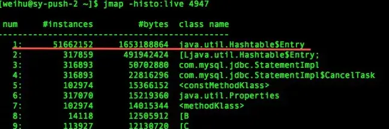 image.png

可以看出HashTable中的元素有5000多万，占用内存大约1.5G的样子。这肯定不正常。

#### 2.3 定位到代码

定位带代码，有很多种方法，比如前面提到的通过MAT查看Histogram即可找出是哪块代码。——我以前是使用这个方法。 也可以使用BTrace，我没有使用过。

**举例：**


一台生产环境机器每次运行几天之后就会莫名其妙的宕机，分析日志之后发现在tomcat刚启动的时候内存占用比较少，但是运行个几天之后内存占用越来越大，通过jmap命令可以查询到一些大对象引用没有被及时GC，这里就要求解决内存泄露的问题。


Java的内存泄露多半是因为对象存在无效的引用，对象得不到释放，如果发现Java应用程序占用的内存出现了泄露的迹象，那么我们一般采用下面的步骤分析：
\1. 用工具生成java应用程序的heap dump（如jmap）
\2. 使用Java heap分析工具（如MAT），找出内存占用超出预期的嫌疑对象
\3. 根据情况，分析嫌疑对象和其他对象的引用关系。
\4. 分析程序的源代码，找出嫌疑对象数量过多的原因。


以下一步步的按照项目实例来操作，去解决内存泄露的问题。

\1. 登录linux服务器，获取tomcat的pid，命令：


[html] [view plain](https://blog.csdn.net/alli0968/article/details/52460008#) [copy](https://blog.csdn.net/alli0968/article/details/52460008#)

1. ps -ef|grep java 

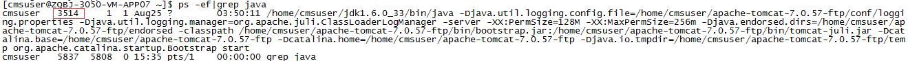


\2. 利用jmap初步分析内存映射，命令：


[html] [view plain](https://blog.csdn.net/alli0968/article/details/52460008#) [copy](https://blog.csdn.net/alli0968/article/details/52460008#)

1. jmap -histo:live 3514 | head -7 

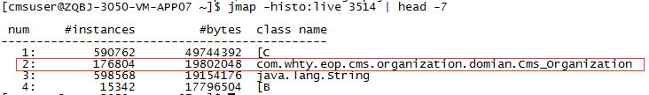

第2行是我们业务系统的对象，通过这个对象的引用可以初步分析出到底是哪里出现了引用未被垃圾回收收集，通知开发人员优化相关代码。


\3. 如果上面一步还无法定位到关键信息，那么需要拿到heap dump，生成离线文件，做进一步分析，命令：


[html] [view plain](https://blog.csdn.net/alli0968/article/details/52460008#) [copy](https://blog.csdn.net/alli0968/article/details/52460008#)

1. jmap -dump:live,format=b,file=heap.hprof 3514 


\4. 拿到heap dump文件，利用eclipse插件MAT来分析heap profile。

a. 安装MAT插件

b. 在eclipse里切换到Memory Analysis视图

c. 用MAT打开heap profile文件。

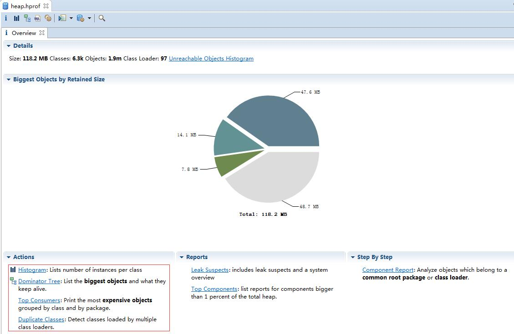

[Memory Analyzer插件下载](http://www.eclipse.org/mat/downloads.php)

直接看到下面Action窗口，有4种Action来分析heap profile，介绍其中最常用的2种:

\- **Histogram**：这个使用的最多，跟上面的jmap -histo 命令类似，只是在MAT里面可以用GUI来展示应用系统各个类产生的实例。

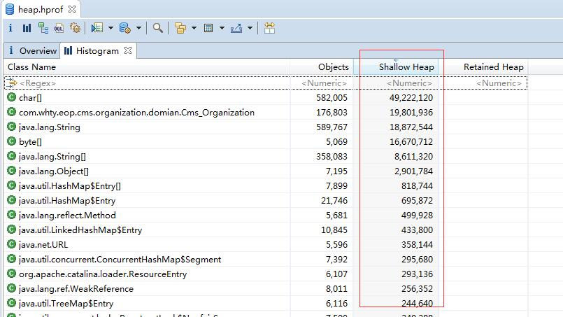

Shllow Heap排序后发现 Cms_Organization 这个类占用的内存比较多（没有得到及时GC），查看引用：

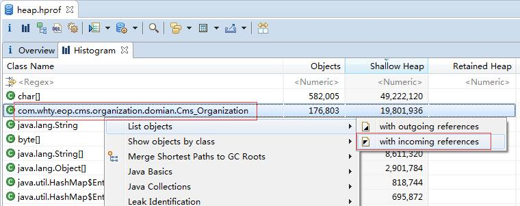

分析引用栈，找到无效引用，打开源码：

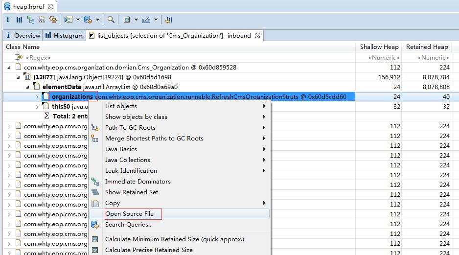

有问题的源码如下：


[java] [view plain](https://blog.csdn.net/alli0968/article/details/52460008#) [copy](https://blog.csdn.net/alli0968/article/details/52460008#)

1. **public** **class** RefreshCmsOrganizationStruts **implements** Runnable{ 
2.  
3.   **private** **final** **static** Logger logger = Logger.getLogger(RefreshCmsOrganizationStruts.**class**); 
4.    
5.   **private** List<Cms_Organization> organizations; 
6.  
7.   **private** OrganizationDao organizationDao = (OrganizationDao) WebContentBean 
8. ​      .getInstance().getBean("organizationDao"); 
9.   **public** RefreshCmsOrganizationStruts(List<Cms_Organization> organizations) { 
10. ​    **this**.organizations = organizations; 
11.   } 
12.  
13.   **public** **void** run() { 
14. ​    Iterator<Cms_Organization> iter = organizations.iterator(); 
15. ​    Cms_Organization organization = **null**; 
16. ​    **while** (iter.hasNext()) { 
17. ​      organization = iter.next(); 
18. ​      **synchronized** (organization) { 
19. ​        **try** { 
20. ​          organizationDao.refreshCmsOrganizationStrutsInfo(organization.getOrgaId()); 
21. ​          organizationDao.refreshCmsOrganizationResourceInfo(organization.getOrgaId()); 
22. ​          organizationDao.sleep(); 
23. ​        } **catch** (Exception e) { 
24. ​          logger.debug("RefreshCmsOrganizationStruts organization = " + organization.getOrgaId(), e); 
25. ​        } 
26. ​      } 
27. ​    } 
28.   } 
29.  
30. } 

**分析源码，定时任务定时调用，每次调用生成10个线程处理，而它又使用了非线程安全的List对象，导致List对象无法被GC收集，所以这里将List替换为CopyOnWriteArrayList 。**


\- **Dominator Tree**：这个使用的也比较多，显示大对象的占用率。

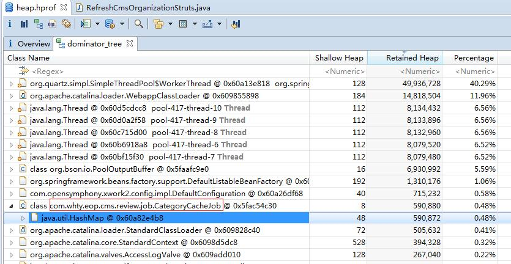

同样的打开源码：


[java] [view plain](https://blog.csdn.net/alli0968/article/details/52460008#) [copy](https://blog.csdn.net/alli0968/article/details/52460008#)

1. **public** **class** CategoryCacheJob **extends** QuartzJobBean **implements** StatefulJob { 
2.    
3.   **private** **static** **final** Logger LOGGER = Logger.getLogger(CategoryCacheJob.**class**); 
4.    
5.   **public** **static** Map<String,List<Cms_Category>> cacheMap = **new** java.util.HashMap<String,List<Cms_Category>>(); 
6.  
7.   @Override 
8.   **protected** **void** executeInternal(JobExecutionContext ctx) **throws** JobExecutionException { 
9. ​    **try** { 
10. ​      //LOGGER.info("======= 缓存编目树开始 ======="); 
11. ​      MongoBaseDao mongoBaseDao = (MongoBaseDao) BeanLocator.getInstance().getBean("mongoBaseDao"); 
12. ​      MongoOperations mongoOperations = mongoBaseDao.getMongoOperations(); 
13. ​       
14. ​      /* 
15. ​      LOGGER.info("1.缓存基础教育编目树"); 
16. ​      Query query = Query.query(Criteria.where("isDel").is("0").and("categoryType").is("F")); 
17. ​      query.sort().on("orderNo", Order.ASCENDING); 
18. ​      List<Cms_Category> list = mongoOperations.find(query, Cms_Category.class); 
19. ​      String key = query.toString().replaceAll("\\{|\\}|\\p{Cntrl}|\\p{Space}", ""); 
20. ​      key += "_CategoryCacheJob"; 
21. ​      cacheMap.put(key, list); 
22. ​      */ 
23. ​       
24. ​      //LOGGER.info("2.缓存职业教育编目树"); 
25. ​      Query query2 = Query.query(Criteria.where("isDel").is("0").and("categoryType").in("JMP","JHP")); 
26. ​      query2.sort().on("orderNo", Order.ASCENDING); 
27. ​      List<Cms_Category> list2 = mongoOperations.find(query2, Cms_Category.**class**); 
28. ​      String key2 = query2.toString().replaceAll("\\{|\\}|\\p{Cntrl}|\\p{Space}", ""); 
29. ​      key2 += "_CategoryCacheJob"; 
30. ​      cacheMap.put(key2, list2); 
31. ​       
32. ​      //LOGGER.info("3.缓存专题教育编目树"); 
33. ​      Query query3 = Query.query(Criteria.where("isDel").is("0").and("categoryType").is("JS")); 
34. ​      query3.sort().on("orderNo", Order.ASCENDING); 
35. ​      List<Cms_Category> list3 = mongoOperations.find(query3, Cms_Category.**class**); 
36. ​      String key3 = query3.toString().replaceAll("\\{|\\}|\\p{Cntrl}|\\p{Space}", ""); 
37. ​      key3 += "_CategoryCacheJob"; 
38. ​      cacheMap.put(key3, list3); 
39. ​       
40. ​      //LOGGER.info("======= 缓存编目树结束 ======="); 
41. ​    } **catch**(Exception ex) { 
42. ​      LOGGER.error(ex.getMessage(), ex); 
43. ​      LOGGER.info("======= 缓存编目树出错 ======="); 
44. ​    } 
45.   } 
46.  
47. } 

这里的HashMap也有问题：居然使用定时任务，在容器启动之后定时将数据放到Map里面做缓存？这里修改这部分代码，替换为使用memcached缓存即可。

内存泄漏的原因分析，总结出来只有一条：**存在无效的引用！**良好的编码规范以及合理使用设计模式有助于解决此类问题。

# 线程安全的CopyOnWriteArrayList介绍


先写一段代码证明`CopyOnWriteArrayList`确实是线程安全的。

ReadThread.java

```
import java.util.List;


 


public class ReadThread implements Runnable {


    private List<Integer> list;


 


    public ReadThread(List<Integer> list) {


        this.list = list;


    }


 


    @Override


    public void run() {


        for (Integer ele : list) {


            System.out.println("ReadThread:"+ele);


        }


    }


}
```

------

WriteThread.java

```
import java.util.List;


 


public class WriteThread implements Runnable {


    private List<Integer> list;


 


    public WriteThread(List<Integer> list) {


        this.list = list;


    }


 


    @Override


    public void run() {


        this.list.add(9);


    }


}
```

------

TestCopyOnWriteArrayList.java

```
import java.util.Arrays;


import java.util.List;


import java.util.concurrent.CopyOnWriteArrayList;


import java.util.concurrent.ExecutorService;


import java.util.concurrent.Executors;


 


public class TestCopyOnWriteArrayList {


 


    private void test() {


        //1、初始化CopyOnWriteArrayList


        List<Integer> tempList = Arrays.asList(new Integer [] {1,2});


        CopyOnWriteArrayList<Integer> copyList = new CopyOnWriteArrayList<>(tempList);


 


 


        //2、模拟多线程对list进行读和写


        ExecutorService executorService = Executors.newFixedThreadPool(10);


        executorService.execute(new ReadThread(copyList));


        executorService.execute(new WriteThread(copyList));


        executorService.execute(new WriteThread(copyList));


        executorService.execute(new WriteThread(copyList));


        executorService.execute(new ReadThread(copyList));


        executorService.execute(new WriteThread(copyList));


        executorService.execute(new ReadThread(copyList));


        executorService.execute(new WriteThread(copyList));


 


        System.out.println("copyList size:"+copyList.size());


    }


 


 


    public static void main(String[] args) {


        new TestCopyOnWriteArrayList().test();


    }


}
```

运行上面的代码,没有报出

```
java.util.ConcurrentModificationException
```

说明了CopyOnWriteArrayList并发多线程的环境下，仍然能很好的工作。

------

**CopyOnWriteArrayList如何做到线程安全的**

------

`CopyOnWriteArrayList`使用了一种叫**写时复制**的方法，当有新元素添加到`CopyOnWriteArrayList`时，先从原有的数组中拷贝一份出来，然后在新的数组做写操作，写完之后，再将原来的数组引用指向到新数组。

当有新元素加入的时候，如下图，创建新数组，并往新数组中加入一个新元素,这个时候，array这个引用仍然是指向原数组的。

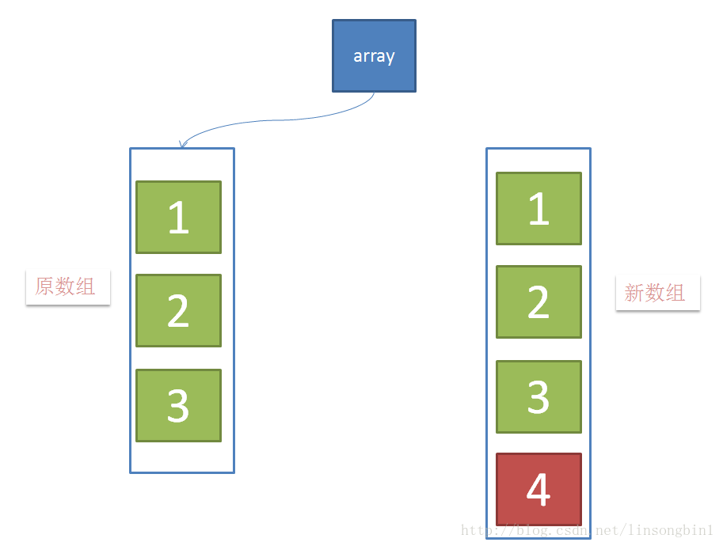

------

当元素在新数组添加成功后，将array这个引用指向新数组。

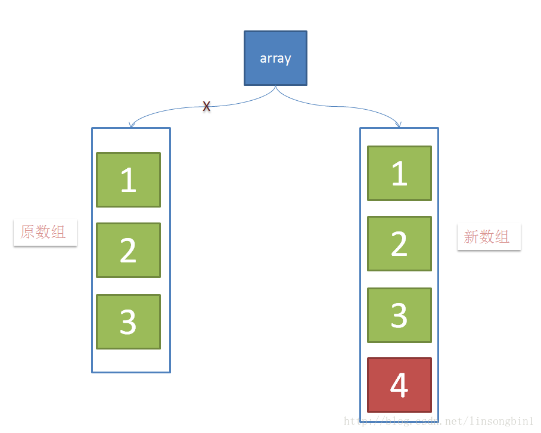

`CopyOnWriteArrayList`的整个add操作都是在**锁**的保护下进行的。 
这样做是为了避免在多线程并发add的时候，**复制出多个副本出来**,把数据搞乱了，导致最终的数组数据不是我们期望的。

`CopyOnWriteArrayList`的`add`操作的源代码如下：

```
 public boolean add(E e) {


    //1、先加锁


    final ReentrantLock lock = this.lock;


    lock.lock();


    try {


        Object[] elements = getArray();


        int len = elements.length;


        //2、拷贝数组


        Object[] newElements = Arrays.copyOf(elements, len + 1);


        //3、将元素加入到新数组中


        newElements[len] = e;


        //4、将array引用指向到新数组


        setArray(newElements);


        return true;


    } finally {


       //5、解锁


        lock.unlock();


    }


}
```

由于所有的写操作都是在新数组进行的，这个时候如果有线程并发的写，则通过锁来控制，如果有线程并发的读，则分几种情况： 
1、如果写操作未完成，那么直接读取原数组的数据； 
2、如果写操作完成，但是引用还未指向新数组，那么也是读取原数组数据； 
3、如果写操作完成，并且引用已经指向了新的数组，那么直接从新数组中读取数据。

可见，`CopyOnWriteArrayList`的**读操作**是可以不用**加锁**的。

------

**CopyOnWriteArrayList的使用场景**

------

通过上面的分析，`CopyOnWriteArrayList` 有几个缺点： 
1、由于写操作的时候，需要拷贝数组，会消耗内存，如果原数组的内容比较多的情况下，可能导致`young gc`或者`full gc`

2、不能用于**实时读**的场景，像拷贝数组、新增元素都需要时间，所以调用一个`set`操作后，读取到数据可能还是旧的,虽然`CopyOnWriteArrayList` 能做到**最终一致性**,但是还是没法满足实时性要求；

`CopyOnWriteArrayList` 合适**读多写少**的场景，不过这类慎用 
因为谁也没法保证`CopyOnWriteArrayList` 到底要放置多少数据，万一数据稍微有点多，每次add/set都要重新复制数组，这个代价实在太高昂了。在高性能的互联网应用中，这种操作分分钟引起故障。

------

**CopyOnWriteArrayList透露的思想**

------

如上面的分析CopyOnWriteArrayList表达的一些思想： 
1、读写分离，读和写分开 
2、最终一致性 

3、使用另外开辟空间的思路，来解决并发冲突


##### Eclipse Memory Analyzer 进行堆转储文件分析


简单的说一下使用(控制台的)如果是tomcat或者是别的服务器需要你去查如何配置JVM参数:

以下是一个会导致**java.lang.OutOfMemoryError: Java heap space**的程序代码:(very easy)


[java] [view plain](https://blog.csdn.net/yanghongchang_/article/details/7711911#) [copy](https://blog.csdn.net/yanghongchang_/article/details/7711911#)

1. **package** org.lx.test; 
2.  
3. **import** java.util.Date; 
4. **import** java.util.HashMap; 
5. **import** java.util.Map; 
6.  
7. **public** **class** OutOfMemoryTest { 
8.   **public** **static** **void** main(String[] args) { 
9. ​    Map<Integer,Date> map=**new** HashMap<Integer, Date>(); 
10. ​    **for** (**int** i = 0; i < 600000000; i++) { 
11. ​      map.put(i, **new** Date()); 
12. ​    } 
13.   } 
14.    
15.    
16. } 


首先在运行之前有一些参数需要设置:


然后就到了参数设置的页面,按照A,B的顺序设置参数:(-XX:+HeapDumpOnOutOfMemoryError)避免写错误可以copy


运行错误的程序代码会看见以下结果:


那么这时候就生成了一个文件**java_pid3708.hprof**,这个文件 在你的项目的根目录下(myeclipse10)


那么接下来我们就打开这个文件进行分析如何打开见下图:(选中刚刚在项目根目录下生成的文件**java_pid3708.hprof**打开)


打开之后你会看见下图就OK了:


参考文档

[一个Java内存泄漏的排查案例](https://juejin.im/entry/5b2c9a376fb9a00e5326e05e?utm_source=gold_browser_extension)

[使用jmap和MAT分析JVM堆内存](https://blog.csdn.net/alli0968/article/details/52460008)

[线程安全的CopyOnWriteArrayList介绍](https://blog.csdn.net/linsongbin1/article/details/54581787)

[使用 Eclipse Memory Analyzer 进行堆转储文件分析](https://www.ibm.com/developerworks/cn/opensource/os-cn-ecl-ma/index.html?ca=drs-)