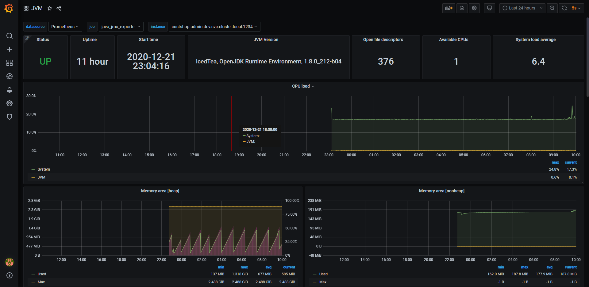
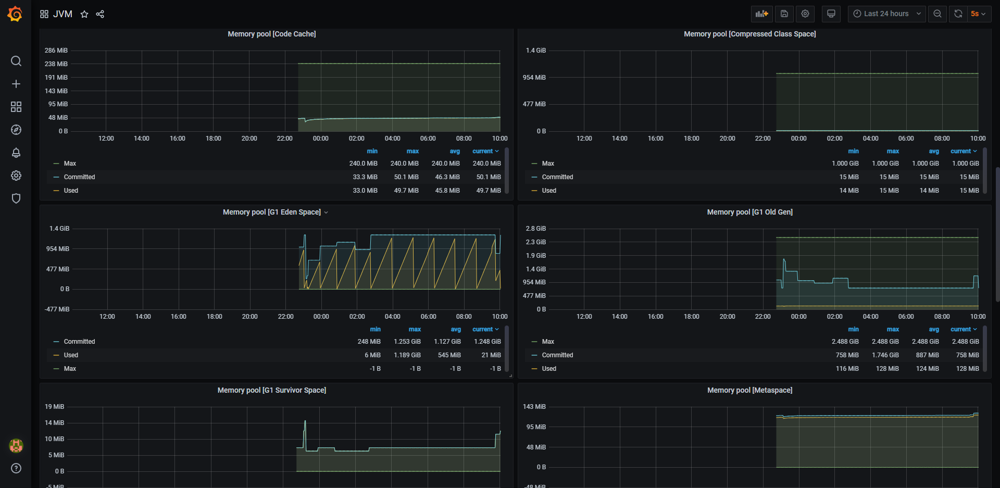
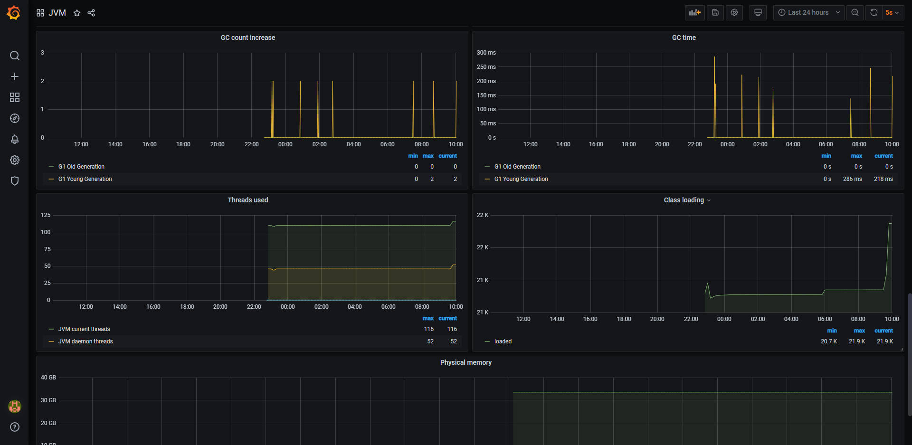

# 项目中集成监控组件

        <!-- java项目监控 -->
        <dependency>
            <groupId>org.springframework.boot</groupId>
            <artifactId>spring-boot-starter-actuator</artifactId>
        </dependency>
# 启用exporter(jmx_exporter)

准备好jmx文件

jmx_prometheus_javaagent-0.14.0.jar

httpserver_sample_config.yml.txt

修改构建脚本, 在构建时拷贝jmx_exporter和jmx_config.yml进去, 使用-javaagent启用jmx_exporter

启动

```
-javaagent:D:/server_files/java_metrics_monitor/jmx_prometheus_javaagent-0.14.0.jar=1234:D:/server_files/java_metrics_monitor/jmx_config.yml
```


```
java -javaagent:D:/server_files/java_metrics_monitor/jmx_prometheus_javaagent-0.14.0.jar=1234:D:/server_files/java_metrics_monitor/jmx_config.yml -jar wms-dal.jar
```


```
java -javaagent:/jmx_prometheus_javaagent-0.14.0.jar=1234:/jmx_config.yml -jar wms-dal.jar
```


tomcat.yml

```
---   
lowercaseOutputLabelNames: true
lowercaseOutputName: true
rules:
- pattern: 'Catalina<type=GlobalRequestProcessor, name=\"(\w+-\w+)-(\d+)\"><>(\w+):'
  name: tomcat_$3_total
  labels:
    port: "$2"
    protocol: "$1"
  help: Tomcat global $3
  type: COUNTER
- pattern: 'Catalina<j2eeType=Servlet, WebModule=//([-a-zA-Z0-9+&@#/%?=~_|!:.,;]*[-a-zA-Z0-9+&@#/%=~_|]), name=([-a-zA-Z0-9+/$%~_-|!.]*), J2EEApplication=none, J2EEServer=none><>(requestCount|maxTime|processingTime|errorCount):'
  name: tomcat_servlet_$3_total
  labels:
    module: "$1"
    servlet: "$2"
  help: Tomcat servlet $3 total
  type: COUNTER
- pattern: 'Catalina<type=ThreadPool, name="(\w+-\w+)-(\d+)"><>(currentThreadCount|currentThreadsBusy|keepAliveCount|pollerThreadCount|connectionCount):'
  name: tomcat_threadpool_$3
  labels:
    port: "$2"
    protocol: "$1"
  help: Tomcat threadpool $3
  type: GAUGE
- pattern: 'Catalina<type=Manager, host=([-a-zA-Z0-9+&@#/%?=~_|!:.,;]*[-a-zA-Z0-9+&@#/%=~_|]), context=([-a-zA-Z0-9+/$%~_-|!.]*)><>(processingTime|sessionCounter|rejectedSessions|expiredSessions):'
  name: tomcat_session_$3_total
  labels:
    context: "$2"
    host: "$1"
  help: Tomcat session $3 total
  type: COUNTER

```


配置jvm规则

```
---   
lowercaseOutputLabelNames: true
lowercaseOutputName: true
whitelistObjectNames: ["java.lang:type=OperatingSystem"]
blacklistObjectNames: []
rules:
  - pattern: 'java.lang<type=OperatingSystem><>(committed_virtual_memory|free_physical_memory|free_swap_space|total_physical_memory|total_swap_space)_size:'
    name: os_$1_bytes
    type: GAUGE
    attrNameSnakeCase: true
  - pattern: 'java.lang<type=OperatingSystem><>((?!process_cpu_time)\w+):'
    name: os_$1
    type: GAUGE
    attrNameSnakeCase: true
```

配置tomcat规则

```
---   
lowercaseOutputLabelNames: true
lowercaseOutputName: true
whitelistObjectNames: ["java.lang:type=OperatingSystem", "Catalina:*"]
blacklistObjectNames: []
rules:
  - pattern: 'Catalina<type=Server><>serverInfo: (.+)'
    name: tomcat_serverinfo
    value: 1
    labels:
      serverInfo: "$1"
    type: COUNTER
  - pattern: 'Catalina<type=GlobalRequestProcessor, name=\"(\w+-\w+)-(\d+)\"><>(\w+):'
    name: tomcat_$3_total
    labels:
      port: "$2"
      protocol: "$1"
    help: Tomcat global $3
    type: COUNTER
  - pattern: 'Catalina<j2eeType=Servlet, WebModule=//([-a-zA-Z0-9+&@#/%?=~_|!:.,;]*[-a-zA-Z0-9+&@#/%=~_|]), name=([-a-zA-Z0-9+/$%~_-|!.]*), J2EEApplication=none, J2EEServer=none><>(requestCount|processingTime|errorCount):'
    name: tomcat_servlet_$3_total
    labels:
      module: "$1"
      servlet: "$2"
    help: Tomcat servlet $3 total
    type: COUNTER
  - pattern: 'Catalina<type=ThreadPool, name="(\w+-\w+)-(\d+)"><>(currentThreadCount|currentThreadsBusy|keepAliveCount|connectionCount|acceptCount|acceptorThreadCount|pollerThreadCount|maxThreads|minSpareThreads):'
    name: tomcat_threadpool_$3
    labels:
      port: "$2"
      protocol: "$1"
    help: Tomcat threadpool $3
    type: GAUGE
  - pattern: 'Catalina<type=Manager, host=([-a-zA-Z0-9+&@#/%?=~_|!:.,;]*[-a-zA-Z0-9+&@#/%=~_|]), context=([-a-zA-Z0-9+/$%~_-|!.]*)><>(processingTime|sessionCounter|rejectedSessions|expiredSessions):'
    name: tomcat_session_$3_total
    labels:
      context: "$2"
      host: "$1"
    help: Tomcat session $3 total
    type: COUNTER
```


# 配置prometheus-scrape数据抓取点

修改service

```
kubectl -n dev edit service purchase-server

  ports:
  - name: http
    port: 80
    protocol: TCP
    targetPort: 80
  - name: http1
    port: 1234
    protocol: TCP
    targetPort: 1234
    
    
```

测试jmx_exporter端点是否可用

```
kubectl delete deployments/load-generator
kubectl run -it --tty load-generator --image=busybox /bin/sh
kubectl get pod |grep  load-generator
kubectl exec --stdin --tty load-generator-7fbcc7489f-z49j5 /bin/sh

wget http://report-admin.wjh-prod.svc.cluster.local:1234
```

调整prometheus数据抓取点

```
kubectl -n kube-system edit configmaps prometheus-config -o yaml
kubectl -n kube-system get configmaps prometheus-config -o yaml > aliyun_prometheus_configmap.yaml
```

内容如下:

```
    - job_name: 'java_jmx_exporter'
      metrics_path: '/'
      static_configs:
      - targets:
        - custshop-admin.dev.svc.cluster.local:1234
        - purchase-server.dev.svc.cluster.local:1234
        - vendor-dal.dev.svc.cluster.local:1234
        - vendor-server.dev.svc.cluster.local:1234
        
```

添加联邦同步job:

```
        - '{job="java_jmx_exporter"}'
```


# 配置grafana-dashboard

JVM dashboard-1608601338377.json

tomcat-dashboard_rev10.json

## 效果





