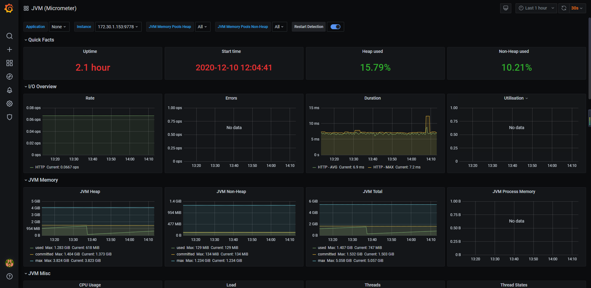

# 数据源

## springboot项目集成监控依赖(推荐使用)

### 调整项目依赖

如果有顶级父pom或者公共pom, 建议在上层pom中加上以下依赖:

备注: 上层pom意味着: common项目或者parent项目中的pom.xml

```
        <!-- java项目监控 -->
        <dependency>
            <groupId>org.springframework.boot</groupId>
            <artifactId>spring-boot-starter-actuator</artifactId>
        </dependency>
        <dependency>
            <groupId>io.micrometer</groupId>
            <artifactId>micrometer-registry-prometheus</artifactId>
        </dependency>
```

### 调整配置

```
management:
  endpoints:
    web:
      exposure:
        include: prometheus,info, metrics
  metrics:
    tags:
      application: ${spring.application.name}
```

验证: 用浏览器访问 http://<地址>:<端口>/<context_path>/prometheus 看到大量的metrics数据

# 数据抓取点

k8s中直接使用prometheus operator

为每一个服务添加ServiceMonitor

统一监控体系使用联邦机制同步K8S中的prometheus

假设svc的定义如下:

```
apiVersion: v1
kind: Service
metadata:
  annotations:
    traffic.sidecar.istio.io/excludeOutboundIPRanges: 0.0.0.0/0
  labels:
    app: <service_name>
  name: <service_name>
  namespace: <namespace_name>
spec:
  ports:
  - name: http
    port: 80
    targetPort: 80
  selector:
    app: <service_name>
```

查看svc

```
kubectl get namespace

kubectl -n dev get svc|grep custshop-admin
kubectl -n dev describe svc custshop-admin

kubectl delete deployments/load-generator
kubectl run --tty load-generator --image=busybox /bin/sh
kubectl exec --stdin --tty load-generator-7fbcc7489f-v2m9s /bin/sh


wget http://custshop-admin.dev.svc.cluster.local/ping
wget http://custshop-admin.dev.svc.cluster.local/custadmin/prometheus

```


那么serviceMonitor的定义如下: 

注意: 如果项目带了context_path那么需要调整在path前面带上context_path

​		或者  spring.mvc.servlet.path

```
apiVersion: monitoring.coreos.com/v1
kind: ServiceMonitor
metadata:
  labels:
    app: <service_name>
  name: <service_name>
  namespace: <namespace_name>
spec:
  endpoints:
  - interval: 15s
    port: 80
    path: "/prometheus"
  selector:
    matchLabels:
      app: <service_name>
```

案例:

```
---
apiVersion: monitoring.coreos.com/v1
kind: ServiceMonitor
metadata:
  labels:
    app: custshop-admin
  name: custshop-admin
  namespace: dev
spec:
  endpoints:
  - interval: 15s
    port: 80
    path: "/prometheus"
  selector:
    matchLabels:
      app: custshop-admin
```


调试阶段可以使用

```
  - job_name: 'java_jmx_exporter'
    metrics_path: '/'
    static_configs:
    - targets:
      - custshop-admin.dev.svc.cluster.local:1234
```


# 展示效果

监控线程数量, 可用, 已用, 是否有阻塞, 等待队列大小, 忙碌线程情况

当有阻塞线程时进行报警

grafana id: 4701

效果如下

