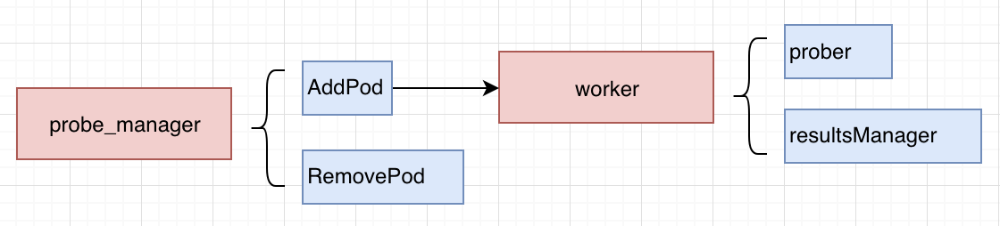
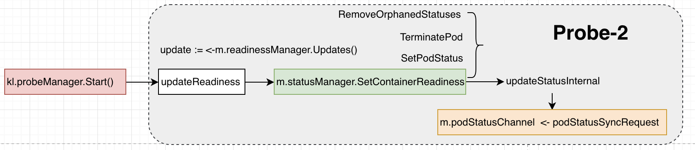
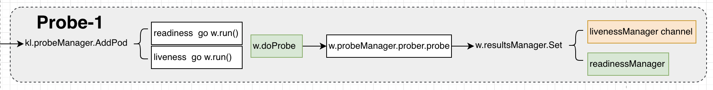

## Kubelet的probe探针流程分析

 发表于 2018-11-16 | 分类于 [kubernetes ](https://chenleji.github.io/categories/kubernetes/)| [0 Comments](https://chenleji.github.io/2018/11/16/kubelet的probe流程分析/#comments)

 阅读时长 ≈ 3 mins.

kubernetes提供了用于存活性检查的liveness和用于服务就绪检查的readiness功能，这两个功能为服务的可靠性提供了极大的帮组；接下来我们就来分析下在kubelet源码中是如何实现这块功能的。

# 概念

kubelet中提供了liveness和readiness探针，这两种探针都支持基于HTTP/TCP/Command的形势；而且他们的配置都是一致的，只是各自的用途不同而已。


- `liveness`探针
  存活性检查，主要用于检测pod是否健康；一旦该配置指定的指标未能达标，kubelet即认为该pod不健康，就会试图杀掉该pod，然后重新启动一个副本，从而保障pod永远是“活着”的。
- `readiness`探针
  就绪检查，主要用于检测某个pod所提供的服务当前是否可用；如果该配置指定的指标未能达标，kubelet就不会将该pod作为service的endpoints，也就意味着，不会将外部的访问流量分配给该pod处理。

# 实现流程

代码实现逻辑首先从核心对象来了解主要的数据结构和封装，然后分别从readiness探测结果的守护go Routine到探针与Pod联动过程来了解探测和结果处理动作。

## 核心对象

[](https://chenleji.github.io/uploads/kubelet-probe-object.png)
如上图所示，实现代码中主要需涉及以下核心对象：

- probe_manager
  封装了pod的状态变化与探针联动的所有操作以及probe对应的worker的添加、删除等。

- worker
  封装了操作具体do_probe行为任务；探针探测的主要逻辑就是在该对象中执行。其方法分析如下：

  1. newWoker用户初始化出属于readiness或者liveness的worker；
  2. run中按照pod.probe.spec.PeriodSeconds中指定的周期，执行worker的w.doProbe操作；
  3. doProbe调用w.probeManager.prober.probe来执行探测，然后对结果进行处理。
     当成功或者失败的次数小于设置的threshold的时候，需要继续执行；否则将结果通过w.resultsManager.Set写到channel中；
  4. doProbe经过多层调用，最终命令是通过runProbe函数来执行的；在该函数中，分别支持了exec、http以及TCPsocket类型的调用探测方式。

- probe
  具体探针探测的流程，按照三种探测类型来实现（HTTP/TCP/Command），对应代码细节如下：

  ```
  func (pb *prober) runProbe(probeType probeType, p *v1.Probe, pod *v1.Pod, status v1.PodStatus, container v1.Container, containerID kubecontainer.ContainerID) (probe.Result, string, error) {
    timeout := time.Duration(p.TimeoutSeconds) * time.Second
    if p.Exec != nil {
      command := kubecontainer.ExpandContainerCommandOnlyStatic(p.Exec.Command, container.Env)
      return pb.exec.Probe(pb.newExecInContainer(container, containerID, command, timeout))
    }
    if p.HTTPGet != nil {
      scheme := strings.ToLower(string(p.HTTPGet.Scheme))
      host := p.HTTPGet.Host
      if host == "" {
        host = status.PodIP
      }
      port, err := extractPort(p.HTTPGet.Port, container)
      if err != nil {
        return probe.Unknown, "", err
      }
      path := p.HTTPGet.Path
      url := formatURL(scheme, host, port, path)
      headers := buildHeader(p.HTTPGet.HTTPHeaders)
      if probeType == liveness {
        return pb.livenessHttp.Probe(url, headers, timeout)
      } else { // readiness
        return pb.readinessHttp.Probe(url, headers, timeout)
      }
    }
    if p.TCPSocket != nil {
      port, err := extractPort(p.TCPSocket.Port, container)
      if err != nil {
        return probe.Unknown, "", err
      }
      host := p.TCPSocket.Host
      if host == "" {
        host = status.PodIP
      }
      return pb.tcp.Probe(host, port, timeout)
    }
    return probe.Unknown, "", fmt.Errorf("Missing probe handler for %s:%s", format.Pod(pod), container.Name)
  }
  ```

  可以从上面代码中看到，分别有三个判断，分别对应为：p.Exec、p.HTTPGet 和 p.TCPSocket。

## 启动流程

[](https://chenleji.github.io/uploads/kubelet-probe-2.png)

kubelet通过probe_manager.start()来启动probe服务，该服务只是持续的从readiness channel中获取readiness的结果（所以，不如说这是在启动readiness的服务）。

readinessManager的结果通过调用probeManager.Start()来从channel中将结果获取出来，并通过statusManager写出去。经过一连串的动作，最终到kubelet的主循环逻辑中触发podStatusChannel收消息后的业务逻辑。

## Pod联动

[](https://chenleji.github.io/uploads/kubelet-probe-1.png)

当pod被kubelet处理时，如果该pod配置了liveness或者readiness探针规则，probeManager的AddPod方法中会启动分别goRoutine来为readiness和liveness启动各自的worker（这里可以参考”核心对象”节的描述）。

各自的worker都会调用相同的probeManager来执行probe操作；这里两种探针使用的probe是行为是一样的。当基于probeManager获取到探针探测结果后，会调用各自的resultManager来处理结果。这里readiness和liveness各自对结果的处理有些不一样。

- readiness
  将结果写入到livenessManager channel，这就和前面“启动流程”一节分析的一致，只是写入channel后其他流程便由kubelet的主逻辑来处理。

  ```
  func (m *manager) updateReadiness() {
    update := <-m.readinessManager.Updates()
  
    ready := update.Result == results.Success
    m.statusManager.SetContainerReadiness(update.PodUID, update.ContainerID, ready)
  }
  ```

- liveness
  livenessManager的结果，直接在syncLoopIteration中读出来然后执行pod的update操作。

- **本文作者：** ljchen
- **本文链接：** http://ljchen.net/2018/11/16/kubelet的probe流程分析/
- **版权声明：** 本博客所有文章除特别声明外，均采用 [CC BY-NC-SA 3.0](https://creativecommons.org/licenses/by-nc-sa/3.0/) 许可协议。转载请注明出处！

[# k8s](https://chenleji.github.io/tags/k8s/) [# opensource](https://chenleji.github.io/tags/opensource/) [# liveness](https://chenleji.github.io/tags/liveness/) [# readiness](https://chenleji.github.io/tags/readiness/)