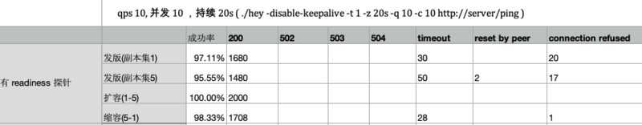
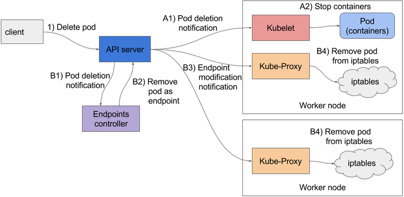
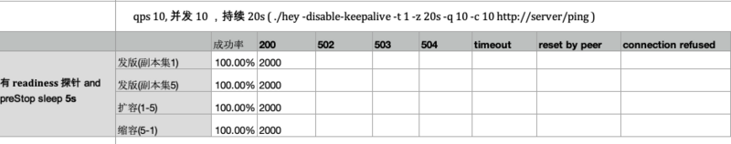

# [kubernetes 探针实战](https://segmentfault.com/a/1190000021371333)

[容器](https://segmentfault.com/t/容器)[linux](https://segmentfault.com/t/linux)[kubernetes](https://segmentfault.com/t/kubernetes)[golang](https://segmentfault.com/t/golang)[devops](https://segmentfault.com/t/devops)

发布于 2019-12-23


## kubernetes 探针实战

### 0x0 实验目的

kubernetes 在 pod 的生命周期中引入探针机制来判断服务的健康状态。
Liveness 探针顾名思义是用来探测服务的生存状态，如果 Liveness 探针连续失败次数超过设定的阈值，则 kubelet 会 kill 掉该 pod。 Readiness 探针用来判断服务是否准备好接收流量和负载，按照官方文档说明，Readiness 探针连续失败后，将从 service 中摘除该 endpoint，不再承载流量。但实际上它还有另外一个作用，就在更新 deployment 或 replica set 时，Liveness 探针决定了 controller kill 掉旧 pod 的时机，这一点在后面的例子中我们再细讲。

在写这篇博客之前，官方文档看了一遍又一遍，也翻了好多第三方的博客，但还是没用深入的理解这两个探针的区别。在生产环境中使用的时候，我们到底该不该使用这两个探针呢，又该怎么搭配使用这个探针呢？

**本文基于 kubernetes 1.14 编写，对于 kubernetes 1.16 引入的 startup 探针的功能请查看官方文档**。

### 0x1 准备

少啰嗦，直接上例子。

首先我们构建一个 golang webserver，然后我们对此服务验证 Liveness Probe 和 Readiness Probe 对此服务的影响。
Dockerfile 如下：

```
FROM golang:1.10-alpine3.8 AS build-env
WORKDIR /go/src/app
COPY . .
RUN go build -o /app .

FROM alpine:3.8
COPY --from=build-env /app /app
COPY --from=build-env /go/src/app/docker/entrypoint.sh /entrypoint.sh

ENTRYPOINT ["/entrypoint.sh"]

CMD ["/app"]
```

在 entrypoint 中我们加入几秒钟的 sleep 来模拟一个启动较慢的应用（或者你可以直接起一个 java 服务），来方便我们观察 Liveness Probe 和 Readiness Probe 的作用。
entrypoint 如下:

```
#!/bin/bash
echo "in entrypoint.sh"
echo "sleep start"
sleep 10
echo "sleep over"

exec "$@"
```

依据此 Dockerfile 构建镜像 example.com/server:latest, 然后创建一个最基本的 deploy

和 service ，我们的试验就开始啦。

```
apiVersion: extensions/v1beta1
kind: Deployment
metadata:
  name: server
  labels:
    app: server
spec:
  replicas: 1
  selector:
    matchLabels:
      app: server
  template:
    metadata:
      labels:
        app: server
    spec:
      containers:
        - name: app
          image: example.com/server:latest
          ports:
            - name: app-tcp
              containerPort: 8000
              protocol: TCP

---
apiVersion: v1
kind: Service
metadata:
  name: server
  labels:
    app: server
spec:
  selector:
    app: server
  ports:
  - port: 80
    protocol: TCP
    targetPort: 8000
```

至此，我们就在集群中运行起来一个服务，它具有如下特征：

- 启动后有 10 秒延迟时间，10秒后开始提供服务
- 服务提供一个 /ping 接口，访问该接口会返回 http 状态码为 200 的页面
- 服务无状态，也设定任意数量的副本集

### 0x2 action

说干就干。
接下来分别配置几种不同的探针组合方式来观察其对日常发版(更新 deployment/rs)以及扩容，缩容操作:

- 不配置任何探针
- 配置 initialDelay 值较小的 Liveness 探针
- 配置 initialDelay 值适当的 Liveness 探针
- 配置 initialDelay 值适当的 Liveness 探针和 initialDelay 值较小的 Readiness 探针
- 配置 initialDelay 值适当的 Liveness 探针和 initialDelay 值较大的 Readiness 探针

然后在发版的同时,用压测工具模拟一定并发请求去访问服务，然后统计不同场景下的请求成功率。
压测工具选用 `hey`，需要注意的是，这里使用压测工具并不是为了测试系统的负载能力，而单纯是为了模拟
一定并发量，观察系统行为。

```
# qps 10, 并发 10 ，持续 20s
hey -disable-keepalive -t 1 -z 20s -q 10 -c 10 http://server/ping
```

#### 不配置任何探针

不配置探针时，kubelet 和 endpoint controller 都默认认为 pod 只要主进程存在，容器即存活，
不会尝试重启 pod, 也不会主动将 pod 的 ip 从 endpoint controller 摘除。

因此，此种场景下 pod 能够正常启动，但启动后流量即打入到新启动的容器。在我们的场景下，主进程启动 10 秒后服务才可以处理网络请求，因此每次发版会有 10 秒左右的服务不可用时间。

#### 配置 initialDelay 值较小的 Liveness 探针

```
livenessProbe:
  httpGet:
    path: /ping
    port: 8000
    scheme: HTTP
  initialDelaySeconds: 2
  timeoutSeconds: 3
  periodSeconds: 5
  successThreshold: 1
  failureThreshold: 3
```

我们配置了初始延迟为 2 秒，超时时间为 3 秒，请求间隔为 5 秒，失败阈值为 3 的 liveness 探针，这意味着什么呢？

从 pod 启动2秒钟开始进行探测，每5秒进行一次，连续失败三次后即判定容器不存活，则会杀掉该容器。

2 + 5*3=17, 17 后如果容器还没启动完成，则会被重启！因为我们的服务启动 10 秒后才能正确的处理 ping
请求，所以我们的容器将会不断重启，永远无法正常提供服务！

#### 配置 initialDelay 值适当的 Liveness 探针

```
livenessProbe:
  httpGet:
    path: /ping
    port: 8000
    scheme: HTTP
  initialDelaySeconds: 10
  timeoutSeconds: 3
  periodSeconds: 5
  successThreshold: 1
  failureThreshold: 3
```

什么叫适当呢。其实只要你的服务正常启动时间小于 initialDelaySeconds + failureThreshold*periodSeconds 就好。但是这样算有点麻烦，为了简便起见，这里直接让服务启动时间小于 initialDelaySeconds 即可。
这样配置以后，服务是起来了，但我们测试后，发现还是有 10 秒左右的不可用时间!

因为 liveness 只是决定了 kubelet 重启 Pod 的时间，但是对 endpoint controller 何时将 pod 的 IP
添加与删除并无直接影响，因此流量还是能打到未启动完全的容器上。不过只是我们的 Pod 能正常启动了。

### 配置 initialDelay 值较小的 Readiness 探针

```
readinessProbe:
  httpGet:
    path: /ping
    port: 8000
    scheme: HTTP
  initialDelaySeconds: 5
  timeoutSeconds: 3
  periodSeconds: 5
  successThreshold: 1
  failureThreshold: 3
```

readiness 探针会的功能包含两个:

- 周期性地探测服务可用性，如果服务不可用，则 endpoint controller 会将该 endpoint 摘除掉。
- 并且只有在 readiness 探针连续成功次数超过成功阈值后才会将 ip 加入 endpoint。

如果只想实现 1 功能，仅服务启动时检测可用性的话， 可使用 startupProbe (前提是你的集群版本大于 1.16) 。

配置 readiness 探针后，手动调用时没有发现服务不可用，然后我们再使用 hey 进行并发测试。
测试后发现，成功率能达到 90% 以上，有了质的飞越。


#### 配置 initialDelay 值较大的 Readiness 探针

```
readinessProbe:
  httpGet:
    path: /ping
    port: 8000
    scheme: HTTP
  initialDelaySeconds: 10
  timeoutSeconds: 3
  periodSeconds: 5
  successThreshold: 1
  failureThreshold: 3
```

只要 Readiness 的 initialDelay 小于服务的正常启动时间（在我们的例子里也就是 10 秒），该值的大小对
服务本身是没有影响的。

但是如果 initialDelay 大于你的服务启动时间，虽然对服务本身也没有影响，但是将会延长你的发布时间。因为在新启动的 pod ready 之前，旧的 pod 是不会被 kill 掉的，流量也不会切到新起的容器。

#### 延迟退出

有了 readiness 探针后，我们发版时服务的调用成功率已经达 90% 以上了，但对于一些并发较高的服务，这剩余的 10% 的失败，影响也是很严重的。还有没有办法再进一步提升成功率呢？

分析一下，请求失败，无非是两种可能：

- 流量请求到了没启动完全的容器上，此时容器还无法处理请求，因而导致 connection refused
- 流量由于某种原因请求到了已经停止服务的容器上，导致 connection refused 或 connect timeout

第一种情况已经由 readiness 解了，只能是第二种了。来看一张 《Kubernetes in action》 一书中的图:



以下节选自《Kubernetes in action》 ：

> 当APIserver收到一个停止Pod的请求时，它首先修改了etcd里Pod的状态，并通知关注这个删除事件所有的watcher。这些watcher里包括Kubelet和Endpoint Controller。这两个序列的事件是并行发生的（标记为A和B)在A系列事件里，你会看到在Kubelet收到该Pod要停止的通知以后会尽快开始停止Pod的一系列操作（执行prestop钩子，发送SIGTERM信号，等待一段时间然后如果这个容器没有自动退出的话就强行杀掉这个容器）。如果应用响应了SIGTERM并迅速停止接收请求，那么任何尝试连接它的客户端都会收到一个Connection Refusd的错误。因为APIserver是直接向Kubelet发送的请求，那么从Pod被删除开始计算，Pod用于执行这段逻辑的时间相当短。
>
> 现在，让我们一起看看另外一系列事件都发生了什么——移除这个Pod相关的iptables规则（图中所示事件系列B）。当Endpoints Controller（运行在在Kubernetes控制平面里的Controller Manager里）收到这个Pod被删除的通知，然后它会把这个Pod从所有关联到这个Pod的Service里剔除。它通过向APIserver发送一个REST请求对Endpoint对象进行修改来实现。APIserver然后通知每个监视Endpoint对象的组件。在这些组件里包含了每个工作节点上运行的Kubeproxy。这些代理负责更新它所在节点上的iptables规则，这些规则可以用来阻止外面的请求被转发到要停止的Pod上。这里有个非常重要的细节，移除这些iptables规则对于已有的连接不会有任何影响——连接到这个Pod的客户端仍然可以通过已有连接向它发送请求。
>
> 这些请求都是并行发生的。更确切地，关停应用所需要的时间要比iptables更新花费所需的时间稍短一些。这是因为iptables修改的事件链看起来稍微长一些（见图2），因为这些事件需要先到达Endpoints Controller，然后它向APIServer发送一个新请求，接着在Proxy最终修改iptables规则之前，APIserver必须通知到每个KubeProxy。这意味着SIGTERM可能会在所有节点iptables规则更新前发送。

简单来说，就是 ip 回收要比 kubelet 停掉容器慢一点。解决办法就很简单了，我们另容器的回收晚于 ip 回收，就不会出现上面的问题了。

```
lifecycle:
  preStop:
    exec:
      command:
        - sh
        - -c
        - "sleep 5"
```

具体延迟时间需根据集群情况调整。

添加了上面的延迟退出操作后，再来进行并发测试，可以看到在我们给定的压力下，请求成功率打到了 100%



### 0x3 conclusion

通过配置 readiness 探针和程序延迟退出的方式，我们实现了一定并发下 kubernetes 无感发布，发版时服务请求成功率 100%