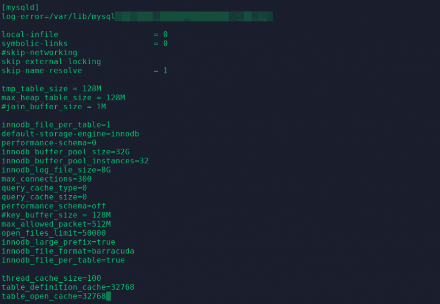

# [调整MySQL：my.cnf，避免这种常见的陷阱！](https://haydenjames.io/my-cnf-tuning-avoid-this-common-pitfall/)

***2018年12月3日**by **[Hayden James](https://haydenjames.io/author/hayden-james/)**，在[Blog ](https://haydenjames.io/category/articles/)[Linux中](https://haydenjames.io/category/linux/)*

***警告：请勿一次全部覆盖my.cnf。备份数据和配置，每次重启后进行一两个更改，进行广泛的测试。\***

我花了一些时间来决定这篇文章的标题。MariaDB一直在快速取代MySQL，因为越来越多的Linux发行版现在[默认](https://mariadb.com/kb/en/library/distributions-which-include-mariadb/)通过MySQL发行 [给MariaDB](https://mariadb.com/kb/en/library/distributions-which-include-mariadb/)。MariaDB是MySQL的增强的直接替代品。这其中就有我主要是[自制的](https://plus.google.com/+HaydenJames/posts/bMLhhKDiSQU) [难题](https://plus.google.com/u/0/+Haydenjames_io/posts/dnnmtJTzEjW)，MySQL或MariaDB的？也就是说，下面的MySQL调整建议适用于MySQL和MariaDB（以及[Percona](https://www.percona.com/)）。经过多年的MySQL调试，我可以肯定地说以下陷阱是最常见的。

 

## 避免任意增加MySQL的每个连接缓冲区的大小

my.cnf配置文件是众所周知的，但通常也经常配置错误。我不确定从哪里开始，什么时候开始，但是已经成为规范，不断增加my.cnf中几乎每个设置的大小和值，而又没有太多理由在后面进行这些增加。让我们看一下一些重要的my.cnf参数，这样做不仅会影响MySQL性能，还会浪费大量的服务器内存，从而降低了MySQL的整体容量和吞吐量。

缓冲剂，如**join_buffer_size**， **sort_buffer_size的值**，**read_buffer_size** 和**read_rnd_buffer_size** 每个连接分配。因此，设置 **read_buffer_size = 1M** 和**max_connections = 150可以** 将MySQL配置为-从启动时开始-每个连接分配1MB x 150个连接。近二十年来，默认值 **read_buffer_size**仍为128KB。增加默认值不仅浪费服务器内存，而且常常无助于性能。在几乎所有情况下，最好通过删除或注释掉这四个缓冲区配置行来使用默认值。对于更渐进的方法，请减小当前的大值以释放浪费的RAM，并随着时间的推移将其减小为默认值。我实际上已经看到通过减少这些缓冲区可以提高吞吐量。避免随意增加这些！

 

## 调优MySQL join_buffer_size

该**join_buffer_size**两个表之间的每个全部联结分配。在[MySQL的文档中](http://dev.mysql.com/doc/)，join_buffer_size被描述为：*“用于普通索引扫描，范围索引扫描和不使用索引从而执行全表扫描的联接的缓冲区的最小大小。”* 它继续说：*“如果全局大小大于使用它的大多数查询所需的大小，则内存分配时间可能会导致性能大幅下降。”*当联接不能使用索引时，联接缓冲区将分配给高速缓存表行。如果您的数据库遭受许多没有索引执行的联接，那么仅通过增加join_buffer_size便无法解决。问题是“执行没有索引的联接”，因此更快的联接的解决方案是添加索引。

 

## 调整MySQL sort_buffer_size

除非有其他说明，否则也应避免任意增加 **sort_buffer_size**。每个连接的内存也在这里分配！[MySQL的文档警告](https://dev.mysql.com/doc/refman/8.0/en/server-system-variables.html#sysvar_sort_buffer_size)：*“在Linux上，存在256KB和2MB的阈值，其中较大的值可能会显着减慢内存分配，因此您应考虑保持在其中一个值以下。”* 避免将sort_buffer_size增加到2M以上，因为这会降低性能，从而降低任何好处。

 

## 调整MySQL时的经验法则

**一个好的经验法则是，如果您不能提供增加任何这些缓冲区的正当理由，请将其设置为默认值。（注释掉配置）。**不幸的是，这四个配置选项在调整MySQL时通常会吸引大量的用户。希望您发现这些快速的MySQL调优技巧很有用。

另请参见： [MySQL查询缓存大小和性能](http://haydenjames.io/mysql-query-cache-size-performance/) ->基本上，如果您主要使用InnoDB表，那么最好完全禁用query_cache。（自MySQL 5.7.20起，不建议使用MySQL查询缓存，并在MySQL 8.0中将其删除。）

如果您使用的是MariaDB，则在大多数情况下，还应在MyISAM和Innodb上使用Aria表类型。

### 标签：[linux](https://haydenjames.io/tag/linux/)，[mariadb](https://haydenjames.io/tag/mariadb/)，[内存](https://haydenjames.io/tag/memory/)，[mysql](https://haydenjames.io/tag/mysql/)，[性能](https://haydenjames.io/tag/performance/)，[sysadmins](https://haydenjames.io/tag/sysadmins/)