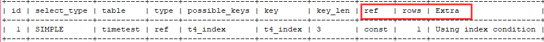
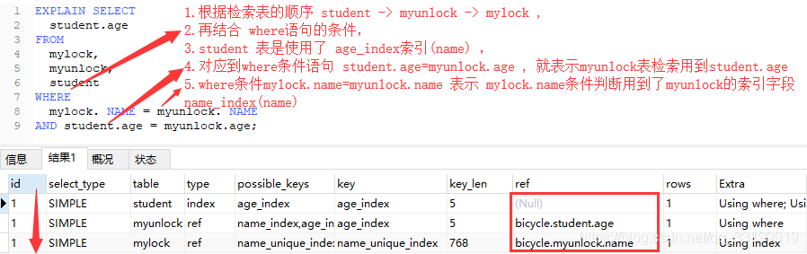
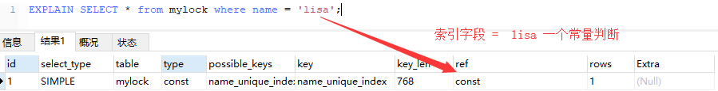

[开发小头目](https://blog.csdn.net/qq_33199919) 2019-04-20 00:34:24  1103  收藏 2

分类专栏： [mysql](https://blog.csdn.net/qq_33199919/category_8763367.html)

版权

继续执行计划分析



## 7. ref 

网上看到很多博客 说是 -----***显示索引的那一列被使用了，如果可能，是一个常量const。***

**没有理解进去，咱不知道是为什么， 咱也不敢问啊 -------------**





## 8.rows

 根据表统计信息以及索引内容选用情况，大致计算出 命中结果 需要查询的行数 ，估计值不一定准确

## 9.Extra  --------- [官方文档介绍](https://dev.mysql.com/doc/refman/8.0/en/explain-output.html#explain_extra)

   描述当前检索包含的类型：

 **A. using filesort   -------- 数据文件sort ------表示查询的方式是通过顺序检索文件内容来命中结果，效率低，需要优化**

**------------> 看到有一篇[博客](https://blog.csdn.net/imzoer/article/details/8485680)介绍这个比较细致**

```
mysql> explain select * from mylock order by name desc;


+----+-------------+--------+------+---------------+------+---------+------+------+----------------+


| id | select_type | table  | type | possible_keys | key  | key_len | ref  | rows | Extra          |


+----+-------------+--------+------+---------------+------+---------+------+------+----------------+


|  1 | SIMPLE      | mylock | ALL  | NULL          | NULL | NULL    | NULL |    7 | Using filesort |


+----+-------------+--------+------+---------------+------+---------+------+------+----------------+


 


//优化有2部分


//1. 通过where 加入索引列的条件来使用索引减少查询行数，提高type类型到 range


mysql> explain select * from mylock where id > 100 order by name desc;


+----+-------------+--------+-------+---------------+---------+---------+------+------+-----------------------------+


| id | select_type | table  | type  | possible_keys | key     | key_len | ref  | rows | Extra                       |


+----+-------------+--------+-------+---------------+---------+---------+------+------+-----------------------------+


|  1 | SIMPLE      | mylock | range | PRIMARY       | PRIMARY | 4       | NULL |    1 | Using where; Using filesort |


+----+-------------+--------+-------+---------------+---------+---------+------+------+-----------------------------+


 


//2. 通过对返回列的修改，使用覆盖索引的方式（也可以叫索引覆盖）保证返回值列都是索引 


mysql> explain select name from mylock order by name desc;


+----+-------------+--------+-------+---------------+-------------------+---------+------+------+-------------+


| id | select_type | table  | type  | possible_keys | key               | key_len | ref  | rows | Extra       |


+----+-------------+--------+-------+---------------+-------------------+---------+------+------+-------------+


|  1 | SIMPLE      | mylock | index | NULL          | name_unique_index | 768     | NULL |    7 | Using index |


+----+-------------+--------+-------+---------------+-------------------+---------+------+------+-------------+
```

***------有人会说，这个返回结果每次都不同呢，这个只是一种优化策略，具体要结合业务进行一个调整么，你不能让DB 这一块成为系统瓶颈就对了***

**B.using temporary ------- 临时表 ------**  要解析查询，MySQL需要创建一个临时表来保存结果。如果查询包含以不同方式列出列的`GROUP BY`和 `ORDER BY`子句，则通常会发生这种情况

**C.using join buffer** **------使用join语句----** 

Tables from earlier joins are read in portions into the join buffer, and then their rows are used from the buffer to perform the join with the current table. `(Block Nested Loop)` indicates use of the Block Nested-Loop algorithm and `(Batched Key Access)` indicates use of the Batched Key Access algorithm. That is, the keys from the table on the preceding line of the [`EXPLAIN`](https://dev.mysql.com/doc/refman/8.0/en/explain.html) output will be buffered, and the matching rows will be fetched in batches from the table represented by the line in which`Using join buffer` appears.

D.F using where / using index  表示对该表的检索使用了where语句 ，使用了索引 ---表示性能还不错

***这个地方要重点突出以下覆盖索引， 通过对返回列加索引的方式，来达到查询优化 ---非常重要的优化手段***