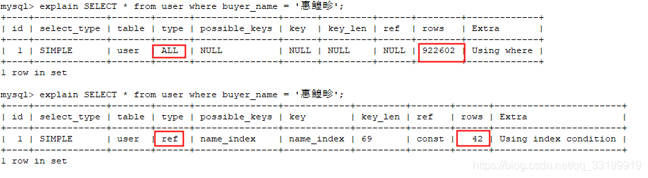

[开发小头目](https://blog.csdn.net/qq_33199919) 2019-04-20 14:12:09  86  收藏

分类专栏： [mysql](https://blog.csdn.net/qq_33199919/category_8763367.html) [基础](https://blog.csdn.net/qq_33199919/category_8661927.html)

版权

> 我只是列出了我想到的和在享学VIP课程上听到的，还有其他的案例欢迎留言讨论 - 2019/04/20

### 索引的的效力---强劲



## 1.关于%导致的索引失效问题

```sql
explain SELECT * from user where buyer_name like '%惠鳇畛';


+----+-------------+-------+------+---------------+------+---------+------+--------+-------------+


| id | select_type | table | type | possible_keys | key  | key_len | ref  | rows   | Extra       |


+----+-------------+-------+------+---------------+------+---------+------+--------+-------------+


|  1 | SIMPLE      | user  | ALL  | NULL          | NULL | NULL    | NULL | 922602 | Using where |


+----+-------------+-------+------+---------------+------+---------+------+--------+-------------+


 


mysql> explain SELECT * from user where buyer_name like '惠鳇畛%';


+----+-------------+-------+-------+---------------+------------+---------+------+------+-----------------------+


| id | select_type | table | type  | possible_keys | key        | key_len | ref  | rows | Extra                 |


+----+-------------+-------+-------+---------------+------------+---------+------+------+-----------------------+


|  1 | SIMPLE      | user  | range | name_index    | name_index | 69      | NULL |   42 | Using index condition |


+----+-------------+-------+-------+---------------+------------+---------+------+------+-----------------------+


 


mysql> explain SELECT * from user where buyer_name like '%惠鳇畛%';


+----+-------------+-------+------+---------------+------+---------+------+--------+-------------+


| id | select_type | table | type | possible_keys | key  | key_len | ref  | rows   | Extra       |


+----+-------------+-------+------+---------------+------+---------+------+--------+-------------+


|  1 | SIMPLE      | user  | ALL  | NULL          | NULL | NULL    | NULL | 922602 | Using where |


+----+-------------+-------+------+---------------+------+---------+------+--------+-------------+


 


mysql> explain SELECT * from user where buyer_name like '惠%畛';


+----+-------------+-------+-------+---------------+------------+---------+------+------+-----------------------+


| id | select_type | table | type  | possible_keys | key        | key_len | ref  | rows | Extra                 |


+----+-------------+-------+-------+---------------+------------+---------+------+------+-----------------------+


|  1 | SIMPLE      | user  | range | name_index    | name_index | 69      | NULL |  629 | Using index condition |


+----+-------------+-------+-------+---------------+------------+---------+------+------+-----------------------+


 


mysql> explain SELECT * from user where buyer_name like '%惠%';


+----+-------------+-------+------+---------------+------+---------+------+--------+-------------+


| id | select_type | table | type | possible_keys | key  | key_len | ref  | rows   | Extra       |


+----+-------------+-------+------+---------------+------+---------+------+--------+-------------+


|  1 | SIMPLE      | user  | ALL  | NULL          | NULL | NULL    | NULL | 922602 | Using where |


+----+-------------+-------+------+---------------+------+---------+------+--------+-------------+


 


mysql> explain SELECT buyer_name from user where buyer_name like '%惠%';


+----+-------------+-------+-------+---------------+------------+---------+------+--------+--------------------------+


| id | select_type | table | type  | possible_keys | key        | key_len | ref  | rows   | Extra                    |


+----+-------------+-------+-------+---------------+------------+---------+------+--------+--------------------------+


|  1 | SIMPLE      | user  | index | NULL          | name_index | 69      | NULL | 922602 | Using where; Using index |


+----+-------------+-------+-------+---------------+------------+---------+------+--------+--------------------------+


 


 


mysql> explain SELECT * from user where buyer_name like '惠%';


+----+-------------+-------+-------+---------------+------------+---------+------+------+-----------------------+


| id | select_type | table | type  | possible_keys | key        | key_len | ref  | rows | Extra                 |


+----+-------------+-------+-------+---------------+------------+---------+------+------+-----------------------+


|  1 | SIMPLE      | user  | range | name_index    | name_index | 69      | NULL |  629 | Using index condition |


+----+-------------+-------+-------+---------------+------------+---------+------+------+-----------------------+
```

----**当模糊查询 的% 加在查询字段的前面，会导致索引失效，全表查询**

**解决方法有2种  ----->  1. 避免在匹配值开头加%,或者尽量使用全值匹配    2.使用覆盖索引，返回索引列**

 

## 2.组合索引失效 --- >最佳左前缀原则


```sql
mysql> explain select * from mylock where sex = 3;


+----+-------------+--------+------+---------------+------+---------+------+------+-------------+


| id | select_type | table  | type | possible_keys | key  | key_len | ref  | rows | Extra       |


+----+-------------+--------+------+---------------+------+---------+------+------+-------------+


|  1 | SIMPLE      | mylock | ALL  | NULL          | NULL | NULL    | NULL |    7 | Using where |


+----+-------------+--------+------+---------------+------+---------+------+------+-------------+


 


mysql> explain select * from mylock where name = 'james';


+----+-------------+--------+------+---------------+------+---------+------+------+-------------+


| id | select_type | table  | type | possible_keys | key  | key_len | ref  | rows | Extra       |


+----+-------------+--------+------+---------------+------+---------+------+------+-------------+


|  1 | SIMPLE      | mylock | ALL  | NULL          | NULL | NULL    | NULL |    7 | Using where |


+----+-------------+--------+------+---------------+------+---------+------+------+-------------+


 


mysql> explain select * from mylock where age = 18;


+----+-------------+--------+------+---------------+--------------+---------+-------+------+-------+


| id | select_type | table  | type | possible_keys | key          | key_len | ref   | rows | Extra |


+----+-------------+--------+------+---------------+--------------+---------+-------+------+-------+


|  1 | SIMPLE      | mylock | ref  | age_name_sex  | age_name_sex | 5       | const |    2 | NULL  |


+----+-------------+--------+------+---------------+--------------+---------+-------+------+-------+


 


mysql> explain select * from mylock where age = 18 and name = 'cindy';


+----+-------------+--------+------+---------------+--------------+---------+-------------+------+-----------------------+


| id | select_type | table  | type | possible_keys | key          | key_len | ref         | rows | Extra                 |


+----+-------------+--------+------+---------------+--------------+---------+-------------+------+-----------------------+


|  1 | SIMPLE      | mylock | ref  | age_name_sex  | age_name_sex | 773     | const,const |    1 | Using index condition |


+----+-------------+--------+------+---------------+--------------+---------+-------------+------+-----------------------+


 


mysql> explain select * from mylock where age = 18 and sex = 4;


+----+-------------+--------+------+---------------+--------------+---------+-------+------+-----------------------+


| id | select_type | table  | type | possible_keys | key          | key_len | ref   | rows | Extra                 |


+----+-------------+--------+------+---------------+--------------+---------+-------+------+-----------------------+


|  1 | SIMPLE      | mylock | ref  | age_name_sex  | age_name_sex | 5       | const |    2 | Using index condition |


+----+-------------+--------+------+---------------+--------------+---------+-------+------+-----------------------+


 


mysql> explain select * from mylock where name = 'cindy' and sex = 4;


+----+-------------+--------+------+---------------+------+---------+------+------+-------------+


| id | select_type | table  | type | possible_keys | key  | key_len | ref  | rows | Extra       |


+----+-------------+--------+------+---------------+------+---------+------+------+-------------+


|  1 | SIMPLE      | mylock | ALL  | NULL          | NULL | NULL    | NULL |    7 | Using where |


+----+-------------+--------+------+---------------+------+---------+------+------+-------------+
```

***组合索引 age , name ,sex ,单独使用 age 会使用到索引，单独使用 name ，sex 不会使用到索引 ， 组合使用到 age，name 和 age ，sex 会使用到索引，组合使用 name，sex 也不会使用到索引 ( 这个强调一点 在where 语句内顺序不影响索引使用) ， 分析可以得出------------------（age,name,sex） <==> (age,name,sex) , (age,name) ,(age,sex) ,(age)***    

*（我在享学VIP课程上听到的一个例子非常贴切 ，组合索引第一个字段 相当于火车头，想要开车，只要火车头在）*

 

## 3.不在索引列上做任何操作

（计算、函数、(自动or手动)类型转换），会导致索引失效而转向全局检索

```sql
mysql> explain select * from mylock where age = 18;


+----+-------------+--------+------+---------------+--------------+---------+-------+------+-------+


| id | select_type | table  | type | possible_keys | key          | key_len | ref   | rows | Extra |


+----+-------------+--------+------+---------------+--------------+---------+-------+------+-------+


|  1 | SIMPLE      | mylock | ref  | age_name_sex  | age_name_sex | 5       | const |    2 | NULL  |


+----+-------------+--------+------+---------------+--------------+---------+-------+------+-------+


1 row in set


 


mysql> explain select * from mylock where age != 18;


+----+-------------+--------+------+---------------+------+---------+------+------+-------------+


| id | select_type | table  | type | possible_keys | key  | key_len | ref  | rows | Extra       |


+----+-------------+--------+------+---------------+------+---------+------+------+-------------+


|  1 | SIMPLE      | mylock | ALL  | age_name_sex  | NULL | NULL    | NULL |    7 | Using where |


+----+-------------+--------+------+---------------+------+---------+------+------+-------------+


1 row in set
```

## 4.索引列范围检索 放where 语句后方（组合索引）

## 5.尽量使用覆盖索引 --- 返回列创建索引

## 6.不等于导致索引失效 ---- !=   <>

## 7.NUll /not Null 对索引可能有影响 

 自定为null的字段 --在使用 where 条件 字段 is not null ,会导致索引失效，因为还会有null的情况没有加入到索引表中

自定义为 not nul 的字段  --在 使用 where 字段 is null ，也会导致索引失效 ，因为该字段不可能为null，不可能搜索的到结果。

## 8 or的连接符改成 union 效率高 

## 9 