[开发小头目](https://blog.csdn.net/qq_33199919) 2019-04-14 22:50:24  523  收藏 1

分类专栏： [mysql](https://blog.csdn.net/qq_33199919/category_8763367.html)

版权

> ***Q: 我们在进行优化的过程中，需要明确的知道，现在优化到什么程度了，是否还能进一步优化，还有那些方面可以优化，这样才能保证大方向的正确性，那谁来保证呢？***      
>
> **A: 没错，执行计划，来看看执行计划到底是什么，我该怎么看它呢**

​    **前面介绍****慢查询的文章中，pt工具有介绍到执行计划的知识点，其实无论慢查询，索引，执行计划这些秀的操作目的就一个，加快sql执行速度，当然他们之间是互相调用互相协作的。**

------

#  

# 一.Explain 的组成（例子都以查询sql分析）

###  

### 1.id ： 表示涉及到的表被搜索的顺序

相同Id的执行顺序是从上往下执行，不同id的执行顺序是从大到小

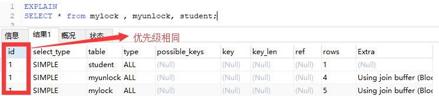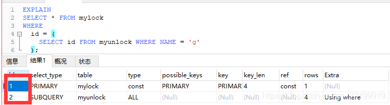

###  

### **2.select_type：查询语句的类型**

**SIMPLE ：查询不包含子查询和 union 合并操作的查询语句**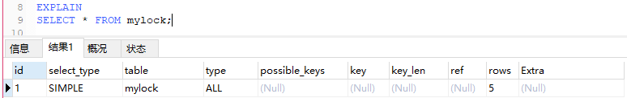

**PRIMARY： 查询中涉及到子查询，最外面的select就是主查询语句，就要被它修饰**

**SUBQUERY : 子查询**       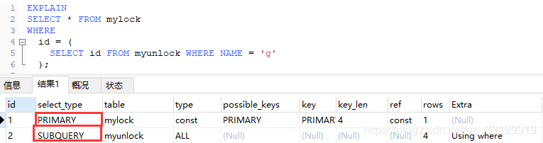

**DERIVED： 衍生查询-在select出一批自定义列的数据，概念上相当于一张表，但是该表只在语句执行过程出现和销毁**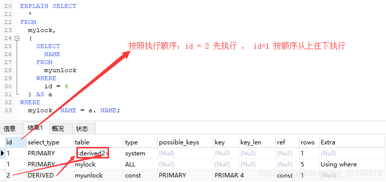

**UNION ：联合查询，union 后面的那张表就会表示成它                                                            UNION RESULT: 联合结果**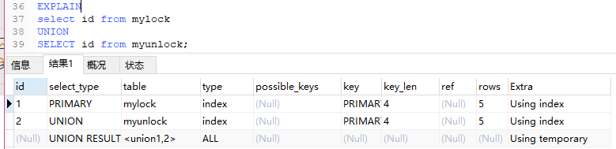

### 3.table 查询语句涉及到的表

| 直接表名   | 直接表名                                 |
| ---------- | ---------------------------------------- |
| derived2   | 中间过程表  2---> 表示指向id=2           |
| <union1,2> | union联合表，<union id1,id2...> 表示联合 |

### 4. type 访问类型

是我们检查当前语句是否需要优化，能够继续优化的重要指标

结果值***从好到坏***   **System -》 const -》 eq_ref -》 ref -》 range -》 index -》 all**

> 我们平时优化的方向 **最低range----> const  （为什么不到System），看下文...**

​     **A .System 属于const类型的特例，查询的表只会有一行数据(就一行数据的表我们需要为它优化什么吗？)         /                   const通过 主键索引 / unique索引 查到单行数据 （查找非常快）**

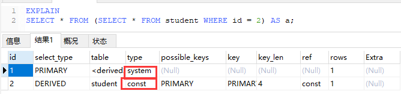

​     **B .eq_ref 唯一性索引**                 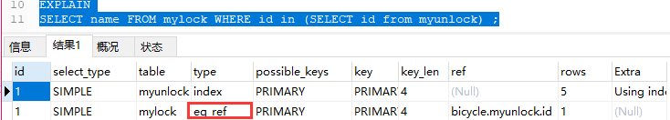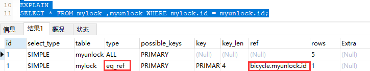

​     **C .ref：通过 非唯一性索引属性扫描 ，可能获取多行结果**        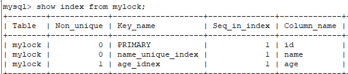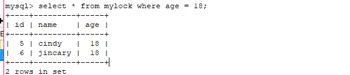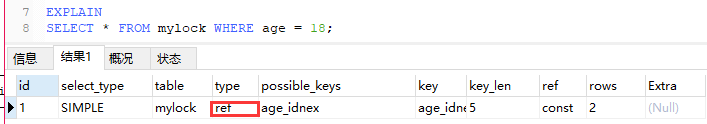

​     **D .range： where 条件 要有 索引字段结合 + 范围查找（in的范围查找在内容不存在对应value时会）**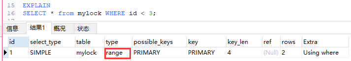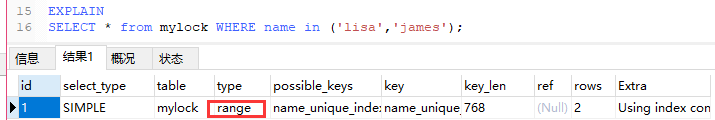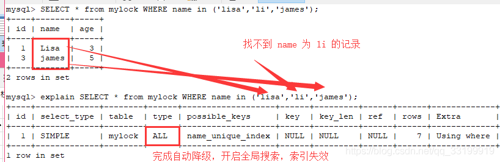

​     **E .index ：当查询的结果列全是 带索引的列**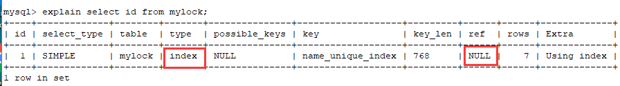

​     **F .ALL 全表遍历匹配数据**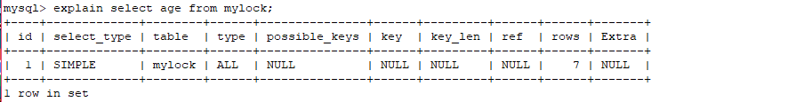

### 5.possible_keys 和 key

​     **possible_keys : 当前表查询可能使用到的索引， key :实际使用的索引** 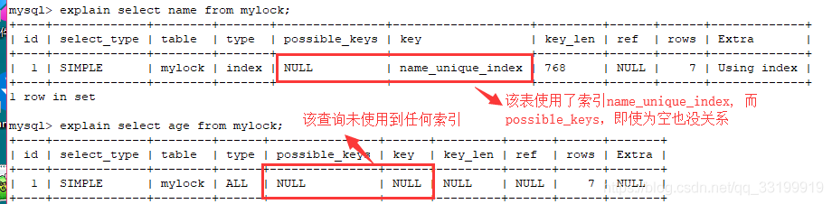

​     数据库表中没有name=lisa ，age>10的记录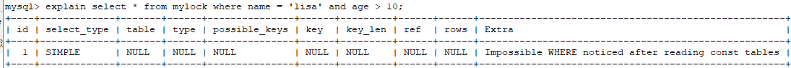

​     我加入一条记录之后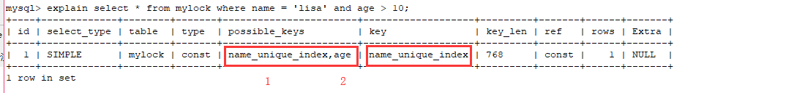