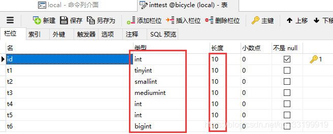
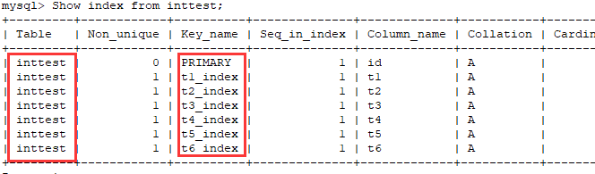
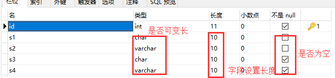
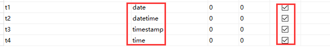

[开发小头目](https://blog.csdn.net/qq_33199919) 2019-04-19 19:02:41  121  收藏 1

分类专栏： [mysql](https://blog.csdn.net/qq_33199919/category_8763367.html)

版权

继续上一篇的内容

**分析 执行计划 组成**


 

## 6. key_len 是什么，怎么计算出的？

​     *key_len 表示使用到的索引字节长度， 计算公式 = 字段类型对应长度 \* 字段设计的长度 + 是否为空(1) + 是否可变长(2）* 

###      A.**整形字段检验：**  

| **字段类型**      | **字段长度** | **允许null** | **key_len**            |
| :---------------- | :----------- | :----------- | :--------------------- |
| **int (PRIMARY)** | **10/ 30**   | **非**       | **4 （不受长度影响）** |
| **tinyint**       | **10/ 30**   | **是**       | **2（不受长度影响）**  |
| **samlllint**     | **10/ 30**   | **是**       | **3（不受长度影响）**  |
| **mediumint**     | **10/ 30**   | **是**       | **4（不受长度影响）**  |
| **int,(integer)** | **10/ 30**   | **是**       | **5（不受长度影响）**  |
| **bigint**        | **10/ 30**   | **是**       | **6（不受长度影响）**  |

###                            

```
mysql> explain select * from inttest where id = 2;


explain select * from inttest where t1 = 2;


explain select * from inttest where t2 = 2;


explain select * from inttest where t3 = 2;


explain select * from inttest where t4 = 2;


explain select * from inttest where t5 = 2;


explain select * from inttest where t6 = 2;


+----+-------------+---------+-------+---------------+---------+---------+-------+------+-------+


| id | select_type | table   | type  | possible_keys | key     | key_len | ref   | rows | Extra |


+----+-------------+---------+-------+---------------+---------+---------+-------+------+-------+


|  1 | SIMPLE      | inttest | const | PRIMARY       | PRIMARY | 4       | const |    1 | NULL  |


+----+-------------+---------+-------+---------------+---------+---------+-------+------+-------+


 


+----+-------------+---------+------+---------------+----------+---------+-------+------+-------+


| id | select_type | table   | type | possible_keys | key      | key_len | ref   | rows | Extra |


+----+-------------+---------+------+---------------+----------+---------+-------+------+-------+


|  1 | SIMPLE      | inttest | ref  | t1_index      | t1_index | 2       | const |    1 | NULL  |


+----+-------------+---------+------+---------------+----------+---------+-------+------+-------+


 


+----+-------------+---------+------+---------------+----------+---------+-------+------+-------+


| id | select_type | table   | type | possible_keys | key      | key_len | ref   | rows | Extra |


+----+-------------+---------+------+---------------+----------+---------+-------+------+-------+


|  1 | SIMPLE      | inttest | ref  | t2_index      | t2_index | 3       | const |    1 | NULL  |


+----+-------------+---------+------+---------------+----------+---------+-------+------+-------+


 


+----+-------------+---------+------+---------------+----------+---------+-------+------+-------+


| id | select_type | table   | type | possible_keys | key      | key_len | ref   | rows | Extra |


+----+-------------+---------+------+---------------+----------+---------+-------+------+-------+


|  1 | SIMPLE      | inttest | ref  | t3_index      | t3_index | 4       | const |    1 | NULL  |


+----+-------------+---------+------+---------------+----------+---------+-------+------+-------+


 


+----+-------------+---------+------+---------------+----------+---------+-------+------+-------+


| id | select_type | table   | type | possible_keys | key      | key_len | ref   | rows | Extra |


+----+-------------+---------+------+---------------+----------+---------+-------+------+-------+


|  1 | SIMPLE      | inttest | ref  | t4_index      | t4_index | 5       | const |    1 | NULL  |


+----+-------------+---------+------+---------------+----------+---------+-------+------+-------+


 


+----+-------------+---------+------+---------------+----------+---------+-------+------+-------+


| id | select_type | table   | type | possible_keys | key      | key_len | ref   | rows | Extra |


+----+-------------+---------+------+---------------+----------+---------+-------+------+-------+


|  1 | SIMPLE      | inttest | ref  | t5_index      | t5_index | 5       | const |    1 | NULL  |


+----+-------------+---------+------+---------------+----------+---------+-------+------+-------+


 


+----+-------------+---------+------+---------------+----------+---------+-------+------+-------+


| id | select_type | table   | type | possible_keys | key      | key_len | ref   | rows | Extra |


+----+-------------+---------+------+---------------+----------+---------+-------+------+-------+


|  1 | SIMPLE      | inttest | ref  | t6_index      | t6_index | 9       | const |    1 | NULL  |


+----+-------------+---------+------+---------------+----------+---------+-------+------+-------+
```

 

 

###     **B.char 和 varchar  - 计算公式 = 3 \* 字段长度 + 是否为空（1） + 是否可变长（2）**

   

```
mysql> show index from strtest;


+---------+------------+----------+--------------+-------------+-----------+-------------+----------+--------+------+------------+---------+---------------+


| Table   | Non_unique | Key_name | Seq_in_index | Column_name | Collation | Cardinality | Sub_part | Packed | Null | Index_type | Comment | Index_comment |


+---------+------------+----------+--------------+-------------+-----------+-------------+----------+--------+------+------------+---------+---------------+


| strtest |          0 | PRIMARY  |            1 | id          | A         |           0 | NULL     | NULL   |      | BTREE      |         |               |


| strtest |          1 | s1_index |            1 | s1          | A         |           0 | NULL     | NULL   | YES  | BTREE      |         |               |


| strtest |          1 | s2_index |            1 | s2          | A         |           0 | NULL     | NULL   | YES  | BTREE      |         |               |


| strtest |          1 | s3_index |            1 | s3          | A         |           0 | NULL     | NULL   |      | BTREE      |         |               |


| strtest |          1 | s4_index |            1 | s4          | A         |           0 | NULL     | NULL   |      | BTREE      |         |               |


+---------+------------+----------+--------------+-------------+-----------+-------------+----------+--------+------+------------+---------+---------------+


 


mysql> explain select * from strtest where s1 = 'a';


+----+-------------+---------+------+---------------+----------+---------+-------+------+-----------------------+


| id | select_type | table   | type | possible_keys | key      | key_len | ref   | rows | Extra                 |


+----+-------------+---------+------+---------------+----------+---------+-------+------+-----------------------+


|  1 | SIMPLE      | strtest | ref  | s1_index      | s1_index | 31      | const |    1 | Using index condition |


+----+-------------+---------+------+---------------+----------+---------+-------+------+-----------------------+


mysql> explain select * from strtest where s2 = 'swf';


+----+-------------+---------+------+---------------+----------+---------+-------+------+-----------------------+


| id | select_type | table   | type | possible_keys | key      | key_len | ref   | rows | Extra                 |


+----+-------------+---------+------+---------------+----------+---------+-------+------+-----------------------+


|  1 | SIMPLE      | strtest | ref  | s2_index      | s2_index | 33      | const |    1 | Using index condition |


+----+-------------+---------+------+---------------+----------+---------+-------+------+-----------------------+


mysql> explain select * from strtest where s3 = 'sed';


+----+-------------+---------+------+---------------+----------+---------+-------+------+-----------------------+


| id | select_type | table   | type | possible_keys | key      | key_len | ref   | rows | Extra                 |


+----+-------------+---------+------+---------------+----------+---------+-------+------+-----------------------+


|  1 | SIMPLE      | strtest | ref  | s3_index      | s3_index | 30      | const |    1 | Using index condition |


+----+-------------+---------+------+---------------+----------+---------+-------+------+-----------------------+


mysql> explain select * from strtest where s4 = 'geg';


+----+-------------+---------+------+---------------+----------+---------+-------+------+-----------------------+


| id | select_type | table   | type | possible_keys | key      | key_len | ref   | rows | Extra                 |


+----+-------------+---------+------+---------------+----------+---------+-------+------+-----------------------+


|  1 | SIMPLE      | strtest | ref  | s4_index      | s4_index | 32      | const |    1 | Using index condition |


+----+-------------+---------+------+---------------+----------+---------+-------+------+-----------------------+
```

###      **C.date 类型分析：再来看看时间类型字段-和整形一样，固定值**

​      

```
mysql> explain select * from timetest where t1 = '2019-04-19';


+----+-------------+----------+------+---------------+----------+---------+-------+------+-------+


| id | select_type | table    | type | possible_keys | key      | key_len | ref   | rows | Extra |


+----+-------------+----------+------+---------------+----------+---------+-------+------+-------+


|  1 | SIMPLE      | timetest | ref  | t1_index      | t1_index | 3       | const |    1 | NULL  |


+----+-------------+----------+------+---------------+----------+---------+-------+------+-------+


1 row in set


 


mysql> explain select * from timetest where t2 = '2019-04-19';


+----+-------------+----------+------+---------------+----------+---------+-------+------+-------+


| id | select_type | table    | type | possible_keys | key      | key_len | ref   | rows | Extra |


+----+-------------+----------+------+---------------+----------+---------+-------+------+-------+


|  1 | SIMPLE      | timetest | ref  | t2_index      | t2_index | 5       | const |    1 | NULL  |


+----+-------------+----------+------+---------------+----------+---------+-------+------+-------+


1 row in set


 


mysql> explain select * from timetest where t3 = '2019-04-19';


+----+-------------+----------+------+---------------+----------+---------+-------+------+-------+


| id | select_type | table    | type | possible_keys | key      | key_len | ref   | rows | Extra |


+----+-------------+----------+------+---------------+----------+---------+-------+------+-------+


|  1 | SIMPLE      | timetest | ref  | t3_index      | t3_index | 4       | const |    1 | NULL  |


+----+-------------+----------+------+---------------+----------+---------+-------+------+-------+


1 row in set


 


mysql> explain select * from timetest where t4 = '2019-04-19';


+----+-------------+----------+------+---------------+----------+---------+-------+------+-----------------------+


| id | select_type | table    | type | possible_keys | key      | key_len | ref   | rows | Extra                 |


+----+-------------+----------+------+---------------+----------+---------+-------+------+-----------------------+


|  1 | SIMPLE      | timetest | ref  | t4_index      | t4_index | 3       | const |    1 | Using index condition |


+----+-------------+----------+------+---------------+----------+---------+-------+------+-----------------------+


1 row in set
```

 