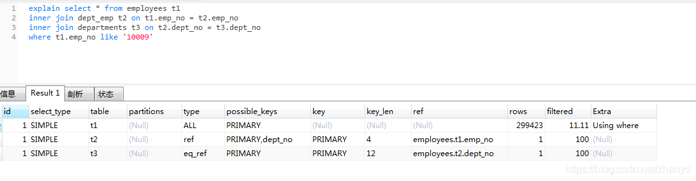

### 引子

小扎刚毕业不久，在一家互联网公司工作，由于是新人，做的也都是简单的CRUD。刚来的时候还有点不适应，做了几个月之后，就变成了熟练工了，左复制，右粘贴，然后改改就是自己的代码了，生活真美好。

有一天，领导说他做的有个列表页面速度很慢，半天打不开，让小扎去优化下。小扎心里一惊，我都是复制别人的代码，怎么还有错？赶紧去问问同事小会，小会说：你先用EXPLAIN命令分析下SQL，看看有什么问题。

小扎赶紧用EXPLAIN命令跑了一下SQL：

“这些都是什么东西？”，小扎望着小会，一脸懵逼。。。“能不能给我讲讲？”

看着小扎无助的眼神，小会无奈：我仔细给你讲讲吧，你看这里的输出。。。


### EXPLAIN的输出列

EXPLAIN命令用来提供MySQL的执行信息，用来显示SQL语句执行的效率，平时我们发现某条SQL语句执行慢，可以通过该语句来查看原因，看看是否用到了索引，以及其他优化措施。 EXPLAIN 可以应用在 SELECT, DELETE, INSERT, REPLACE, 和 UPDATE 语句上。

EXPLAIN命令的输出信息如下表所示：

| Column        | JSON Name     | Meaning                                        | 备注                                                         |
| ------------- | ------------- | ---------------------------------------------- | ------------------------------------------------------------ |
| id            | select_id     | The SELECT identifier                          | 查询语句的序号                                               |
| select_type   | None          | The SELECT type                                | 选择类型（详见下表）                                         |
| table         | table_name    | The table for the output row                   | 表名                                                         |
| partitions    | partitions    | The matching partitions                        | 分区表信息，没有分区表则为NULL                               |
| type          | access_type   | The join type                                  | 连接类型（详见下表）                                         |
| possible_keys | possible_keys | The possible indexes to choose                 | 可供选择的索引                                               |
| key           | key           | The index actually chosen                      | 实际选择的索引                                               |
| key_len       | key_length    | The length of the chosen key                   | 选择的索引的长度                                             |
| ref           | ref           | The columns compared to the index              | 和索引匹配的列                                               |
| rows          | rows          | Estimate of rows to be examined                | 估算的扫描行数                                               |
| filtered      | filtered      | Percentage of rows filtered by table condition | 被条件过滤行数的百分比                                       |
| Extra         | None          | Additional information                         | [额外信息（详情点击超链接）](https://dev.mysql.com/doc/refman/8.0/en/explain-output.html#explain-extra-information) |

小扎，深吸一口气，怎么这复杂。。。
这还是总体上的表格，小会笑着，指着上面的 select_type（选择类型）说，你看这个select_type还可以单独细分成下面这张表格呢：


### select_type（选择类型）

| select_type Value    | JSON Name                  | Meaning                                                      | 备注                                                       |
| -------------------- | -------------------------- | ------------------------------------------------------------ | ---------------------------------------------------------- |
| SIMPLE               | None                       | Simple SELECT (not using UNION or subqueries)                | 简单查询（没有使用联合和子查询）                           |
| PRIMARY              | None                       | Outermost SELECT                                             | 查询中若包含任何复杂的子部分,最外层的select被标记为PRIMARY |
| UNION                | None                       | Second or later SELECT statement in a UNION                  | UNION中第二个或后面的SELECT语句                            |
| DEPENDENT UNION      | dependent (true)           | Second or later SELECT statement in a UNION, dependent on outer query | UNION中的第二个或后面的SELECT语句，取决于外面的查询        |
| UNION RESULT         | union_result               | Result of a UNION.                                           | UNION的结果                                                |
| SUBQUERY             | None                       | First SELECT in subquery                                     | 子查询中的第一个SELECT                                     |
| DEPENDENT SUBQUERY   | dependent (true)           | First SELECT in subquery, dependent on outer query           | 子查询中的第一个SELECT，取决于外面的查询                   |
| DERIVED              | None                       | Derived table                                                | 派生表的SELECT                                             |
| DEPENDENT DERIVED    | dependent (true)           | Derived table dependent on another table                     | 依赖其他表的派生表的SELECT                                 |
| MATERIALIZED         | materialized_from_subquery | Materialized subquery                                        | 物化子查询                                                 |
| UNCACHEABLE SUBQUERY | cacheable (false)          | A subquery for which the result cannot be cached and must be re-evaluated for each row of the outer query | 不能被缓存的子查询                                         |
| UNCACHEABLE UNION    | cacheable (false)          | The second or later select in a UNION that belongs to an uncacheable subquery (see UNCACHEABLE SUBQUERY) | UNION中第二个或后面的不能被缓存的子查询                    |

小扎已经开始头大了，小会说，你不用全记住，等你用到的时候，查一下表格就行，这些都是官方文档上的资料。
第一张表格中的type（连接类型），还可以细分成以下情况：


### type（连接类型）

注意，以下连接类型的查询速度**从快到慢排序**


##### system

> The table has only one row (= system table). This is a special case of the const join type.

当表只有一条数据的时候，是const的特例（我只有一条数据，我查找最快：）。


##### const

> The table has at most one matching row, which is read at the start of the query. Because there is only one row, values from the column in this row can be regarded as constants by the rest of the optimizer. const tables are very fast because they are read only once.

> const is used when you compare all parts of a PRIMARY KEY or UNIQUE index to constant values. In the following queries, tbl_name can be used as a const table:

通过主键或唯一索引查找，搜索结果只有一条数据，速度最快（除system外）。

```sql
// 通过主键查找
SELECT * FROM tbl_name WHERE primary_key=1;

// 通过唯一索引查找
SELECT * FROM tbl_name
  WHERE primary_key_part1=1 AND primary_key_part2=2;
123456
```


##### eq_ref

> One row is read from this table for each combination of rows from the previous tables. Other than the system and const types, this is the best possible join type. It is used when all parts of an index are used by the join and the index is a PRIMARY KEY or UNIQUE NOT NULL index.

> eq_ref can be used for indexed columns that are compared using the = operator. The comparison value can be a constant or an expression that uses columns from tables that are read before this table. In the following examples, MySQL can use an eq_ref join to process ref_table:

表连接查询，主键索引或者唯一索引全部被命中，是除system和const之外，最好的连接类型，和索引列比较只能使用=号。
**查询结果只有一条数据。**

```sql
// 多表关联查询，单行匹配
SELECT * FROM ref_table,other_table
  WHERE ref_table.key_column=other_table.column;

// 多表关联查询，联合唯一索引，单行匹配
SELECT * FROM ref_table,other_table
  WHERE ref_table.key_column_part1=other_table.column
  AND ref_table.key_column_part2=1;
12345678
```


##### ref

> All rows with matching index values are read from this table for each combination of rows from the previous tables. ref is used if the join uses only a leftmost prefix of the key or if the key is not a PRIMARY KEY or UNIQUE index (in other words, if the join cannot select a single row based on the key value). If the key that is used matches only a few rows, this is a good join type.

> ref can be used for indexed columns that are compared using the = or <=> operator. In the following examples, MySQL can use a ref join to process ref_table:

使用最左前缀匹配索引（索引不是主键，也不是唯一索引），匹配到了多行数据，如果只有少量数据，性能也是不错的哦。
和索引列比较可以使用 = 或 <=> 。
**查询结果有多条数据。**

```sql
// 根据索引（非主键，非唯一索引），多行匹配
SELECT * FROM ref_table WHERE key_column=expr;

// 多表关联查询，多行匹配
SELECT * FROM ref_table,other_table
  WHERE ref_table.key_column=other_table.column;

// 多表关联查询，联合索引,多行匹配
SELECT * FROM ref_table,other_table
  WHERE ref_table.key_column_part1=other_table.column
  AND ref_table.key_column_part2=1;
1234567891011
```


##### fulltext

> The join is performed using a FULLTEXT index.

使用全文索引的时候才会出现。


##### ref_or_null

> This join type is like ref, but with the addition that MySQL does an extra search for rows that contain NULL values. This join type optimization is used most often in resolving subqueries. In the following examples, MySQL can use a ref_or_null join to process ref_table:

这个查询类型和ref很像，但是 MySQL 会做一个额外的查询，来看哪些行包含了NULL。

```sql
SELECT * FROM ref_table
  WHERE key_column=expr OR key_column IS NULL;
12
```


##### index_merge

> This join type indicates that the Index Merge optimization is used. In this case, the key column in the output row contains a list of indexes used, and key_len contains a list of the longest key parts for the indexes used.

在一个查询里面很有多索引用被用到，可能会触发index_merge的优化机制。


##### unique_subquery

> This type replaces eq_ref for some IN subqueries of the following form:

unique_subquery和eq_ref不一样的地方是使用了in的子查询：

```sql
value IN (SELECT primary_key FROM single_table WHERE some_expr)
1
```

> unique_subquery is just an index lookup function that replaces the subquery completely for better efficiency.

unique_subquery是一个索引查找函数，代替子查询提高效率。


##### index_subquery

> This join type is similar to unique_subquery. It replaces IN subqueries, but it works for nonunique indexes in subqueries of the following form:

index_subquery和unique_subquery很像，区别是它在子查询里使用的是非唯一索引。

```sql
value IN (SELECT key_column FROM single_table WHERE some_expr)
1
```


##### range

> Only rows that are in a given range are retrieved, using an index to select the rows. The key column in the output row indicates which index is used. The key_len contains the longest key part that was used. The ref column is NULL for this type.

> range can be used when a key column is compared to a constant using any of the =, <>, >, >=, <, <=, IS NULL, <=>, BETWEEN, LIKE, or IN() operators:

通过索引范围查找多行数据，可以使用=, <>, >, >=, <, <=, IS NULL, <=>, BETWEEN, LIKE, 或 IN() 操作符。

```sql
// 多行结果
SELECT * FROM tbl_name
  WHERE key_column = 10;

// 范围查找
SELECT * FROM tbl_name
  WHERE key_column BETWEEN 10 and 20;
  
// 范围查找
SELECT * FROM tbl_name
  WHERE key_column IN (10,20,30);
  
// 范围查找
SELECT * FROM tbl_name
  WHERE key_part1 = 10 AND key_part2 IN (10,20,30);
123456789101112131415
```


##### index

> The index join type is the same as ALL, except that the index tree is scanned. This occurs two ways:

> If the index is a covering index for the queries and can be used to satisfy all data required from the table, only the index tree is scanned. In this case, the Extra column says Using index. An index-only scan usually is faster than ALL because the size of the index usually is smaller than the table data.

> A full table scan is performed using reads from the index to look up data rows in index order. Uses index does not appear in the Extra column.

> MySQL can use this join type when the query uses only columns that are part of a single index.

index类型和ALL类型一样，区别就是index类型是扫描的索引树。以下两种情况会触发：

1. 如果索引是查询的覆盖索引，就是说查询的数据在索引中都能找到，只需扫描索引树，不需要回表查询。 在这种情况下，explain 的 Extra 列的结果是 Using index。仅索引扫描通常比ALL快，因为索引的大小通常小于表数据。

2. 全表扫描会按索引的顺序来查找数据行。使用索引不会出现在Extra列中。

   

### ALL

> A full table scan is done for each combination of rows from the previous tables. This is normally not good if the table is the first table not marked const, and usually very bad in all other cases. Normally, you can avoid ALL by adding indexes that enable row retrieval from the table based on constant values or column values from earlier tables.

全表扫描，效率最低的查询，一般可以通过添加索引避免，这种情况是不能容忍的，赶紧优化吧。


type（连接类型）在图中的位置越上面越好，如果实在不行，index也是勉强可以接受的，当然ALL是不可接受的，一定要优化。

小会指着小扎的分析结果说，你看第一列的type是ALL，是最差的连接类型，后面的rows是扫描的行数，进行了全表扫描，肯定会很慢，你条件里为什么用like？

小扎羞愧得脸一红，我这里的代码是从别人那直接复制过来的，忘了改这里了。。。

小扎赶紧改了下SQL，重新运行：


“现在快多了，type是const耶，我拿到了第二名哦”，小扎对着屏幕开心得笑着。

小会仿佛看到了多年前的自己，顿时思绪万千，看着他开心的样子，微微一笑，悄悄地走开了。

参考资料：[MySQl官方文档](https://dev.mysql.com/doc/refman/8.0/en/explain-output.html)