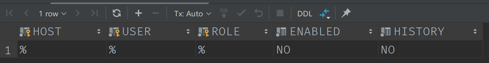
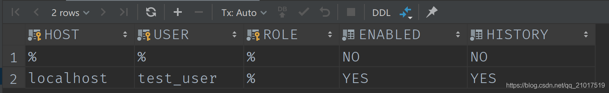
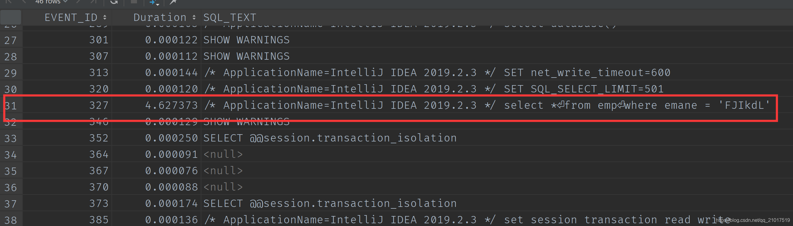
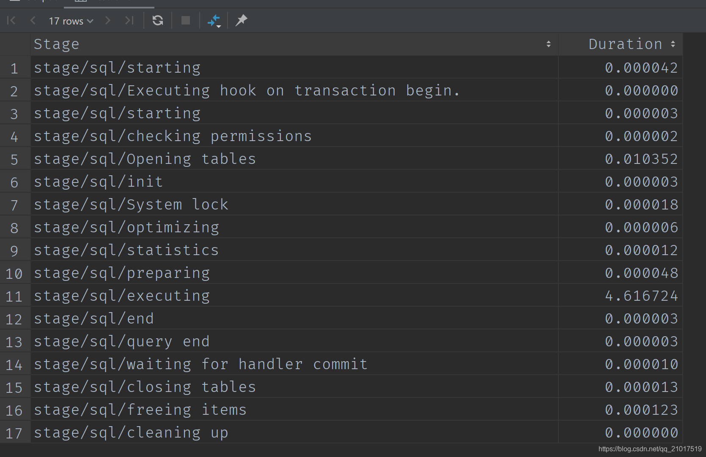

# MySQL8.0使用performance_schema分析一条SQL的具体执行时间

## 新版的MySQL已经彻底移除了以前ProFile的大多数功能

### 第一步

```sql
SELECT *
FROM performance_schema.setup_actors;
12
```

这是用于配置是否为新的前台server线程（与客户端连接相关联的线程）启用监视和历史事件日志记录的表


### 第二步

```sql
UPDATE performance_schema.setup_actors
SET ENABLED = 'NO',
    HISTORY = 'NO'
WHERE HOST = '%'
  AND USER = '%';
12345
```

关闭HOST为%并且USER为%的记录功能(这个功能在MySQL重启后会自动还原)
这个时候我们在查看第一步的SQL检查是否关闭


### 第三步

```sql
INSERT INTO performance_schema.setup_actors
    (HOST, USER, ROLE, ENABLED, HISTORY)
VALUES ('localhost', 'test_user', '%', 'YES', 'YES');
123
```

我们自己往setup_actors 表中插入一个自定义用户用于记录,HOST指定为localhost,USER指定为test_user,并且开启日志监控和记录
此时我们再去查看第一步SQL验证是否插入成功


### 第四步

```sql
UPDATE performance_schema.setup_instruments
SET ENABLED = 'YES', TIMED = 'YES'
WHERE NAME LIKE '%statement/%';
123
UPDATE performance_schema.setup_instruments
SET ENABLED = 'YES', TIMED = 'YES'
WHERE NAME LIKE '%stage/%';
123
UPDATE performance_schema.setup_consumers
SET ENABLED = 'YES'
WHERE NAME LIKE '%events_statements_%';
123
sql
UPDATE performance_schema.setup_consumers
SET ENABLED = 'YES'
WHERE NAME LIKE '%events_stages_%';
1234
```

设置系统记录哪些事件,在setup_instruments表中可以看到所有的事件支持,在setup_consumers表中可以看到一些我也不知道是什么的数据,反正就是一些监控的配置,YES代表启用,NO代表不启用

### 第五步

```sql
select *
from emp
where emane = 'FJIkdL';
123
```

执行需要检测事件的SQL语句

### 第六步

```sql
SELECT EVENT_ID, TRUNCATE(TIMER_WAIT/1000000000000,6) as Duration, SQL_TEXT
FROM performance_schema.events_statements_history_long;
12
```

查询所有的日志记录类似于以前的show profiles;每一个记录都会带一个id


### 第七步

```sql
SELECT event_name AS Stage, TRUNCATE(TIMER_WAIT / 1000000000000, 6) AS Duration
FROM performance_schema.events_stages_history_long
WHERE NESTING_EVENT_ID = 327;
123
```

根据上面的EVENT_ID查询每一个事件的详细执行时间


### 参考资料

[罗小波·沃趣科技高级数据库技术专家-《performance_schema全方位介绍》](https://blog.csdn.net/n88Lpo/article/details/82700906)
[MySQL8.0官方文档](https://dev.mysql.com/doc/refman/8.0/en/performance-schema-query-profiling.html)