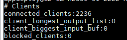
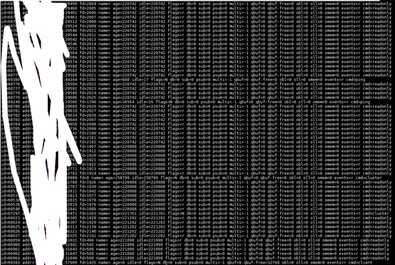
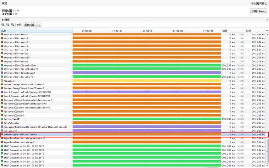
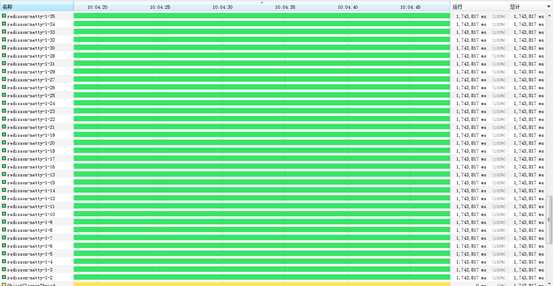
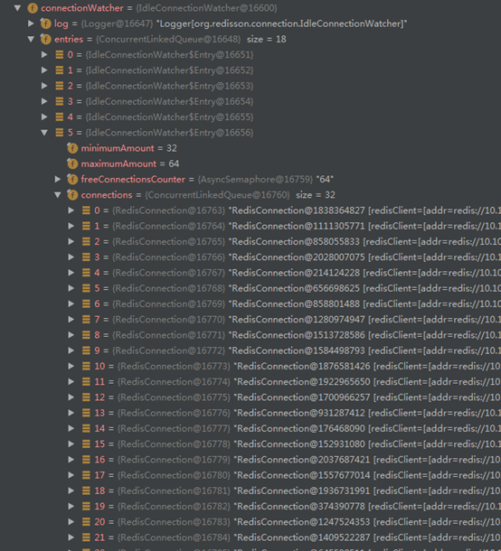
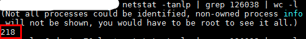
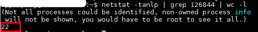

## 问题

运维反应redis客户端连接数太多，超过默认最大限制1W。
执行命令

```
./redis-cli –h host –p port info clients
```

查看redis客户端连接数，共6个节点每个节点都是2000+



## 分析

执行命令

```
./redis-cli –h host –p port client list
```

查看具体连接信息，有大量空闲连接，主节点大量cmd=null，从节点大量cmd=readonly，且idle时间和age时间差不多大的连接


说明大部分连接都是没有用到的。

发现Jedis连接池的*minEvictableIdleTimeMillis*和*timeBetweenEvictionRunsMillis*都配置成了-1，是不是Jedis连接池未及时回收连接的问题呢？但maxTotal配置的是20，一共30+个组件，不应该超过这个值啊！
写个脚本，先用jps查看组件pid，再

```
netstat –tanlp | grep pid | wc -l
```

统计每个组件的连接，发现每个组件都已经十倍超出这个值，平均200+。

打断点进入Jedis连接池中实现空闲连接检测的GenericObjectPool.evict()方法，发现IdleObjects一直是0，并没有需要丢弃的空闲连接。
基于对commons-pool2的信任，而且同个组件的druid连接池并没有出问题(两者用的都是用commons-pool2实现自己的连接池)，我觉得问题应该出现在其他地方。

打开java进程的jmx功能(或者使用idea的remote远程调试功能)，进一步分析，配置如下（看key就能明白作用）：

```
-Djava.rmi.server.hostname=IP
-Dcom.sun.management.jmxremote.port=Port
-Dcom.sun.management.jmxremote.ssl=false 
-Dcom.sun.management.jmxremote.authenticate=false
```

用jvisualvm连接目标组件，发现commons-pool-evictor-thread线程在空闲着


可以确定Jedis连接池并没有多余的连接需要丢弃。

一顿分析，再重新看一次，发现有很多redisson-netty开头的线程一直在运行



框架中确实使用了redisson，而且大部分配置项都是用的默认值，打个断点，SpringContextUtil.getBean(RedissonClient.class)获取RedissonClient到处看看，发现！
connectionManager下面的connectionWatcher记录了使用到的Redis连接！



太多了，而且lastUsageTime都是组件刚启动的时候，说明并没有使用过！而且6个节点每个32个连接，再加上Pubsub连接的数量和Jedis连接池的数量，正好和统计出来的数量差不多！

## 解决方案

问题应该就在这里，将Redisson的SlaveConnectionMinimumIdleSize和MasterConnectionMinimumIdleSize设置成1，重启组件再对比一下连接数



