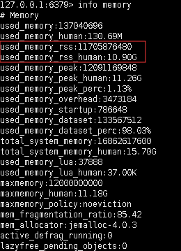
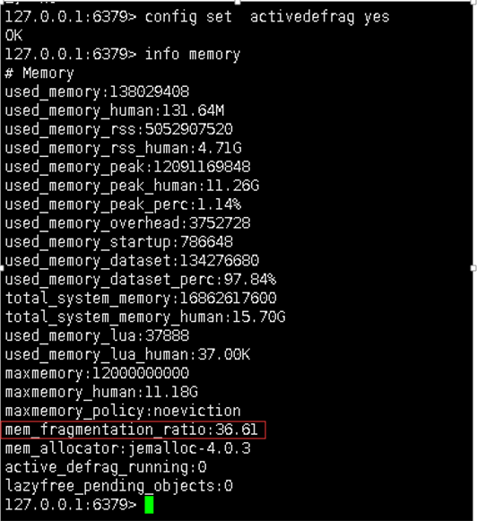

# [Redis内存碎片清理](https://www.cnblogs.com/gjc592/p/12180024.html)

当Redis中清理了大量的Key之后原先Redis申请的内存（used_memory_rss）将继续持有而不会释放，此时查看内存信息将会看到存在大量的内存碎片。那么，Redis的内存碎片可以清理么，该如何清理呢？

翻看了Redis的相关资料发现，Redis4版本之后开始支持内存碎片的清理，于是进行了一次测试，内容如下：

### 1. 搭建Redis

搭建一个Redis，版本为4.0.14.搭建步骤参考历史博文或微信公众号，步骤相对简单，没有太多幺蛾子，很快便可以搭建成功。

### 2. 插入一堆Key,使其内存占用很大

可以批量写一个循环，插入大量key。

### 3. 删除90%以上的key

循环删除key或在创建key时设置过期时间，待key删除或过期之后，可以查看内存的情况。

[](javascript:void(0);)

```
127.0.0.1:6379> info memory 
# Memory
used_memory:137040696
used_memory_human:130.69M
used_memory_rss:11705876480
used_memory_rss_human:10.90G
used_memory_peak:12091169848
used_memory_peak_human:11.26G
used_memory_peak_perc:1.13%
used_memory_overhead:3473184
used_memory_startup:786648
used_memory_dataset:133567512
used_memory_dataset_perc:98.03%
total_system_memory:16862617600
total_system_memory_human:15.70G
used_memory_lua:37888
used_memory_lua_human:37.00K
maxmemory:12000000000
maxmemory_human:11.18G
maxmemory_policy:noeviction
mem_fragmentation_ratio:85.42
mem_allocator:jemalloc-4.0.3
active_defrag_running:0
lazyfree_pending_objects:0
 
```

[](javascript:void(0);)



可以发现实际使用内存为130.69M，而Redis申请的内存为10.90G，碎片率mem_fragmentation_ratio为85.42，相当高了

 

### 4. 清理内存碎片

默认情况下自动清理碎片的参数是关闭的，可以按如下命令查看

```
127.0.0.1:6379> config get activedefrag 
1) "activedefrag"
2) "no"
```

启动自动清理内存碎片

```
127.0.0.1:6379> config set  activedefrag yes
OK
```

开启后再查看内存信息

[](javascript:void(0);)

```
127.0.0.1:6379> info memory
# Memory
used_memory:138029408
used_memory_human:131.64M
used_memory_rss:5052907520
used_memory_rss_human:4.71G
used_memory_peak:12091169848
used_memory_peak_human:11.26G
used_memory_peak_perc:1.14%
used_memory_overhead:3752728
used_memory_startup:786648
used_memory_dataset:134276680
used_memory_dataset_perc:97.84%
total_system_memory:16862617600
total_system_memory_human:15.70G
used_memory_lua:37888
used_memory_lua_human:37.00K
maxmemory:12000000000
maxmemory_human:11.18G
maxmemory_policy:noeviction
mem_fragmentation_ratio:36.61
mem_allocator:jemalloc-4.0.3
active_defrag_running:0
lazyfree_pending_objects:0
 
```

[](javascript:void(0);)



 

此时redis占用的内存used_memory_rss已降低至4.71G了，内存碎片为36.61

### 5. 查看内存分配情况

此时也可以查看内存分配情况,其中重要的指标是查看bins里的util,此时可以发现当前最大的已达到0.998（1除外）

 

[](javascript:void(0);)

```
127.0.0.1:6379> memory malloc-stats
___ Begin jemalloc statistics ___
Version: 4.0.3-0-ge9192eacf8935e29fc62fddc2701f7942b1cc02c
Assertions disabled
Run-time option settings:
  opt.abort: false
  opt.lg_chunk: 21
  opt.dss: "secondary"
  opt.narenas: 8
  opt.lg_dirty_mult: 3 (arenas.lg_dirty_mult: 3)
  opt.stats_print: false
  opt.junk: "false"
  opt.quarantine: 0
  opt.redzone: false
  opt.zero: false
  opt.tcache: true
  opt.lg_tcache_max: 15
CPUs: 2
Arenas: 8
Pointer size: 8
Quantum size: 8
Page size: 4096
Min active:dirty page ratio per arena: 8:1
Maximum thread-cached size class: 32768
Chunk size: 2097152 (2^21)
Allocated: 138983464, active: 149237760, metadata: 133846144, resident: 299532288, mapped: 5274861568
Current active ceiling: 153092096

arenas[0]:
assigned threads: 1
dss allocation precedence: secondary
min active:dirty page ratio: 8:1
dirty pages: 36435:4043 active:dirty, 348100 sweeps, 737670 madvises, 4686933 purged
                            allocated      nmalloc      ndalloc    nrequests
small:                       51173416     27946257     27800354    215995984
large:                       20701184      6397067      6396713      7682104
huge:                        67108864          754          753          754
total:                      138983464     34344078     34197820    223678842
active:                     149237760
mapped:                    5270667264
metadata: mapped: 130830336, allocated: 115776
bins:           size ind    allocated      nmalloc      ndalloc    nrequests      curregs      curruns regs pgs  util       nfills     nflushes      newruns       reruns
                   8   0         2952         4753         4384     18226389          369            1  512   1 0.720         2600         2566            1            0
                  16   1       699600      5702102      5658377     34777916        43725          392  256   1 0.435        61712        64807        22136          251
                  24   2       824592      9648532      9614174     75492339        34358          441  512   3 0.152       102398       100732        16561      1083971
                  32   3          800         1828         1803     11077167           25            1  128   1 0.195         1031          883            1            0
                  40   4          400          893          883      1285046           10            1  512   5 0.019          787          791            1            0
                  48   5         1824        10123        10085     23813168           38            1  256   3 0.148         6390         7039           18            9
                  56   6        11200       665763       665563      3654283          200           60  512   7 0.006        11325        18434         1302          135
                  64   7        44480      2221901      2221206      8140167          695           62   64   1 0.175        38634        43809        34702         1105
                  80   8      2243120      3241050      3213011     12640545        28039          154  256   5 0.711        36308        40673        12556          268
                  96   9      1248384      1173523      1160519      5632612        13004          116  128   3 0.875        17234        22442         9049          828
                 112  10       257152       497094       494798       378079         2296            9  256   7 0.996        10382        20700         1942          529
                 128  11       173056       241148       239796      1500956         1352           43   32   1 0.982        11994        19268         7491         1149
                 160  12       510880       676589       673396      1867045         3193           25  128   5 0.997        12036        20344         5279          974
                 192  13        86784       163154       162702       104853          452            8   64   3 0.882         8095        19909         2538          885
                 224  14      1050784       937414       932723       882636         4691           37  128   7 0.990        14534        21327         7237          653
                 256  15       177920       122377       121682       108334          695           44   16   1 0.987        11216        18094         7648         1025
                 320  16       158720       160687       160191      1395080          496           10   64   5 0.775         8282        19932         2458          806
                 384  17       108288        87166        86884        56781          282           10   32   3 0.881         7364        18594         2691          830
                 448  18       520576       311865       310703       235276         1162           19   64   7 0.955         9885        20257         4849         1277
                 512  19       366080       139077       138362       136708          715           91    8   1 0.982        16677        21203        17307          758
                 640  20       296320       136674       136211      1387569          463           15   32   5 0.964         8781        19327         4294         1194
                 768  21       754176       164055       163073       154637          982           62   16   3 0.989        13751        19514        10232          853
                 896  22       507136       142840       142274       104081          566           19   32   7 0.930         8831        19297         4488         1232
                1024  23       460800        81240        80790        71715          450          113    4   1 0.995        11411        17538        20204         1932
                1280  24       967680       142375       141619      3997592          756           48   16   5 0.984        12880        19162         8852          974
                1536  25       806400        83240        82715      1363965          525           66    8   3 0.994        11744        17875        10296         1083
                1792  26       507136        70931        70648        50310          283           18   16   7 0.982         8140        17915         4403         1138
                2048  27       540672        52915        52651        40011          264          132    2   1 1             8604        16582        26425         1888
                2560  28      1487360       115947       115366      2688774          581           73    8   5 0.994        15012        19969        14410          962
                3072  29      1022976        70646        70313        58822          333           84    4   3 0.991        10445        17189        17546         2050
                3584  30      1634304        76807        76351        66030          456           57    8   7 1            11190        17542         9538         1175
                4096  31       487424        56959        56840        43668          119          119    1   1 1             9176        16863        56959            0
                5120  32      6154240       145461       144259      2675097         1202          301    4   5 0.998        17704        22138        36076         1483
                6144  33      1198080        45380        45185        83315          195           98    2   3 0.994         8050        16148        22721         1759
                7168  34       824320        32518        32403      1310845          115           29    4   7 0.991         6598        14416         8063         1715
                8192  35     18800640       355210       352915       362972         2295         2295    1   2 1            39103        42128       355210            0
               10240  36      2232320        76168        75950        66295          218          109    2   5 1            11960        17361        37917         1769
               12288  37      2039808        52860        52694        40296          166          166    1   3 1             8941        16632        52860            0
               14336  38      1964032        36992        36855        24610          137           69    2   7 0.992         6879        15285        18422         1777
large:          size ind    allocated      nmalloc      ndalloc    nrequests      curruns
               16384  39       688128         7548         7506         7760           42
               20480  40       880640         9391         9348      1293561           43
               24576  41       688128         6279         6251         6367           28
               28672  42       602112         4187         4166         4261           21
               32768  43      2818048        17937        17851        18430           86
               40960  44      1433600      6306450      6306415      6306450           35
               49152  45      1277952         5117         5091         5117           26
               57344  46       860160         5916         5901         5916           15
               65536  47       393216         2953         2947         2953            6
               81920  48      1310720         8244         8228         8244           16
               98304  49       294912         5037         5034         5037            3
              114688  50       573440         4224         4219         4224            5
              131072  51       393216         2233         2230         2233            3
              163840  52      1638400         2798         2788         2798           10
              196608  53      1179648         1740         1734         1740            6
              229376  54       229376         1162         1161         1162            1
              262144  55       524288          872          870          872            2
              327680  56       327680         1290         1289         1290            1
              393216  57            0          782          782          782            0
              458752  58            0          520          520          520            0
              524288  59       524288          400          399          400            1
              655360  60       655360          606          605          606            1
              786432  61            0          371          371          371            0
              917504  62            0          196          196          196            0
             1048576  63      2097152          224          222          224            2
             1310720  64      1310720          328          327          328            1
             1572864  65            0          179          179          179            0
             1835008  66            0           83           83           83            0
huge:           size ind    allocated      nmalloc      ndalloc    nrequests   curhchunks
             2097152  67            0          110          110          110            0
             2621440  68            0          263          263          263            0
             3145728  69            0           86           86           86            0
             3670016  70            0           91           91           91            0
             4194304  71            0           45           45           45            0
             5242880  72            0           55           55           55            0
             6291456  73            0           26           26           26            0
             7340032  74            0           15           15           15            0
             8388608  75            0           13           13           13            0
            10485760  76            0            8            8            8            0
            12582912  77            0           13           13           13            0
            14680064  78            0            2            2            2            0
            16777216  79            0            4            4            4            0
            20971520  80            0            2            2            2            0
            25165824  81            0            2            2            2            0
            29360128  82            0            2            2            2            0
            33554432  83            0            4            4            4            0
            41943040  84            0            2            2            2            0
            50331648  85            0            2            2            2            0
            58720256  86            0            2            2            2            0
            67108864  87     67108864            7            6            7            1
                     ---
--- End jemalloc statistics ---
```

[](javascript:void(0);)

 

### 6. 手动清理

其实还可以手动清理，可以采用如下命令

```
127.0.0.1:6379> memory purge
OK
```

### 7. 相关参数配置说明

内存清理相关参数如下，可以使用config get的方式查看对应的值

[](javascript:void(0);)

```
# Enabled active defragmentation
# 碎片整理总开关
# activedefrag yes

# Minimum amount of fragmentation waste to start active defrag
# 内存碎片达到多少的时候开启整理
active-defrag-ignore-bytes 100mb

# Minimum percentage of fragmentation to start active defrag
# 碎片率达到百分之多少开启整理
active-defrag-threshold-lower 10

# Maximum percentage of fragmentation at which we use maximum effort
# 碎片率小余多少百分比开启整理
active-defrag-threshold-upper 100

# Minimal effort for defrag in CPU percentage
active-defrag-cycle-min 25

# Maximal effort for defrag in CPU percentage
active-defrag-cycle-max 75
```

[](javascript:void(0);)

至此，Redis4.0.14版本的内存碎片清理就测试完成了。