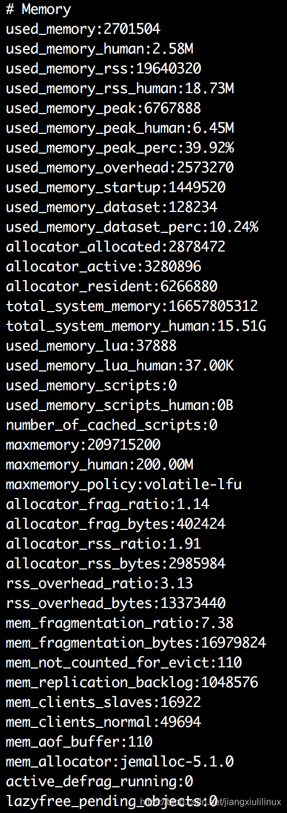

Redis服务器内存不够用了，这时可以看看是否是内存碎片的原因，不一定只能靠内存扩容来处理。

# 一、碎片率的计算

我们登陆到Redis服务器上，执行以下命令：

```bash
info memory
```

我们会看到如下的信息：

其中**mem_fragmentation_ratio**就是内存碎片率。

```bash
mem_fragmentation_ratio = used_memory_rss / used_memory
```

used_memory_rss：是Redis向操作系统申请的内存。
used_memory：是Redis中的数据占用的内存。

# 二、内存碎片如何产生的？

Redis内部有自己的内存管理器，为了提高内存使用的效率，来对内存的申请和释放进行管理。
Redis中的值删除的时候，并没有把内存直接释放，交还给操作系统，而是交给了Redis内部有内存管理器。
Redis中申请内存的时候，也是先看自己的内存管理器中是否有足够的内存可用。
Redis的这种机制，提高了内存的使用率，但是会使Redis中有部分自己没在用，却不释放的内存，导致了内存碎片的发生。

# 三、碎片率的意义：

**mem_fragmentation_ratio**的不同值，说明不同的情况。

1. 大于1：说明内存有碎片，一般在1到1.5之间是正常的。
2. 大于1.5：说明内存碎片率比较大，需要考虑是否要进行内存碎片清理，要引起重视。
3. 小于1：说明已经开始使用交换内存，也就是使用硬盘了，正常的内存不够用了，需要考虑是否要进行内存的扩容。

# 四、解决碎片率大的问题

## 低于4.0版本的Redis

如果你的Redis版本是4.0以下的，Redis服务器重启后，Redis会将没用的内存归还给操作系统，碎片率会降下来。

## 高于4.0版本的Redis

Redis4.0版本开始，可以在不重启的情况下，线上整理内存碎片。
自动碎片清理，只要设置了如下的配置，内存就会自动清理了。

```bash
config set activedefrag yes
```

如果想把Redis的配置，写到配置文件中去。

```bash
config rewrite
```

如果你对自动清理的效果不满意，可以使用如下命令，直接试下手动碎片清理：

```bash
memory purge
```