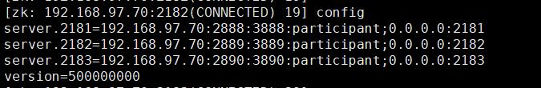
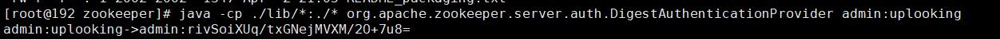
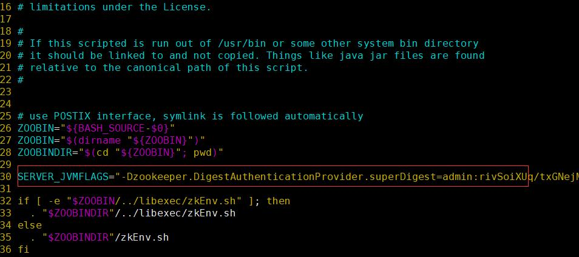
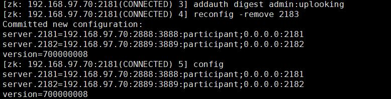
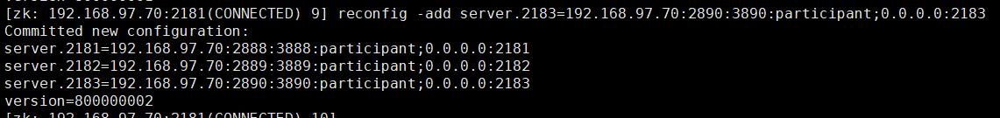

## **前言**

在3.5.0版本之前，Zookeeper的配置参数都是静态的即修改配置时需要重启ZooKeeper。从3.5.0开始，不再需要“重启”！ZooKeeper已经完全支持配置自动加载

下面是摘至官方文档的[原文](https://github.com/apache/zookeeper/blob/master/zookeeper-docs/src/main/resources/markdown/zookeeperReconfig.md)

> Prior to the 3.5.0 release, the membership and all other configuration parameters of Zookeeper were static - loaded during boot and immutable at runtime. Operators resorted to ‘’rolling restarts’’ - a manually intensive and error-prone method of changing the configuration that has caused data loss and inconsistency in production.
>
> > Starting with 3.5.0, “rolling restarts” are no longer needed! ZooKeeper comes with full support for automated configuration changes: the set of Zookeeper servers, their roles (participant / observer), all ports, and even the quorum system can be changed dynamically, without service interruption and while maintaining data consistency. Reconfigurations are performed immediately, just like other operations in ZooKeeper. Multiple changes can be done using a single reconfiguration command. The dynamic reconfiguration functionality does not limit operation concurrency, does not require client operations to be stopped during reconfigurations, has a very simple interface for administrators and no added complexity to other client operations.

```
注意：从3.5.3开始，默认情况下禁用动态重新配置功能，并且必须通过reconfigEnabled配置选项明确打开。
```

下面开始安装并测试该功能。

## **安装jdk**

此处省略

## **安装zookeeper**

安装是跟zookeeper-3.4.x是没区别的，这里快速过一下。

1. 下载并解压

   源码包: [apache-zookeeper-3.5.5.tar.gz](http://mirror.bit.edu.cn/apache/zookeeper/zookeeper-3.5.5/apache-zookeeper-3.5.5.tar.gz)

   Jar包: [apache-zookeeper-3.5.5-bin.tar.gz](http://mirror.bit.edu.cn/apache/zookeeper/zookeeper-3.5.5/apache-zookeeper-3.5.5-bin.tar.gz)

   以Jar包为例

   ```
   $ cd /usr/local/src
   $ wget http://mirror.bit.edu.cn/apache/zookeeper/zookeeper-3.5.5/apache-zookeeper-3.5.5-bin.tar.gz
   $ tar xf apache-zookeeper-3.5.5-bin.tar.gz && mv apache-zookeeper-3.5.5-bin /usr/local/apache-zookeeper-3.5.5-bin
   $ ln -s /usr/local/apache-zookeeper-3.5.5-bin /usr/local/zookeeper
   ```

2. 修改环境变量

   编辑 /etc/profile 文件, 在文件末尾添加以下环境变量配置:

   ```
   # ZooKeeper Env
   export ZOOKEEPER_HOME=/usr/local/zookeeper
   export PATH=$PATH:$ZOOKEEPER_HOME/bin
   ```

   运行以下命令使环境变量生效: source /etc/profile

3. 配置文件

   初次使用 ZooKeeper 时,需要将/usr/local/zookeeper/conf 目录下的 zoo_sample.cfg 重命名为 zoo.cfg

   $ cp -rpv /usr/local/zookeeper/conf/zoo_sample.cfg /usr/local/zookeeper/conf/zoo.cfg

## **Zookeeper配置**

### **初始化**

```
创建目录/data/zookeeper/zookeeper_data 和/data/zookeeper/zookeeper_logs 修改配置文件

    $ mkdir -pv /data/zookeeper/zookeeper_data
    $ mkdir -pv /data/zookeeper/zookeeper_logs
```

### **需要修改的配置详解**

下面解释一下需要修改的配置

静态配置文件

```
$ vim /usr/local/zookeeper/conf/zoo.cfg

    tickTime=2000
    initLimit=10
    syncLimit=5
    dataDir=/data/zookeeper/zookeeper_data
    dataLogDir=/data/zookeeper/zookeeper_logs
    clientPort=2181

    # 4lw.commands.whitelist=*
    4lw.commands.whitelist=stat, ruok, conf, isro

    autopurge.purgeInterval:    24*2
    autopurge.snapRetainCount:  2

    # 在3.5.0之前，可以在独立模式或分布式模式下运行ZooKeeper。并且无法在运行时在它们之间进行切换。
    # 默认情况下（为了向后兼容），standaloneEnabled设置为 true。
    # 使用此默认值的结果是，如果以单个服务器启动，则不允许集合增长，并且如果从多个服务器启动，则不允许缩小以包含少于两个参与者。
    # 将标志设置为false 可以启动包含单个参与者的ZooKeeper集群，并通过添加更多服务器来动态增长它。同样，通过删除服务器，可以缩小整体，以便只剩下一个参与者。
    # 由于运行分布式模式可以提供更大的灵活性，因此我们建议将标志设置为false。
    standaloneEnabled=false

    # 从3.5.0开始，3.5.3之前，无法禁用动态重新配置功能。
    # 我们希望提供禁用重新配置功能的选项，因为启用了重新配置后，我们有一个安全问题，即恶意行为者可以对ZooKeeper集合的配置进行任意更改，包括将受感染的服务器添加到集合中。
    # 我们倾向于由用户自行决定是否启用它，并确保采用适当的安全措施。
    # 因此，在3.5.3 中引入了reconfigEnabled配置选项，以便可以完全禁用重新配置功能，并且默认情况下，无论是否使用身份验证通过reconfig API重新配置群集的任何尝试都将失败，除非reconfigEnabled设置为 true。
    reconfigEnabled=true

    # 从3.5.0开始，zookeeper将可以区分动态配置参数和静态配置参数，静态配置参数在服务器引导时从配置文件中读取，并且在执行期间不会更改。
    # 动态配置参数则可以通过dynamicConfigFile写到相应的文件(该文件)。目前，以下配置关键字被视为动态配置的一部分：server, group and weight。
    # 即静态的部分还是放在原来的zooN.cfg当中，动态的部分放到了zooN.cfg.dynamic.xxx上。动态参数将由ZooKeeper推送，并覆盖所有服务器上的动态配置文件。
    # 因此，不同服务器上的动态配置文件通常是相同的（它们只能在重新配置进行时暂时不同，或者如果新配置尚未传播到某些服务器）。
    # 创建后，不应手动更改动态配置文件。只可以通过API或者reconfig命令进行更改。
    dynamicConfigFile=/usr/local/zookeeper/conf/zoo_replicated.cfg.dynamic
```

动态配置文件

```
在zoo_replicated.cfg.dynamic配置。

$ vim zoo_replicated1.cfg.dynamic(仅供参考)

    格式为：server.<positive id> = <address1>:<port1>:<port2>[:role];[<client port address>:]<client port>

    客户端端口的规范是在分号的右边。客户端端口地址是可选的，如果没有指定它默认是"0.0.0.0"。和往常一样，角色也是可选的，它可以是participant或者observer(默认是participant)。

    下面是合法的服务端声明：

    server.5 = 125.23.63.23:1234:1235;2181
    server.5 = 125.23.63.23:1234:1235:participant;2181
    server.5 = 125.23.63.23:1234:1235:observer;2181
    server.5 = 125.23.63.23:1234:1235;125.23.63.24:2181
    server.5 = 125.23.63.23:1234:1235:participant;125.23.63.23:2181
```

初始化myid,比如在每台的zookeeper data目录分别执行

```
#master
$ echo "1">/data/zookeeper/zookeeper_data/myid
#slave1
$ echo "2">/data/zookeeper/zookeeper_data/myid
#slave2
$ echo "3">/data/zookeeper/zookeeper_data/myid
```

### **Zookeeper集群**

上面的解释配置文件的参数，下面来做个测试

假设在192.168.97.70这台服务器上已经搭建好zookeeper, 那么我们分别起2181，2182，2183三个服务组成一个集群。

下面是配置文件

***Zookeeper 2181\***

- zoo_2181.cfg

  ```
  initLimit=10
  syncLimit=5
  4lw.commands.whitelist=*
  tickTime=2000
  dataDir=/data/zookeeper/zookeeper_data/2181
  dataLogDir=/data/zookeeper/zookeeper_logs/2181
  reconfigEnabled=true
  standaloneEnabled=false
  dynamicConfigFile=/usr/local/apache-zookeeper-3.5.5-bin/conf/zoo_replicated.2181.cfg.dynamic
  ```

- zoo_replicated.2181.cfg.dynamic

  ```
  server.2181=192.168.97.70:2888:3888:participant;0.0.0.0:2181
  server.2182=192.168.97.70:2889:3889:participant;0.0.0.0:2182
  server.2183=192.168.97.70:2890:3890:participant;0.0.0.0:2183
  ```

- 初始化myid

  ```
  $ echo "2181">/data/zookeeper/zookeeper_data/2181/myid
  ```

***Zookeeper 2182\***

- zoo_2182.cfg

  ```
  initLimit=10
  syncLimit=5
  4lw.commands.whitelist=*
  tickTime=2000
  dataDir=/data/zookeeper/zookeeper_data/2182
  dataLogDir=/data/zookeeper/zookeeper_logs/2182
  reconfigEnabled=true
  standaloneEnabled=false
  dynamicConfigFile=/usr/local/apache-zookeeper-3.5.5-bin/conf/zoo_replicated.2182.cfg.dynamic
  ```

- zoo_replicated.2182.cfg.dynamic

  ```
  server.2181=192.168.97.70:2888:3888:participant;0.0.0.0:2181
  server.2182=192.168.97.70:2889:3889:participant;0.0.0.0:2182
  server.2183=192.168.97.70:2890:3890:participant;0.0.0.0:2183
  ```

- 初始化myid

  ```
  $ echo "2182">/data/zookeeper/zookeeper_data/2182/myid
  ```

***Zookeeper 2183\***

- zoo_2183.cfg

  ```
  initLimit=10
  syncLimit=5
  4lw.commands.whitelist=*
  tickTime=2000
  dataDir=/data/zookeeper/zookeeper_data/2183
  dataLogDir=/data/zookeeper/zookeeper_logs/2183
  reconfigEnabled=true
  standaloneEnabled=false
  dynamicConfigFile=/usr/local/apache-zookeeper-3.5.5-bin/conf/zoo_replicated.2183.cfg.dynamic
  ```

- zoo_replicated.2183.cfg.dynamic

  ```
  server.2181=192.168.97.70:2888:3888:participant;0.0.0.0:2181
  server.2182=192.168.97.70:2889:3889:participant;0.0.0.0:2182
  server.2183=192.168.97.70:2890:3890:participant;0.0.0.0:2183
  ```

- 初始化myid

  ```
  $ echo "2183">/data/zookeeper/zookeeper_data/2183/myid
  ```

启动服务

```
$ /usr/local/zookeeper/bin/zkServer.sh restart /usr/local/zookeeper/conf/zoo_2181.cfg
$ /usr/local/zookeeper/bin/zkServer.sh restart /usr/local/zookeeper/conf/zoo_2182.cfg
$ /usr/local/zookeeper/bin/zkServer.sh restart /usr/local/zookeeper/conf/zoo_2183.cfg
```

随便进入一台Zookeeper，比如2182, 执行config命令。

```
$ /usr/local/zookeeper/bin/zkCli.sh -server 192.168.97.70:2181
```

[](https://res.920430.com/resources/blogs/linux/Zookeeper/zk5001.jpg)

[001](https://res.920430.com/resources/blogs/linux/Zookeeper/zk5001.jpg)


## **Zookeeper动态增加删除**

由于Zookeeper服务器默认没有/zookeeper/config的写入权限导致的，需要添加写入权限,不然会出现”Authentication is not valid”

1. 先进入zookeeper的安装目录，然后执行下述命令产生认证使用的摘要信息：

   ```
   $ java -cp ./lib/*:./* org.apache.zookeeper.server.auth.DigestAuthenticationProvider admin:uplooking
   ```

   [](https://res.920430.com/resources/blogs/linux/Zookeeper/zk5002.jpg)

   [002](https://res.920430.com/resources/blogs/linux/Zookeeper/zk5002.jpg)

   

   说明下，这条命令实际上在执行zookeeper的org.apache.zookeeper.server.auth.DigestAuthenticationProvider功能，

   使用用户名：admin / 密码：uplooking

   产生认证参数，执行完毕后程序返回： admin:uplooking->admin:rivSoiXUq/txGNejMVXM/2O+7u8=

2. 修改zkServer.sh文件，添加下述命令行：

   ```
   SERVER_JVMFLAGS="-Dzookeeper.DigestAuthenticationProvider.superDigest=admin:rivSoiXUq/txGNejMVXM/2O+7u8="
   ```

   [](https://res.920430.com/resources/blogs/linux/Zookeeper/zk5003.jpg)

   [003](https://res.920430.com/resources/blogs/linux/Zookeeper/zk5003.jpg)

   

   然后重启集群中的一个节点

3. 连接步骤2中重启的节点，执行下述命令：

   验证登陆

   ```
   zk: > addauth digest admin:uplooking
   ```

   删除节点，比如节点2183.

   ```
   zk: > reconfig -remove 2183
   ```

   [](https://res.920430.com/resources/blogs/linux/Zookeeper/zk5004.jpg)

   [004](https://res.920430.com/resources/blogs/linux/Zookeeper/zk5004.jpg)

   

   重新添加节点

   ```
   zk: > reconfig -add server.2182=192.168.97.70:2889:3889:participant;0.0.0.0:2182
   ```

   [](https://res.920430.com/resources/blogs/linux/Zookeeper/zk5005.jpg)

   [005](https://res.920430.com/resources/blogs/linux/Zookeeper/zk5005.jpg)

   

   reconfig的用法很灵活, 下面官方文档上的一个例子。

   ```
   zk: > reconfig -add server.4=127.0.0.1:2801:2802:participant;2794
   zk: > reconfig -remove 3 -add server.5=125.23.63.23:1234:1235;1236
   zk: > reconfig -remove 3,4 -add server.5=localhost:2111:2112;2113,6=localhost:2114:2115:observer;2116
   ```

## **参考文章**

[官网](https://zookeeper.apache.org/)

[Zookeeper-QuickStart](https://github.com/alibaba/canal/wiki/Zookeeper-QuickStart)

[ZooKeeper动态重新配置](https://blog.csdn.net/Aria_Miazzy/article/details/86609693)

[ZooKeeper动态重新配置](https://github.com/apache/zookeeper/blob/master/zookeeper-docs/src/main/resources/markdown/zookeeperReconfig.md)

[部署zookeeper+kafka集群并开启基于DIGEST-MD5的SASL-SSL身份认证](https://www.fullstackmemo.com/2019/01/21/deploy-zookeeper-clu/)