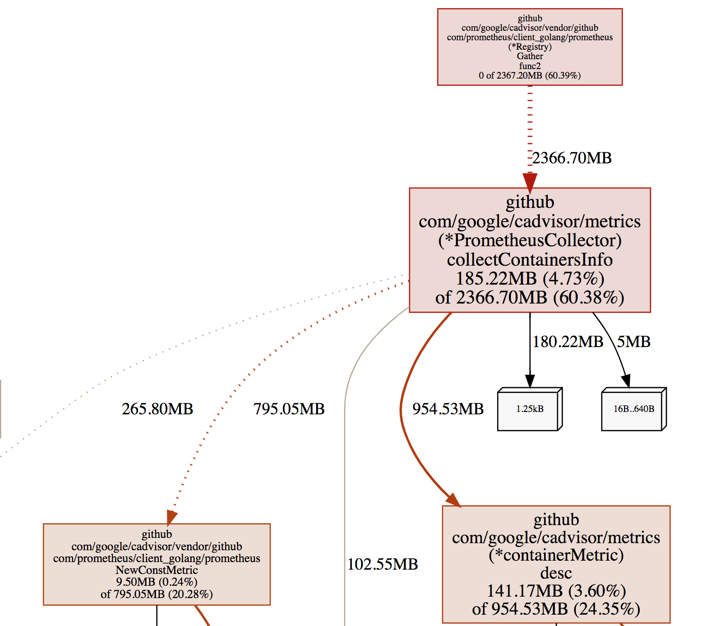

# cAdvisor内存占用不断飙升导致其在k8s内不断crash问题排查

 发表于 2018-10-24 | 分类于 [kubernetes ](https://hansedong.github.io/categories/kubernetes/)， [cAdvisor ](https://hansedong.github.io/categories/kubernetes/cAdvisor/)| 阅读次数: 968 | 4778

#### 背景

我们的额监控方案为：Kubernetes（K8S）+cAdvisor+Prometheus+Grafana。
然后，用cAdivor监控容器信息，其实，cAdivor其实到现在的主流K8S版本中，Kubelet进程已经将其内置了，但是我们没有这么用，因为没有必要因为让Prometheus定期去Kubelet上采集容器信息，平白增添对Kubelet的压力。相反，我觉得，还是应该还是应该单独部署cAdvisor，这样一来，不论是定制化cAdvisor，还是版本更新，都会更方面。所以，我使用DaemonSet部署了cAdvisor。

#### 问题

用DaemonSet的方式部署cAdvisor，本质上，就是每个K8S的宿主机都启动了一个pod，实际观测，发现这些Pod的状态，会随着时间的推移，开始频繁出现Crash。这个问题，势必会导致cAdvisor无法正常监控容器信息。下面是具体的排查过程。

#### 排查初探

首先，Pod Crash 必然有其原因，所以，一开始是通过下面的方式，看cAdvisor到底为何会Crash，通过

```
kubectl describe pod -n monitoring pod-xxxxx
```


找到Last State部分，发现其为：

```
State: OOMKilled
```


这说明，这个 Pod，是因为内存不够，cAdvisor在运行过程，超出了Pod的资源限制，被OOM杀掉了。既然资源不够，那么首先，就是调大其内存限制。

一开始为这个Pod设置的上限资源为1核CPU+1G内存，既然内存无法满足，那么调大为2G，继续观测，发现依然会OOM。然后又调整为3G、4G、10G、20G（机器内存大，土豪），发现虽然内存变大了会有一些缓解，但实际上，即使内存上限设置为20G，还是会有Crash的情况，那么，这时候就需要反思一下几个问题了：

1. 是否是cAdvisor存在bug？
2. 哪个机器上的cAdvisor Pod总是重启？

##### 排查是否是cAdvisor版本问题

针对第一点，我们升级了cAdivor镜像为最新版，问题依旧。

##### 排查是否是cAdvisor参数配置问题

google一些文章，有人提过类似的问题，官方issue的解释中，有人提到可能配置不对，可能采集的指标过多等，于是，我review了一下我的配置，调整后的完整配置如下：

```
apiVersion: extensions/v1beta1
kind: DaemonSet
metadata:
  labels:
    name: cadvisor
  name: cadvisor
  namespace: monitoring
spec:
  revisionHistoryLimit: 10
  selector:
    matchLabels:
      name: cadvisor
  template:
    metadata:
      annotations:
        prometheus.io/port: "28762"
        prometheus.io/scrape: "true"
      creationTimestamp: null
      labels:
        name: cadvisor
    spec:
      automountServiceAccountToken: false
      containers:
      - args:
        - -allow_dynamic_housekeeping=true
        - -global_housekeeping_interval=1m0s
        - -housekeeping_interval=3s
        - -disable_metrics=udp,tcp,percpu,sched
        - -storage_duration=15s
        - -profiling=true
        - -port=28762
        - -max_procs=1
        image: mine/cadvisor-test:v0.0.2
        imagePullPolicy: IfNotPresent
        name: cadvisor
        ports:
        - containerPort: 28762
          hostPort: 28762
          name: http
          protocol: TCP
        resources:
          limits:
            cpu: "1"
            memory: 3000Mi
          requests:
            cpu: "1"
            memory: 500Mi
        terminationMessagePath: /dev/termination-log
        terminationMessagePolicy: File
        volumeMounts:
        - mountPath: /rootfs
          name: rootfs
          readOnly: true
        - mountPath: /var/run
          name: var-run
          readOnly: true
        - mountPath: /sys
          name: sys
          readOnly: true
        - mountPath: /var/lib/docker
          name: docker
          readOnly: true
        - mountPath: /dev/disk
          name: disk
          readOnly: true
      dnsPolicy: ClusterFirst
      hostNetwork: true
      restartPolicy: Always
      schedulerName: default-scheduler
      securityContext: {}
      terminationGracePeriodSeconds: 30
      volumes:
      - hostPath:
          path: /
          type: ""
        name: rootfs
      - hostPath:
          path: /var/run
          type: ""
        name: var-run
      - hostPath:
          path: /sys
          type: ""
        name: sys
      - hostPath:
          path: /DATA/docker
          type: ""
        name: docker
      - hostPath:
          path: /dev/disk
          type: ""
        name: disk
  templateGeneration: 6
  updateStrategy:
    rollingUpdate:
      maxUnavailable: 1
    type: RollingUpdate
```

我调整的部分主要集中在：

```
// 这个是禁用哪些指标，默认只有udp、tcp
- -disable_metrics=udp,tcp,percpu,sched
// 存储最近多久的数据，原来是1分多钟，调整为15s
- -storage_duration=15s
// 是否开启性能测试，默认为关闭，之所以开启，是要一会儿debug内存占用
- -profiling=true
// 使用多少CPU，默认不到1个
- -max_procs=1
```

上面的方式，是减少了一些采集指标，以及采集数据的最多保留时长，稍微有些效果，但是发现效果不大，原来某些机器上频繁Crash的cAdvisor Pod，还是Crash，另外某些机器上从来不Crash的，也不会Crash。那么，说明参数配置没什么用，问题应该出现某些机器上。

##### 排查为何cAdivosr Pod在某些机器上Crash

我回顾了一下我们的K8S节点，发现cAdvisor Pod不OOM的机器上面，容器都比较少。越是容器多的机器，这机器上的cAdvisor Pod就越容易OOM Crash。

那么，我们看一下 cAdvisor 的 Pod 日志，发现其频繁报一个错误：

```
fsHandler.go:135] du and find on following dirs took 57.562700809s: [/rootfs/DATA/docker/overlay2/d8c002c4dc33c22129124e70bf7ca15fd312cd8867c040708d11d7d462ee58df/diff /rootfs/DATA/docker/containers/16eb9120ce2da24d867ee287c093ce7221f1d3ed39e69c3a8d128313a5dc0d63]; will not log again for this container unless duration exceeds 4s
```

这说明，cAdvisor会统计每一个容器占用的磁盘使用大小，这个大小是通过du命令来处理的，而且，这个统计耗费的时间很长。我们可以实际去看一下，发现这个目录，确实比较大，有些在2-3G。这说明，这个机器上，必然存在一些容器，里边在搞事情，写了很多的文件，导致 du 命令在统计的时候，比较耗时。

##### 问题初步总结

K8S节点，有些容器存储或写入了比较多的文件，造成cAdvisor统计容器磁盘使用耗时，进而引发此cAdivosr内存占用升高。

#### 排查深入探究

既然上面已经初步定为问题，但是我们依然会疑惑，为什么cAdivosr统计容器磁盘耗时会引发内存飙升呢？

我们需要借助一些工具来进一步排查

1. 通过 go tool pprof 分析内存
2. 通过查看 cAdvisor 源码分析流程
3. 在源码中，打断点，验证猜想

##### 通过 go tool pprof 分析内存

首先，将 DaemonSet 启动的 cAdvisor，使用 Host 模式启动，这样我们就可以直接通过访问宿主机上，cAdvisor开放的端口，来做性能采样了。

```
go tool pprof  -cum -svg -alloc_space http://x.x.x.x:28762/debug/pprof/heap
```

上面的步骤，会生成内存性能采样图，类似如下：

[](https://hansedong.github.io/2018/10/24/5/5-1.png)

详细采样图，可以通过此连接查看：

[采样图全](https://hansedong.github.io/2018/10/24/5/5-2.svg)

从图中，先看红色部分，颜色越深，表示这部分资源消耗越严重，我们这个采样图是采集的内存，可以看到，有 2366.70M，是 Gather 函数的，但其实，这个函数本身，并没有多少内存消耗，它的内存占用这么大，是 collectContainersInfo 函数分配的。其实不论怎样，Gather函数都脱离不了干系。那么，我们从源码看一下

##### 源码分析

首先，入口函数main中，注册了/metrics对应的handler，因为cAdvisor要开发 /metirics路径，让 Prometheus 来定时采集

```
// cadvisor.go#82
func main() {
	defer glog.Flush()
	flag.Parse()
	//注册HTTP路径 *prometheusEndpoint 值就是 /metirics
	cadvisorhttp.RegisterPrometheusHandler(mux, containerManager, *prometheusEndpoint, containerLabelFunc, includedMetrics)
	glog.V(1).Infof("Starting cAdvisor version: %s-%s on port %d", version.Info["version"], version.Info["revision"], *argPort)

	addr := fmt.Sprintf("%s:%d", *argIp, *argPort)
	glog.Fatal(http.ListenAndServe(addr, mux))
}
```

然后，看一下，是谁在处理 /metrics 路由对应的操作

```
// 代码文件：http/handler.go#97
func RegisterPrometheusHandler(mux httpmux.Mux, containerManager manager.Manager, prometheusEndpoint string,
	f metrics.ContainerLabelsFunc, includedMetrics container.MetricSet) {
	r := prometheus.NewRegistry()
	r.MustRegister(
		metrics.NewPrometheusCollector(containerManager, f, includedMetrics),
		prometheus.NewGoCollector(),
		prometheus.NewProcessCollector(os.Getpid(), ""),
	)
	//可以看到，真正执行 /metrics 的函数，是 promhttp.HandlerFor
	mux.Handle(prometheusEndpoint, promhttp.HandlerFor(r, promhttp.HandlerOpts{ErrorHandling: promhttp.ContinueOnError}))
}
```

可以看到，真正执行 /metrics 的函数，是promhttp.HandlerFor，具体深入HandlerFor看一下

```
// 代码文件：vendor/github.com/prometheus/client_golang/prometheus/promhttp/http.go#82
func HandlerFor(reg prometheus.Gatherer, opts HandlerOpts) http.Handler {
	return http.HandlerFunc(func(w http.ResponseWriter, req *http.Request) {
	   //这里就是真正的 Gather 调用
		mfs, err := reg.Gather()
		...
	})
}
```

至此，可以说明，每一次HTTP调用（调用 x.x.x.x:8080/metrics），都会又一次Gather调用。

所以我们猜想，之所以Gather函数有这么大的内存占用，主要是因为Gather函数调用次数多，而每次Gather函数执行之间长，导致形成了并发调用，这种情况下，Gather函数从执行到结束期间，都不会释放内存，并发调用，就会导致内存积压。

##### 修改源码，重新构建部署，验证猜想

那么，我们在Gather调用处，打断点，看一下执行时间：

```
// 代码文件：vendor/github.com/prometheus/client_golang/prometheus/promhttp/http.go#82
func HandlerFor(reg prometheus.Gatherer, opts HandlerOpts) http.Handler {
	return http.HandlerFunc(func(w http.ResponseWriter, req *http.Request) {
	   pp.Println("请求开始————————")
		start:=time.Now()
	   //这里就是真正的 Gather 调用
		mfs, err := reg.Gather()
		...
		timeCost := time.Since(start)
		pp.Println(fmt.Sprintf("请求结束，耗时 %v", timeCost))
	})
}
```

我们打印了Gather执行的耗时，然后重新构建 cAdvisor源码，打一个私有镜像出来，推送到私有镜像仓库。然后我们使用这个测试镜像，重新部署cAdvisor。

现在，我们挑一台之前cAdvisor频发OOM Crash的机器，看一下它的log

```
kubectl logs -n monitoring cadvisor-k9kpt -f
```

日志输出大致如下：

```
"请求开始————————"
I1023 14:21:19.126794       1 fsHandler.go:135] du and find on following dirs took 15.420205027s: [/rootfs/var/lib/docker/overlay2/67ec1868b2c0ed5ce5b22ee014eb4d08993accd68546a3de6aa2a6355bdc1a78/diff /rootfs/var/lib/docker/containers/cd910753386b3325af8bd5a69fc01b261ca14c1bfaf754677662e903b755d34f]; will not log again for this container unless duration exceeds 56s
I1023 14:21:19.305938       1 fsHandler.go:135] du and find on following dirs took 15.278733582s: [/rootfs/var/lib/docker/overlay2/10621b60f26962cb1a90d7a7dc1ce4e3c8a15f6e4e30861b8433c5c37727bb9e/diff /rootfs/var/lib/docker/containers/b2a4d11c37aa9c63b4759c5728956253fad46fa174c7fe4d91336a4ac7532127]; will not log again for this container unless duration exceeds 1m34s
I1023 14:21:19.827757       1 fsHandler.go:135] du and find on following dirs took 13.897447077s: [/rootfs/var/lib/docker/overlay2/29b3b0dfc22053937e9c40e004a6d31af489573ff3a385020feb22d88d1a3d0a/diff /rootfs/var/lib/docker/containers/af962971a0643418d28c03b374e31a0c58dd6302524ea06dc8a23c4eccf5d663]; will not log again for this container unless duration exceeds 1m20s
I1023 14:21:20.042949       1 fsHandler.go:135] du and find on following dirs took 14.514122984s: [/rootfs/var/lib/docker/overlay2/27f1d3cb3d421567754cb7abb986c16c3f3bec0874e983a2604aa7eda8834d9a/diff /rootfs/var/lib/docker/containers/60cad8688e31b557e2e98c47beaa1f3af2ea2e6cbfab0c1f399887b3eecec86c]; will not log again for this container unless duration exceeds 1m56s
"请求结束，耗时 58.093771464s"
```

日志其实我只是截图了一部分，基本上可以看出来，Gather请求十分耗时，这个耗时，就是由 du 操作耗时造成的，有时候，du 耗时非常严重，能将近2分钟。

这样，基本上，就印证了，Gather函数处理慢，而Prometheus每隔3s请求一次，造成同时有非常多的 Gather函数在并发处理，也就导致了内存积压的情况。

##### 彻底解决

综上，其实我们只需要让 du 磁盘统计快了就可以了，du 的快慢，是一个CPU密集和磁盘IO密集的操作，要加快 du 操作，就需要给到足够的运算能力。

回顾之前我们的 cAdvisor 的 DaemonSet 的yaml配置，我们在资源的 limit 部分，仅给到了一个 CPU，我们加 CPU 核数增加到6。如下：

```
resources:
  limits:
    cpu: "6"
    memory: 3000Mi
  requests:
    cpu: "2"
    memory: 500Mi
```

然后，更新 DaemonSet 部署

```
kubectl apply -f cadvisor.ds.yaml
```

再次去观察 cAdvisor 的pod日志，发现du耗时明显缩短到2秒钟以内，pod内存占用过高的情况，再也没有出现过。问题得解！