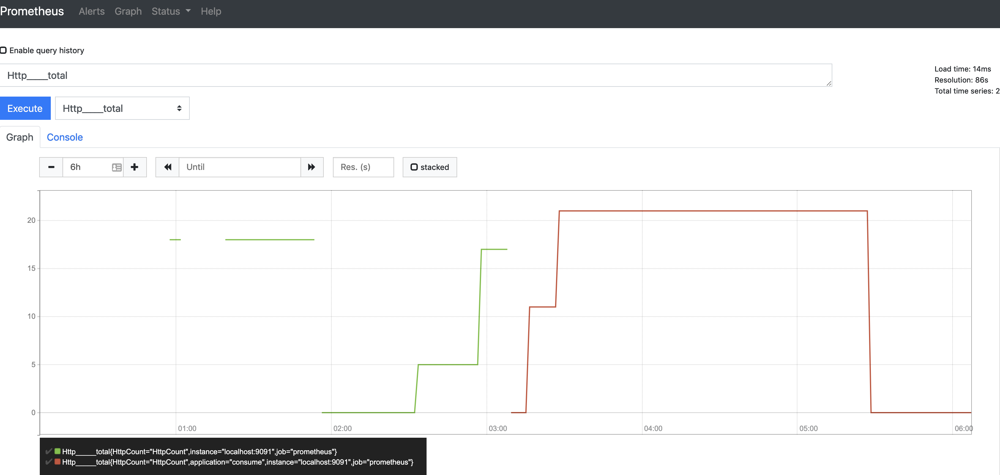
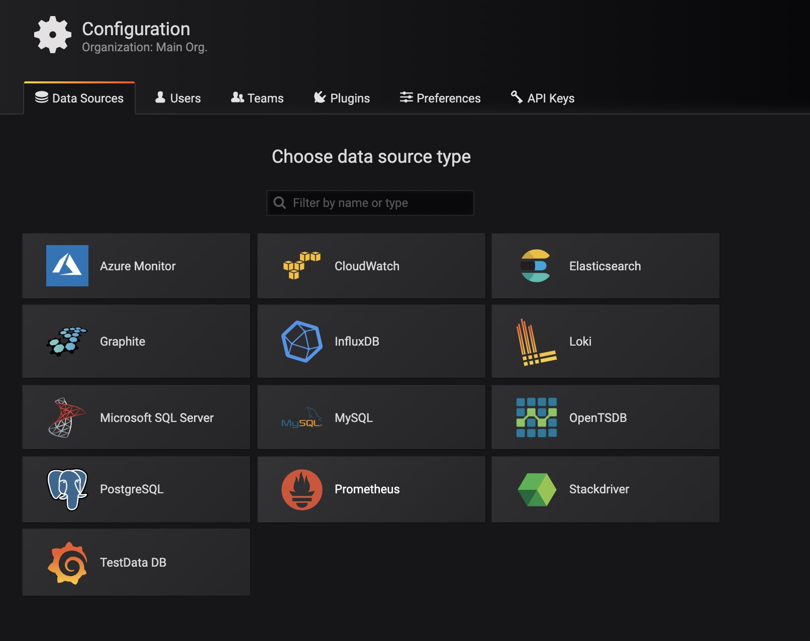
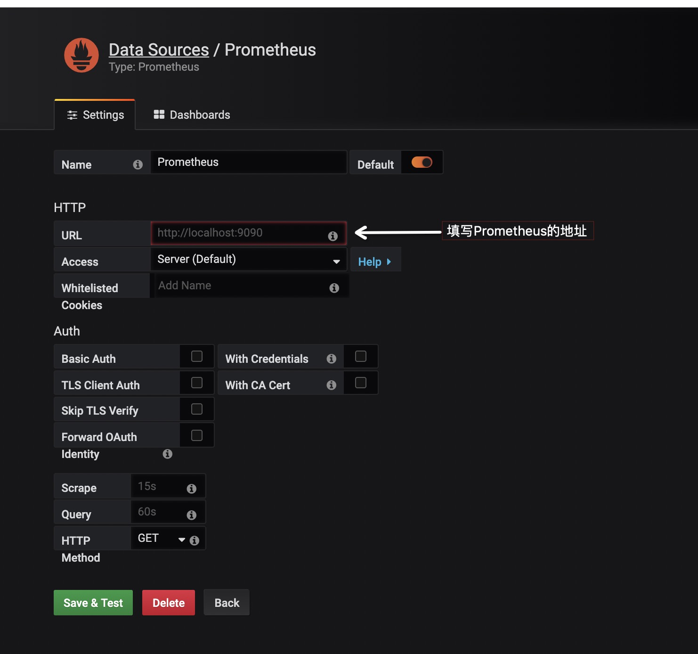
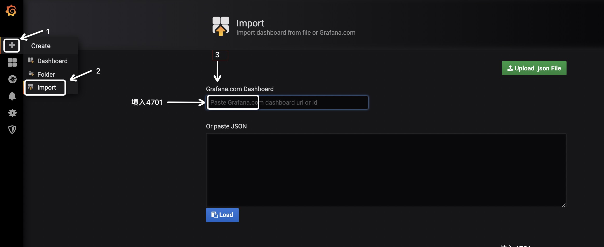
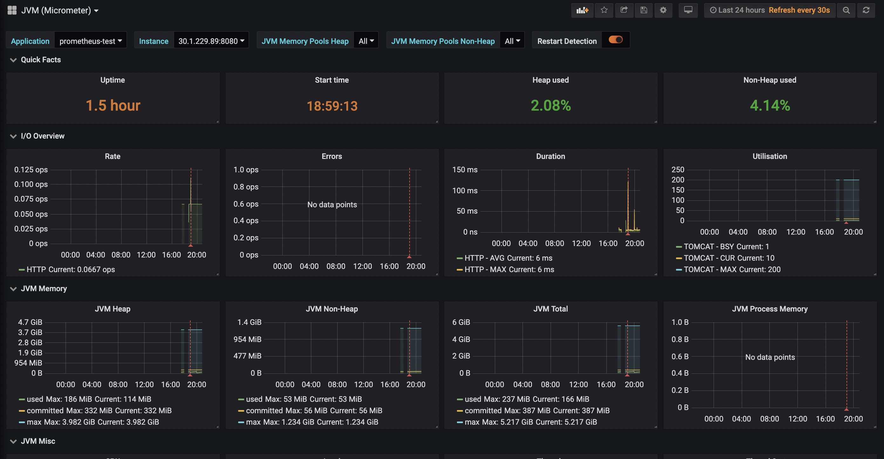
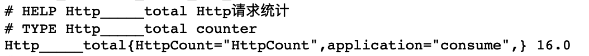
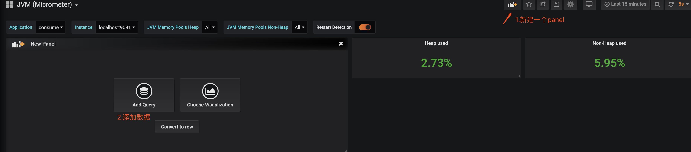
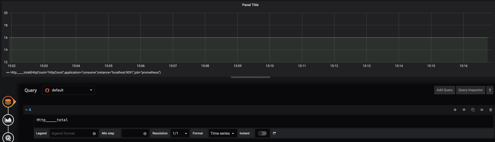

# [Springboot的监控](https://www.cnblogs.com/xmzJava/p/11212963.html)


目录

- Micrometer
  - [计数器](https://www.cnblogs.com/xmzJava/p/11212963.html#计数器)
  - [仪表](https://www.cnblogs.com/xmzJava/p/11212963.html#仪表)
  - [摘要](https://www.cnblogs.com/xmzJava/p/11212963.html#摘要)
  - [计时器](https://www.cnblogs.com/xmzJava/p/11212963.html#计时器)
- [Prometheus](https://www.cnblogs.com/xmzJava/p/11212963.html#prometheus)
- grafana
  - [保存后我们就能在dashboard上看得我我们的监控指标了参考](https://www.cnblogs.com/xmzJava/p/11212963.html#保存后我们就能在dashboard上看得我我们的监控指标了参考)


Spring Boot有个子项目Spring Boot Actuator，它为应用提供了强大的监控能力。从Spring Boot 2.0开始，Actuator将底层改为Micrometer，提供了更强、更灵活的监控能力。本次便利用Micrometer搭建出一套可视化的监控体系。


# Micrometer

Micrometer 为 Java 平台上的性能数据收集提供了一个通用的 API，应用程序只需要使用 Micrometer 的通用 API 来收集性能指标即可。Micrometer 会负责完成与不同监控系统的适配工作。这就使得切换监控系统变得很容易。Micrometer 还支持推送数据到多个不同的监控系统。

我们首先引入相关的依赖

```
    <dependency>
      <groupId>org.springframework.boot</groupId>
      <artifactId>spring-boot-starter-actuator</artifactId>
    </dependency>
    <dependency>
      <groupId>io.micrometer</groupId>
      <artifactId>micrometer-core</artifactId>
    </dependency>
```

在Micrometer中有以下几种指标

## 计数器

只加不减，通常用于记录服务的请求数量

```
public static void main(String[] args) throws Exception {
				//tag必须成对出现，也就是偶数个
				Counter counter = Counter.builder("counter")
						.tag("counter", "counter")
						.description("counter")
						.register(new SimpleMeterRegistry());
				counter.increment();
				counter.increment(2D);
				System.out.println(counter.count());
				System.out.println(counter.measure());
				//全局静态方法
				Metrics.addRegistry(new SimpleMeterRegistry());
				counter = Metrics.counter("counter", "counter", "counter");
				counter.increment(10086D);
				counter.increment(10087D);
				System.out.println(counter.count());
				System.out.println(counter.measure());
		}
```

## 仪表

表示单个数值的度量，它可以表示任意地上下移动的数值测量。通常用于变动的测量值，如当前的内存使用情况，同时也可以测量上下移动的”计数”，比如队列中的消息数量

```
public static void main(String[] args) throws Exception {
				AtomicInteger atomicInteger = new AtomicInteger();
				Gauge gauge = Gauge.builder("gauge", atomicInteger, AtomicInteger::get)
						.tag("gauge", "gauge")
						.description("gauge")
						.register(new SimpleMeterRegistry());
				atomicInteger.addAndGet(5);
				System.out.println(gauge.value());
				System.out.println(gauge.measure());
				atomicInteger.decrementAndGet();
				System.out.println(gauge.value());
				System.out.println(gauge.measure());
				Metrics.addRegistry(new SimpleMeterRegistry());
				AtomicInteger other = Metrics.gauge("gauge", atomicInteger, AtomicInteger::get);
				System.out.println(other);
		}
```

## 摘要

用于跟踪事件的分布。它类似于一个计时器，但更一般的情况是，它的大小并不一定是一段时间的测量值。在micrometer中，对应的类是DistributionSummary，它的用法有点像Timer，但是记录的值是需要直接指定，而不是通过测量一个任务的执行时间。

```
public static void main(String[] args) throws Exception {
				DistributionSummary summary = DistributionSummary.builder("summary")
						.tag("summary", "summary")
						.description("summary")
						.register(new SimpleMeterRegistry());
				summary.record(2D);
				summary.record(3D);
				summary.record(4D);
				System.out.println(summary.measure());
				System.out.println(summary.count());
				System.out.println(summary.max());
				System.out.println(summary.mean());
				System.out.println(summary.totalAmount());
		}
```

## 计时器

测量一个特定的代码逻辑块的调用(执行)速度和它的时间分布

```
public static void main(String[] args) throws Exception{
				Timer timer = Timer.builder("timer")
						.tag("timer","timer")
						.description("timer")
						.register(new SimpleMeterRegistry());
				timer.record(()->{
						try {
								TimeUnit.SECONDS.sleep(2);
						}catch (InterruptedException e){
								//ignore
						}
				});
				System.out.println(timer.count());
				System.out.println(timer.measure());
				System.out.println(timer.totalTime(TimeUnit.SECONDS));
				System.out.println(timer.mean(TimeUnit.SECONDS));
				System.out.println(timer.max(TimeUnit.SECONDS));
		}
```

有了以上几个api后我们就能实现简单的自定义监控指标进行测量。但是这样的数据无法直接的显示到页面上。所以我们这里还需要引入两个中间件

# Prometheus

Prometheus 是一套开源的系统监控报警框架
作为新一代的监控框架，Prometheus 具有以下特点：

```
灵活而强大的查询语句（PromQL）：在同一个查询语句，可以对多个 metrics 进行乘法、加法、连接、取分数位等操作。
易于管理： Prometheus server 是一个单独的二进制文件，可直接在本地工作，不依赖于分布式存储。
高效：平均每个采样点仅占 3.5 bytes，且一个 Prometheus server 可以处理数百万的 metrics。
使用 pull 模式采集时间序列数据，这样不仅有利于本机测试而且可以避免有问题的服务器推送坏的 metrics。
可以采用 push gateway 的方式把时间序列数据推送至 Prometheus server 端。
可以通过服务发现或者静态配置去获取监控的 targets。
有多种可视化图形界面。
```

我们先下载安装 Prometheus

为了更直接的操作，我们这次不使用docker。去官网下载压缩文件解压执行

```
wget https://github.com/prometheus/prometheus/releases/download/v2.11.1/prometheus-2.11.1.darwin-amd64.tar.gz
tar -zvxf prometheus-2.11.1.darwin-amd64.tar.gz
```

解压完成后修改Prometheus的配置文件prometheus.yml。将metrics_path和 static_configs.targets的地址修改成项目的地址。

```
# my global config
global:
  scrape_interval:     15s # Set the scrape interval to every 15 seconds. Default is every 1 minute.
  evaluation_interval: 15s # Evaluate rules every 15 seconds. The default is every 1 minute.
  # scrape_timeout is set to the global default (10s).

# Alertmanager configuration
alerting:
  alertmanagers:
  - static_configs:
    - targets:
      # - alertmanager:9093

# Load rules once and periodically evaluate them according to the global 'evaluation_interval'.
rule_files:
  # - "first_rules.yml"
  # - "second_rules.yml"

# A scrape configuration containing exactly one endpoint to scrape:
# Here it's Prometheus itself.
scrape_configs:
  # The job name is added as a label `job=<job_name>` to any timeseries scraped from this config.
  - job_name: 'prometheus'

    # metrics_path defaults to '/metrics'
    # scheme defaults to 'http'.
    metrics_path: /prometheus
    static_configs:
    - targets: ['localhost:9091']
```

然后运行prometheus

```
./prometheus -config.file=prometheus.yml
```

这个时候我们要在项目中增加一个prometheus依赖这样就能把项目中断点数据暴露到prometheus了。

```
<dependency>
      <groupId>io.micrometer</groupId>
      <artifactId>micrometer-registry-prometheus</artifactId>
    </dependency>
```

访问 http://localhost:9090/targets


这个时候项目的数据已经能够展示成一个图表了。但还不够直观，这里我们再引入grafana

# grafana

Grafana是一个跨平台的开源的度量分析和可视化工具，可以通过将采集的数据查询然后可视化的展示，并及时通知。它主要有以下六大特点：

```
1、展示方式：快速灵活的客户端图表，面板插件有许多不同方式的可视化指标和日志，官方库中具有丰富的仪表盘插件，比如热图、折线图、图表等多种展示方式；

2、数据源：Graphite，InfluxDB，OpenTSDB，Prometheus，Elasticsearch，CloudWatch和KairosDB等；

3、通知提醒：以可视方式定义最重要指标的警报规则，Grafana将不断计算并发送通知，在数据达到阈值时通过Slack、PagerDuty等获得通知；

4、混合展示：在同一图表中混合使用不同的数据源，可以基于每个查询指定数据源，甚至自定义数据源；

5、注释：使用来自不同数据源的丰富事件注释图表，将鼠标悬停在事件上会显示完整的事件元数据和标记；

6、过滤器：Ad-hoc过滤器允许动态创建新的键/值过滤器，这些过滤器会自动应用于使用该数据源的所有查询。
```

安装

```
wget https://dl.grafana.com/oss/release/grafana-6.2.5.darwin-amd64.tar.gz 
tar -zxvf grafana-6.2.5.darwin-amd64.tar.gz 
```

默认配置先不用改

```
./grafana-server
```

运行grafana,访问localhost:3000 账号密码是admin/admin。我们就进入grafana的界面了

先添加一个数据源


选择prometheus

填写信息保存即可

再创建监控Dashboard
Dashboard也就是数据面板。规定了数据源中的数据已何种方式展现。我们这里选择导入别人已有的数据面板。前往 Grafana Lab - Dashboards,选择适合的数据面板

输入后即可看到类似如下的界面，选择数据源，并点击Import。
此时，即可看到类似如下的界面，如图所示，我们常关心的指标该Dashboard均已支持！


好了，一个简单的监控系统小案例就完成了。

那现在我们想要自定义一些指标展现到面板上。举个例子，我们要统计所有HTTP请求数量。
首先添加一个拦截器，在连接器中用一个Counter做累加器

```
/**
 * @author Xu.Minzhe
 * @version V1.0
 * @package com.xmz.consume.micrometer
 * @class: SampleMvcInterceptor.java
 * @description: 统计所有入站的Http请求数量(包括成功、失败和非法的)
 * @Date 2019-07-18 16:40
 */
//请求拦截器
@Component
public class SampleMvcInterceptor extends HandlerInterceptorAdapter {

		private static final Counter COUNTER = Counter.builder("Http请求统计")
				.tag("HttpCount", "HttpCount")
				.description("Http请求统计")
				.register(Metrics.globalRegistry);

		@Override
		public void afterCompletion(HttpServletRequest request, HttpServletResponse response,
				Object handler, Exception ex) throws Exception {
				COUNTER.increment();
		}

}
/**
 * @author Xu.Minzhe
 * @version V1.0
 * @package com.xmz.consume.micrometer.interceptor
 * @class: SampleWebMvcConfigurer.java
 * @description:
 * @Date 2019-07-18 16:42
 */
@Component
public class SampleWebMvcConfigurer implements WebMvcConfigurer {
		@Autowired
		private SampleMvcInterceptor sampleMvcInterceptor;

		@Override
		public void addInterceptors(InterceptorRegistry registry) {
				registry.addInterceptor(sampleMvcInterceptor);
		}
}
```

然后我们访问http://localhost:9091/prometheus 查看prometheus的的断点中是否多了Http请求统计


然后有了上述端点后我们在grafana中添加http请求的数据窗口




## 保存后我们就能在dashboard上看得我我们的监控指标了 参考

https://www.ibm.com/developerworks/cn/java/j-using-micrometer-to-record-java-metric/index.html
http://www.itmuch.com/spring-boot/actuator-prometheus-grafana/

分类: [SpringBoot](https://www.cnblogs.com/xmzJava/category/1023980.html)