2020年5月7日[工程](https://www.elastic.co/cn/blog/category/engineering)

- [EN](https://www.elastic.co/blog/elastic-observability-sre-incident-response)
- [PT](https://www.elastic.co/pt/blog/elastic-observability-sre-incident-response)
- [FR](https://www.elastic.co/fr/blog/elastic-observability-sre-incident-response)
- [KR](https://www.elastic.co/kr/blog/elastic-observability-sre-incident-response)
- [ES](https://www.elastic.co/es/blog/elastic-observability-sre-incident-response)
- [JP](https://www.elastic.co/jp/blog/elastic-observability-sre-incident-response)
- [DE](https://www.elastic.co/de/blog/elastic-observability-sre-incident-response)
- [CN](https://www.elastic.co/cn/blog/elastic-observability-sre-incident-response)

# Elastic 可观测性解决方案在 SRE 和事件响应中的应用

作者

[Dave Moore](https://www.elastic.co/cn/blog/author/dave-moore)

Share

## 为何要实现服务可靠性

在当今的数字时代，软件服务可谓现代商业的核心之所在。只需看一下您智能手机上的应用。购物、理财、在线视频、游戏、阅读、聊天、打车、日程安排、搜索，简直数不过来。当今社会运行的基础是软件服务。这一行业实现了爆发式增长以满足需求，而且人们对于将金钱和精力花费在何处，也有着很多选择。公司必须参与激烈竞争才能吸引并留住客户，否则客户只需滑动一下屏幕便能切换到其他服务。

服务可靠性是人们的普遍期待。无论任何服务，您肯定希望它不仅运行正常而且速度快，否则您定会将其删除并选择更尊重您时间的其他服务。这里有一个很有名的案例，在 2018 年的 Amazon Prime Day（亚马逊会员购物节）期间，亚马逊在服务中断期间预计[每分钟损失 120 万美元](https://techcrunch.com/2018/07/18/amazon-prime-day-outage-cost/)。但是，即使您不是技术巨头，服务可靠性对您也至关重要。无论什么公司，服务中断和降级不仅会立即造成收入损失，还将在很长一段时间内损害公司声誉。因此，企业才会斥巨资开展运维项目，预计 2018 年在软件开发运维 (DevOps) 领域花费了 [52 亿美元](https://www.idc.com/getdoc.jsp?containerId=US42656218)。

本篇博文会探讨**网站可靠性工程**和**事件响应生命周期**领域的最佳实践，还会讲到 **[Elastic 可观测性](https://www.elastic.co/cn/observability)**在实现最大可靠性的过程中发挥着什么作用。本篇博文主要面向负责下列事务的技术主管和工程师：确保软件服务能满足用户的预期。看完本篇博文后，您应该能对下列两方面有一个清晰的基本了解：运维团队如何执行网站可靠性工程和事件响应，以及他们如何通过诸如 Elastic 可观测性等技术解决方案来实现自己的目标。

## 什么是 SRE？

**网站可靠性工程 (SRE)** 活动的目的是确保软件服务能够满足用户在性能方面的期望。简言之，SRE 就是确保持续提供可靠服务。这一职责与“软件即服务”这一理念其实是同时产生的。最近 Google 的工程师创造了“网站可靠性工程”这个术语，并且在下面这本极有影响力的书中解释了他们的框架：*[Site Reliability Engineering](https://landing.google.com/sre/books/)*（网站可靠性工程）。本篇博文便借鉴了该书中的很多概念。

网站可靠性工程师 (SRE) 负责实现服务级别目标，期间会用到诸如可用性、延迟、质量和饱和度等指标。这些变量类型会直接影响到用户对服务的体验。所以，之所以要采用 SRE，正是因为下面两点：令客户满意的服务能够产生收入，高效的运维工作能够控制成本。有鉴于此，SRE 通常有两部分工作：管理*事件响应*以确保服务可靠性；为开发和运维团队确立*解决方案和最佳实践*，以便这些团队能够优化服务可靠性并降低人工成本。

SRE 通常会通过 SLA、SLO 和 SLI 这三个术语来表达服务的理想状态：

- **服务等级协议 (SLA)** -*“用户的期待是什么？”*SLA 是服务提供商就其服务的行为向用户做出的承诺。某些 SLA 已涵盖在合同条款中，会迫使服务提供商在未达到 SLA 时向客户提供补偿。另外一些 SLA 则没那么明确，而是基于所观测到的用户行为。
- **服务级别目标 (SLO)** -*“什么时候采取操作？”*SLO 是一个内部阈值，一旦超过这个阈值，服务提供商便需采取操作来预防降到 SLA 以下。例如，如果服务提供商承诺的 SLA 是 99% 的可用性，那么他们可以制定更为严格的 SLO，例如 99.9% 的可用性，以便拥有足够时间来预防可用性降到 SLA 以下。
- **服务级别指标 (SLI)** -*“我们衡量什么？”*SLI 指能够描述 SLA 或 SLO 状态的可观测指标。举个例子，如果服务提供商承诺的 SLA 是 99% 的可用性，那么可以将诸如对服务所进行 Ping 测试的成功百分比等指标作为 SLI。

下面是 SRE 最常监测的一些 SLI：

- **可用性**衡量的是服务的正常运行时间。用户希望服务能够响应他们的请求。这是需要监测的最基本也最重要的指标之一。
- **延迟**衡量服务的性能。用户希望服务能够及时响应他们的请求。至于在什么范围内用户才认为算得上“及时”，这视他们所提交请求的类型而异。
- **错误**衡量的是服务的质量和正确性。用户希望服务能够正确响应他们的请求。至于在什么范围内用户才认为算得上“正确”，这视他们所提交请求的类型而异。
- **饱和度**衡量的是服务的资源利用率。该指标能够表明是否需要扩展资源规模以满足服务的需求。

参与服务开发和运维工作的每个人都有责任确保服务可靠性，即使他们的职衔并不是“网站可靠性工程师”。传统上，包括下列人员：

- **产品**团队，负责领导服务的相关事宜。
- **开发**团队，负责构建服务。
- **运维**团队，负责运行基础设施。
- **支持**团队，负责升级用户遇到的事件。
- **值班**团队，负责解决事件。

如果拥有复杂的服务，公司/组织可能会设立专门的 SRE 团队来领导这一系列事务并负责在各个团队之间调解。对这些公司/组织而言，SRE 就是“开发”和“运维”之间的桥梁。 但说到最后，无论是何种实施方法，网站可靠性都是开发运维周期中所有人的共同责任。

## 什么是事件响应？

**事件响应**，在 SRE 的语境中，指的是将部署从非理想状态恢复到理想状态的过程。SRE（网站可靠性工程师）理解理想状态的含义，并且通常负责管理事件响应生命周期以维持这些理想状态。一般而言，生命周期涉及预防、发现和解决，最终目的是尽可能实现自动化。我们来详细了解一下。

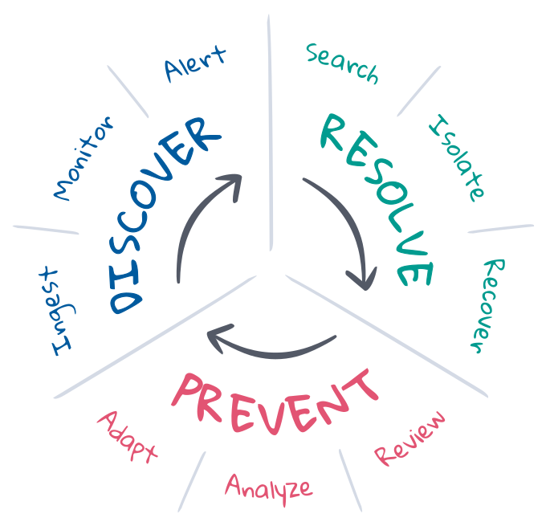

图 1： SRE 语境中的事件响应生命周期。

**预防**是事件响应生命周期中的第一步和最后一步。理想情况下，会通过 CI/CD 管道中的测试驱动型开发来预防事件的发生。但在生产环境中，并非所有事情都会按照计划进行。SRE 通过规划、自动化和反馈来对预防措施加以优化。在事件发生之前，他们会规定理想状态的条件，并施行所需的工具以发现并解决非理想状态。事件发生之后，他们会开展事后检讨，审查所发生的的事件并讨论要如何调整。长期来看，他们可以分析 KPI 并使用从中获得的洞见来向产品/开发/运维团队提交改进请求。

**发现**指的是当事件发生时能够知道，并且向正确的渠道提供告警以便对方予以响应。发现步骤应该自动完成，以最大程度延长事件响应的覆盖时间，将平均发现时间 (MTTD) 降至最低，并确保达到 SLO。自动化要求能够持续观测整个部署的状态，持续监测理想状态，并在出现非理想状态时能够立即提供告警。尽管 [Machine Learning](https://www.elastic.co/cn/what-is/elasticsearch-machine-learning) 可帮助发现意外状态变更（这些变更能表明已发生事件或可解释事件原因），但事件发现步骤的覆盖范围和相关度很大程度上取决于理想状态的定义。

**解决**指将部署恢复为理想状态。某些事件有自动型解决方案，例如当容量接近饱和时自动扩展服务规模。但是很多事件都需要人工参与，尤其当无法识别出症结所在或者原因不明时。要想解决问题，必须由合适的专家调查根本原因，隔离并再现问题，从而制定解决方案并将部署恢复到理想状态。这是一个迭代式流程，可能涉及很多专家，需要完成多轮调查和多次失败尝试。如要取得成功，搜索和沟通发挥着至关重要的作用。信息能够缩短周期、将平均解决时间 (MTTR) 降至最低，并确保达到 SLO。

## Elastic 在SRE 和事件响应中的应用

**[Elastic 可观测性解决方案](https://www.elastic.co/cn/observability)**通过可观测性、监测、告警和搜索推动事件响应生命周期向前发展。本篇博文对其在下列方面的功能进行了介绍：对整个堆栈部署的状态实现持续可观测性；持续监测 SLI 以了解低于 SLO 的情况；针对低于 SLO 的情况自动向事件响应团队发送告警；打造直观的搜索体验以让响应人员快速解决问题。这一集成解决方案能够将平均解决时间 (MTTR) 降至最低，从而确保服务可靠性和客户忠诚度。

### 可观测性和数据

如果无法观测问题，那肯定无法解决问题。要想对事件作出响应，必须对一段时间内受影响部署所在的完整堆栈拥有可见性。但是分布式服务极其复杂多变，即使如下图所示的单个逻辑型事件，也是如此。堆栈中的每个组件都有可能会遇到服务降级或故障，从而影响到下游的方方面面。事件响应人员在解决问题时必须考虑（即使不能控制和再现）每个组件的状态。复杂性是影响工作效率的元凶。除非能够在单一地方观测一段时间内所有组件的状态，否则根本不可能在严格的 SLA 限度内解决事件。

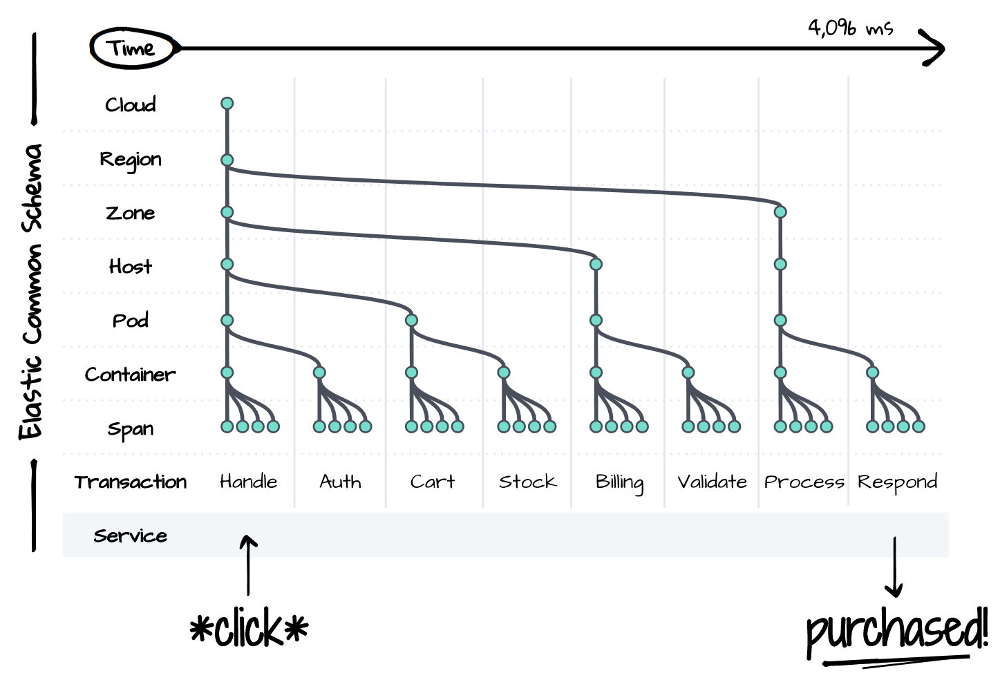

图 2：云端微服务架构示例 — 通过点击购买按钮启动的在线零售结账流程。每个绿点都是一个架构组件，也是潜在的服务降级或故障的源头，会影响到下游的所有组件。

[Elastic Common Schema (ECS)](https://www.elastic.co/guide/en/ecs/current/ecs-reference.html) 是我们针对复杂问题交出的答案。ECS 是一套适用于可观测性的开源类数据模型规范。它会对命名规则、数据类型以及与现代分布式服务和基础设施之间的关系进行标准化。这一架构会使用传统上存在于孤岛中的数据来呈现整个部署堆栈一段时间内的统一视图。堆栈内每个层级的跟踪信息、指标和日志在这个架构内和谐共存，从而为用户在事件响应期间打造流畅的搜索体验。

通过 ECS 标准化，您只需花费极少精力便能持续获得可观测性。Elastic 的 [APM](https://www.elastic.co/cn/apm) 和 [Beats](https://www.elastic.co/cn/beats) 代理会从您的部署中自动采集跟踪信息、指标和日志，对这些数据进行转换使其符合通用架构的规范，并将数据发送到集中的搜索平台以供未来调查时使用。由于能够与热门的数据源（例如云平台、容器、系统和应用程序框架）进行整合，所以即使部署变得越来越复杂，用户也能轻松地添加和管理数据。

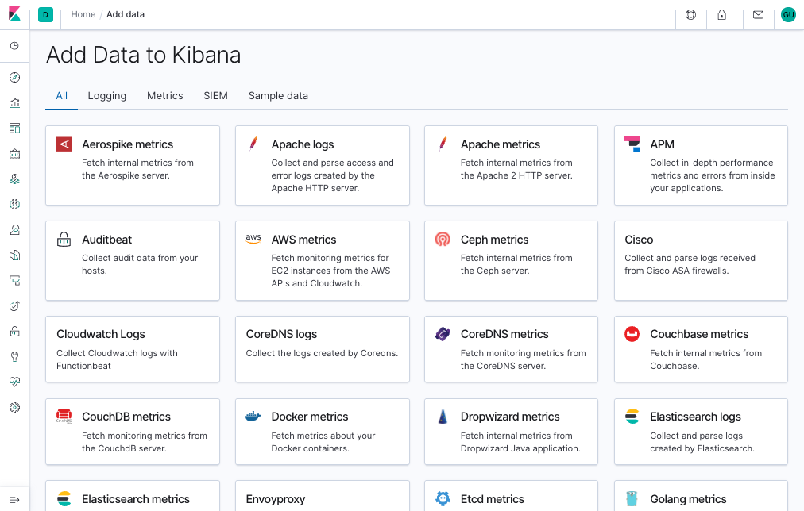

图 3：可将数据转换为符合 Elastic Common Schema 规范的官方集成的示例（[查看更多](https://demo.elastic.co/app/kibana#/home/tutorial_directory/all)）。

每家公司都有其独具特色的部署堆栈。所以您可以[扩展 ECS](https://www.elastic.co/guide/en/ecs/current/ecs-custom-fields-in-ecs.html) 以优化您的事件响应工作流。服务和基础设施的项目名称能够帮助响应人员定位到要找的内容，或者让他们知道要寻找什么内容。应用程序的 Commit ID（提交 ID）能够帮助开发人员找到故障的最初来源，因为这些 Commit ID 在构建时便存在于版本控制系统中。功能旗标会针对金丝雀部署的状态或 A/B 测试的结果提供洞见。无论是什么内容，只要有助于描述您的部署、执行您的工作流或满足您的业务要求，您便能将它们嵌入到这一架构中。

### 监测、告警和操作

**[Elastic 可观测性](https://www.elastic.co/cn/observability)**通过监测、发现和针对基本的 SLI 和 SLO 发送告警，能够自动完成事件响应生命周期。该解决方案涵盖监测的四个领域：[Uptime](https://www.elastic.co/cn/uptime-monitoring)、[APM](https://www.elastic.co/cn/apm)、[Metrics](https://www.elastic.co/cn/infrastructure-monitoring)和 [Logs](https://www.elastic.co/cn/log-monitoring)。Uptime 通过向服务终端发送外部心跳信息来监测*可用性*。APM 通过直接在应用程序内测量和采集事件来监测*延迟*和*质量*。Metrics 通过衡量基础设施的资源利用率来监测*饱和度*。Logs 通过从系统和服务采集消息来监测*正确性*。

一旦您知道了自己的 SLI 和 SLO，便可以将它们定义为[告警和操作](https://www.elastic.co/cn/what-is/elasticsearch-alerting)，从而无论何时降至 SLO 以下都能与正确的人员分享正确的数据。Elastic 告警指的是满足下列要求的定期查询：当结果满足特定条件时，该查询会触发操作。这些条件是指标 (SLI) 和阈值 (SLO) 的表达式。操作指的是投递到一个或多个渠道（例如呼叫系统或问题跟踪系统）的消息，标志着事件响应流程的开始。

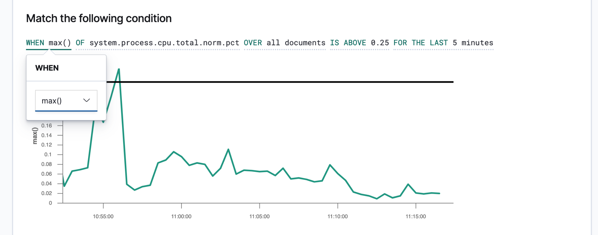

图 4：Elastic 中告警管理界面的示例。

简洁且可操作性强的告警能够指导响应人员快速解决问题。响应人员需要拥有足够信息才能再现环境状态和所观测到的问题。您应当创建一个[消息模板](https://www.elastic.co/guide/en/kibana/current/watcher-ui.html#_add_an_action)，并借助此模板向相应人员提供详细信息。下面是需要考虑的一些细节，包括：

- **标题** -*“发生了什么事件”*
- **严重程度** -*“这一事件的优先级如何？”*
- **阐释** -*“这一事件会造成什么业务影响？”*
- **观测到的状态** -*“发生什么了？”*
- **理想状态** -*“应该发生什么？”*
- **上下文** -*“环境的状态如何？”*使用告警中的数据来描述[时间](https://www.elastic.co/guide/en/ecs/current/ecs-base.html)、[云](https://www.elastic.co/guide/en/ecs/current/ecs-cloud.html)、[网络](https://www.elastic.co/guide/en/ecs/current/ecs-network.html)、[操作系统](https://www.elastic.co/guide/en/ecs/current/ecs-os.html)、[容器](https://www.elastic.co/guide/en/ecs/current/ecs-container.html)、[进程](https://www.elastic.co/guide/en/ecs/current/ecs-process.html)以及有关事件的其他上下文。
- **链接** -*“接下来我要查看什么？”*使用告警中的数据来创建链接，从而将相应人员带到仪表板、错误报告或其他有用的目标位置。

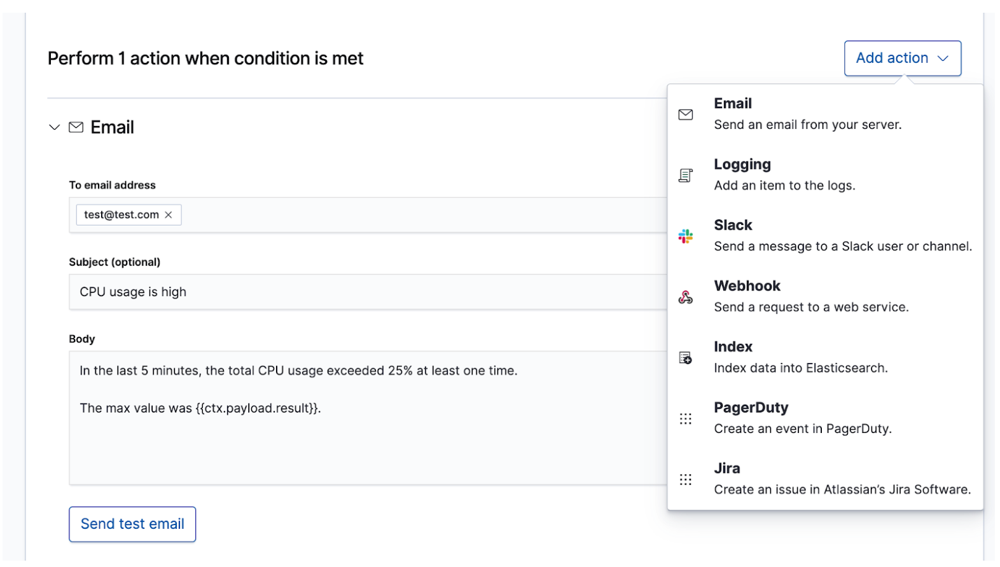

图 5：Elastic 中告警消息模板的示例。

如果发生较高严重级别的事件且需要*立即*有人员参与进来，则会通过实时渠道（例如 [PagerDuty](https://www.elastic.co/guide/en/elasticsearch/reference/current/actions-pagerduty.html) 或 [Slack](https://www.elastic.co/guide/en/elasticsearch/reference/current/actions-slack.html)）向值班的事件响应团队发送告警。举个例子，某项服务的中断时间要求为至少达到 99% 的可用性。这一 SLA 每天所允许的中断时间还不足 15 分钟，这已经比事件响应团队解决问题所需的时间要短。对于低严重程度的事件，如果只是*最后*才需要员工参与进来，则此事件会在问题跟踪系统（例如 [JIRA](https://www.elastic.co/guide/en/elasticsearch/reference/current/actions-jira.html)）中创建一个工单。举个例子，延迟和服务错误率出现增长，但这不会直接影响收入。您可以选择同时向多个目标位置提供告警，每个都有各自的消息内容，目的就是为了记录数据或实现过度沟通。

### 调查和搜索

向值班团队发送告警后，会怎样呢？解决问题的路径因事件而异，但有一些事情是肯定的。会有很多具有不同技能和经验的人员顶着压力来既快又准地解决尚不明确的问题，同时还要处理多到无以复加的数据。他们需要找到所报告的症状，再现问题，调查根本原因，应用解决方案，并最后看一下问题是否已解决。有时可能需要进行数次尝试。他们可能发现自己进了一个兔子洞。所有这一切都需要您~~~~*高度专注才能给出答案*。正是信息推动着事件响应工作的进展，让用户从最初的充满不确定性到成功解决问题。

事件响应是一个搜索问题。搜索能够针对问题快速地提供相关结果。良好的搜索体验不仅局限于“搜索栏”——整个用户界面都在等待您提问，并引导您找到正确答案。回想一下您最近一次网购的体验。在您浏览目录时，应用程序会预测您点击和搜索操作的意图，为您提供最优的建议和筛选，从而推动您更快地花出更多钱。您从来不需要编写结构化的查询。即使不知道自己想查找什么，您也很快就能找到。这一原则同样适用于事件响应。搜索体验的设计能够在极大程度上影响事件的解决时间。

搜索对实现快速的事件响应至关重要，这不仅是因为技术的速度*飞快*，还因为这一体验*十分直观*。您完全无需学习查询语言的语法，用不着参照架构，也不用像机器那么完美。只需搜索，然后您秒秒钟就能找到所需内容。您要查找的是其他内容吗？搜索能够为您提供指导。希望按照特定字段进行搜索？开始输入，然后搜索栏会提供建议字段。对图表上的骤升部分感到好奇？单击骤升段，然后仪表板的其他部分便会显示骤升期间发生了什么事情。搜索不但速度快，而且容错性十分优异，如能正确进行搜索，这可赋予事件响应人员巨大能力，尽管人都有不完美之处，他们也能快速且正确地采取操作。

图 6：Elastic 提供引导式搜索体验，从而帮助用户在复杂数据中直观地进行导航。与可视化数据的其他互动也能帮助打造更出色的整体搜索体验。

**[Elastic 可观测性](https://www.elastic.co/cn/observability)**为事件响应团队打造良好搜索体验，其能预测事件响应人员的问题、期望和目标。这一设计方案为每个传统的数据孤岛（[Uptime](https://www.elastic.co/cn/uptime-monitoring)、[APM](https://www.elastic.co/cn/apm)、[Metrics](https://www.elastic.co/cn/infrastructure-monitoring) 和 [Logs](https://www.elastic.co/cn/log-monitoring)）提供了熟悉的体验，然后会引导事件响应人员完成所有这些体验，以便他们查看部署的完整堆栈。之所以能够做到这一点，正是因为数据存在于统一的架构中，而不再是孤岛。这一设计不仅能够有效回答有关可用性、延迟、错误和饱和度的最初问题，还能通过最合适的体验帮助导航到根本原因。

我们通过一些示例来了解一下是什么体验。

**[Elastic Uptime](https://www.elastic.co/cn/uptime-monitoring)** 能够解答有关服务可用性的基本问题，例如*“哪项服务发生中断了？服务是什么时候中断的？运行状态监测代理发生故障了吗？”*有关可用性 SLO 的告警可能会将事件响应人员带到这个页面。找到不可用服务的症状后，响应人员在发生故障的当时便能按照链接探索受影响服务及其部署基础设施的跟踪信息、指标或日志。在事件响应人员导航的过程中，调查的上下文在受影响服务上仍处于筛选状态。这能够帮助事件响应人员深入分析服务故障的根本原因。

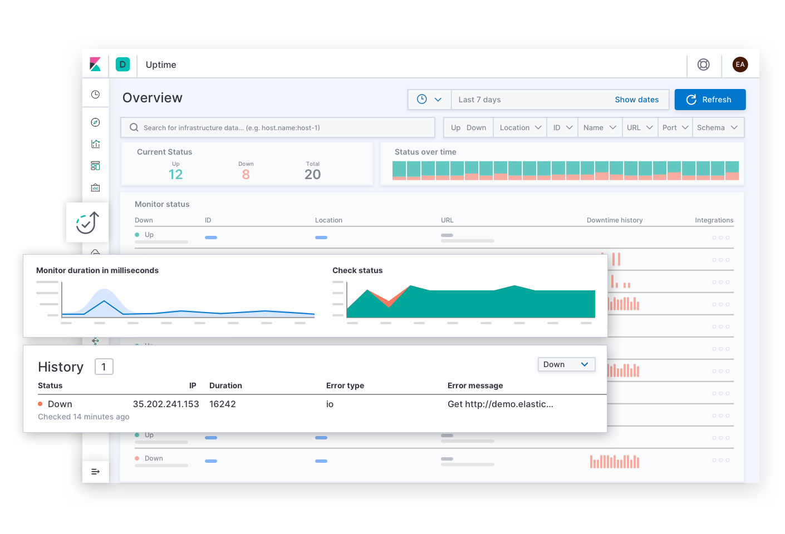

图 7：Elastic Uptime 搜索体验速览。

**[Elastic APM](https://www.elastic.co/cn/apm)** 能够解答有关服务延迟和错误的问题，例如*“哪个终端对用户体验造成的负面影响最大？哪个跨度正在导致事务速度变慢？如何跟踪分布式服务的事务？源码中的哪里存在错误？我如何在与生产环境相匹配的开发环境中再现问题？”*有关延迟和错误 SLO 的告警可能会将事件响应人员带到这个页面。APM 体验能够为应用程序开发人员提供所需信息，以便他们查找、再现并解决故障。通过导航至堆栈底层并查看受影响服务的部署基础设施的指标，事件响应人员便能探索任何延迟问题的原因。

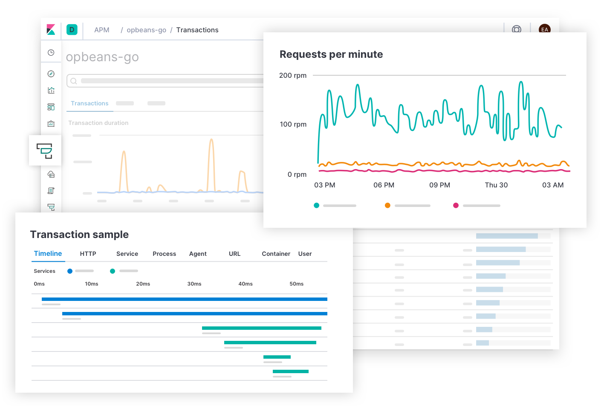

图 8：Elastic APM 搜索体验速览。

**[Elastic Metrics](https://www.elastic.co/cn/infrastructure-monitoring)** 能够回答有关资源饱和度的问题，例如*“哪个主机、Pod 或容器的内存使用率高或者低？存储呢？计算呢？网络流量呢？如果按照云服务提供商、地理区域、可用区或者某些其他值来分组，会怎样呢？”*有关饱和度 SLO 的告警可能会将事件响应人员带到这个页面。找到拥堵、热点或性能降级的症状后，事件响应人员可以扩展受影响基础设施的历史指标和日志，也可以下钻以探索在这些基础设施上所运行服务的行为。

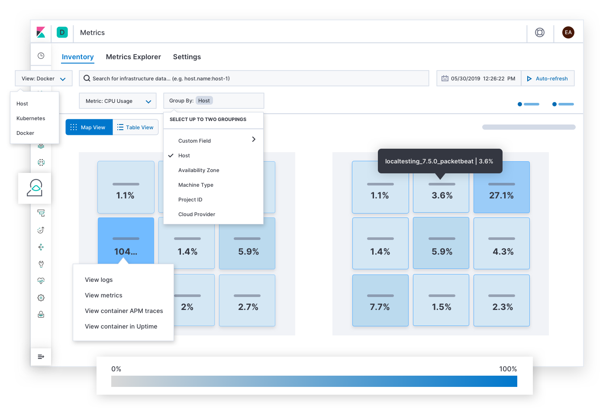

图 9：Elastic Metrics 搜索体验速览。

**[Elastic Logs](https://www.elastic.co/cn/log-monitoring)** 能够回答有关系统或应用程序所发出事件的信息源的问题。有关质量或正确性 SLO 的告警可能会将事件响应人员带到这个页面。日志可能能够解释故障的根本原因，并成为调查的最后目标位置。或者它们可能可以解释其他症状的原因，并且该原因能最终引领事件响应人员找到根本原因。在后台，该技术会[对日志进行分类](https://www.elastic.co/guide/en/machine-learning/current/ml-configuring-categories.html)，并[发现文本中的趋势](https://www.elastic.co/cn/elasticon/tour/2018/chicago/elastic-at-etrade)，从而向事件响应人员提供能够解释部署状态变更的信号。

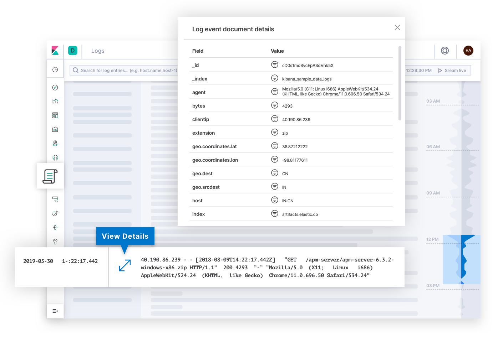

图 10：Elastic Logs 搜索体验速览。

通过采纳数以千计的客户和社区成员的意见反馈，Elastic 的工程师针对可观测性成功设计出了广泛适用的搜索体验。说到最后，SRE 才是自己部署的专家，所以您可能会构想完全不同的体验以最好地满足自身运维工作的独特需求。因此，您可以使用 Elastic 中的任何数据构建您自己的[定制仪表板](https://www.elastic.co/guide/en/kibana/current/tutorial-build-dashboard.html)和[可视化](https://www.elastic.co/guide/en/kibana/current/tutorial-visualizing.html)，并分享给有需要的任何人。使用起来十分简单，[拖放即可](https://www.elastic.co/cn/what-is/kibana-lens)。

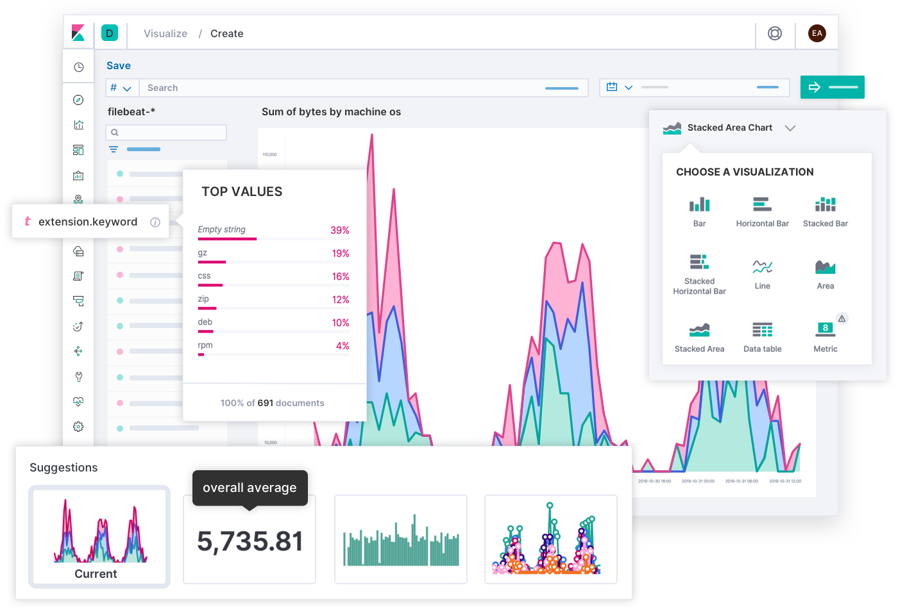

图 11：使用 Elastic Lens 所构建定制可视化的速览。

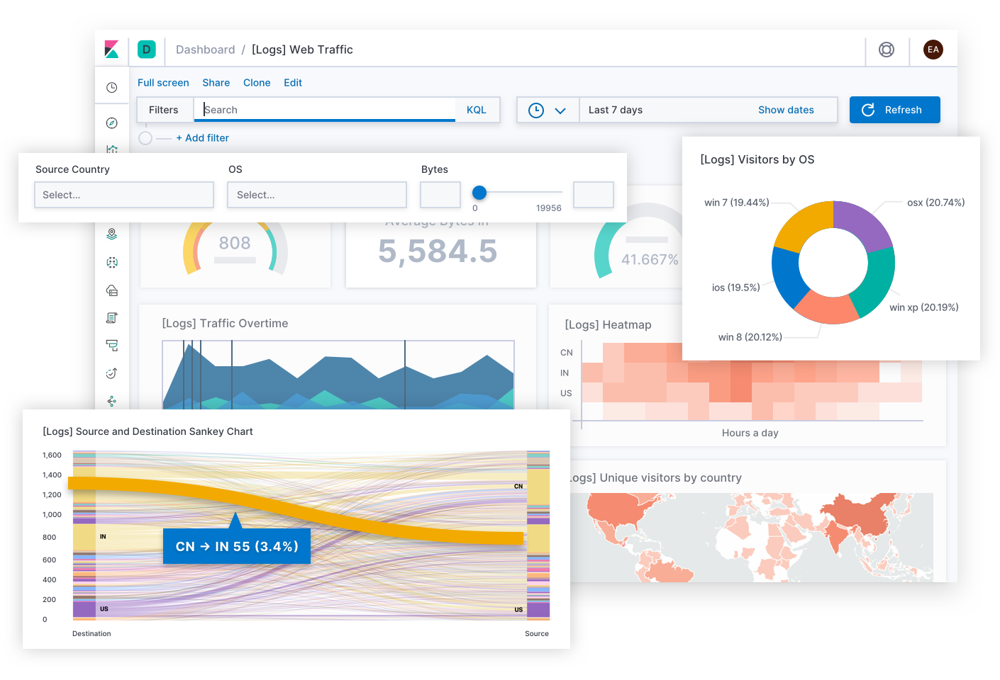

图 12：Elastic 中所构建定制仪表板的速览。

在每天的辛苦工作之外，[Canvas](https://www.elastic.co/cn/what-is/kibana-canvas) 能够让您通过富有创意的方式来表达 KPI 并分享给团队或高级领导层。您可将它们看做讲述业务故事的信息图表，而非用来解决技术问题的仪表板。还有什么方法能够比以笑脸和哭脸形式表示的 SLO 更好地展示今天的用户体验呢？还有什么方式能够比下面这个条幅更好地解释今天所剩余的错误预算呢：“你还有 12 分钟可在生产环境中测试代码！（千万不要这样做哦！）”如果您知道受众，Canvas 能够让您将复杂情况转换为一个有意义的故事，以方便他们理解。

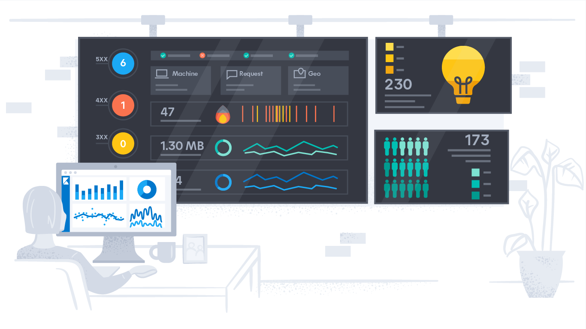

图 13：Canvas 体验速览。

## 示例

我们看几个 Elastic 可观测性的实际应用示例。每种情形都是以不同 SLI 的告警开始，并且每种情形的解决路径各不相同，也涉及到不同团队的人员。Elastic 帮助事件响应团队在各种不同环境下推进并快速解决问题。

### 可用性：服务为什么中断？

Elastic 检测到某项要求达到 99% 可用性的服务出现无响应情况，然后呼叫了值班团队。运维团队的 Ramesh 负责此事。他点击链接查看[运行状态](https://www.elastic.co/cn/uptime-monitoring)历史。他[确认](https://www.elastic.co/guide/en/kibana/current/uptime-overview.html#_monitor_list)监测代理运行正常，所以此告警不太可能是错误告警。他从受影响服务开始[导航](https://www.elastic.co/guide/en/kibana/current/uptime-overview.html#_observability_integrations)以查看其主机的[指标](https://www.elastic.co/cn/infrastructure-monitoring)，然后将指标按照主机和容器[进行分组](https://www.elastic.co/guide/en/kibana/current/infra-ui.html#infra-group)。主机上并无任何容器报告指标。*“问题肯定出在堆栈的上层。”*他按照可用区和主机再次对数据进行分组。受影响区内的其他主机均正常。但是当他运行受影响服务的副本并按主机进行[筛选](https://www.elastic.co/guide/en/kibana/current/infra-ui.html#infra-search)时，该主机并未报告任何内容。*“为什么主机仅在这项服务上发生故障呢？”*他在 Slack 里的 #ops 频道上分享了一个该仪表板的链接。一位工程师说她最近更新了负责配置运行该服务的主机的 playbook。她撤回了变更，然后指标开始实时显示在视图中。危急状况到此为止。他们在 12 分钟内解决了该问题——仍然在 99% 的 SLA 范围内。稍后，该名工程师会查看主机[日志](https://www.elastic.co/cn/log-monitoring)进行故障排查，从而了解为什么她的变更会让主机发生故障，然后进行正确的更改。

### 延迟：服务为什么变慢？

当在多项服务中检测到[异常延迟](https://www.elastic.co/guide/en/kibana/current/machine-learning-integration.html)后，Elastic 在问题跟踪系统中创建了一个工单。应用程序开发人员举行了一场会议来审查[样本跟踪信息](https://www.elastic.co/guide/en/kibana/current/traces.html)，以便发现对延迟造成最大影响的跨度。在与某项数据验证服务进行对接的服务上，他们发现了延迟模式。负责领导该项服务叫做 Sandeep 的开发者开始深入挖掘其跨度。这些跨度向数据库报告运行时间很长的查询，这一点通过 slowlog 中的[异常日志速率](https://www.elastic.co/guide/en/kibana/current/xpack-logs-analysis.html)得到了证实。他检查了[查询](https://www.elastic.co/guide/en/kibana/current/spans.html)，并且在本地环境中再现了这一问题。这些声明会将未索引的列合并在一起，这一点直到最近因插入大量数据导致速度缓慢才被发现。他对表格进行了优化，这虽优化了服务延迟，但仍未达到所需的 SLO。他转移了调查方向，开始使用[上下文筛选](https://www.elastic.co/guide/en/kibana/current/filters.html)将样本跟踪数据与服务的之前版本进行对比。还有一些新的跨度在处理查询结果。他在本地环境中查看堆栈跟踪信息，看到其中有一种方法会针对每个查询结果评估一个正则表达式集合。他调整了代码，以在回路之前对模式进行预编译。提交变更后，该项服务的延迟回到了 SLO 范围内。Sandeep 将这一问题标记为已解决。

### 错误：为什么服务会报错？

Esther 是一名软件开发人员，负责领导一家在线零售商的账户注册服务。她收到了一封来自团队所用问题跟踪系统的通知。问题内容为：Elastic 检测到新加坡地区生产环境中的注册服务错误率超高，这可能会危及新业务。她点击问题描述中的链接，该链接将她带到一个针对下列情况的[错误群组](https://www.elastic.co/guide/en/kibana/current/errors.html)：表格提交终端中有未处理的“Unicode Decode Error”（Unicode 解码错误）。她打开样本，查找罪魁祸首的详细信息，包括文件名称、出现错误的代码行、堆栈跟踪信息、环境的相关上下文，乃至构建应用程序时源码的提交哈希值。她看到为了符合隐私法规，注册表输入中的某些数据经过了[修订](https://www.elastic.co/guide/en/apm/agent/java/current/config-core.html#config-sanitize-field-names)。她注意到输入中包括越南语的 Unicode 字符。她使用所有这些信息在自己的本地机上再现了这一问题。在修复了 Unicode 处理器的问题后，她提交了变更。CI/CD 管道运行了她的测试并成功通过，然后在生产环境中部署了更新的应用程序。Esther 将这一问题标记为已解决，并继续完成她的正常工作。

### 饱和度：哪个地方导致了容量快速增长？

当检测到内存使用率[异常](https://www.elastic.co/guide/en/kibana/current/xpack-ml-anomalies.html)后，Elastic 在问题跟踪系统中创建了一个工单，并将云区域列为[影响因素](https://www.elastic.co/guide/en/machine-learning/current/ml-influencers.html)。一名运维人员点击链接查看一段时间内各地区的内存使用情况。柏林地区显示出现骤增，图中显示了一个红点，自从这个红点之后，使用率一直在缓慢上升。她[预计](https://www.elastic.co/guide/en/machine-learning/current/ml-gs-forecasts.html)如果这种情况持续下去，内存很快会用完。她查看了全球范围所有 Pod 近期的内存[指标](https://www.elastic.co/cn/infrastructure-monitoring)。柏林地区的 Pod 明显不同，因为与其他区域相比，这里 Pod 的饱和度要高。她按照服务名称对 Pod 进行[组合](https://www.elastic.co/guide/en/kibana/current/infra-ui.html#infra-group)并[筛选](https://www.elastic.co/guide/en/kibana/current/infra-ui.html#infra-search)出了柏林，从而缩小了搜索范围。这时一项服务引起了她的注意：产品推荐服务。她扩展搜索范围查看全球范围内这一服务的副本。结果显示柏林的内存使用率最高，而且这里副本 Pod 的数量也最多。她深入研究了柏林地区这一服务的[事务](https://www.elastic.co/guide/en/kibana/current/transactions.html)。她与负责领导此项服务的应用程序开发人员分享了该仪表板的链接。这名开发人员阅读了这些事务的上下文。他看到对于 A/B 测试，只有柏林地区推出了某个功能旗标的[定制标签](https://www.elastic.co/guide/en/apm/get-started/current/metadata.html)。他优化了服务，以便对某个会随着时间而增长的数据集执行惰性载入（而非预先载入）。CI/CD 管道部署了他更新后的服务，内存使用率恢复至正常水平，运维人员将问题标记为已完成。尽管并没有迹象表明这一问题影响到了业务，但是预测显示如果未能及时检测到这一骤增，业务会受到影响。

## 成功案例

有大量[成功案例](https://www.elastic.co/cn/customers/?usecase=observability)能够证明 Elastic 可观测性解决方案的价值。Verizon Communications 便是一个很好的例子，这是美国的一家通信巨头，道琼斯工业平均指数 (DJIA) 中便包括这家公司。在其[提交给 SEC（美国证券交易委员会）的 2019 年年报](https://www.sec.gov/Archives/edgar/data/732712/000073271219000012/a2018q410-k.htm#sCD9F40FDD6D05529BBF38F39F2A5AFA7)中，Verizon 认为会给业务带来最高竞争风险的因素中便包括“网络质量、容量和覆盖范围”以及“客服质量”。该公司当年的总收入为 1309 亿美元，其中 [69.3%](https://www.verizon.com/about/sites/default/files/2018-Verizon-Annual-Report.pdf) 来自无线业务（注册经营别称为 Verizon Wireless）。Verizon Wireless 的某个基础设施运维团队曾[表示](https://www.elastic.co/cn/customers/verizon-wireless)：用 Elastic 替换他们旧有的监测解决方案之后，他们“将 MTTR 从 20–30 分钟降至 2–3 分钟”，这“能直接对应至为客户提供卓越服务。” 对这家公司以及必须提供可靠服务的其他公司而言，服务可靠性、事件响应以及 Elastic Stack 是他们取得竞争优势的基础。