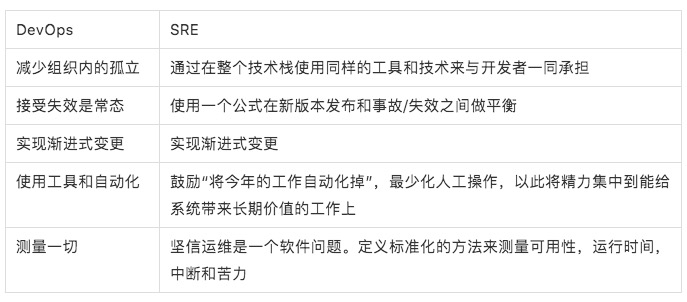

# SRE vs DevOps：是敌是友？

【编者的话】网站可靠性工程（SRE）和DevOps是两个具有相当多重叠的热门学科。在过去，一些人认为SRE是与DevOps相竞争的一组实践。但我们不认为他们有那么大差别。

SRE是什么？它与DevOps有什么关系？ 今年早些时候，我们（[Liz Fong-Jones](https://twitter.com/lizthegrey) 和 [Seth Vargo](https://twitter.com/sethvargo)）发布了一组视频试图来回答这些问题并减少社区间的摩擦。在这篇博文里面我们将对这个系列中的每个视频做个主题和课程总结，以提供要实现更好更可靠系统的可行步骤。

### 1. DevOps与SRE的区别

我们以理解SRE与DevOps之间的异同点来作为开始，为接下来来的讨论奠定基础。

**[视频](https://v.qq.com/x/page/h0642jh5wiu.html)**

[DevOps运动](https://itrevolution.com/devops-culture-part-1/)的缘起是因为很早之前开发者编写代码但对代码如何在生产环境运行知之甚少。他们会把写好的代码隔“墙”扔给运维团队，由后者来负责程序的部署和持续运行。这很容易导致两个团队的关系紧张，而且每个团队的优先级与实际的业务需要并不一致。这样DevOps作为一种文化和一组实践出现了，致力于弥合软件开发与软件运维之间的鸿沟。但是，DevOps并没有明确定义[应该如何做才能在这些方面获得成功](https://www.sethvargo.com/the-ten-myths-of-devops/)。DevOps就好比是程序开发中的抽象类或者接口, 它定义了整个系统的总体的行为，但是具体的实现细节就留给作者。

21世纪初SRE在Google内部独立于DevOps运动发展起来，最初只是为了满足内部的需要。它碰巧将DevOps的哲学具体化了，但它本身包括一种更标准规范的方式通过工程和运维来测量和获得稳定性。换句话说，SRE针对如何在不同的DevOps领域获得成功给出了药方。例如，下面这张表描述了DevOps五大支柱和相对应的SRE实践：

*苦力： toil，关于何为toil下文还有论述。

你可以将DevOps想象为一种编程语言里面的一个接口，而**SRE类实现了这个接口**。虽然SRE程序最初并没有显式表达要满足DevOps接口，但是两种理论最后都得到了相似的一组结论。但是就像编程语言，类里面常常会包含比它们的接口定义中的多得多的行为，它们甚至可能实现多个接口。SRE包括了DevOps之外的其他的实践和推荐。

DevOps与SRE对于软件开发和运维来说并不是竞争的关系，而是亲密的战友，致力于交付更快更好的软件而将组织的藩篱推垮。如果你想找书来看，那么可以看看Betsy Beyer、Niall Richard Murphy、Liz Fong-Jones等人合著的[How SRE relates to DevOps](https://www.safaribooksonline.com/library/view/how-sre-relates/9781492030645/)，里面有十分详尽的解释。

### 2. SLI，SLO和SLA

SRE这门学科通过工程师，PO（product owner）和客户的输入协作定义出一个系统的可用性目标和测量可用性。

**[视频](https://v.qq.com/x/page/i0678mwggjp.html)**

如果没有一个一致认可的方式来描述系统的在线时间和可用性，那么对于软件开发而言要想获得有成效的沟通会十分困难。运维团队不停的救火，有些最后发现是开发人员的代码bug造成的。但是没有一个对在线时间的清楚衡量标准，没有一个对于可用性的清楚优先级列表，那么产品团队不会同意可靠性是一个问题。在这个世纪初这个挑战就开始影响Google，它也是发展SRE学科的动因之一。

SRE保证：每个人都认可如何测量可用性，并且认可当可用性降低到期盼以下应该采取的措施。这个流程涵盖了每个级别的每个参与者，上到VP，高管，好处是它创造了在整个组织内要对可用性共同承担的一个责任。SRE与干系人决定服务级别指标（SLI）和服务级别目标（SLO）。

- SLI是随时间变化的度量值，比如请求的延迟，每秒请求的吞吐量，或者每种请求的失败次数。这些值通常会随时间累积，然后被转换为一个比率，平均值或者相对某个阈值的百分比。
- SLO是相关方一致同意的贯穿一个时间窗口（比如过去30天或者这个季度）内SLI累积成功数的目标

这个视频也谈到了SLA服务级别协议。虽然在SRE的日常工作中不会特别关注SRE，SLA是服务提供者对服务消费者关于服务可用性和无法达到所要求的服务级别的后果的承诺。SLA由代表客户的管理人员协商定义，提供的可用性会比SLO高。毕竟我们希望在掉出客户的SLA之前先掉出我们自己内部的SLO。

SLI，SLO和SLA紧密地与DevOps中“测量一切“的理念相结合。我们之所以说SRE实现了DevOps，这也是原因之一。

### 3. 风险和错误预算

这里我们关注通过错误预算来衡量风险，这是SRE和PO（product owner）一起协同工作时采取的量化方法，用来在保证可用性和新特性开发之前做取舍平衡。这个视频也讨论了为什么100%不是一个可行的可用性目标。

**[视频](https://v.qq.com/x/page/c0678331m16.html)**

最大化一个系统的稳定性是违反生产规律且毫无意义的。不切实际的可用性目标会限制新特性交付给用户的速度。而且用户本身也不会注意到超高可用性（比如99.999999%)，因为他们的实际感受到的质量与ISP，蜂窝网络，WiFi等等这些极不可靠的服务都有很大关系。定一个100%可用性的需求会严重的限制一个团队或者开发人员交付更新和优化的能力。Service Owner如果要交付许多的新功能，那么他们只能选择没那么苛刻的SLO，这样即使在有bug发生时他们也能继续交付。关注于可用性的service owner可以选择一个更高的SLO，但是那样的SLO会导致功能发布延后。SRE学科将这种可接受的风险量化为“错误预算”。当错误预算耗尽时，关注点就要从功能开发转向提高稳定性。

在第二个视频中我们提到，领导层的支持是SRE落地的关键因素之一。没有这个，那么没什么能限制团队破坏已经达成一致的SLO，强迫SRE加班或者卖苦力浪费超多时间去保持系统正常运行。如果SRE团队没有能力去实施错误预算（或者说，错误预算没有被人认真严肃的对待），那么这套系统最终也会失效。

风险和错误预算量化的接受“错误是正常的”，让devops团队去实现渐进式的更新。非渐进式更新的风险比错误预算要大的多。

### 4. 苦力和苦力预算

SRE学科里一个重要的部分是苦力，苦力预算和减少苦力的方法。当每次一个运维人员在正常的运维过程中需要手工接触一个系统的时候，苦力就产生了——但是“正常”的定义不是固定不变的。

**[视频](https://v.qq.com/x/page/s0678gpc8i1.html)**

苦力不是简单的“我不喜欢干的事情”。举例来说，下面的工作是开销，但是明显不能归于苦力：提交消费清单，参加会议，回邮件，通勤等。这里苦力是与运行一个生产上的服务紧密连接的。这种工作有如下特点：手工的，重复性的，可以自动化的，偏战术型，缺乏长期价值。而且苦力会随着服务的规模增长而线性增加。每当运维人员需要接触一个系统，比如响应一个页面，处理一个工单或者剥离一个进程的时候，苦力就会发生。

SRE的目标是通过关注SRE中的“工程化（engineering）”组件来减少苦力。当SRE发现任务能够被自动化时，他们会开发一个解决方案，以避免未来再花苦力。虽然最小化苦力很重要，但是要完全消灭苦力是不现实的。Google致力于保证每个SRE至少50%的时间是花在项目工程上，这些SRE每个人会在季度性的苦力调查中报告他们的苦力以此来识别运维工作过载的团队。换句话说，苦力并不总是坏的。可预测的重复行工作是招收新员工的非常好的途径，而且常常会在低风险低压力的情况下提供一种直接的成就感和满足感。但是如果是长期的苦力，很快就会盖过这些优势，从而导致职业倦怠。

苦力和苦力预算与DevOps中的“测量一切”和“减少组织内壁垒”紧密相关。

### 5. 客户可靠性工程（CRE）

最后，客户可靠性工程这一项就将完整SRE给补齐了（还有视频中一位未来的朋友的帮忙）。CRE的目标是向客户传授SRE实践并最终服务于客户。

**[视频](https://v.qq.com/x/page/x0678g01vde.html)**

在过去一段时间，Google并没有在公开场合谈论SRE。我们认为它是我们的一个竞争优势所以我们选择对外部世界保密。但是每当一个客户报了一个问题，而问题的原因是因为他们使用我们系统的方式不正确的时候，我们必须停下手头的创新性工作而帮他们去解决问题。这虽然是很小的摩擦，但是当影响的范围是数以十亿计的用户的时候，就会快速叠加。所以有一项工作变得明确了：我们需要开始公开的谈论SRE，并且我们需要教导我们的用户这些SRE实践，以便他们能在自己的组织内复制。

这样，在2016年，我们启动了[CRE](https://cloudplatform.googleblog.com/2016/10/introducing-a-new-era-of-customer-support-Google-Customer-Reliability-Engineering.html)项目：一方面帮助我们GCP的用户提高他们的可靠性；另一方面将客户所面临的挑战直接暴露给Google SRE团队。CRE项目的目标是通过教导客户SRE原则和帮助他们采取SRE实践来减少他们的焦虑。

通过在组织内强制跨部门协作，CRE与DevOps的“减少组织内藩篱”相契合。同时以所有干系人共享的SLO的形式创建了一个共担的责任感，从而落实了“接受失败是一种常态”和“测量一切”的概念。

### SRE前瞻

我们正在制作多种形式的创新内容来给客户展现如何在Google Cloud上落地DevOps和SRE，我们非常迫不及待地想将这些内容与你分享。你还对哪些SRE的议题感兴趣呢？
欢迎给我们发送[tweet](https://twitter.com/GCPcloud)或者关注我们的[视频](https://www.youtube.com/watch?v=uTEL8Ff1Zvk&list=PLIivdWyY5sqJrKl7D2u-gmis8h9K66qoj&index=1)。

**原文链接：[SRE vs. DevOps: competing standards or close friends?](https://cloudplatform.googleblog.com/2018/05/SRE-vs-DevOps-competing-standards-or-close-friends.html)（翻译：姚洪）**

[ **0**](javascript:;)

 分享 *2018-06-05*