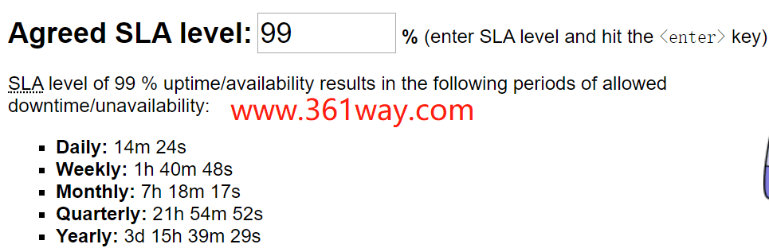
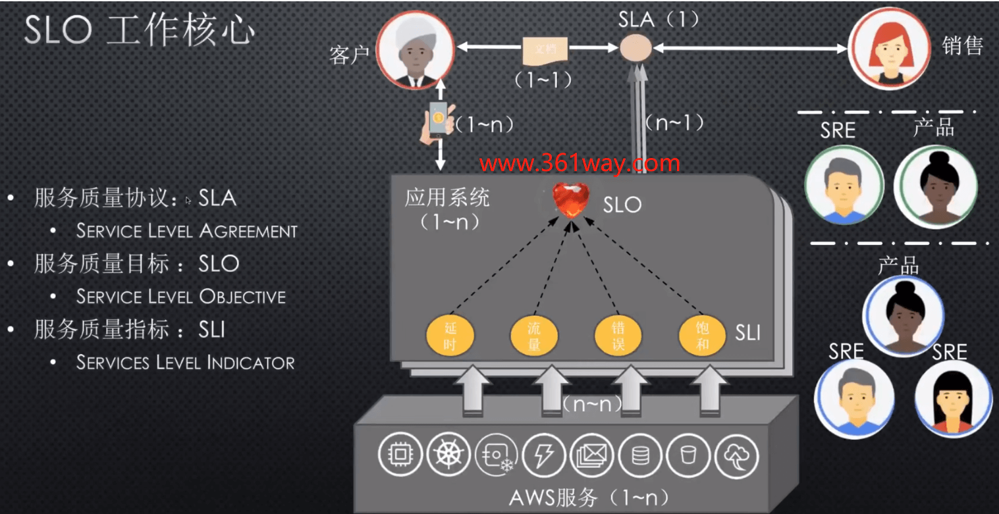

## SRE运维（五）从SLO开始

2020年10月5日[admin](http://www.361way.com/author/admin)[发表评论](http://www.361way.com/sre-slo/6471.html#respond)[阅读评论](http://www.361way.com/sre-slo/6471.html#comments)

### 一、SLO的重要性 

SLO是（service level objective）服务质量目标的简称，其是用于定量的描述服务可靠性的程度，它是SRE实践的核心。引用google工作手册上的一段话：SRE的核以职责并不只是将”所有工作“都自动化，并保持on-call状态。其实SRE们的日常任务和项目都是受SLO驱动的；捍卫短期的SLO，并确保中长期内对其进行持续维护。有些人甚至可能说：如果你连SLO都没有，那你根本就不需要SRE。所以从上在这段话了解到SLO对SRE的重要性了吧？在这里我为什么不以选择SRE团队的构建入手，而是以SLO作为开始，也是因为在SRE团队或者理念还没正常开始之前，就需要先启动一个SLO，再慢慢以些为目标演化出自己的SRE团队。既然提到了SLO，就不得不得SLA和SLI。

### 二、SLA、SLO、SLI 

这三个都是英文缩写，具体内容如下：


```
SLA （service level agreement）:服务等级协议SLI（service level indicator）:服务等级对象，指的是对象，例如：qps，响应时间，准确性等SLO（service level objective）:服务等级目标，指的是目标，例如：qps 99.99% ，响应时间10ms等
```

SLA指的是整个协议，协议的内容包含了SLI，SLO以及恢复的方式和时间等等一系列所构成的协议，是与服务对象就SLO所签署的协议。具体用公式表达为: SLA = SLO + 后果 ，当然协议中有时规定的可能不仅仅是一个SLO指标，这时也会出现SLO可能是部分不达到或全部不达到的情况，如：达到响应时间SLO+未达到可用性SLO。

一个SLO里可能包含多个SLI（需向多个的SLI，可能是多个SLI指标的求和，求百分比等），也可能和SLI一一对应。面向可度量的SLI，一般会以百分比的形式出现。

这里选取一个例子来理解下：比如，我们在阿里云上买了台ECS服务器，买的时候和阿里签了一个SLA协议，比如阿里的销售人员拍着胸脯保证，我提供的云服务器的可用性是99%。这里选取的SLI指标就是可用性，SLO就是可用性99%。对应的后果是什么呢？如果达不到这个要求，阿里说会退还费用（后果）。当然这里的可用性也不是空口白牙讲完就算了的，是要数字化计算的。比如，这台服务器给我们对外提供了一个公网IP，我们搞了一个监控，主是不停的ping这个IP的可用性。有一天光缆被挖断了，或者阿里的这台宿主机出问题了，导致了IP无法访问，这就要计到可用性里面的。这里有一个[uptime calc计算器](https://uptime.is/) ，通过上面的计算，我们可以计算得出，一年下来阿里提供的这台ECS可以异常的时间为：



这里我们得出的结果是一年阿里可以出现故障的时长为3天多(同时也可以看出分解到每天可以故障的时长为多少)。哈哈，是不是还是感觉太长了，这个只是个例子，实际上阿里云单实例ECS给出的服务可用性不低于99.975% ，根据这个值算出的结果是一年的故障时间不得超过2h 11m 29s 。具体这部分有兴趣的可以机看阿里云的服务协议部分：https://help.aliyun.com/document_detail/64695.html 。

### 三、SLO指标的内部拆解 

[](http://www.361way.com/wp-content/uploads/2020/10/slo-ex-in.png)

从上图我们不难发现，在销售和客户签订了SLA以后，我们有了一个面向客户的SLO，同时呢，这个在内部也会形成多个SLO指标。因为对客户感知的一个产品，可能又是由多个产品或部件构成的。这里还以上面的阿里云ECS主机为例。阿里云团队现在有了一个面向所有可用户可用性99%的SLO了。但是ECS这个产品在内部，会有云存储、云计算软件、物理宿主机构成的，这可能又是三个不同的部门或三个SRE团队维护的，这时候各自又有了针对自己产品的SLI和SLO，这里比如以云存储为例，其为ECS提供了硬盘IO服务，云存储其对外提供服务的整体SLI指标可能是IOPS、带宽、时延三个，对应的SLO可能是IOPS小于总IOPS的90%、带宽小于总带宽的90%、时延小于10ms，只有提供这样的服务，用户感知上才是好的。