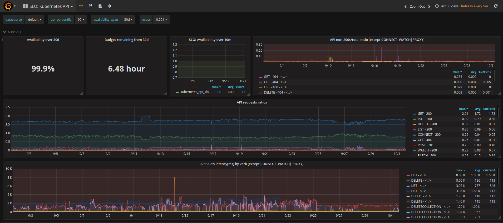

# 使用Prometheus和Grafana实现SLO


- JUANJO CIARLANTE

- 关贺宇


** 2019 年 2 月 14 日

**[运维](https://www.infoq.cn/topic/operation)[云计算](https://www.infoq.cn/topic/cloud-computing)[网络协议](https://www.infoq.cn/topic/network protocol)


> 在线服务的目标应该是提供与业务需求匹配的可用服务。此流程的关键部分应该涉及组织中的不同团队，例如，从业务开发团队到工程团队。


> 要验证一个服务如何符合这些目标，可以用这些目标可衡量的“成就”来定义“阈值”，例如，“服务必须在99.9%的时间内可用”，这应该与用户的期望和业务连续性相匹配。


## SLA, SLO, SLI


已经有很多关于这些话题的文章，如果你不熟悉这些术语，我强烈建议你先阅读谷歌关于 SLO(服务级别目标)的 SRE 书籍中的文章。


总而言之：


- SLA：服务水平协议
- 你承诺向用户提供的服务，如果你无法满足，可能会受到惩罚。
- 例如：“99.5%”的可用性。
- 关键词：合同
- SLO：服务水平目标
- 你在内部设置的目标，驱动你的测量阈值(例如，仪表板和警报)。通常，它应该比SLA更严格。
- 示例：“99.9%”可用性(所谓的“三个9”)。
- 关键字：阈值
- SLI：服务水平指标
- 你实际测量的是什么，以确定你的SLO是否在满足目标/偏离目标。
- 示例：错误率、延迟。
- 关键词：指标。


# SLO 关注时间


99%的可用性意味着什么？它不是 1%的错误率(失败的 http 响应的百分比)，而是在一个预定义的时间段内可用服务的时间百分比。


在上面的仪表板中，服务在 1 小时内的错误率超过 0.1% (y 轴为 0.001)(错误峰值顶部的红色小水平段)，从而在 7 天内提供 99.4%的可用性：


这一结果中的一个关键因素是你选择度量可用性的时间跨度(在上面的示例中为 7 天)。较短的周期通常用作工程团队(例如 SRE 和 SWE)的检查点，以跟踪服务的运行情况，而较长的周期通常用于组织/更广泛的团队的评审目的。


例如，如果你设置了 99.9%的 SLO，那么服务可以停机的总时间如下:


- 30天：43分钟(3/4小时)
- 90天：129分钟(~2小时)


另一个无关紧要的“数字事实”是，给 SLO 多加一个 9 都会产生明显的指数级影响。以下是 1 年的时间跨度的时间组成部分:


- 2个9: 99%: 5250min (87hrs或3.64天)
- 3个9: 99.9%: 525min (8.7hrs)
- 4个9: 99.99%: 52.5min
- 5个9：99.999%：5min< -经验法则：5个9 -> 5分钟 (每年)


## 输入错误预算


在服务可以停机的允许时间内，上面的数字可能被认为是错误预算，你可以从以下事件中消耗这些错误预算:


- 计划维护
- 升级失败
- 意想不到的故障


实际的结果是，上面的任何一种情况都将消耗服务的错误预算，例如，意外的停机可能会耗这些预算，从而在此期间阻止进一步的维护工作。


## SLI 与度量有关


从上面可以清楚地看出，必须有服务指标来告诉我们什么时候认为服务可用／不可用。有几种方法可以做到这一点：


- [RED](https://grafana.com/files/grafanacon_eu_2018/Tom_Wilkie_GrafanaCon_EU_2018.pdf)：速率、错误、持续时间。
- [USE](http://www.brendangregg.com/usemethod.html)：利用率、饱和度和错误。


# SLO 实现例子


让我们举一个具体的例子，遵循 RED 方法(因为我们现有的度量标准更适合这种方法)：通过 Prmoetheus 和 Grafana 等监控工具创建警报和 dashboard，以支持 Kubernetes API 的目标 SLO。


此外，我们将使用 jsonnet 来构建规则和仪表盘文件，充分利用现有的库助手。


- [Prometheus](https://prometheus.io/)
- [Grafana](https://grafana.com/)
- [jsonnet](https://jsonnet.org/)


本文不是解释如何在服务超出阈值时发出信号，而是重点介绍如何记录服务处于这种情况的时间。


本文的其余部分将着重于创建 Prometheus 规则，以根据特定度量标准(SLI)的阈值捕获“超出 SLO 的时间”。


## 定义 SLO 目标和指标阈值


让我们定义一个简单的目标：


- *SLO*：99%，来自以下数据：
- *SLI*：
- 错误率低于1%
- 请求的90%的延迟小于200ms


以 jsonnet 的形式编写上述规范(参见[spec-kubeapi.jsonnet])：


```
slo:: {  target: 0.99,  error_ratio_threshold: 0.01,  latency_percentile: 90,  latency_threshold: 200,},
```

复制代码


# 找到 SLIs


Kubernetes API 公开了几个我们可以作为 SLIs 使用的指标，使用 Prometheus  `rate()`函数在短时间内 (这里我们选择 5min，这个数字应该是抓取间隔的几倍)：


- apiserver_request_count：按`verb`、`code`、`resource`对所有请求进行计数，例如，获得最近5分钟的总错误率：


```
sum(rate(apiserver_request_count{code=~"5.."}[5m])) /sum(rate(apiserver_request_count[5m]))
```

复制代码


上面的公式放弃了所有的指标标签(例如，通过 http`verb`、`code`)。如果你想保留一些标签，你需要做如下的事情：


```
sum by (verb, code) (rate(apiserver_request_count{code=~"5.."}[5m]))  / ignoring (verb, code) group_leftsum (rate(apiserver_request_count[5m]))
```

复制代码


- apiserver_request_latencies_bucket：由动词表示的延迟直方图。例如，要获得以毫秒为单位的第90个延迟分位数: (注意，le“less or equal”标签是特殊的，因为它设置了直方图桶间隔，参见[Prometheus直方图和摘要][promql-直方图])：


```
histogram_quantile (  0.90,  sum by (le, verb, instance)(    rate(apiserver_request_latencies_bucket[5m])  )) / 1e3
```

复制代码


在这里了解更多的：


- [bitnami-labs/kubernetes-grafana-dashboards](https://github.com/bitnami-labs/kubernetes-grafana-dashboards/)
- [spec-kubeapi.jsonnet](https://github.com/bitnami-labs/kubernetes-grafana-dashboards/blob/master/jsonnet/spec-kubeapi.jsonnet)
- [promql-histogram](https://prometheus.io/docs/practices/histograms/)


# 编写 Prometheus 规则来记录所选的 SLI


[PromQL](https://prometheus.io/docs/prometheus/latest/querying/basics/)是一种非常强大的语言，尽管截至 2018 年 10 月，它还不支持范围的嵌套子查询。我们需要能够计算`error ratio`或超出阈值的`latency`的`time ratio`。


另外，作为一种良好的实践，为了减少查询 Prometheus 资源使用的时间，建议在诸如`sum(rate(…))`之类的预计算表达式中添加记录规则。


举一个例子来说明如何做到这一点，下面的一组记录规则是从我们的[bitnami-labs/kubernetes-grafana-dashboards]存储库中构建的，用于捕获上面的`time ratio`：


创建一个新的`kubernetes: job_verb- code_instance:apiserver_requests:rate5m`指标来记录请求**速率**：


```
record: kubernetes:job_verb_code_instance:apiserver_requests:rate5mexpr: |  sum by(job, verb, code, instance) (rate(apiserver_request_count[5m]))
```

复制代码


- 使用上面的度量，为请求的比率（总的）创建一个新的`kubernetes: job_verb-code_instance:apiserver_requests:ratio_rate5m` ：


```
record: kubernetes:job_verb_code_instance:apiserver_requests:ratio_rate5mexpr: |  kubernetes:job_verb_code_instance:apiserver_requests:rate5m    / ignoring(verb, code) group_left()  sum by(job, instance) (    kubernetes:job_verb_code_instance:apiserver_requests:rate5m  )
```

复制代码


- 使用上面的比率指标 (对于每个http `code`和`verb`)，创建一个新的指标来捕获**错误率：**


```
record: kubernetes:job:apiserver_request_errors:ratio_rate5mexpr: |  sum by(job) (    kubernetes:job_verb_code_instance:apiserver_requests:ratio_rate5m      {code=~"5..",verb=~"GET|POST|DELETE|PATCH"}  )
```

复制代码


- 使用上面的错误率(以及其他类似创建的`kubernetes::job:apiserver_latency:pctl90rate5m`，用于记录过去5分钟内的第90个百分位延迟，为简单起见，未在上面显示)，最后创建一个布尔指标来记录SLO遵从性情况：


```
record: kubernetes::job:slo_kube_api_okexpr: |  kubernetes:job:apiserver_request_errors:ratio_rate5m < bool 0.01    *  kubernetes::job:apiserver_latency:pctl90rate5m < bool 200
```

复制代码


# 编写 Prometheus 警报规则


上述`kubernetes::job:slo_kube_api_ok`最终指标对于仪表板和 SLO 遵从性的解释非常有用，但是我们应该警惕上面哪个指标导致 SLO 消失，如下面的 Prometheus 警报规则所示：


- 高API错误率警告：


```
alert: KubeAPIErrorRatioHighexpr: |  sum by(instance) (    kubernetes:job_verb_code_instance:apiserver_requests:ratio_rate5m      {code=~"5..",verb=~"GET|POST|DELETE|PATCH"}  ) > 0.01for: 5m
```

复制代码


- 高API延迟警报


```
alert: KubeAPILatencyHighexpr: |  max by(instance) (    kubernetes:job_verb_instance:apiserver_latency:pctl90rate5m      {verb=~"GET|POST|DELETE|PATCH"}  ) > 200for: 5m
```

复制代码


请注意，Prometheus 来自已经显示的 jsonnet 输出，阈值可以分别从`$.slo.error_ratio_threshold`和`$.slo.latency_threshold`中评估得出。


# 以编程方式创建 Grafana 仪表板


创建 Grafana 仪表板通常是通过与 UI 交互来完成的。这对于简单的和/或“标准”仪表板（例如，从[https://grafana.com/dashboards ](https://grafana.com/dashboards下载))下载）来说是很好的，但是如果你想要实现最好的 devops 实践，特别是对于[gitops工作流](https://www.weave.works/blog/category/gitops/)，就变得很麻烦了。


社区正在通过各种努力来解决这个问题，例如针对[jsonnet](https://github.com/grafana/grafonnet-lib)、[python](https://github.com/weaveworks/grafanalib)和[Javascript](http://docs.grafana.org/reference/scripting/)的 Grafana 库。考虑到我们的`jsonnet`实现，我们选择了[grafonnet-lib](https://github.com/grafana/grafonnet-lib)。


使用`jsonnet`来设置 SLO 阈值和编码 Prometheus 规则的一个非常有用的结果是，我们可以再次使用它们来构建 Grafana 仪表板，而不必复制和粘贴它们，也就是说，我们为这些保留了一个真实的来源。


例如:


- 关于`$.slo.error_ratio_threshold`，在我们的Grafana仪表板中设置error_ratio_threshold来设置Grafana图形面板的`阈值`属性，就像我们在前面为Prometheus警报规则所做的那样。
- 记录`metric.rules.requests_ratiorate_job_verb_code.record`使用情况(而不是’`kubernetes: job_verb_code_instance:apiserver_requests:ratio_rate5m'`)：


```
// Graph showing all requests ratiosreq_ratio: $.grafana.common {  title: 'API requests ratios',  formula: metric.rules.requests_ratiorate_job_verb_code.record,  legend: '{{ verb }} - {{ code }}',},
```

复制代码


你可以在[dash-kubeapi.jsonnet](https://github.com/bitnami-labs/kubernetes-grafana-dashboards/blob/master/jsonnet/dash-kubeapi.jsonnet)上了解我们的实现情况，下面是生成的仪表板的屏幕截图：





## 总结


我们在`jsonnet`文件夹下的 **bitnami-labs/ kubernets-grafana -dashboards** 存储库中实现了上述想法。


我们构建的 Prometheus 规则和 Grafana 仪表盘文件来自 jsonnet，如下所示：


- [spec-kubeapi.[jsonnet]：尽可能多的数据规范(阈值、规则和仪表板公式)
- [rules-kubeapi.jsonnet](https://github.com/bitnami-labs/kubernetes-grafana-dashboards/blob/master/jsonnet/rules-kubeapi.jsonnet)：输出Prometheus记录规则和警报
- [dash-kubeapi.jsonnet](https://github.com/bitnami-labs/kubernetes-grafana-dashboards/blob/master/jsonnet/dash-kubeapi.jsonnet)：输出Grafana仪表盘，通过我们选择的bitnami_grafana.libsonnet使用 [grafonnet-lib](https://github.com/grafana/grafonnet-lib)。


自从我们开始这个项目以来，社区已经创建了许多其他有用的 Prometheus 规则。点击 [srecon17_americas_slides_wilkinson](https://www.usenix.org/sites/default/files/conference/protected-files/srecon17_americas_slides_wilkinson.pdf)查看有关这方面的更多信息。如果我们必须从头开始，我们可能会使用[kubernetes-mixin](https://github.com/kubernetes-monitoring/kubernetes-mixin)和[jsonnet-bundler](https://github.com/jsonnet-bundler/jsonnet-bundler)。


2019 年 2 月 14 日 09:558760

文章版权归极客邦科技InfoQ所有，未经许可不得转载。