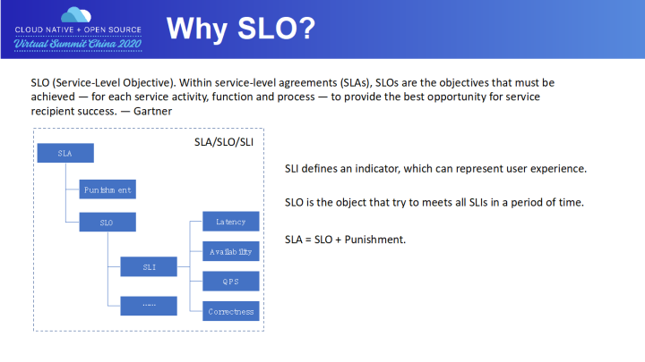
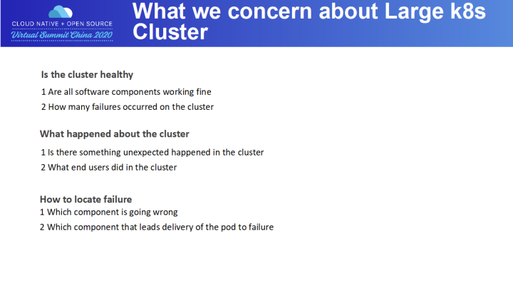
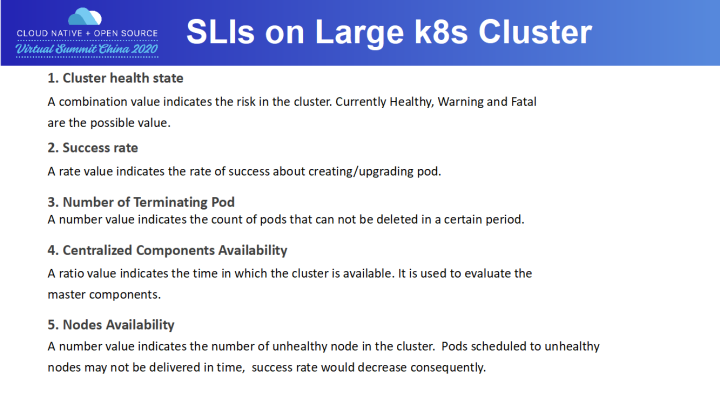
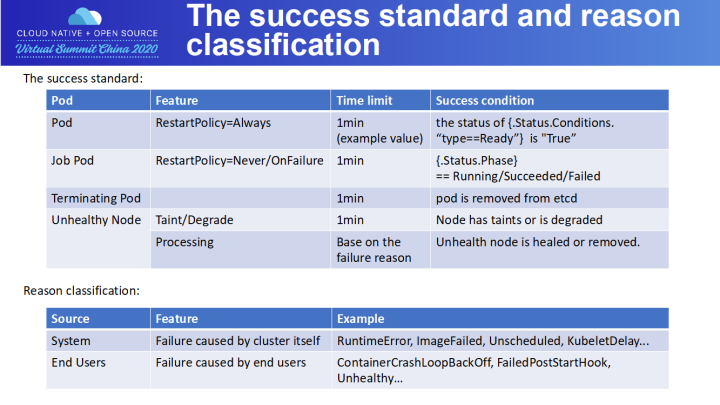
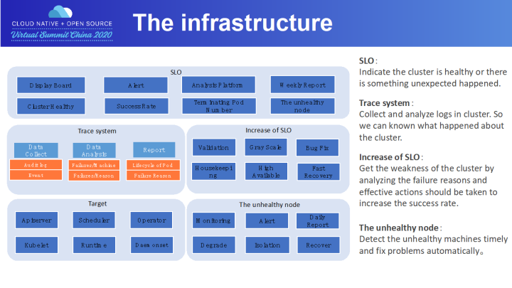
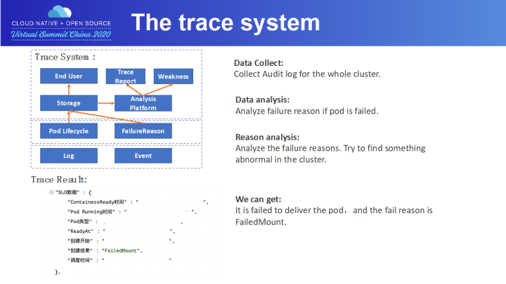
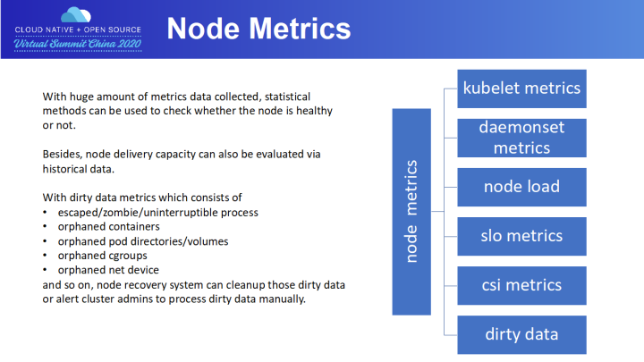
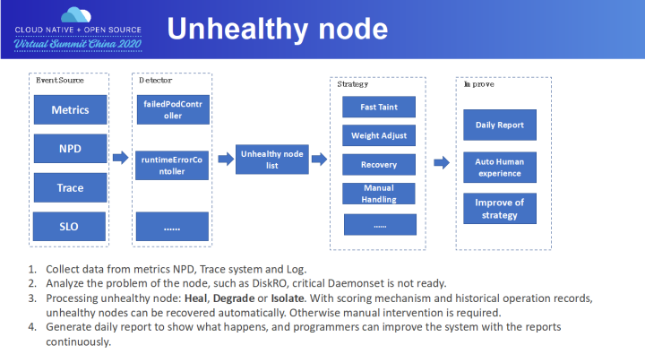
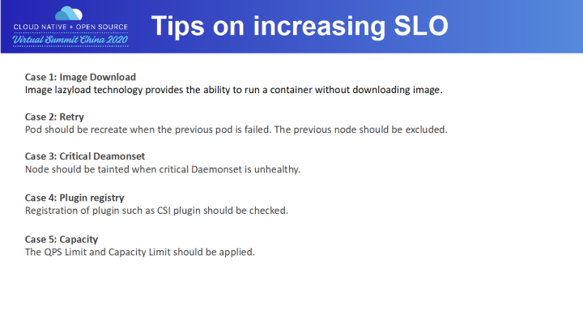

# 在大规模 Kubernetes 集群上实现高 SLO 的方法 

2020-11-09 13:55

> **简介：** 随着 Kubernetes 集群规模和复杂性的增加，集群越来越难以保证高效率、低延迟的交付 pod。本文将分享蚂蚁金服在设计 SLO 架构和实现高 SLO 的方法和经验。

Why SLO?

Gartner 对 SLO 的定义：在 SLA 框架下，SLO 是系统必须要达到的目标；需要尽可能地保障调用方的成功。有些人可能会对 SLI/SLO/SLA 有困惑，可以先来看下三者的关系：

- **SLI** 定义一个指标，来描述一个服务有多好算达到好的标准。比如 Pod 在 1min 内交付。我们通常从迟延、可用性、吞吐率及成功率这些角度来制定 SLI。
- **SLO** 定义了一个小目标，来衡量一个 SLI 指标在一段时间内达到好的标准的比例。比如说，99% 的 Pod 在 1min 内交付。当一项服务公布了其 SLO 的以后，用户方就会对该服务的质量有了期望。
- **SLA** 是 SLO 衍生出来的协议，常用于 SLO 定义的目标比例没有完成时，服务方要赔多少钱。通常来说，SLA 的协议会具体白纸黑字形成有法律效率的合同，常用于服务供应商和外部客户之间（例如阿里云和阿里云的使用者）。一般来说对于内部服务之间的 SLO 被打破，通常不会是经济上的赔偿，可能更多的是职责上的认定。

所以，我们在系统内部更多关注的是 SLO。

What we concern about Larger K8s Cluster?

随着生产环境不断发展、K8s 集群越来越复杂、集群规模不断增大。如何保障大规模环境 K8s 集群的可用性？是摆在众多厂家面前的一个难题。对于 K8s 集群，我们通常关心以下几个问题：

- 第一个问题就是集群是否健康，所有组件是否正常工作，集群中 Pod 创建的失败数量有多少，这是一个整体指标的问题。
- 第二个问题就是集群中发生了什么，集群中是否有异常发生了，用户在集群中做了些什么事情，这是一个追踪能力的问题。
- 第三个问题就是有了异常后，是哪个组件出了问题导致成功率降低，这是一个原因定位的问题。

那么，我们该如何解决上面的问题呢？

- 首先，我们要定义一套 SLO，来描述集群的可用性。
- 接着，我们必须有能力对集群中 Pod 的生命周期进行追踪；对于失败的 Pod，还需要分析出失败原因，以快速定位异常组件。
- 最后，我们要通过优化手段，消除集群的异常。

SLls on Large K8s Cluster

我们先来看下集群的一些指标。

- **第一项指标：集群健康度**。目前有 Healthy/Warning/Fatal 三个值来描述，Warning 和 Fatal 对应着告警体系，比如 P2 告警发生，那集群就是 Warning；如果 P0 告警发生，那集群就是 Fatal，必须进行处理。
- **第二项指标：成功率**。这里的成功率是指 Pod 的创建成功率。Pod 成功率是一个非常重要的指标，蚂蚁一周 Pod 创建量是百万级的，成功率的波动会造成大量 Pod 的失败；而且 Pod 成功率的下跌，是集群异常的最直观反应。
- **第三项指标：残留 Terminating Pod 的数量**。为什么不用删除成功率呢？因为在百万级别的时候，即使 Pod 删除成功率达到 99.9%，那么 Terminating Pod 的数量也是千级别的。残留如此多的 Pod，会占着应用的容量，在生产环境中是不可接受的。
- **第四项指标：服务在线率**。服务在线率是通过探针来衡量的，探针失败，意味着集群不可用。服务在线率是会对 Master 组件来设计的。
- **最后一项指标：故障机数量**，这是一个节点维度的指标。故障机通常是指那些无法正确交付 Pod 的物理机，可能是磁盘满了，可能是 load 太高了。集群故障机并须做到“快速发现，快速隔离，及时修复”，毕竟故障机会对集群容量造成影响。

The success standard and reason classification

有了集群的指标后，我们需要把这些指标进行细化，定义出成功的标准。

先来看 Pod 创建成功率指标。我们把 Pod 分为了普通 Pod 和 Job 类 Pob。普通 Pod 的 RestartPolicy 为 Always，Job 类 Pod 的 RestartPlicy 为 Never 或 OnFailure。两者都设定有交付时间，比如必须在 1 分钟以内完成交付。普通 Pod 的交付标准是 1min 内 Pod 已经 Ready；Job 类 Pod 的交付标准是 1min 内 Pod 的状态已达 Running、Succeeded 或 Failed。当然创建的时间需要把 PostStartHook 执行时间排除。

对于 Pod 的删除，成功的标准为：在规定时间内，Pod 从 ETCD 内删除。当然，删除的时间需要把 PreStopHookPeriod 时间排除。

对于故障机，要尽快的发现并进行隔离和降级。比如物理机磁盘只读，那必须在 1min 内完成对该 Pod 打 taint。至于故障机的恢复时间，需要按不同的故障原因，制定不同的恢复时间。比如系统故障需要重要安装系统，那恢复时间就会长些。

有了这些标准后，我们也对 Pod 失败的原因进行了整理，有些失败原因是系统引起的，是我们需要关心的；有些失败原因是用户引发的，是我们不需要关心的。

比如 RuntimeError，就是一个系统错误，底层 Runtime 有问题了；ImagePullFailed，Kubelet 下载镜像失败，由于蚂蚁有 Webhook 对镜像准入做了校验，所有镜像下载失败一般都是系统原因造成的。

对于用户原因，在系统侧无法解决，我们只把这些失败原因以接口查询的方式提供给用户，让用户自己解决。比如 ContainerCrashLoopBackOff，通常是由用户容器退出引起的。

The infrastructure

围绕 SLO 目标，我们构建了一整套体系，一方面用于向终端用户、运维人员展示当前集群各项指标状；另一方面，各个组件相互协作，通过分析当前集群状态，得到影响 SLO 的各项因素，为提升集群 pod 交付成功率提供数据支持。

自顶向下而看，顶层组件主要面向各种指标数据， 如集群健康状态、pod 创建、删除、升级成功率，残留 pods 数量、不健康节点数量等指标。其中 Display Board 就是我们常说的监控大盘。

我们同样构建了 Alert 告警子系统，支持灵活的配置方式，可以为不同的指标，根据指标的下跌百分比，指标下跌绝对值等配置多种告警方式，如电话，短信，邮件等。

Analysis System 通过分析指标历史数据，以及采集到的节点 metrics 和 master 组件指标，给出更详细的集群运营报告。其中：

- Weekly Report 子系统给出当前集群本周 pod 创建/删除/升级的数据统计，以及失败案例原因汇总。
- Terminating Pods Number 给出一段时间内集群内新增的无法通过 K8s 机制删除的 pods 列表和 pods 残留原因。
- Unhealthy Nodes 则给出一个周期内集群所有节点的总可用时间占比，每个节点的可用时间，运维记录，以及不能自动恢复，需要人工介入恢复的节点列表。

为了支撑上述这些功能，我们开发了 Trace System，用来分析展示单个 pod 创建/删除/升级失败的具体原因。其中包含日志和事件采集、数据分析和 pod 生命周期展示三个模块：

- 日志和事件采集模块采集各 master 组件以及节点组件的运行日志和 pod/node 事件，分别以 pod/node 为索引存储日志和事件。
- 数据分析模块分析还原出 pod 生命周期中各阶段用时，以及判断 pod 失败原因及节点不可用原因。
- 最后，由 Report 模块向终端用户暴露接口和 UI，向终端用户展示 pod 生命周期以及出错原因。

The trace system

接下来，以一个 pod 创建失败案例为例，向大家展示下 tracing 系统的工作流程。

用户输入 pod uid 之后，tracing system 通过 pod 索引，查找到 pod 对应生命周期分析记录、交付成功与否判定结果。当然，storage 存储的数据不仅为终端用户提供基础数据，更重要的是通过对集群内 pods 生命周期，分析出周期内集群的运营状况及每个节点的运营状况。比如说集群内太多 pods 调度到热点节点，不同 pods 的交付引起节点上资源竞争，导致节点负载太高，而交付能力却在下降，最终表现为节点上 pods 交付超时。

再举个例子，通过历史统计数据，分析出 pods 生命周期中各阶段的执行时间基线，以基线为评估标准，比较组件不同版本的平均用时、用时分布，给出组件改进建议。另外，通过整体的 pods 生命周期中各组件负责的步骤时间占比，找出占比较多的步骤，为后续优化 pod 交付时间提供数据支持。

Node Metrics

一个运行状况良好的集群，不仅需要 master 组件保持高可用，节点稳定性也不容忽视。

如果把 pod 创建比作是 rpc 调用，则每个节点就是一个 rpc 服务提供者，集群的总容量等于每个节点能处理的 pod 创建请求的总和。每多一个不可用的节点，都代表着集群交付能力的下降，也代表着集群可用资源的下降，这就要求尽量保证集群内节点高可用；每一次 pod 交付/删除/升级失败，也意味着用户使用成本上升，体验下降，这就要求集群节点只有保证良好的健康度，调度到节点上的 pods 才能成功交付。

换句话说，不仅要尽早发现节点异常，也要尽快修复节点。通过分析各组件在 pod 交付链路上的功能，我们补充了各种不同类型的组件的 metrics，以及将 host 运行状态转换为 metrics，一并采集到数据库之后，结合每个节点上 pod 交付结果，可以构建模型预测节点可用性，分析节点是否存在不可恢复异常，适当调整节点在调度器中比重，从而提升 pod 交付成功率。

Pod 创建/升级失败，用户可以通过重试来解决，但 pod 删除失败，虽然有着 K8s 面向终态的理念，组件会不断重试，但终究也会存在脏数据，如 pod 在 etcd 上删除，但是节点上还残留着脏数据。我们设计实现了一个巡检系统，通过查询 apiserver 获取调度到当前节点上的 pods，通过对比，找到节点上残留的进程/容器/volumes 目录/cgroup /网络设备等，通过其他途径尝试释放残留资源。

Unhealthy node

接下来描述故障机的处理流程。

故障机判断的数据来源有很多，主要有节点的监控指标，比如：

- 某类 Volume 挂载失败
- NPD(Node Problem Detector)，这是社区的一个框架
- Trace 系统，比如某个节点上 Pod 创建持续报镜像下载失败
- SLO，比如单机上残留大量 Pod

我们开发了多个 Controller 对这些某类故障进行巡检，形成故障机列表。一个故障机可以有好几项故障。对于故障机，会按照故障进行不同的操作。主要的操作有：打 Taint，防止 Pod 调度上去；降低 Node 的优先级；直接自动处理进行恢复。对于一些特殊原因，比如磁盘满，那就需要人工介入排查。

故障机系统每天都会产生一个日报，来表明故障机系统今天做了哪些事情。开发人员可以通过不断地添加 Controller 和处理规则完善整个故障机处理系统。

Tips on increasing SLO

接下来，我们来分享下达到高 SLO 的一些方法。

- **第一点**，在提升成功率的进程中，我们面临的最大问题就是镜像下载的问题。要知道，Pod 必须在规定时间内交付，而镜像下载通常需要非常多的时间。为此，我们通过计算镜像下载时间，还专门设置了一个 ImagePullCostTime 的错误，即镜像下载时间太长，导致 Pod 无法按时交付。

还好，阿里镜像分发平台 Dragonfly 支持了 Image lazyload 技术，也就是支持远程镜像，在 Kubelet 创建容器时，不用再下载镜像。所以，这大大加速了 Pod 的交付速度。有关 Image lazyload 技术，大家可以看下阿里 Dragonfly 的分享。

- **第二点**，对于提升单个 Pod 成功率，随着成功率的提升，难度也越来越难。可以引入一些 workload 进行重试。在蚂蚁，paas 平台会不断重试，直到 Pod 成功交付或者超时。当然，在重试时，之前的失败的节点需要排除。
- **第三点**，关键的 Daemonset 一定要进行检查，如果关键 Daemonset 缺失，而把 Pod 调度上去，就非常容易出问题，从而影响创建/删除链路。这需要接入故障机体系。
- **第四点**，很多 Plugin，如 CSI Plugin，是需要向 Kubelet 注册的。可能存在节点上一切正常，但向 Kubelet 注册的时候失败，这个节点同样无法提供 Pod 交付的服务，需要接入故障机体系。
- **最后一点**，由于集群中的用户数量是非常多的，所以隔离非常重要。在权限隔离的基础上，还需要做到 QPS 隔离，及容量的隔离，防止一个用户的 Pod 把集群能力耗尽，从而保障其他用户的利益。

作者：蚂蚁金服技术专家 姚菁华；蚂蚁金服高级开发工程师 范康