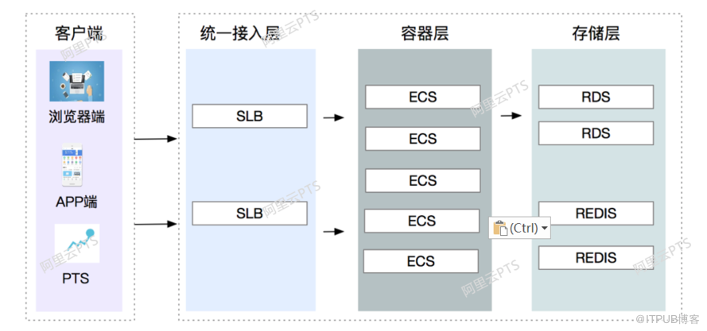
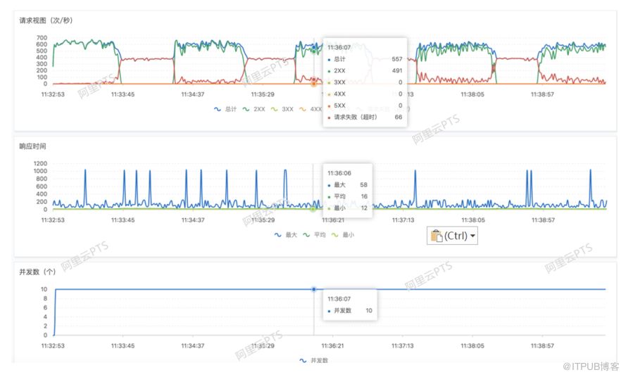
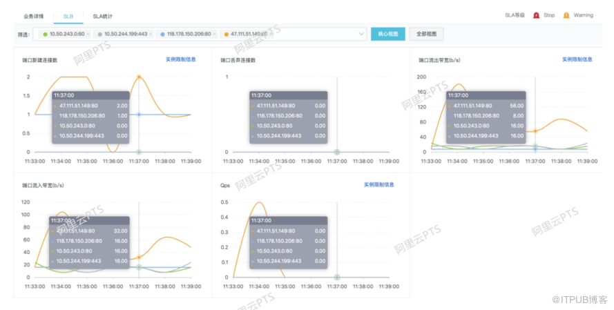
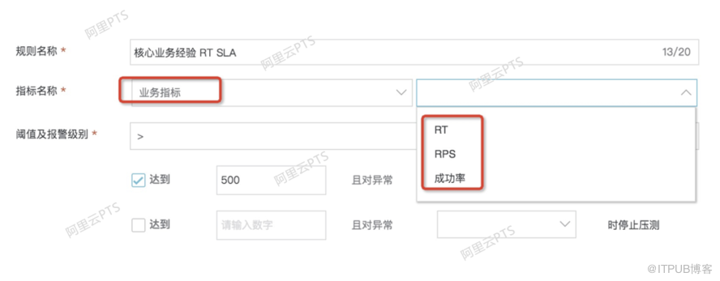
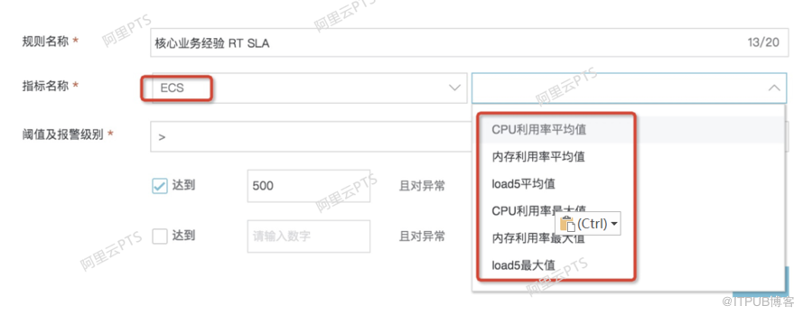
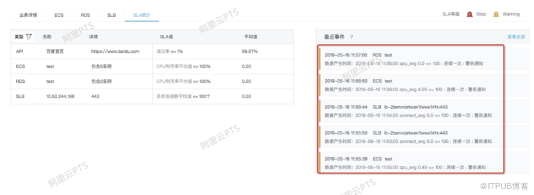

# 性能压测中的SLA，你知道吗？

[国内数据库](http://blog.itpub.net/chdatabase/) 作者：[大涛学长](http://blog.itpub.net/69947441/) 时间：2019-09-05 16:59:47 729 0

本文是《Performance Test Together》（简称PTT）系列专题分享的第6期，该专题将从性能压测的设计、实现、执行、监控、问题定位和分析、应用场景等多个纬度对性能压测的全过程进行拆解，以帮助大家构建完整的性能压测的理论体系，并提供有例可依的实战。

该系列专题分享由阿里巴巴 PTS 团队出品，欢迎在文末处加入性能压测交流群，参与该系列的线上分享。

本文主要介绍如何正确的使用SLA来确定备容的目标，同时提高压测效率。主要分为理论和实践两个部分。

### SLA无处不在

在云计算时代，越来越多企业的服务迁移到云上，各大云服务厂商有自己服务发布的SLA，比如阿里云的ECS服务器/RDS服务/REDIS服务等，都有对应的SLA,SLA是服务提供商与客户之间定义的正式承诺。

除了云服务厂商，提供各种服务的APP/网站，如果在客户在购物时无法下单/或者在周末刷着小视频的视频打不开了，这个会严重影响用户的体验，如果故障出现的时间比较久，会流失一大批的客户，给业务带来损失。那么，如何衡量给客户提供的服务质量呢？进而如何衡量系统的稳定性呢？毋庸置疑，也需要统一的语言SLA。那么，具体什么是SLA呢？

在新系统上线，大促以及系统面临大的架构调整等各种场景中，架构组以及开发人员，需要提前为系统进行备容,对系统进行性能压测，在压测过程中，与SLA又有什么联系呢？

### SLA定义

服务级别协议（英语：service-level agreement，缩写SLA）也称服务等级协议、服务水平协议，是服务提供商与客户之间定义的正式承诺[维基百科定义]。SLA的概念，对互联网公司来说就是网站服务可用性的一个保证。

SLA包括两个要素，一个是SLI,一个是SLO，其中SLI定义的是测量指标；SLO定义的是服务提供的一种状态。

SLI：SLI是经过仔细定义的测量指标，它根据不同系统特点确定要测量什么，SLI的确定是一个非常复杂的过程。SLI确定测量的具体指标，在确定具体指标的时候，需要做到该指标能否准确描述服务质量以及该指标是否可靠。

SLO：SLO(服务等级目标)指定了服务所提供功能的一种期望状态，包含所有能够描述服务应该提供什么样功能的信息。一般描述为：每分钟平均qps > 100k/s；99% 访问延迟 < 500ms；99% 每分钟带宽 > 200MB/s。

设置SLO时的几个最佳实践：

- 指定计算的时间窗口
- 使用一致的时间窗口(XX小时滚动窗口、季度滚动窗口)
- 要有一个免责条款，比如：95%的时间要能够达到SLO

SLA以面向人员的维度区分，可以划分为以下两个维度。
第一：业务维度：客户对这部分的指标最有体感，直接与用户的体验好坏挂钩。

- 例如，响应时间，错误率等。有统计数据显示，如果响应时间大于1s，80%的用户就会流失掉；错误率指标，是对功能正确性的保障，如果开始有业务错误，那么客户都无法直接完成期望的操作，流失也是避免不了的。这部分的指标直接影响用户的体验。
  第二：服务侧维度：描述的是服务端的指标，这部分指标主要是面向开发以及测试人员的，为了在发生问题的时候，可以快速定位问题。
- 比如，ECS/RDS等的系统指标，包括 CPU/LOAD等。

### 压测中的SLA

在进行性能压测设计阶段,有一个重要的环节是确定“性能压测通过标准”。缺少了这个标准,意味着压测可能是没完没了的,谁都不知道什么时候该结束,影响性能压测效果,浪费人力财力。所以需要通过“性能压测通过标准”中一系列量化下来的指标来确定,压测结果是否符合预期,可以停止了。这个"标准"的来源,可能是来自业务方的期望,研发组对系统的性能期望等等,最终整理汇总下来的我们称为压测中的SLA。这个SLA与产品对外的SLA有紧密联系,但是又存在区别。联系就是,系统对外的SLA是压测中的SLA的重要来源,而区别就是,压测中的SLA可能会涵盖更多更细的指标,而对外的SLA并不关心这么多细节。

### 在正确压测吗？

在压测中，看似一个简单的业务请求，实则后端是复杂的系统架构，比如统一接入层/容器层/存储层，即使容器层，也涉及到了很多不同应用/不同服务，面对纷繁复杂的架构，如何快速判断压测结果是否满足了业务需求？如何快速判断是否达到了系统的水位不能再往上施压了呢？

作为备容的一份子（开发或者测试），可以想象一下，常态是怎样的？
一声号令，开始压测！好了，A开发看A系统，B开发看B系统，C开发看网络层，D测试看压测结果等。大家手忙脚乱，这个时候，有人在群里一声喊，我的系统扛不住了，停止吧（当然还有一种风险，是不是这位同学的误判呢）。好的，这个时候压测停止。当然这种还是比较好的情况，而有些压测场景，就只有一个测试同学，他怎么分工呢？一会看看压测结果，一会看看A系统，一会看看B系统，忙得不亦乐乎。

这样压测能否达到效果，当然能。但是这样的状态是最好的一种状态吗？当然不是！这个时候SLA就派上用场了。

- 首先，开发/测试/业务同学在压测之前，对齐SLA指标，即意味着明确系统需要持续提供的服务能力，以及系统的整体水位，减少后续的沟通流程，大家都以此目标备容。
- 其次，配置好SLA之后，压测的负责人则只需要重点关注是否存在SLA告警，如果连续告警则说明系统已经扛不住了，直接停止压测或者由SLA直接停止压测。对于压测的小伙伴来说，省时省力，既不会漏掉一些指标，同时也不会浪费压测时间。

### 如何在PTS中正确使用SLA

想象一下，开发同学都在忙，只有“我”一个测试人员有时间全盘盯着压测。压测起来之后，直接把不合格的业务维度数据以及系统维度数据，统统通知给“我”，“我”只是决策要不要停止压测，同时直接产出系统容量水位报告，这样是不是爽歪歪？PTS就提供了这样的功能，即设置SLA。设置SLA需要基于采集到的各种指标，采集的指标越丰富，则SLA越丰富，越能满足不同业务的需求。

在具体使用中，首先了解PTS提供的指标，然后选取与自己业务相契合的指标并设置对应的阈值，最后进行压测。

### 首先，了解一揽子指标

监控指标，可以分为客户端相关指标，即业务维度指标；另一个是服务端相关指标。

- 客户端监控指标，是最直观的判断系统提供的服务是否满足了业务的诉求，PTS提供了RPS/请求失败RPS/响应时间等指标。

- 服务端相关指标，则是从研发人员角度区分的，一方面服务端系统的表现会直接影响客户端的各个指标，是联动的。另一方面，在客户端或者服务端出现问题的时候，可以更加方便的定位到问题。PTS服务端指标，包含了SLB/ECS/RDS等相关组件的监控数据。

### 第二，选取核心指标并设置阈值

- 首先，客户端的SLA指标包含了 RT/RPS/成功率三个指标，分别从 响应时间/可用性以及访问负载 描述了客户端的访问是否正常，直接反映了客户的使用体感，以及提供的核心服务是否在提供可持续性可用的服务；客户端的指标通常需要测试人员与业务方根据具体的业务具体设定。
- 成功率是一个衡量系统是否可用的核心指标。同时成功率优先考虑的是业务成功率，若未设置业务成功率，则是code码等默认的成功率。
- RT反映了客户访问网站的速度，一般情况下，互联网用户都不是特别有耐心。KissMetrics 的研究结果显示，“1 秒的网页响应延迟可能会导致转化次数减少 7%”，“47% 的消费者都希望网页能够在 2 秒内加载完毕”。
- RPS则是系统能承载的最大的RPS，也即系统容量最大水位。

- 其次，服务端的指标，包括了 SLB/ECS/RDS 三个层面的指标，每个层面的指标，由具体组件提供服务的特点决定。例如ECS指标包括 CPU/内存利用率/LOAD ；SLB指标包括 丢弃连接数/异常后端server数；RDS指标包括 CPU/内存利用率/IOPS/连接利用率；这部分的指标大部分情况下由开发人员确定，有个大的规则，比如CPU一般不超过80%，LOAD不超过核数的1.5倍等，具体情况具体分析。

### 第三，选择好指标，以及为指标设置好对应的阈值之后，就可以放心的压测了。在压测中，如果触发了设定的SLA则进行报警，或者直接停止压测。同时还会有事件的汇总信息。

这样，通过前期各方对齐相应的SLA指标，并且在PTS中设置SLA，既可以对齐目标，又可以解放压测过程中的人力，很直观的看到哪些指标达到了阈值。未设置SLA之前，大家手忙脚乱的观看各种指标数据，生怕漏掉，而加了SLA之后，就可以喝着茶把压测做完。同时，除了通过设置SLA帮助小伙伴们更好的提高压测效率外，我们还会将SLA与智能压测相结合，大家敬请期待。

### 小结

SLA无处不在，本文主要从SLA是什么，压测过程中设置SLA的意义，以及如何正确使用SLA进行了简述。正确利用并设置SLA，让压测不再手忙脚乱。有不同意见处请指正，谢谢！

本文作者：中间件小哥