[toc]

# 为什么要这样做

规范流程

目前的SQL审核平台的在变更表结构时会锁表(阻塞表的写操作)

不依靠人手动执行, 由需要者自行编辑并提出申请, dba审核执行即可

# 登录阿里云-子账号

目前创建4个项目组长账号

使用浏览器, 例如: chrome

手机下载安装 谷歌动态口令 app

https://www.softonic.cn/download-launch?token=eyJhbGciOiJIUzI1NiIsInR5cCI6IkpXVCJ9.eyJkb3dubG9hZFR5cGUiOiJpbnRlcm5hbERvd25sb2FkIiwiZG93bmxvYWRVcmwiOiJodHRwczovL2dzZi1mbC5zb2Z0b25pYy5jb20vMDc0LzBjNC9lYTAzZmEyMGVkNWVlYzU1NDk2NmExY2VlZDM1NTkzYjg3L2NvbS5nb29nbGUuYW5kcm9pZC5hcHBzLmF1dGhlbnRpY2F0b3IyLmFwaz9FeHBpcmVzPTE2MDU4MjU3OTUmU2lnbmF0dXJlPWZjNzIzNWVkNjJhM2E5YjZmMTZkYTQ0OGIyZDI3Mzg1Y2Y1M2ExZDgmdXJsPWh0dHBzOi8vZ29vZ2xlLWF1dGhlbnRpY2F0b3Iuc29mdG9uaWMuY24vYW5kcm9pZCZGaWxlbmFtZT1jb20uZ29vZ2xlLmFuZHJvaWQuYXBwcy5hdXRoZW50aWNhdG9yMi5hcGsiLCJhcHBJZCI6IjAxMjIwMGM2LTliMjktMTFlNi05NWMwLTAwMTYzZWQ4MzNlNyIsInBsYXRmb3JtSWQiOiJhbmRyb2lkIiwiaWF0IjoxNjA1NzgzMjI4LCJleHAiOjE2MDU3ODY4Mjh9.phvRkazTzcHj5Y5kWojevzv0m5pc4CLOKbMql8uS_rI

协助 谭世霖 绑定到阿里云子账号MFA, 打开APP扫码阿里云子账号MFA绑定二维码, 输入两次随机码进行绑定

访问地址: https://signin.aliyun.com/login.htm#/login


打开 谷歌动态口令app, 查看并输入随机码

# DMS(数据库管理)初步使用

打开dms

访问地址: https://dms.aliyun.com

## 在DMS界面进行操作


## 填写SQL

绝大部分变更业务场景都是进行 无锁数据变更 操作

SQL内容中填写数据变更语句和结构变更语句


新增/修改/删除 数据库表字段或修改字段名时审批流程中会依次加入大数据和运维两个节点, 目前运维在审核完之后需要手动去矫正DTS上游同步结构


## 提交审核


## 等待审核


## 查看审核

查看审核状态

查看执行结果


查看执行结果详细, 如果有回滚则查看备份生成的回滚SQL文件, 下载并打开文件作为回滚SQL工单使用

回滚SQL时, 需要备注: 回滚SQL-工单号-


# 已测试过的各种SQL的使用及出现结果

**能做什么:**

​	新增/删除表、修改表结构、修改表数据

**需要注意什么:**

​	目前只要是实例设置为无锁表更, 那么所有的DDL变更都是无锁的, 普通数据变更中也是无锁进行变更的, 但是DML变更是加锁的

​	当需要锁表变更时需要让管理员进行协助管理

**十分警惕的地方:**

​	目前在自动生成回滚SQL这块是个很大的隐患(部分SQL会生成回滚SQL, 回滚SQL时需要重新走工单)

​	在多SQL工单联合以及部署工单结合这块也是个隐患, 即如果有工单串联关系需要在备注中标明前置工单, 审批工单时需要从最久时间往最近时间开始审, 不要使用就近原则

​	检查SQL成功, 执行直接失败; 执行成功, 实际修改数据没有效果

​	执行SQL时可以使用字符串文本以及SQL文件, 执行SQL文件时会有问题, 建议不要使用SQL文件

**不支持的地方:**

​	需要在SQL执行之前获取执行时间

​	调整表结构前查看索引影响情况

​	目前在多人流程设置这块还没有弄好

​	审批流程不支持转发


## 新增/删除表

### 新增表

```
create table designer_data_struct
(
	id int auto_increment
		primary key,
	did int not null,
	code varchar(100) not null,
	meaning varchar(100) not null,
	reference_type varchar(100) null,
	is_open_data tinyint default 0 null comment '是否开放数据',
	data_type varchar(100) default 'string' null comment '数据类型',
	default_value varchar(255) null comment '默认值'
);
```

#### 错误操作

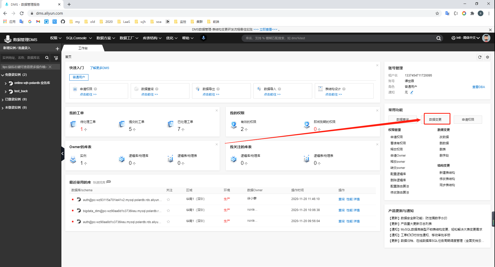

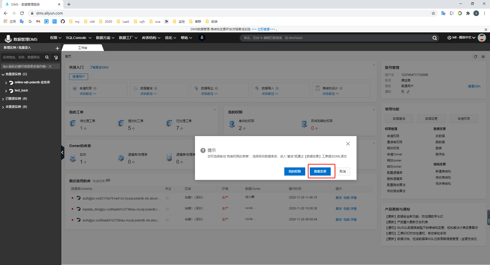

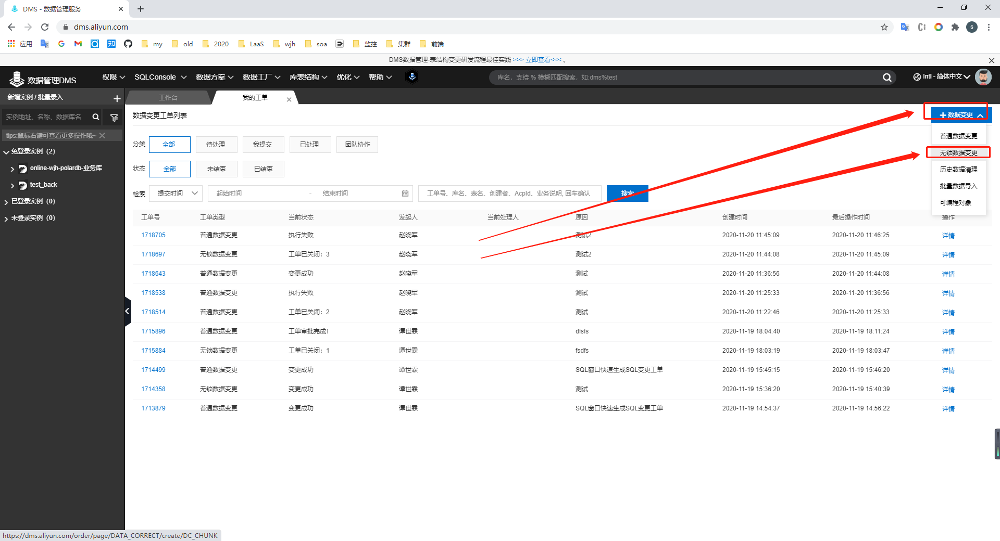

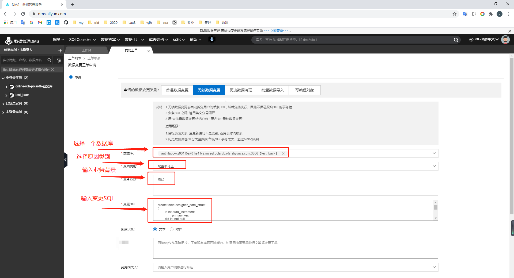

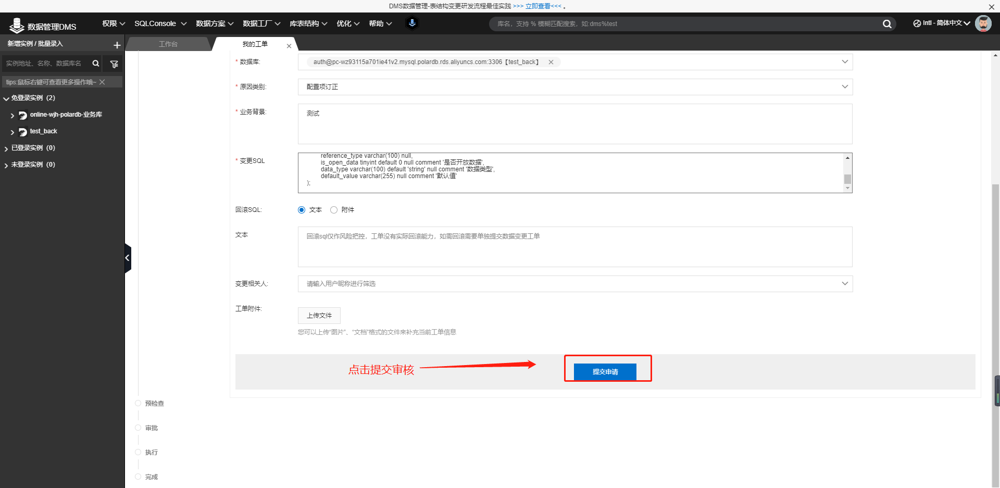

演示一个错误的工单如何查看及修复

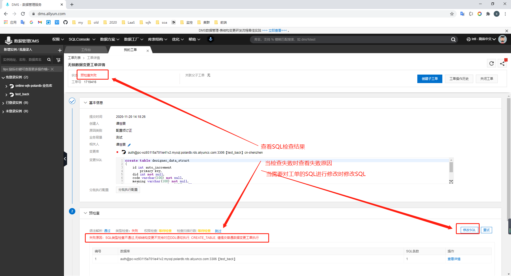

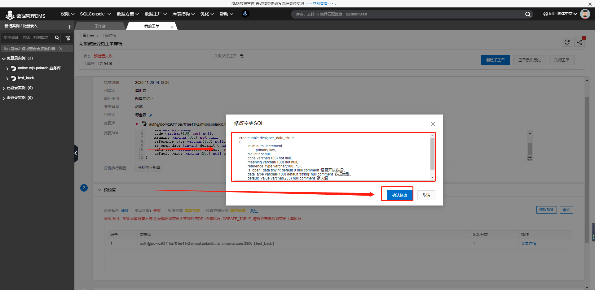

即使能修改SQL也不能更改工单类型, 这个时候就需要修改工单类型

这时就需要关闭工单, 重新提一个工单

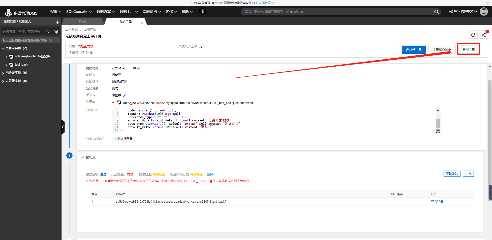


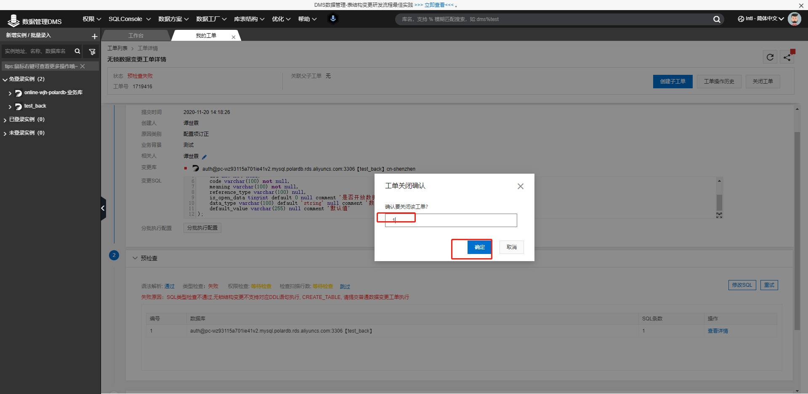

#### 正确操作

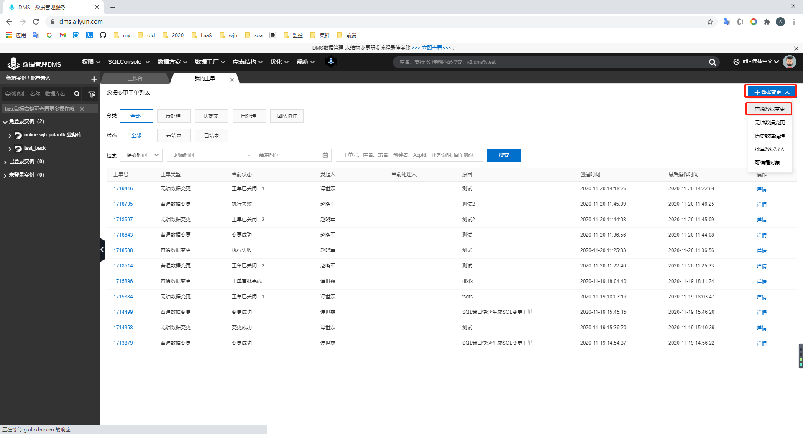

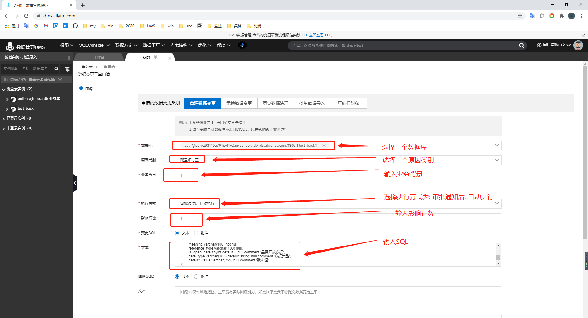

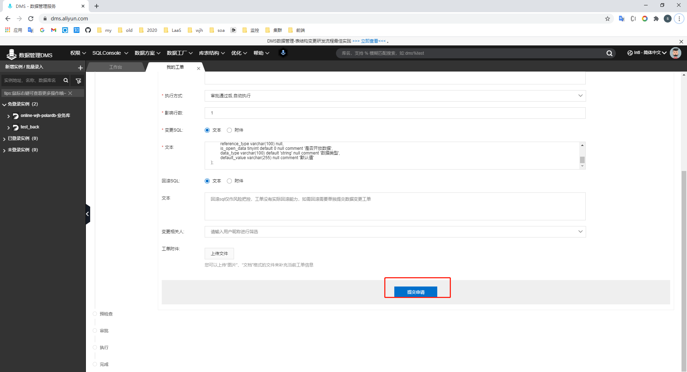

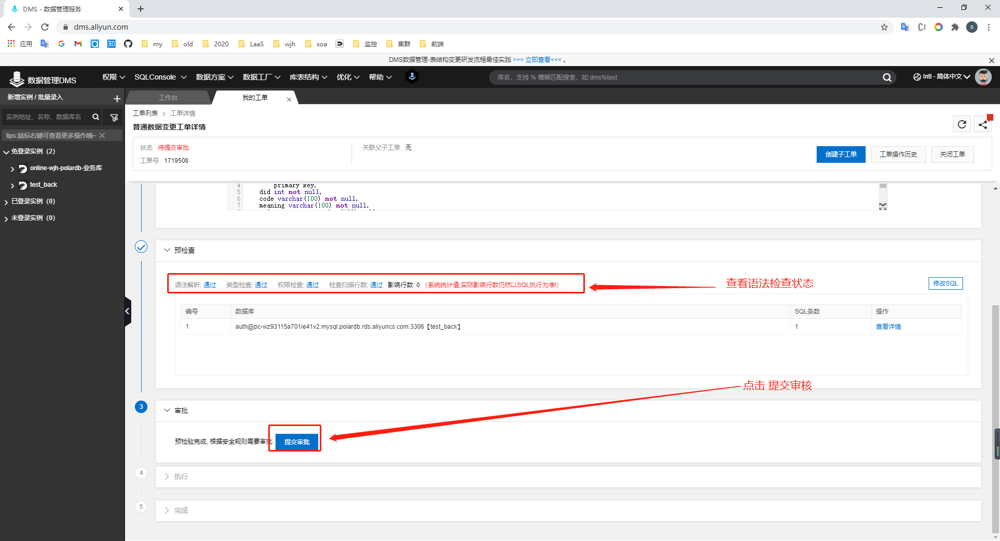

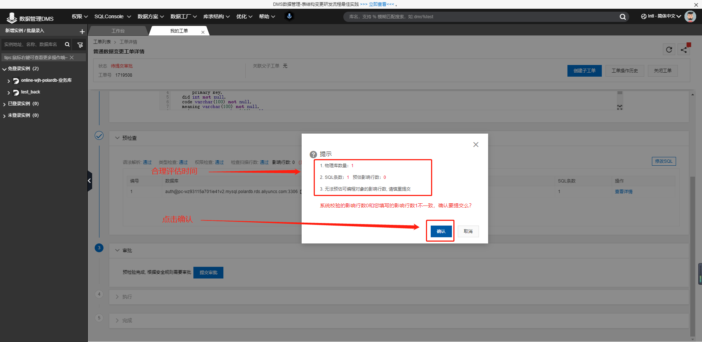

然后等待审核

微信提醒审批

查看审批结果

审批完成之后查看执行结果

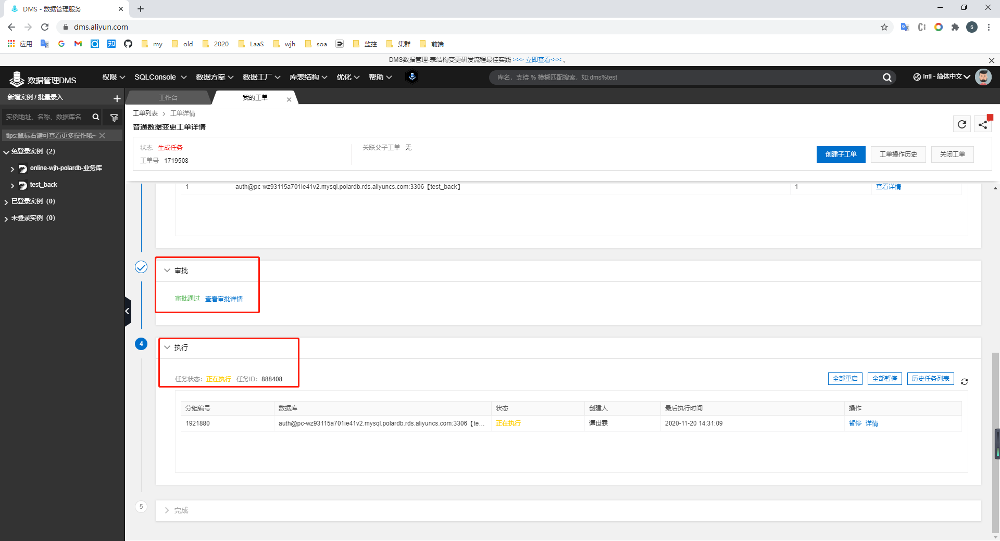

当执行成功时查看成功结果

当执行失败时查看失败原因

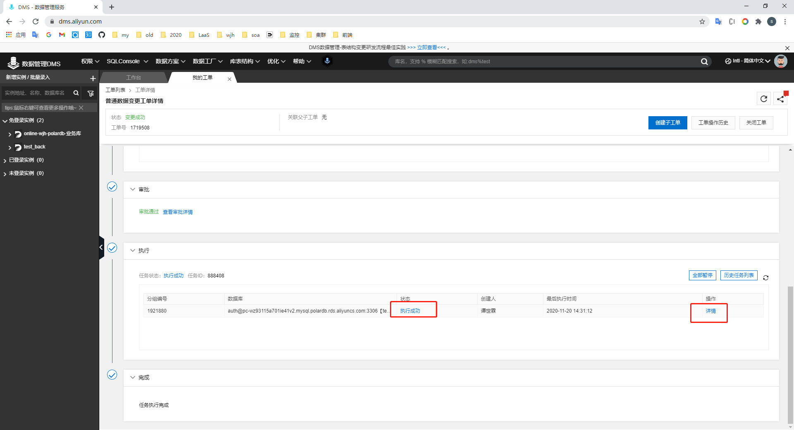

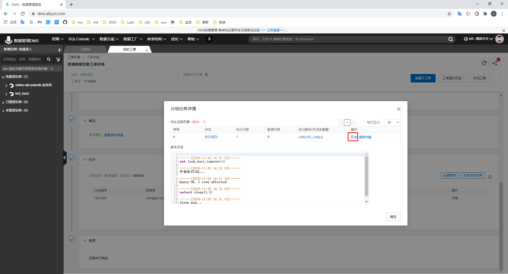

### 删除表

```
drop table designer_data_struct;
```

## 修改表结构

### 新增字段

```
 ALTER TABLE designer_data_struct ADD game_zone VARCHAR(20) NOT NULL DEFAULT "HuaBei";
```

### 修改字段

包含修改字段名和字段信息两种

```
ALTER TABLE designer_data_struct CHANGE game_zone game_zone VARCHAR(60);
```

### 删除字段

```
ALTER TABLE designer_data_struct DROP game_zone;
```

## 修改表数据

### 插入数据

```
INSERT INTO designer_data_struct ( did, code, meaning, reference_type, is_open_data, data_type, default_value) VALUES ( 4, 'registry_url', '仓库地址', '', 0, 'string', null);
```

### 修改数据

```
update designer_data_struct set meaning = "test"
```

### 删除数据

删除数据时需要设置条件, 至少为where 1 = 1

```
delete from designer_data_struct where 1=1
```

# 关于流程

DML操作DevelopManager审核即可

DDL会在上面流程上加上BigData节点, 需要BigData节点审核通过才能通过, 在BigData审批完成之后需要运维审批

# 关于通知

注册钉钉, 绑定手机

登录钉钉

DMS用户设置钉钉账号的手机号码

当有需要审批时, DMS会推送消息到钉钉给绑定手机号码的人, 注意打开钉钉以看到消息

