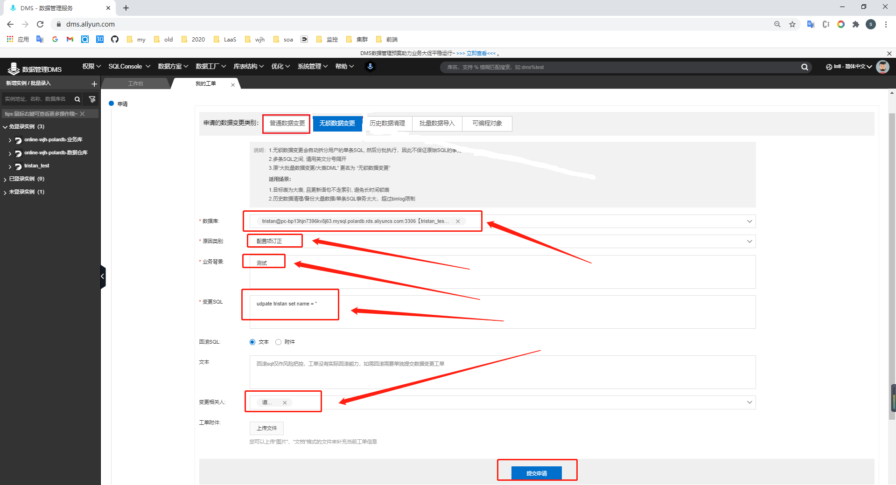

# 为什么要这样做

规范流程

目前的SQL审核平台的在变更表结构时会锁表(阻塞表的写操作)

不依靠人手动执行, 由需要者自行编辑并提出申请, dba审核执行即可

# 登录阿里云-子账号

为使用者创建用户, 为了减少减轻管理成本, 在最末一层创建即可, 目前创建4个项目组长账号

使用浏览器, 例如: chrome

手机下载安装 谷歌动态口令 app

https://www.softonic.cn/download-launch?token=eyJhbGciOiJIUzI1NiIsInR5cCI6IkpXVCJ9.eyJkb3dubG9hZFR5cGUiOiJpbnRlcm5hbERvd25sb2FkIiwiZG93bmxvYWRVcmwiOiJodHRwczovL2dzZi1mbC5zb2Z0b25pYy5jb20vMDc0LzBjNC9lYTAzZmEyMGVkNWVlYzU1NDk2NmExY2VlZDM1NTkzYjg3L2NvbS5nb29nbGUuYW5kcm9pZC5hcHBzLmF1dGhlbnRpY2F0b3IyLmFwaz9FeHBpcmVzPTE2MDU4MjU3OTUmU2lnbmF0dXJlPWZjNzIzNWVkNjJhM2E5YjZmMTZkYTQ0OGIyZDI3Mzg1Y2Y1M2ExZDgmdXJsPWh0dHBzOi8vZ29vZ2xlLWF1dGhlbnRpY2F0b3Iuc29mdG9uaWMuY24vYW5kcm9pZCZGaWxlbmFtZT1jb20uZ29vZ2xlLmFuZHJvaWQuYXBwcy5hdXRoZW50aWNhdG9yMi5hcGsiLCJhcHBJZCI6IjAxMjIwMGM2LTliMjktMTFlNi05NWMwLTAwMTYzZWQ4MzNlNyIsInBsYXRmb3JtSWQiOiJhbmRyb2lkIiwiaWF0IjoxNjA1NzgzMjI4LCJleHAiOjE2MDU3ODY4Mjh9.phvRkazTzcHj5Y5kWojevzv0m5pc4CLOKbMql8uS_rI

绑定到阿里云子账号MFA

访问地址: https://signin.aliyun.com/login.htm#/login

打开 谷歌动态口令app, 查看并输入随机码

# 数据库变更(查看/变更/回滚)

打开dms

访问地址: https://dms.aliyun.com

## 登录DMS

TODO

## 在DMS界面进行操作

## 填写SQL

绝大部分变更业务场景都是进行 无锁数据变更 操作

SQL内容中填写数据变更语句和结构变更语句

新增/修改/删除 数据库表字段或修改字段名时 请先通知大数据先做好应对, 运维在审核完之后手动去矫正DTS上游同步结构

## 提交审核

## 等待审核

可以直接微信/企业微信上找 徐小攀 或者 谭世霖

## 查看审核

查看审核状态

查看执行结果

查看执行结果详细, 如果有回滚则查看备份生成的回滚SQL文件, 下载并打开文件作为回滚SQL工单使用

回滚SQL时, 需要备注: 回滚SQL-工单号-

# 数据库同步

