[toc]

整体思路为: 自身演练

选择一个用户一对一演练, 然后全体通知演练(至少一次)

# 用户

为使用者创建用户, 为了减少减轻管理成本, 在最末一层创建即可

## 注册用户

使用阿里云主账号创建用于提交DMS审核的用户

登录主账号

打开阿里云子账号管理界面

访问地址: https://ram.console.aliyun.com/users/new

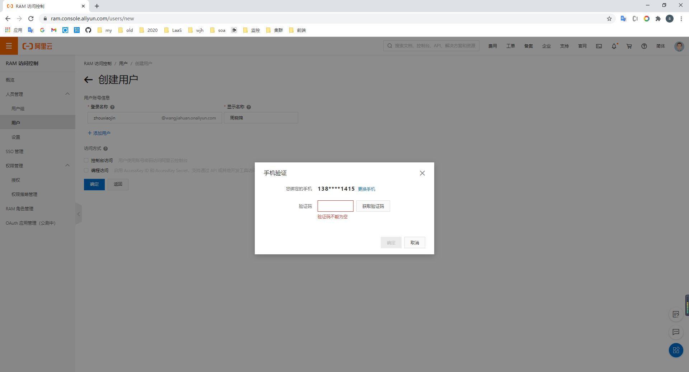

目前用户: 

| 名字   | 账号名      |
| ------ | ----------- |
| 周晓锦 | zhouxiaojin |
| 赵晓君 | zhaoxiaojun |
| 蒋鑫俊 | jiangxinjun |
| 马建平 | majianping  |
| 喻庆捷 | yuqingjie   |

用户设置MFA

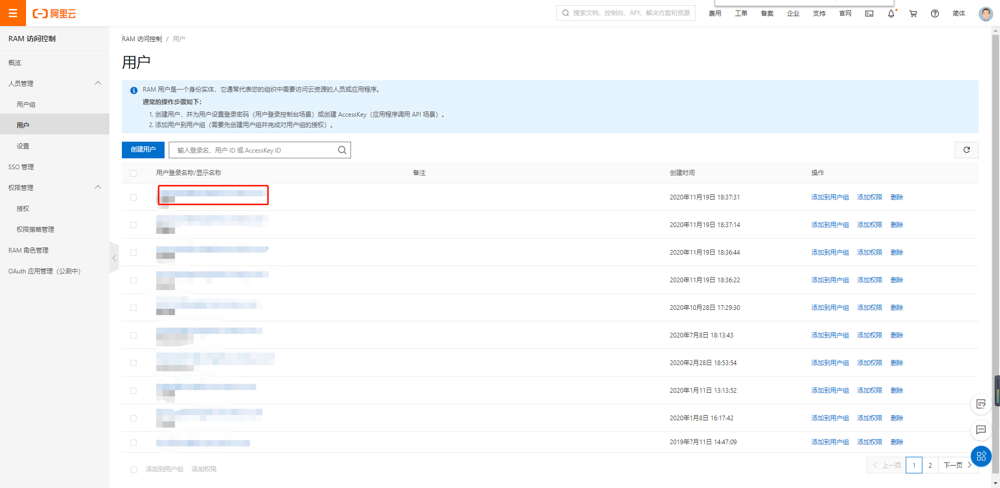

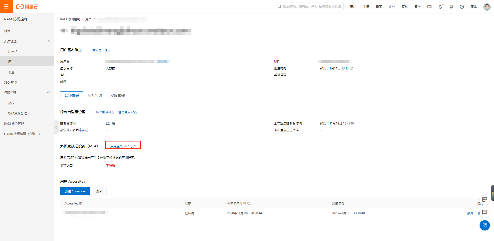

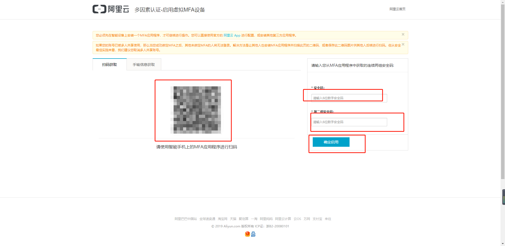

## 用户权限问题

权限设置到用户组

添加用户到用户组

使用各自的专属账号, 原先使用统一账号的继续使用统一账号
将原来统一账号的权限设置到用户组, 用户组添加专属用户

## 添加用户到DMS

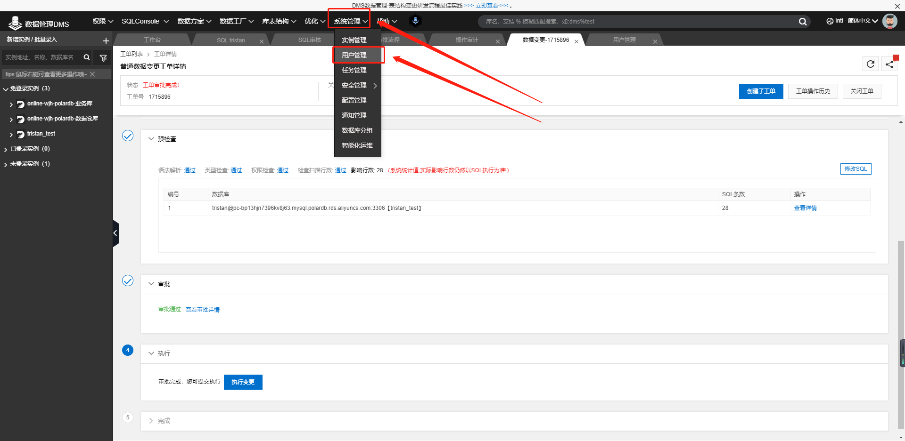

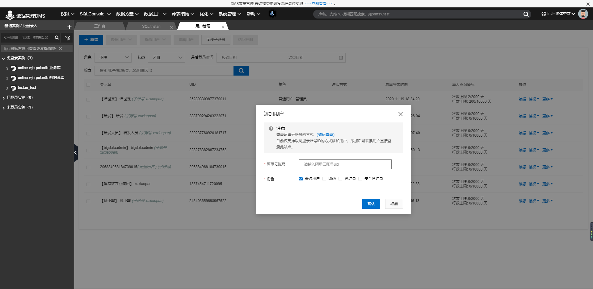

## 用户设置权限

需要分别设置实例权限、数据库权限

在设置数据库权限时需要单个依次勾选

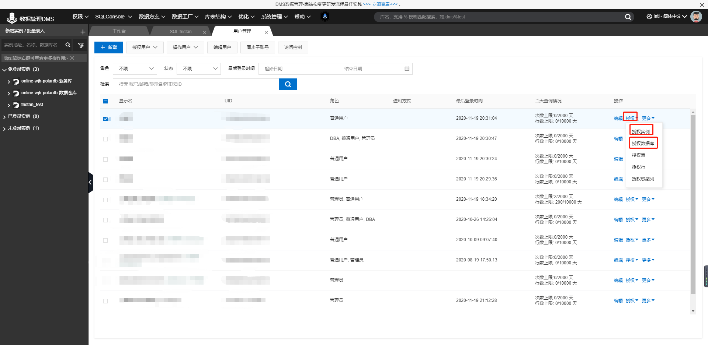

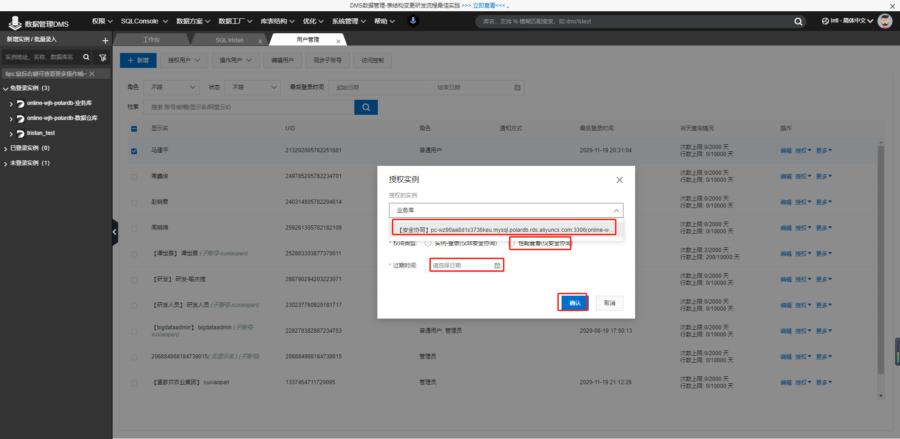

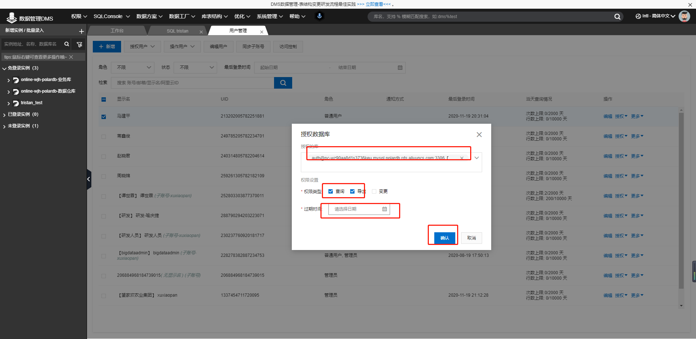

# DMS配置数据库

## polardb实例

### 新增

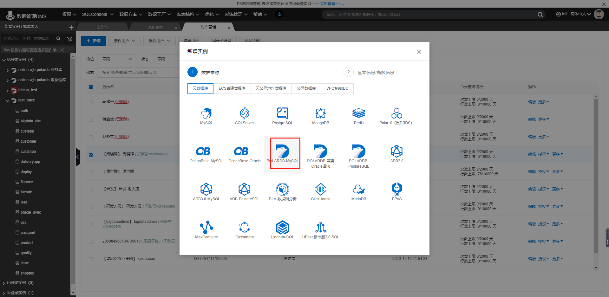

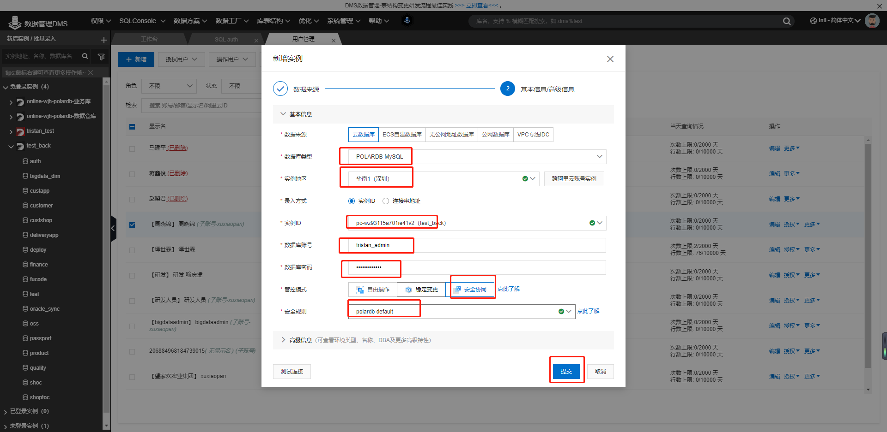

### 删除

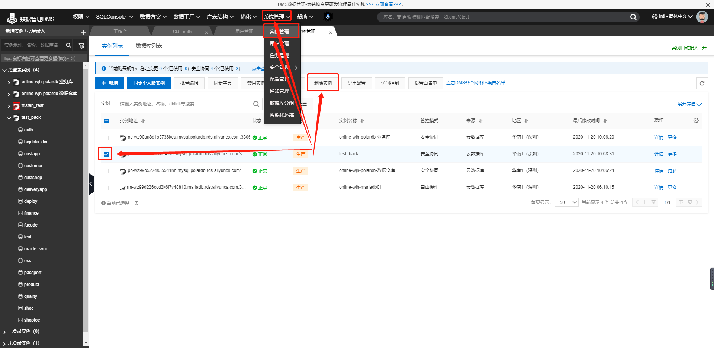

## 开启不锁表变更

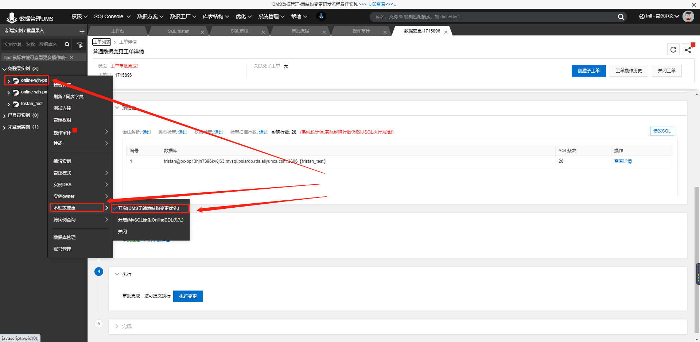

## 开启协作审批模式

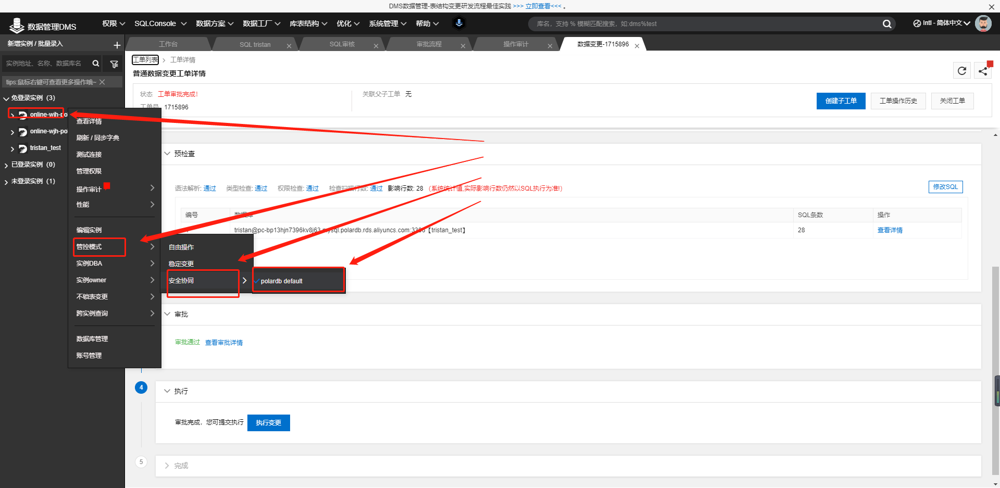

## 协作流程

开启协作模式需要修改polardb配置文件中的loose_polar_log_bin为ON, 开启binlog, 否则会报错

# 审核数据库变更审批

审核时按照从远到近审核, 不要就近原则

## 进入sql审核界面

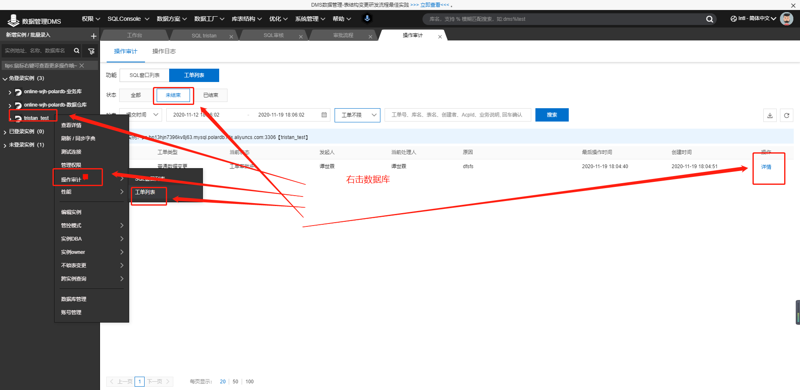

## 查看申请执行的SQL

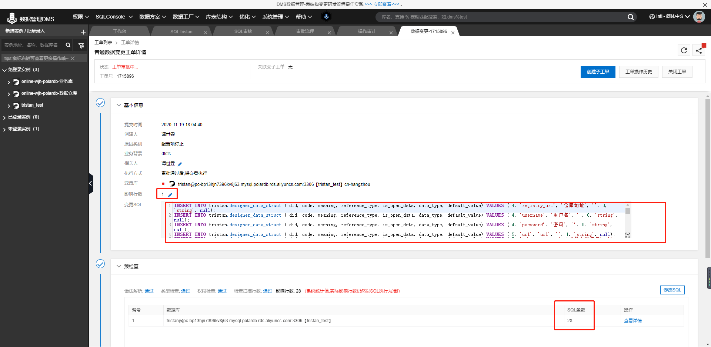

## 点击审核

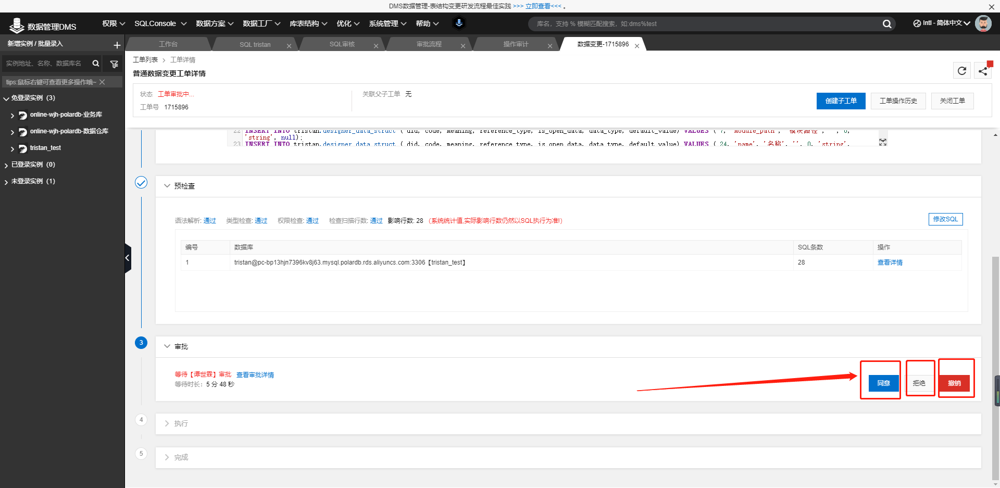

## 如果需要手动点击执行则手动点击执行

很多情况下执行了SQL但是没有生成回滚语句, 这个责任属于运维

# 关闭其他入口

yearning SQL审核平台