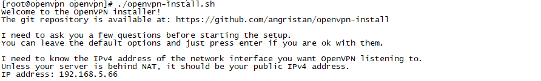
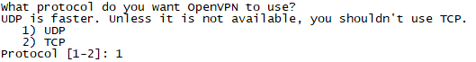
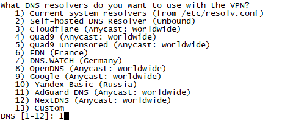
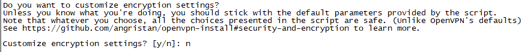
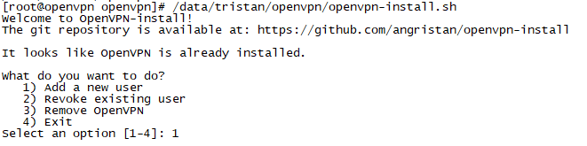
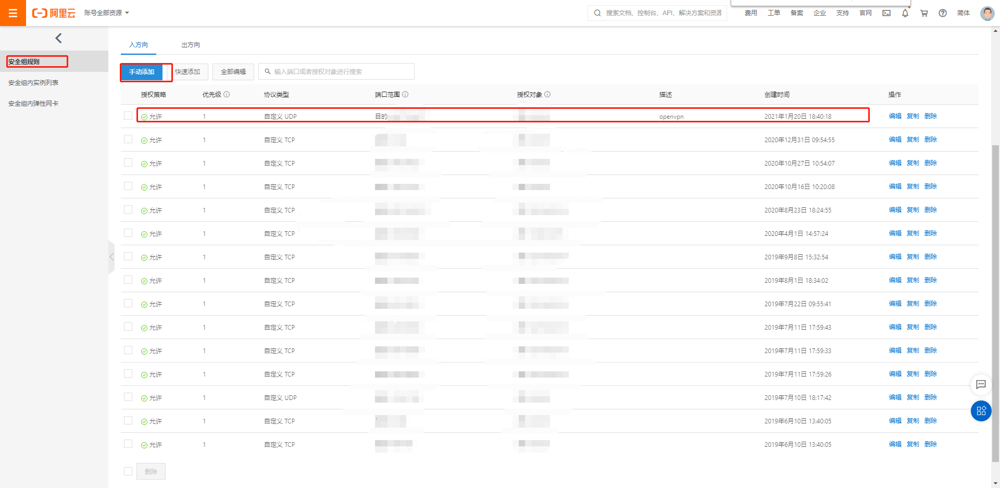

# 安装

```
mkdir -p /data/tristan/openvpn && chmod 777 /data/tristan/openvpn
cd /data/tristan/openvpn

wget https://github.com/angristan/openvpn-install/archive/master.zip
yum install -y unzip
unzip master.zip
cp -f openvpn-install-master/openvpn-install.sh openvpn-install.sh

chmod +x openvpn-install.sh

./openvpn-install.sh
```


实际上基本上一路回车即可, 注意在dns选择和端口选择的地方需要改动

确定本机ip



确定公网ip


是否需要使用ipv6


确定端口, 注意选择随机高位端口


确定协议: 使用udp更加稳定



确定dns, 要使用本机的, 不然会有问题(特别是阿里云上)




确定压缩


确定自定义加密



回车确定安装


# 配置网络

我们先看到服务端配置如下:

```
port 1234
proto udp
dev tun
user nobody
group nobody
persist-key
persist-tun
keepalive 10 120
topology subnet
server 10.8.0.0 255.255.255.0
ifconfig-pool-persist ipp.txt
push "dhcp-option DNS 100.100.2.138"
push "dhcp-option DNS 100.100.2.136"
push "redirect-gateway def1 bypass-dhcp"
dh none
ecdh-curve prime256v1
tls-crypt tls-crypt.key
crl-verify crl.pem
ca ca.crt
cert server_1yskQcVXgsFI5B6r.crt
key server_1yskQcVXgsFI5B6r.key
auth SHA256
cipher AES-128-GCM
ncp-ciphers AES-128-GCM
tls-server
tls-version-min 1.2
tls-cipher TLS-ECDHE-ECDSA-WITH-AES-128-GCM-SHA256
client-config-dir /etc/openvpn/ccd
status /var/log/openvpn/status.log
verb 3
```


`vi /etc/openvpn/server.conf`

加上服务端ip, 去掉dhcp和全部流量代理

```
explicit-exit-notify 1

push "route 10.8.0.0 255.255.255.0"
push "route 192.168.2.0 255.255.255.0"
push "route 192.168.3.0 255.255.255.0"
push "route 192.168.4.0 255.255.255.0"
push "route 192.168.5.0 255.255.255.0"
push "dhcp-option DNS 223.5.5.5"

#push "dhcp-option DNS 100.100.2.138"
#push "dhcp-option DNS 100.100.2.136"
#push "redirect-gateway def1 bypass-dhcp"
```

`systemctl restart openvpn-server@server`

`systemctl status openvpn-server@server`

# 添加用户

```
/data/tristan/openvpn/openvpn-install.sh
```



输入名字


# 管理

查看状态

```
systemctl status openvpn-server@server
```

重启

```
systemctl restart openvpn-server@server
```

其他的按照systemctl指令即可

# 配置网络

协议: udp

端口范围: openvpn端口/openvpn端口

授权对象: 0.0.0.0/0

