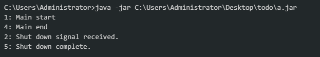
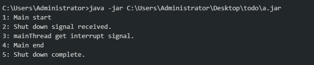

============================
背景
============================
在系统生命周期中, 免不了要做升级部署, 对于关键服务, 我们应该能做到不停服务完成升级 (perform a zero downtime upgrade), 对于一般系统, 应该做到优雅地停服务.

如何做到不停服务的升级? 需要做到下面两点:
\1. 服务本身应该部署多份, 前面应该有 LVS/Haproxy 层或者服务注册组件.
\2. 每一份服务能被优雅停机, 即: 在 kill pid 命令发出后, 程序应该能拒绝新的请求, 但应该继续完成已有请求的处理.

本文重点关注如何支持优雅停机.


============================
Linux kill 命令
============================
kill 命令常用的信号选项:
(1) kill -2 pid 向指定 pid 发送 SIGINT 中断信号, 等同于 ctrl+c.
(2) kill -9 pid, 向指定 pid 发送 SIGKILL 立即终止信号.
(3) kill -15 pid, 向指定 pid 发送 SIGTERM 终止信号.
(4) kill pid 等同于 kill 15 pid

SIGINT/SIGKILL/SIGTERM 信号的区别:
(1) SIGINT (ctrl+c) 信号 (信号编号为 2), 信号会被当前进程树接收到, 也就说, 不仅当前进程会收到该信号, 而且它的子进程也会收到.
(2) SIGKILL 信号 (信号编号为 9), 程序不能捕获该信号, 最粗暴最快速结束程序的方法.
(3) SIGTERM 信号 (信号编号为 15), 信号会被当前进程接收到, 但它的子进程不会收到, 如果当前进程被 kill 掉, 它的的子进程的父进程将变成 init 进程 (init 进程是那个 pid 为 1 的进程)

一般要结束某个进程, 我们应该优先使用 kill pid , 而不是 kill -9 pid. 如果对应程序提供优雅关闭机制的话, 在完全退出之前, 先可以做一些善后处理.

如果是 Windows 平台, 可以使用一次Ctrl+C组合来优雅地关闭命令行程序, 注意不是两次Ctrl+C组合.


============================
Java 对于优雅停机的底层支持
============================
Java 语言底层有机制能捕获到 OS 的 SIGINT/ SIGTERM 停止指令的, 具体是通过 Runtime.getRuntime().addShutdownHook() 向 JVM 中注册一个 Shutdown hook 线程, 当 JVM 收到停止信号后, 该线程将被激活运行, 这时候我们就可以向其他线程发出中断指令, 进而快速而优雅地关闭整个程序.

[](javascript:void(0);)

```
public class Test {
    public static void main(String[] args){
        System.out.println("1: Main start");

        Thread mainThread = Thread.currentThread();

        //注册一个 ShutdownHook
        ShutdownSampleHook thread=new ShutdownSampleHook(mainThread);
        Runtime.getRuntime().addShutdownHook(thread);

        try {
            Thread.sleep(30*1000);
        } catch (InterruptedException e) {
            System.out.println("3: mainThread get interrupt signal.");
        }

        System.out.println("4: Main end");  
    }
}

class ShutdownSampleHook extends Thread {
    private Thread mainThread;
    @Override
    public void run() {
        System.out.println("2: Shut down signal received.");
        mainThread.interrupt();//给主线程发送一个中断信号
        try {
            mainThread.join(); //等待 mainThread 正常运行完毕
        } catch (InterruptedException e) {
            e.printStackTrace();
        }
        System.out.println("5: Shut down complete.");
    }

    public ShutdownSampleHook(Thread mainThread) {
        this.mainThread=mainThread;

    }
}
```

[](javascript:void(0);)

 

关于 mainThread.interrupt() 方法的说明, 该方法将给主线程发送一个中断信号. 如果主线程没有进入阻塞状态, interrupt() 其实没有什么作用; 如果主线程处于阻塞状态, 该线程将得到一个 InterruptedException 异常. 在调用 mainThread.join() 或 mainThread.wait() 之前, 仍可以通过调用 mainThread.interrupted() 来清除中断信号.
一个线程有三种进入阻塞状态的方法, 分别是调用 Thread.wait() 或 Thread.join() 或 Thread.sleep().

 

正常情况下, 程序需要运行 30 秒, 程序的输出是:



 

如果在程序启动后, 按下 Ctrl+C, 程序很快就结束了, 最终的输出是:



============================
SpringBoot Web 项目的优雅停机
============================
Java web 服务器通常也支持优雅退出, 比如 tomcat, 提供如下命令:
catalina.sh stop n     , 先等 n 秒后, 然后停止 tomcat.
catalina.sh stop n -force , 先等 n 秒后, 然后 kill -9 tomcat.

SpringBoot Web 项目, 如果使用的是外置 tomcat, 可以直接使用上面 tomcat 命令完成优雅停机. 但通常使用的是内置 tomcat 服务器, 这时就需要编写代码来支持优雅停止.
网上很多文章都提及 Actuator 的 shutdown 提供优雅停机功能, 官方文档也是这么宣传的, 其实并没有实现优雅停机功能, 至少在 SpringBoot 2.1.0, 在 github issues/4657 也有提及, 也许将来会实现, https://github.com/spring-projects/spring-boot/issues/4657

更新: SpringBoot 2.3 之后, SpringBoot已经完美地支持了优雅停机.

本节所有的代码摘自 https://dzone.com/articles/graceful-shutdown-spring-boot-applications
下面是一个简单的测试代码:

[](javascript:void(0);)

```
import org.springframework.web.bind.annotation.RequestMapping;
import org.springframework.web.bind.annotation.RestController;
@RestController
public class LongProcessController {
    @RequestMapping("/long-process")
    public String pause() throws InterruptedException {
        Thread.sleep(20*1000);
        System.out.println("Process finished");
        return "Process finished";
    }
}
```

[](javascript:void(0);)

appication.properties 文件内容:

```
management.endpoint.shutdown.enabled=true
management.endpoints.web.exposure.include=*
```

浏览器访问 GET http://localhost:8080/long-process , 紧接访问actuator shutdown 端点: POST http://localhost:8080/actuator/shutdown , 当应用程序停止时, GET请求并没有得到返回值, 可见 **Actuator 并没有提供优雅停机功能**.

\------------------------------------
增加 GracefulShutdown Connector 监听类
\------------------------------------
当 tomcat 收到 kill 信号后, web程序先关闭新的请求, 然后等待 30 秒, 最后结束整个程序.

[](javascript:void(0);)

```
import org.apache.catalina.connector.Connector;
import org.slf4j.Logger;
import org.slf4j.LoggerFactory;
import org.springframework.boot.web.embedded.tomcat.TomcatConnectorCustomizer;
import org.springframework.context.ApplicationListener;
import org.springframework.context.event.ContextClosedEvent;
import java.util.concurrent.Executor;
import java.util.concurrent.ThreadPoolExecutor;
import java.util.concurrent.TimeUnit;

public class GracefulShutdown implements TomcatConnectorCustomizer, ApplicationListener<ContextClosedEvent> {
    private static final Logger log = LoggerFactory.getLogger(GracefulShutdown.class);
    private volatile Connector connector;
    @Override
    public void customize(Connector connector) {
        this.connector = connector;
    }
    
    @Override
    public void onApplicationEvent(ContextClosedEvent event) {
        this.connector.pause();
        Executor executor = this.connector.getProtocolHandler().getExecutor();
        if (executor instanceof ThreadPoolExecutor) {
            try {
                ThreadPoolExecutor threadPoolExecutor = (ThreadPoolExecutor) executor;
                threadPoolExecutor.shutdown();
                if (!threadPoolExecutor.awaitTermination(30, TimeUnit.SECONDS)) {
                    log.warn("Tomcat thread pool did not shut down gracefully within "
                            + "30 seconds. Proceeding with forceful shutdown");
                }
            } catch (InterruptedException ex) {
                Thread.currentThread().interrupt();
            }
        }
    }
}
```

[](javascript:void(0);)

\------------------------------------
注册自定义的 Connector 监听器
\------------------------------------
在 @SpringBootApplication 入口类中, 增加下面的代码, 注册之前定义的 Connector 监听器.  

[](javascript:void(0);)

```
@Bean
public GracefulShutdown gracefulShutdown() {
    return new GracefulShutdown();
}

@Bean
public ConfigurableServletWebServerFactory webServerFactory(final GracefulShutdown gracefulShutdown) {
    TomcatServletWebServerFactory factory = new TomcatServletWebServerFactory();
    factory.addConnectorCustomizers(gracefulShutdown);
    return factory;
}
```

[](javascript:void(0);)


============================
graceful shutdown-down spring-boot starters
============================
上面的示例代码基本能满足我们的需要, github上甚至有几个专门处理 graceful shutdown-down 的 starter 库, 使用这些 starter 包就不需要上编写 Tomcat Connector 监听类.
https://github.com/jihor/hiatus-spring-boot  , 支持SpringBoot 2
https://github.com/Askerlve/grace-shutdown   , 支持SpringBoot 2
https://github.com/gesellix/graceful-shutdown-spring-boot , 有一些有关 docker 的信息.

hiatus-spring-boot 库是一个很有意思的库, 它并没有实现一个 Tomcat Connector 监听类, 所以直接 kill pid, 将不会有善后处理过程, 它而仅仅是修改 actuator/health 状态为 OUT_OF_SERVICE, 所以要想截流量功能必须配合 discovery server. 项目取名为 hiatus , 该单词和 pause 意思相近, 项目取名是很准确的, 仅仅是暂停服务, 后续可以重新开启服务.


hiatus-spring-boot 的特点是:
\1. actuator metrics 端点只能提供OS/JVM/Tomcat类的指标, hiatus 引入一个 @UnitOfWork 计数器注解, 加在视图方法上, 可以作为一个业务方面的 metrics.
\2. 实现了三个 actuator 端点
/actuator/hiatus-on 端点(POST), 停歇 springBoot 程序,
/actuator/hiatus-off 端点(POST), 恢复 springBoot 程序.
/actuator/hiatus 端点(GET), 查询暂停状态和正在处理的request数量.
进入 hiatus 状态后, actuator/health 端点查询的结果是 "status":"OUT_OF_SERVICE".

项目中的推荐的做法是, 引入 hiatus-spring-boot, 并参考上面示例编写一个Tomcat Connector 监听类, 这样既能优雅应对 kill pid, 又能做到主动截留.

 

============================
docker 微服务的优雅关闭
============================
详见 https://www.cnblogs.com/harrychinese/p/springboot_Dockerize_SpringBoot_App.html 的"docker 微服务的优雅关闭"章节.

 

============================
参考
============================
https://www.jianshu.com/p/0c49eb23c627
https://www.jianshu.com/p/073a0da36d48
https://dzone.com/articles/graceful-shutdown-spring-boot-applications

标签: [SpringBoot](https://www.cnblogs.com/harrychinese/tag/SpringBoot/), [Java](https://www.cnblogs.com/harrychinese/tag/Java/)