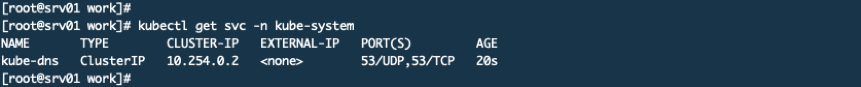
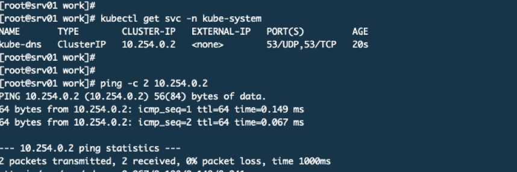
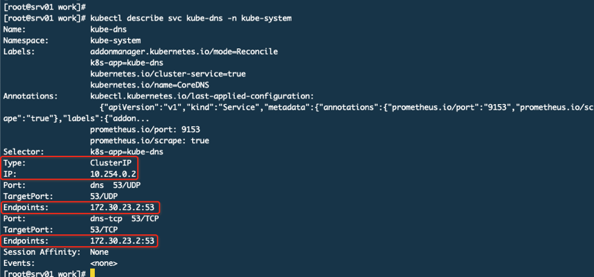
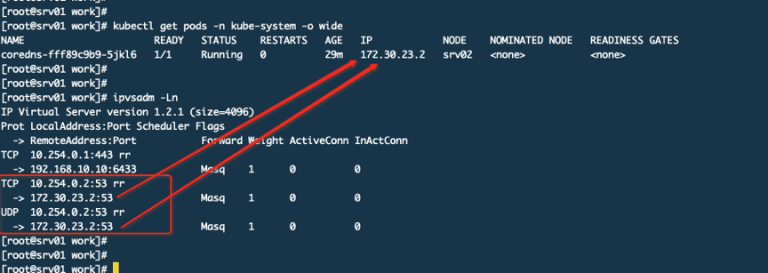
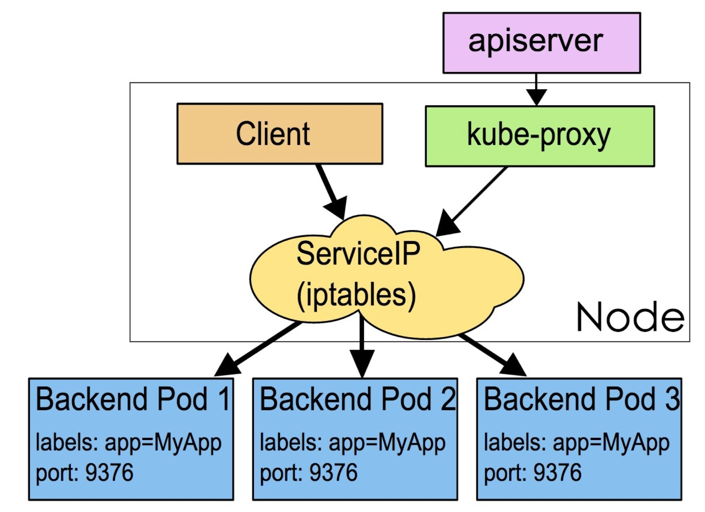
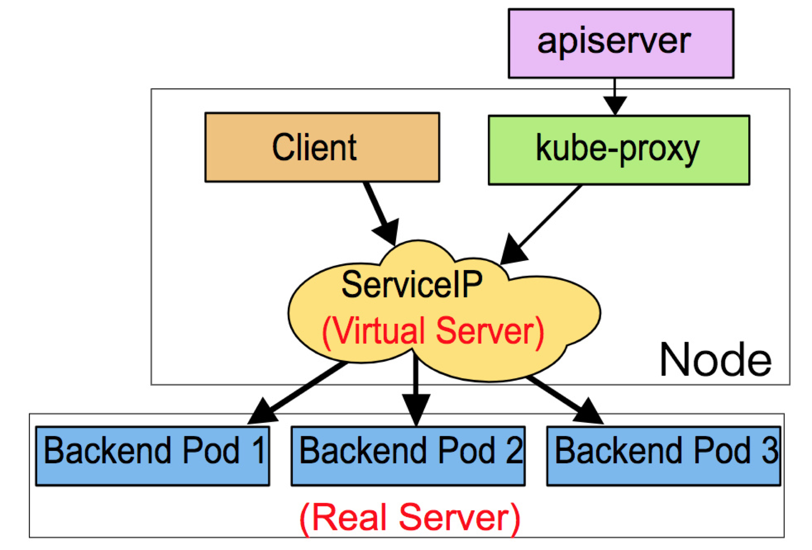
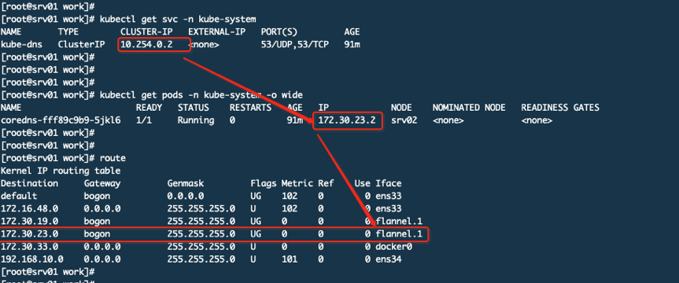
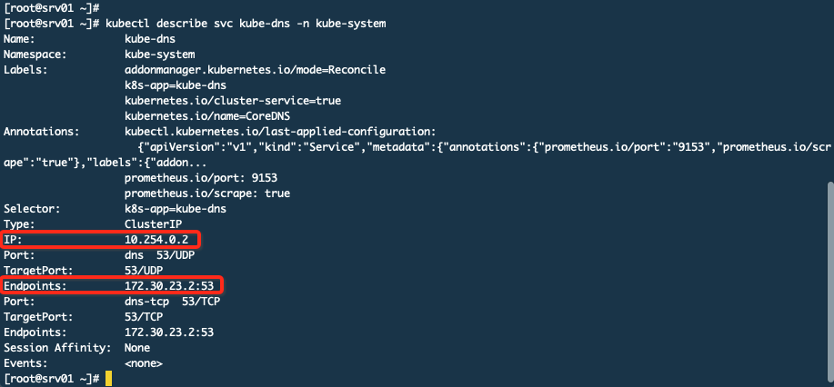

# Kube-proxy的功能

我们知道POD的IP是动态分配的而且经常会变，所以为了可以通过一个不太容易变化的IP访问POD就会使用一个叫做service的东西，通过标签选择器和POD进行关联。

Service提供常用的类型有：

- ClusterIP，也是默认方式。Service会分配一个集群内部的固定虚拟IP，实现集群内通过该IP来对POD进行访问。这个又有两类，上面说到的最普通的Service，ClusterIP还有一种是Headless Service，这种形式不会分配IP也不会通过kube-proxy做反向代理或者负载均衡，而是通过DNS提供稳定的网络ID来访问，DNS会将headless service的后端直接解析为POD的IP列表，这种主要是共StatefulSet类型使用。
- NodePort，这种类型的Service是除了使用ClusterIP的功能外还会映射一个宿主机随机端口到service上，这样集群外部可以通过宿主机IP+随机端口来访问。
- LoadBalancer：和nodePort类似，不过除了使用ClusterIP和NodePort之外还会向使用的公有云申请一个负载均衡器，从而实现集群外部通过LB来访问服务
- ExternalName：是Service的一种特例，此模式主要面对运行在集群外部的服务，通过它可以将外部服务映射到k8s集群，具备k8s内服务的一些特性，来为集群内部提供服务。

我们要说一下ClusterIP这个东西，这是通过yaml安装的一个coredns插件，它就的配置清单中就定义了service。

这个servic ip地址段是在部署API SERVER时API SERVER服务启动配置文件中定义的地址段。而且在Flannel中都没有这个地址段。相比之下POD的IP其实是实实在在配置在容器中的，最终要的是集群中任何节点上都没有关于这个网段的路由信息，那么集群内部是如何通过这个完全虚拟的IP来访问的呢？这就要说到kube-proxy了

*你看在集群的任何机器上都可以PING通这个地址。我们来看看这个svc的详情*

这个10.254.0.2 serviceIP关联了Endpoints（这里是2个endpoints因为POD开放了TCP和UDP的53号端口，所以是2个）。那么现在就有了一个大致的认识就是你访问10.254.0.2就是访问172.30.23.2，而这个172的IP就是POD的真实IP，这个IP段是在Flannel上配置过的。下面再来看一张图：

在IPVS规则中定义了访问10.254.0.2就会转发到172.30.23.2，而172.30.23.2就是POD的IP。

所以通过上面我们就知道它其实是通过IPVS规则来转发的根本不是通过路由来实现的。可是你想过没有这个规则是谁生成的呢？其实就是kube-proxy来生成的，而且这样的规则会同步到集群其他机器上，哪怕这个POD没有运行在自己的机器上也要有这样的规则，只有这样才能保证集群任何一台主机都可以通过这个serviceIP来访问到POD，当面临跨主机的时候才会用到路由规则，由Flannel的隧道来进行转发到真实POD所在主机，然后由该主机的kube-proxy来转发到具体的POD上。

这时候我们就明白了kube-proxy的大致作用，当service有了IP、端口以及POD的IP和端口对应关系以及宿主机随机端口到service的映射，就可以完成对内、外请求的转发，而转发就是，本地转发还是用IPVS规则，而远程则用了路由信息。

集群中每个NODE都运行一个kube-proxy进程，这个就是service的载体。它负责建立和删除包括更新IPVS规则、通知API SERVER自己的更新，或者从API SERVER哪里获取其他kube-proxy的IPVS规则变化来更新自己的。*我们说了多次IPVS，其实kube-proxy支持3中模式*

## *Userspace模式*

userspace，这种模式时最早的，不过已经不推荐使用了，效率低，因为需要在内核空间和用户空间转换。

## Iptables模式

这是默认方案，在内核中通过iptables的NAT实现本地转发和负载均衡。在大规模试用下存在性能问题。

## Ipvs模式

可选方案，如果内核支持且用户指定那么kube-proxy将使用这种模式。在早期版本的K8S中不支持。

## 如果POD不在本机怎么办

本机是srv01而这个coredns是运行在srv02上，你从srv01访问会先进行ipvs找到目标POD的IP地址，发现不在本机就通过路由，访问的网段172.30.23.0走flannel.1这个网络接口，这个接口其实和其他主机的flannel.1通过物理链路做了隧道，所以就可以通。那么10.254.0.2是如何与这个172.30.23.2这个IP建立关系的呢？其实就是service，看下图

 

分类: [Kubernetes](https://www.cnblogs.com/rexcheny/category/1439616.html)

标签: [Kubernetes](https://www.cnblogs.com/rexcheny/tag/Kubernetes/), [kube-proxy](https://www.cnblogs.com/rexcheny/tag/kube-proxy/)

