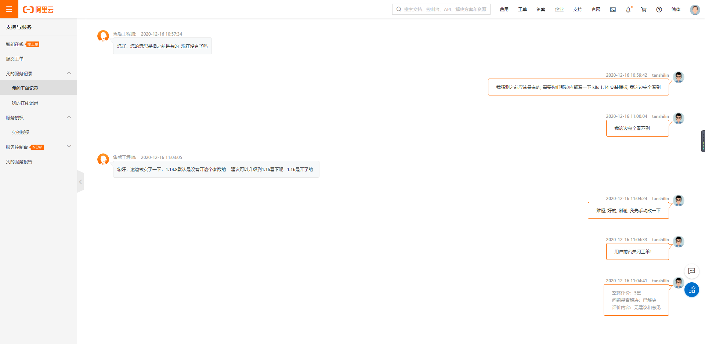

发现一直在报警


看到 node_cadvisor和node_kubectl是有问题的

这个报警是k8s中prometheus operator提供的

我们应该没有改prometheus operator什么东西

在prometheus target里面看到有一个job是处于401状态, 顺着这个job的端口在服务器上找一下

```
找一下这个端口的进程
[root@c-t5-49 ~]# netstat -ntlp|grep 10250
tcp6       0      0 :::10250                :::*                    LISTEN      22398/kubelet
找下这个进程
[root@c-t5-49 ~]# ps aux|grep 22398
root     16371  0.0  0.0 112708   976 pts/0    S+   09:52   0:00 grep --color=auto 22398
看一下这个进程的信息
[root@c-t5-49 ~]# ps aux|grep 22398
root     16371  0.0  0.0 112708   976 pts/0    S+   09:52   0:00 grep --color=auto 22398
root     22398  5.9  2.3 1185892 186188 ?      Ssl  Jul29 12005:45 /usr/bin/kubelet --bootstrap-kubeconfig=/etc/kubernetes/bootstrap-kubelet.conf --kubeconfig=/etc/kubernetes/kubelet.conf --pod-manifest-path=/etc/kubernetes/manifests --allow-privileged=true --network-plugin=cni --cni-conf-dir=/etc/cni/net.d --cni-bin-dir=/opt/cni/bin --enable-controller-attach-detach=false --cluster-dns=10.0.0.10 --pod-infra-container-image=registry-vpc.cn-shenzhen.aliyuncs.com/acs/pause-amd64:3.0 --enable-load-reader --cluster-domain=cluster.local --cloud-provider=external --hostname-override=cn-shenzhen.192.168.3.13 --provider-id=cn-shenzhen.i-wz9318qlyf0us0pyv76z --authorization-mode=Webhook--client-ca-file=/etc/kubernetes/pki/ca.crt --system-reserved=memory=300Mi --kube-reserved=memory=400Mi --eviction-hard=imagefs.available<15%,memory.available<300Mi,nodefs.available<10%,nodefs.inodesFree<5% --cgroup-driver=systemd --anonymous-auth=false --rotate-certificates=true --cert-dir=/var/lib/kubelet/pki


```

然后同样的操作在另外两台正常的kubectl节点服务器上对比发现少了一个 --authentication-token-webhook=true
搜索找资料, 看issue, 发现--authorization-mode=Webhook 要结合 --authentication-token-webhook=true 使用

https://github.com/Azure/AKS/issues/1087

https://github.com/prometheus-operator/prometheus-operator/issues/976

https://github.com/kubernetes/kops/issues/5176

提工单问一下阿里云, 发现



那么就只能手动改一下了, 然后每次新加/重装节点都要改一下kubectl启动参数, 加上 --authentication-token-webhook=true

```
ll /etc/systemd/system/kubelet.service.d
一般来说都是/etc/systemd/system/kubelet.service.d/10-kubeadm.conf 这个文件

修改: 
Environment="KUBELET_AUTHZ_ARGS=--authorization-mode=Webhook --client-ca-file=/etc/kubernetes/pki/ca.crt"
为:
Environment="KUBELET_AUTHZ_ARGS=--authorization-mode=Webhook --authentication-token-webhook=true  --client-ca-file=/etc/kubernetes/pki/ca.crt"

重启kubectl
systemctl daemon-reload
systemctl restart kubelet
systemctl status kubelet
ps -ef |grep kubectl
```

