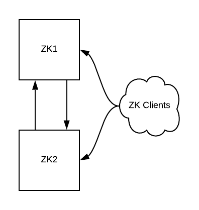
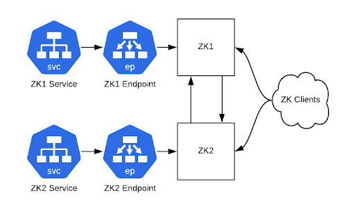
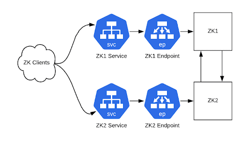
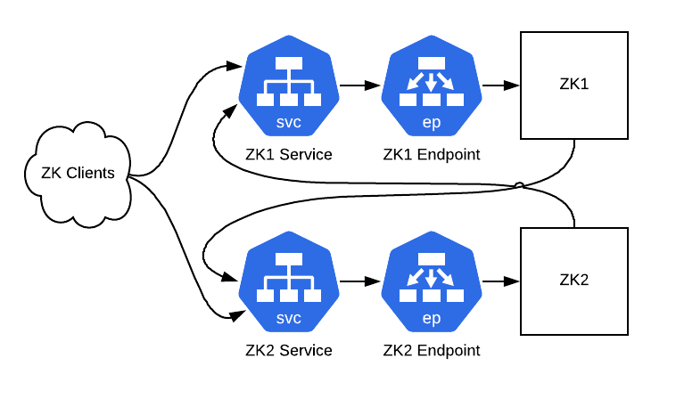
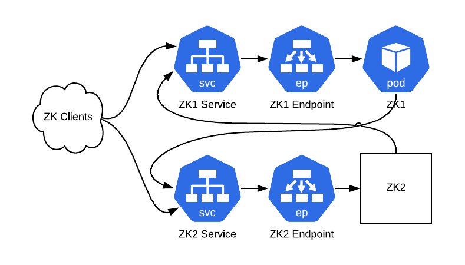

最近，我们在不停机的情况下将数百个 ZooKeeper 实例迁移到了 Kubernetes。我们利用了强大的 Kubernetes 特性（例如端点）简化了迁移过程，那些想要跟我们一样进行 Zookeeper 迁移的人可以在这篇文章里找到答案。文章的末尾列出了进行迁移所需的网络条件。

 

**一、传统的ZooKeeper迁移方法**

 

ZooKeeper 是很多分布式系统的基础，它为这些系统提供了一个强大的平台，让它们可以聚在一起形成集群。它提供了一种比较基础的方法来形成集群：每个服务器实例都有一个配置文件，文件里列出了集群成员的主机名和数字 ID，所有的服务器都有相同的集群成员列表，如下所示：

 

 

server.1=host1:2888:3888

server.2=host2:2888:3888

server.3=host3:2888:3888

 

每台服务器都有一个叫作 myid 的文件，用来指明它在列表中对应的是哪个数字 ID。

 

集群可以随意添加和移除服务器，只要没有违反这个关键规则：每台服务器必须能够与配置文件中列出的仲裁服务器通信。传统的 ZooKeeper 服务器迁移步骤主要包括：

 

- 启动一台新主机，在服务器列表配置中加入“server.4=host:4…”；
- 更新已有主机上的配置文件，添加新的服务器条目，或删除已退役的主机；
- 滚动重启旧主机（3.4x 版本分支不提供动态服务器配置功能）；
- 更新客户端的连接串。

 

这种方法的缺点是需要修改大量的配置文件并进行滚动重启，这种方式可能无法进行可靠的自动化。在将 ZooKeeper 迁移到 Kubernetes 之前，我们也考虑过这种方法，但后来找到了一种更简单的方法。这种方法更为安全，因为根据我们的经验，每一次新的首领选举都存在一个小风险，就是有可能会让依赖它们的系统崩溃。

 

**二、新的迁移方法**

 

我们将已有的 ZooKeeper 服务器包装成 Kubernetes 服务，然后使用相同的 ZooKeeper ID 进行从服务器到 Pod 的一对一替换。这只需要一次滚动重启就可以重新配置现有的 ZooKeeper 实例，然后逐一关闭服务器。不过，我们不打算深入讨论如何为 ZooKeeper 配置 Kubernetes 拓扑，也不打算深入讨论底层的状态就绪检查机制，因为有很多方法可以实现这些操作。

 

我们将分五个步骤进行迁移：

 

- 确保为 ZooKeeper 集群的迁移做好准备；
- 在 Kubernetes 中创建 ClusterIP 服务，将 Zookeeper 包装成服务；
- 修改 ZooKeeper 客户端，让它们连接到 ClusterIP 服务；
- 配置 ZooKeeper 服务器实例，让它们可以基于 ClusterIP 服务地址执行点对点事务；
- 通过 Kubernetes Pod 运行 ZooKeeper 实例。

 

对于下面的每一个步骤，我们都将提供一个基础设施拓扑关系图。为了便于理解，这些图只包含两个 ZooKeeper 实例（在现实当中一般不会创建少于三个节点的集群）。

 

1、准备好先决条件

 

 

 

我们从一个可运行的 ZooKeeper 集群开始，确保主机上的服务能够与 Kubernetes 集群通信。文末介绍了几种方法。

 

图 1：初始状态，一个包含两个实例的 ZooKeeper 集群和一些客户端

 

2、创建ClusterIP服务

 

 

 

为每个 ZooKeeper 服务器创建一个具有匹配端点的 ClusterIP 服务，可以让客户端端口（2181）和集群内部端口（2888、3888）通过。完成之后，就可以通过这些服务主机名连接到 ZooKeeper 集群。

 

Kubernetes ClusterIP 服务在这个时候很有用，因为它们提供了可以作为后端 Pod 负载均衡器的静态 IP 地址。我们用它们进行从服务到 Pod 的一对一映射，相当于为每个 Pod 提供了一个静态的 IP 地址。

 

图 2：可以通过 ClusterIP 服务访问我们的集群（ZooKeeper 仍然运行在物理硬件上）

 

3、重新配置客户端

 

 

 

在可以通过 Kubernetes ClusterIP 服务连接到 ZooKeeper 集群之后，接下来就可以重新配置客户端了。如果你在 ZooKeeper 连接串中使用了 CNAME 记录，那么请修改 DNS 记录。

 

如果客户端在连接失败时不会重新解析 DNS 条目，那么就重新启动客户端。如果没有使用 CNAME 记录，那么就需要使用新的连接串，并重新启动客户端。在这个时候，新旧连接串都可以使用。

 

图 3：客户端现在通过 ClusterIP 服务实例与 ZooKeeper 集群通信

 

4、重新配置ZooKeeper实例

 

 

 

接下来，我们将让 ZooKeeper 服务器通过 ClusterIP 服务进行点对点通信。为此，我们将结合 ClusterIP 服务的地址来修改配置文件。这里还需要配置 zk_quorum_listen_all_ips 标志，如果没有这个，ZooKeeper 实例将无法成功绑定到主机接口上不存在的 IP 地址，因为它是一个 Kube 服务 IP。

 

 

server.1=zk1-kube-svc-0:2888:3888

server.2=zk2-kube-svc-1:2888:3888

server.3=zk3-kube-svc-2:2888:3888

zk_quorum_listen_all_ips: true

 

滚动重新启动这些主机，后面就可以开始准备用 Pod 替换主机了。

 

图 4：ZooKeeper 实例现在通过 ClusterIP 服务与其他实例通信

 

5、使用Pod替代ZooKeeper主机

 

 

 

我们将进行以下这些步骤，每次操作一台服务器：

 

- 选择一台 ZooKeeper 服务器及其相应的 ClusterIP 服务；
- 关闭服务器上的 ZooKeeper 进程；
- 使用与被关闭的 ZooKeeper 具有相同服务器列表配置和 myid 文件的 Pod；
- 等待，直到 Pod 中的 ZooKeeper 启动，并与其他 ZooKeeper 节点的数据同步。

 

就这样，ZooKeeper 集群现在运行在 Kubernetes 中，并带有之前所有的数据。

 

图 5：经过替换后的集群。ZK1 运行在一个 Pod 中，而 ZK2 不需要知道发生了什么

 

6、网络先决条件

 

 

 

要顺利完成这些步骤，需要确保一些网络设置符合条件。你需要确保：

 

- 可以从所有需要连接到 ZooKeeper 的服务器重新路由 Kubernetes Pod 的 IP 地址；
- 所有连接到 ZooKeeper 的服务器必须能够解析 Kubernetes 服务主机名；
- 所有需要连接到 ZooKeeper 的服务器必须运行 kube-proxy，让它们能够访问 ClusterIP 服务。

 

这些可以通过几种方式来实现，我们使用了一个内部网络插件。

 

类似于 Lyft 的插件：https://github.com/aws/amazon-vpc-cni-k8s

或者 AWS 插件：https://github.com/lyft/cni-ipvlan-vpc-k8s

 

可以直接将 AWS VPC IP 地址分配给 Pod，而不是使用虚拟叠加网络，所以可以从任意实例重新路由 Pod 的 IP。叠加网络（如 flannel）也是可以的，只要所有的服务器都可以连接到叠加网络。

 

**>>>>**

 

**参考资料**

 

- https://product.hubspot.com/blog/zookeeper-to-kubernetes-migration

 

作者丨James Kebinger & Paul Furtado

译者丨无明

来源丨架构头条（ID：ArchFront）

dbaplus社群欢迎广大技术人员投稿，投稿邮箱：editor@dbaplus.cn