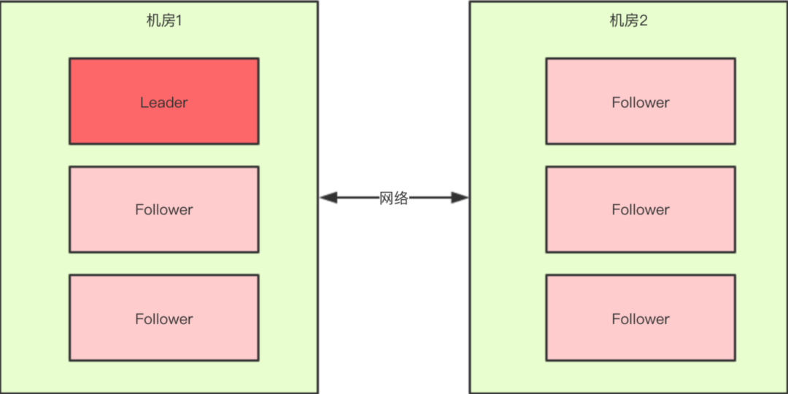
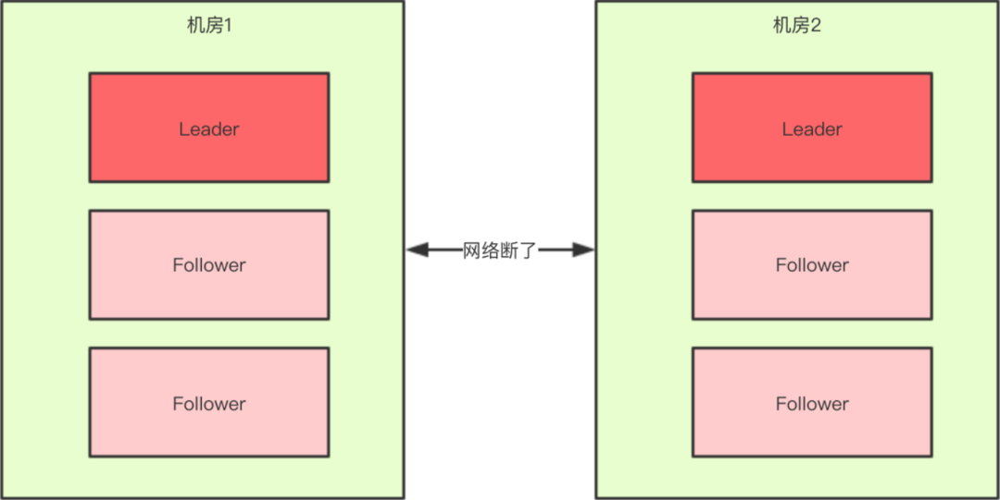
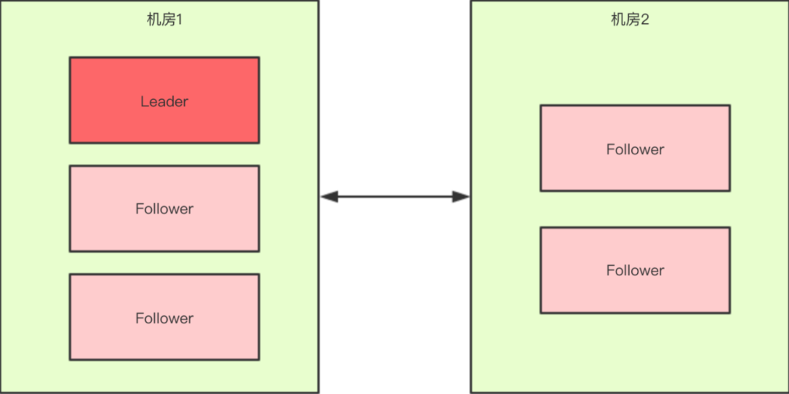

本文重点分享Zookeeper脑裂问题的处理办法。ZooKeeper是用来协调（同步）分布式进程的服务，提供了一个简单高性能的协调内核，用户可以在此之上构建更多复杂的分布式协调功能。

 

脑裂通常会出现在集群环境中，比如ElasticSearch、Zookeeper集群。而这些集群环境有一个统一的特点，就是它们有一个大脑，比如ElasticSearch集群中有Master节点，Zookeeper集群中有Leader节点。

 

**一、 Zookeeper集群节点为什么要部署成奇数**

 

**Zookeeper容错**指的是当宕掉几个Zookeeper节点服务器之后，剩下的个数必须大于宕掉的个数，也就是剩下的节点服务数必须大于n/2，这样Zookeeper集群才可以继续使用，无论奇偶数都可以选举Leader。例如5台Zookeeper节点机器最多宕掉2台，还可以继续使用，因为剩下3台大于5/2。

 

**至于为什么最好为奇数个节点？**

 

这样是为了以最大容错服务器个数的条件下，能节省资源。

 

比如，最大容错为2的情况下，对应的Zookeeper服务数，奇数为5，而偶数为6，也就是6个Zookeeper服务的情况下最多能宕掉2个服务。

 

所以从节约资源的角度看，没必要部署6（偶数）个Zookeeper服务节点。

 

**Zookeeper集群有这样一个特性：集群中只要有过半的机器是正常工作的，那么整个集群对外就是可用的。**

 

也就是说如果有2个Zookeeper节点，那么只要有1个Zookeeper节点死了，那么Zookeeper服务就不能用了，因为1没有过半，所以2个Zookeeper的死亡容忍度为0。

 

同理，要是有3个Zookeeper，一个死了，还剩下2个正常的，过半了，所以3个Zookeeper的容忍度为1。

 

同理也可以多列举几个：2->0; 3->1; 4->1; 5->2; 6->2 就会发现一个规律，2n和2n-1的容忍度是一样的，都是n-1，所以为了更加高效，何必增加那一个不必要的Zookeeper呢。

 

所以说，根据以上可以得出结论：**从资源节省的角度来考虑，Zookeeper集群的节点最好要部署成奇数个！**

 

**二、 Zookeeper集群中的"脑裂"场景说明**

 

对于一个集群，想要提高这个集群的可用性，通常会采用多机房部署，比如现在有一个由6台zkServer所组成的一个集群，部署在了两个机房：

 

图1

 

正常情况下，此集群只会有一个Leader，那么如果机房之间的网络断了之后，两个机房内的zkServer还是可以相互通信的。如果不考虑**过半机制**，那么就会出现每个机房内部都将选出一个Leader。

 

图2

 

这就相当于原本一个集群，被分成了两个集群，出现了两个"大脑"，这就是所谓的"脑裂"现象。

 

对于这种情况，其实也可以看出来，原本应该是统一的一个集群对外提供服务的，现在变成了两个集群同时对外提供服务，如果过了一会，断了的网络突然联通了，那么此时就会出现问题了。两个集群刚刚都对外提供服务了，数据该怎么合并，数据冲突怎么解决等等问题。

 

刚刚在说明脑裂场景时有一个前提条件就是没有考虑过半机制，所以实际上Zookeeper集群中是不会轻易出现脑裂问题的，原因就在于过半机制。

 

**Zookeeper的过半机制：**在领导者选举的过程中，如果某台zkServer获得了超过半数的选票，则此zkServer就可以成为Leader了。

 

举个简单的例子：如果现在集群中有5台zkServer，那么half=5/2=2，那么也就是说，领导者选举的过程中至少要有三台zkServer投了同一个zkServer，才会符合过半机制，才能选出来一个Leader。

 

**那么Zookeeper选举的过程中为什么一定要有一个过半机制验证？**

 

因为这样不需要等待所有zkServer都投了同一个zkServer就可以选举出来一个Leader了。这样比较快，所以叫快速领导者选举算法。

 

**Zookeeper过半机制中为什么是大于，而不是大于等于？**

 

这就是跟脑裂问题有关系了。比如回到上文出现脑裂问题的场景 （如上图1）：

 

当机房中间的网络断掉之后，机房1内的三台服务器会进行领导者选举，但是此时过半机制的条件是 "节点数 > 3"，也就是说至少要4台zkServer才能选出来一个Leader。

 

所以对于机房1来说它不能选出一个Leader，同样机房2也不能选出一个Leader，这种情况下整个集群当机房间的网络断掉后，整个集群将没有Leader。

 

而如果过半机制的条件是 "节点数 >= 3"，那么机房1和机房2都会选出一个Leader，这样就出现了脑裂。这就可以解释为什么过半机制中是大于而不是大于等于，目的就是为了防止脑裂。

 

如果假设我们现在只有5台机器，也部署在两个机房：

 

图3

 

此时过半机制的条件是 "节点数 > 2"，也就是至少要3台服务器才能选出一个Leader。

 

此时机房件的网络断开了，对于机房1来说是没有影响的，Leader依然还是Leader；对于机房2来说是选不出来Leader的，此时整个集群中只有一个Leader。

 

**因此总结得出，有了过半机制，对于一个Zookeeper集群来说，要么没有Leader，要么只有1个Leader，这样Zookeeper也就能避免了脑裂问题。**

 

**三、 Zookeeper集群"脑裂"问题处理**

 

1、什么是脑裂？

 

 

 

简单点来说，脑裂(Split-Brain) 就是比如当你的 cluster 里面有两个节点，它们都知道在这个 cluster 里需要选举出一个 master。那么当它们两个之间的通信完全没有问题的时候，就会达成共识，选出其中一个作为 master。

 

但是如果它们之间的通信出了问题，那么两个结点都会觉得现在没有 master，所以每个都把自己选举成 master，于是 cluster 里面就会有两个 master。

 

对于Zookeeper来说有一个很重要的问题，就是到底是根据一个什么样的情况来判断一个节点死亡down掉了？在分布式系统中这些都是有监控者来判断的，但是监控者也很难判定其他的节点的状态，唯一一个可靠的途径就是心跳，所以Zookeeper也是使用心跳来判断客户端是否仍然活着。

 

**使用ZooKeeper来做Leader HA基本都是同样的方式：**

 

- 每个节点都尝试注册一个象征Leader的临时节点，其他没有注册成功的则成为follower，并且通过watch机制 (这里有介绍) 监控着leader所创建的临时节点；

- Zookeeper通过内部心跳机制来确定leader的状态，一旦Leader出现意外Zookeeper能很快获悉并且通知其他的follower，其他flower在之后作出相关反应，这样就完成了一个切换。这种模式也是比较通用的模式，基本大部分都是这样实现的。

 

但是这里面有个很严重的问题，如果注意不到会导致短暂的时间内系统出现脑裂。因为心跳出现超时可能是Leader挂了，但是也可能是Zookeeper节点之间网络出现了问题，导致Leader假死的情况。

 

Leader其实并未死掉，但是与ZooKeeper之间的网络出现问题导致Zookeeper认为其挂掉了然后通知其他节点进行切换，这样follower中就有一个成为了Leader。

 

但是原本的Leader并未死掉，这时候client也获得Leader切换的消息，仍然会有一些延时，Zookeeper通讯需要一个一个通知。

 

这时候整个系统在混乱中，很有可能有一部分client已经通知到了连接到新的Leader上去了，而有的client仍然连接在老的Leader上。

 

如果同时有两个client需要对Leader的同一个数据更新，并且刚好这两个client此刻分别连接在新老的Leader上，就会出现很严重问题。

 

**这里做下小总结：**

 

- **假死：**由于心跳超时（网络原因导致的）认为Leader死了，但其实leader还存活着；
- **脑裂：**由于假死会发起新的Leader选举，选举出一个新的Leader，但旧的Leader网络又通了，导致出现了两个Leader ，有的客户端连接到老的Leader，而有的客户端则连接到新的leader。

 

2、Zookeeper脑裂是什么原因导致的？

 

 

 

主要原因是Zookeeper集群和Zookeeper client判断超时并不能做到完全同步，也就是说可能一前一后，如果是集群先于client发现，那就会出现上面的情况。

 

同时，在发现并切换后通知各个客户端也有先后快慢。一般出现这种情况的几率很小，需要Leader节点与Zookeeper集群网络断开，但是与其他集群角色之间的网络没有问题，还要满足上面那些情况，但是一旦出现就会引起很严重的后果，数据不一致。

 

3、Zookeeper是如何解决"脑裂"问题的？

 

 

 

要解决Split-Brain脑裂的问题，一般有下面几种种方法：

 

- **Quorums (法定人数) 方式:** 比如3个节点的集群，Quorums = 2, 也就是说集群可以容忍1个节点失效，这时候还能选举出1个lead，集群还可用。比如4个节点的集群，它的Quorums = 3，Quorums要超过3，相当于集群的容忍度还是1，如果2个节点失效，那么整个集群还是无效的。**这是Zookeeper防止"脑裂"默认采用的方法**；
- **Redundant communications (冗余通信)方式：**集群中采用多种通信方式，防止一种通信方式失效导致集群中的节点无法通信。
- **Fencing (共享资源) 方式：**比如能看到共享资源就表示在集群中，能够获得共享资源的锁的就是Leader，看不到共享资源的，就不在集群中。
- **仲裁机制方式；**
- **启动磁盘锁定方式。**

 

要想避免Zookeeper"脑裂"情况其实也很简单，在follower节点切换的时候不在检查到老的Leader节点出现问题后马上切换，而是在休眠一段足够的时间，确保老的leader已经获知变更并且做了相关的shutdown清理工作了，然后再注册成为master就能避免这类问题了。

 

这个休眠时间一般定义为与Zookeeper定义的超时时间就够了，但是这段时间内系统可能是不可用的，但是相对于数据不一致的后果来说还是值得的。

 

**1）ZooKeeper默认采用了Quorums这种方式来防止"脑裂"现象**

 

即只有集群中超过半数节点投票才能选举出Leader。

 

这样的方式可以确保Leader的唯一性,要么选出唯一的一个Leader，要么选举失败。在zookeeper中Quorums作用如下：

 

- **集群中最少的节点数用来选举Leader保证集群可用；**
- **通知客户端数据已经安全保存前集群中最少数量的节点数已经保存了该数据。**一旦这些节点保存了该数据，客户端将被通知已经安全保存了，可以继续其他任务。而集群中剩余的节点将会最终也保存了该数据。

 

假设某个Leader假死，其余的followers选举出了一个新的Leader。这时，旧的Leader复活并且仍然认为自己是Leader，这个时候它向其他followers发出写请求也是会被拒绝的。

 

因为每当新Leader产生时，会生成一个epoch标号(标识当前属于那个Leader的统治时期)，这个epoch是递增的，followers如果确认了新的Leader存在，知道其epoch，就会拒绝epoch小于现任Leader epoch的所有请求。

 

那有没有follower不知道新的Leader存在呢？有可能，但肯定不是大多数，否则新Leader无法产生。Zookeeper的写也遵循quorum机制，因此，得不到大多数支持的写是无效的，旧Leader即使各种认为自己是leader，依然没有什么作用。

 

Zookeeper除了可以采用上面默认的Quorums方式来避免出现"脑裂"，还可以可采用下面的预防措施：

 

**2）添加冗余的心跳线，例如双线条线，尽量减少“裂脑”发生机会**

 

**3）启用磁盘锁**

 

正在服务一方锁住共享磁盘，"裂脑"发生时，让对方完全"抢不走"共享磁盘资源。但使用锁磁盘也会有一个不小的问题，如果占用共享盘的一方不主动"解锁"，另一方就永远得不到共享磁盘。

 

现实中假如服务节点突然死机或崩溃，就不可能执行解锁命令。后备节点也就接管不了共享资源和应用服务。于是有人在HA中设计了"智能"锁。即正在服务的一方只在发现心跳线全部断开（察觉不到对端）时才启用磁盘锁。平时就不上锁了。

 

 

**4）设置仲裁机制**

 

例如设置参考IP（如网关IP），当心跳线完全断开时，2个节点都各自ping一下 参考IP，不通则表明断点就出在本端，不仅"心跳"、还兼对外"服务"的本端网络链路断了，即使启动（或继续）应用服务也没有用了，那就主动放弃竞争，让能够ping通参考IP的一端去起服务。

 

更保险一些，ping不通参考IP的一方干脆就自我重启，以彻底释放有可能还占用着的那些共享资源。