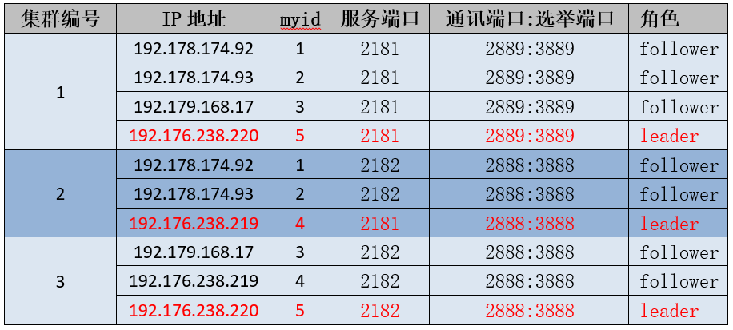

## 运维老鸟告诉你这个经典Zookeeper问题的根因

邹春华 2020-04-16 10:19:33

**作者介绍**

**邹春华，**新炬网络中间件专家。10年软件开发工作经验，9年运营商行业IT系统维护经验。精通C、C++、JAVA、PHP、SHELL等语言，有着深厚的大型IT软件系统开发功底，精通MQ、Redis、Zookeeper、nginx、tomcat等技术组件的配置和优化，也擅长zabbix、Grafana 、cacti、ansbile等组件的运用，有大量的自动化运维开发实践。

 

大家好，我是一名有着近二十年工作经验的运维老鸟。

 

你问运维干什么的？呵呵…运维就像三国里的军师，擅长排兵布阵，能够运筹帷幄，统筹大局。再烂的系统，运维也能玩得转！

 

你说什么？重启能够解决运维90%的问题？

 

嗯…嗯…其实…你说的对！重启能够解决90%的问题，如果不行的话…那就再重启一次试试！

 

好吧，看看大家眼中的运维是什么样的吧：

 

 

至于我对运维的理解…给大家讲讲我们最近解决的一个小问题吧。

 

**一、问题缘由**

 

最近从业务部门纳管了一批ZooKeeper集群，在对纳管集群进行巡检的时候，发现其中一个5节点的集群存在两个leader节点的情况。经与业务部门确认，该集群影响多个重要业务系统，所以在处理问题的时候既要保证ZooKeeper集群能够恢复正常服务，又需要确保所有的业务数据不能丢失。

 

问题集群为三机房部署的可容灾集群，集群信息如下（本文所有IP等关键信息已脱敏）：

 

 

正常情况下一个ZooKeeper集群只能有一个leader节点，若干个follower节点。如下图：

 

 

但是该集群在两个leader节点的情况下，各节点依然状态正常，并能够正常提供服务，确实有点奇怪。为了能够说明清楚该问题，我们先了解下ZooKeeper集群的选举原则。

 

**二、ZooKeeper集群选举原则**

 

ZooKeeper集群的leader选举三原则：

 

- 集群中只有超过半数以上的节点启动，集群才能正常工作；
- 在集群正常服务前，myid小的节点给myid大的节点投票，直到集群正常，选出Leader；
- 选出Leader之后，之前的节点状态由Looking变为Following，以后的节点都是Follower。

 

假设一个5节点的集群，myid分别是1、2、3、4、5，依序启动：

 

**1）节点1启动**

 

- 各节点状态（1：启动；2：关停；3：关停；4：关停；5：关停）
- 选取状态（1: LOOKING；2：-；3：-；4：-；5：-）
- 集群状态（节点未满半数：失败）

 

**2）节点2启动**

 

- 各节点状态（1：启动；2：启动；3：关停；4：关停；5：关停）
- 选取状态（1: LOOKING；2：LOOKING；3：-；4：-；5：-）
- 集群状态（节点未满半数：失败）

 

**3）节点3启动**

 

- 各节点状态（1：启动；2：启动；3：启动；4：关停；5：关停）
- 选取状态（1: FOLLOWING；2：FOLLOWING；3：LEADING；4：-；5：-）
- 集群状态（节点过半数：成功）

 

**4）节点4启动**

 

- 各节点状态（1：启动；2：启动；3：启动；4：启动；5：关停）
- 选取状态（1: FOLLOWING；2：FOLLOWING；3：LEADING；4：FOLLOWING；5：-）
- 集群状态（节点过半数：成功）

 

**5）节点5启动**

 

- 各节点状态（1：启动；2：启动；3：启动；4：启动；5：启动）
- 选取状态（1: FOLLOWING；2：FOLLOWING；3：LEADING；4：FOLLOWING；5：FOLLOWING）
- 集群状态（节点过半数：成功）

 

**三、问题分析**

 

根据集群信息表：

 

 

查看192.176.238.219的日志发现4号节点成为LEADING状态时，集群中有3个节点：

 

 

[myid:4] - INFO [QuorumPeer[myid=4]/0:0:0:0:0:0:0:0:2181:Leader@946] - Have quorum of supporters, sids: [ 1,2,4 ];

 

满足节点数过半的原则，集群正常服务，但是查看节点内容，发现节点1、2的内容和4不一致，反而是节点1、2、3、5内容是一致的。

 

查看节点4的内容：

 

 

查看节点5内容：

 

 

通过内容排查可以看出节点1、2、3、5内容一致，可能属于同一集群，那么节点4为什么和其它节点内容不一致呢？

 

继续排查节点的配置信息，发现节点4配置的内部通讯端口：选举端口与其它节点配置的不一致！

 

节点4配置情况：

 

 

节点1、2、3、5的配置情况：

 

 

通过配置排查可以确认1、2、3、5是属于同一个集群，那4节点又是哪个集群呢？

 

继续排查发现，在同一批主机下面部署了另一个ZooKeeper实例，开放的服务端口是2182，而其配置的内部通讯端口：选举端口正是2888:3888。

 

 

通过排查这个集群节点的内容发现：节点1、2的内容和上面集群的节点4内容是一致的，而这个集群3、4、5节点的内容又是一致的！通过推断，集群状态如下表：

 

 

由于集群2和集群3都有三个节点，配置的总节点数是5，均满足节点数过半的原则！

 

**四、问题影响**

 

那么这种情况下会出现什么问题呢？

 

本来正常情况下A类业务系统只读写2181端口的集群、B类业务系统只读写2182端口的集群，而现在集群2既可以服务A类业务，又可服务B类业务，如果集群2的数据丢失，将影响两类业务的正常运行。

 

 

**五、解决问题**

 

集群2是一个异常集群，但是如果将集群2的节点恢复正常并分别加入到集群1和集群3后，集群2的数据势必会丢失。由于ZooKeeper集群的数据是由A类业务系统和B类业务系统进行读写的，解决的方法首先需要将集群2的数据导出并根据业务类型进行区分，待集群恢复正常后，再将这部分数据依据业务归属分别重新写入到对应的集群。

 

集群恢复步骤：

 

1）为防止数据丢失，备份集群1、集群2、集群3的数据（snapshot和log）。

 

2）提取集群2的数据，并依据业务类型将数据分类，并准备重新写入。

 

3）关停集群2节点4（192.176.238.219:2181）实例，集群2剩余2个节点，不满足半数要求，集群重新进行选举，由于集群2的1、2两个节点的通讯、选举端口和集群3配置一致，并且集群3已经选举了节点5为leader，那么集群2的节点1、2将加入到集群3成为follower，形成5节点的集群。

 

4）修改集群2节点4（192.176.238.219:2181）的内部通讯端口:选举端口为2889:3889

 

5）启动192.176.238.219:2181实例，由于该实例的通讯、选举端口和集群1配置一致，并且集群1已经选举了节点5为leader， 该实例将加入集群1成为follower，形成5节点的集群。

 

6）分别将原集群2的数据分类后重新写入到集群1和集群3。

 

7）检查集群状态，检查集群数据信息，并进行业务测试。

 

恢复后的集群信息如下：

 

 

 

通过以上操作步骤后，集群恢复正常，丢失数据重新写入，所有业务验证正常。

 

**六、小结**

 

该问题根因很简单，只是一个配置的小问题，但是处理却很容易出错。因为这是一个已经在线运行了很久的系统，往往不会怀疑是配置的问题，在处理该问题时，如果没有理清楚问题根因，只是简单将问题集群重启，表面上问题已经解决，但是大量数据将会丢失会严重影响到业务，并且根因没有找到，问题依旧存在，随时可能复发…

 

说了这么多，你还认为运维只是简单的重启就能解决问题吗？那什么是运维呢？

 

其实啊，运维是个灶台，上面背着个黑锅，下面还有个大坑…