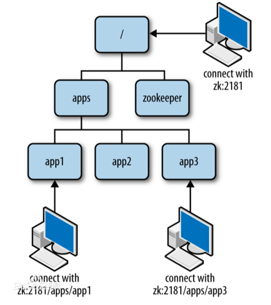
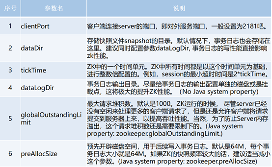
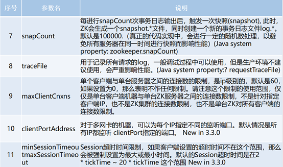
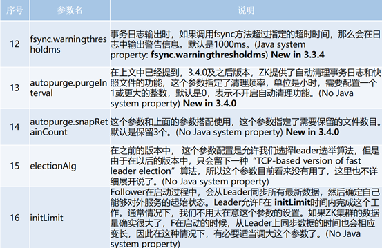
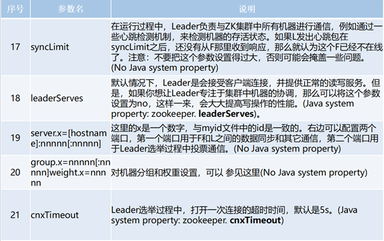
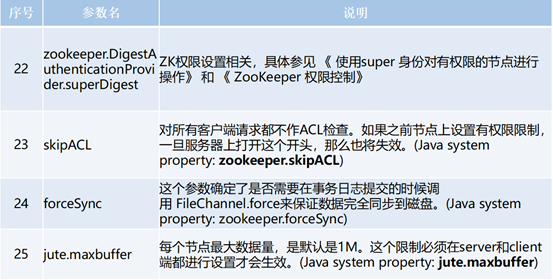
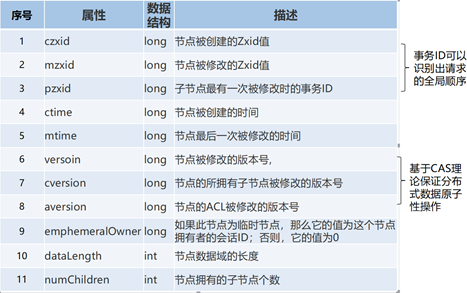
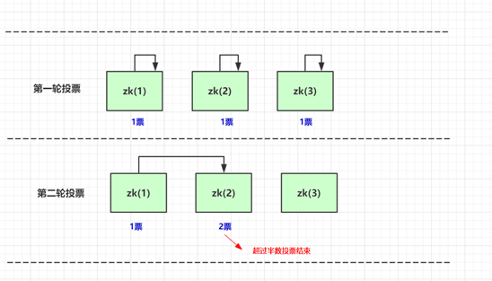
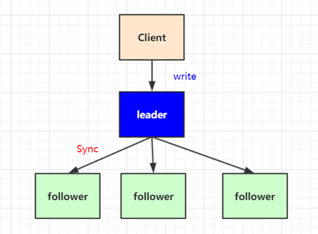
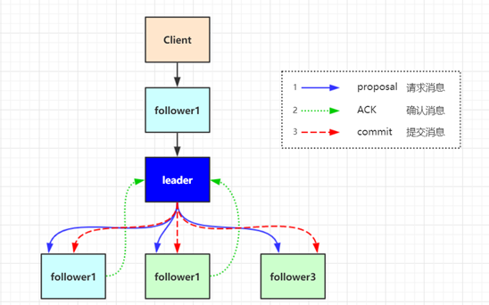

# 1.zookeeper节点特性详解

# 一、zookeeper产生背景：

项目从单体到分布式转变之后，将会产生多个节点之间协同的问题。如：

1. 1. 每天的定时任务由哪个节点来执行？
   2. RPC调用时的服务发现?
   3. 如何保证并发请求的幂等
   4. ....

这些问题可以统一归纳为多节点协调问题，如果靠节点自身进行协调这是非常不可靠的，性能上也不可取。必须由一个独立的服务做协调工作，它必须可靠，而且保证性能。

ZooKeeper是用于分布式应用程序的协调服务。它公开了一组简单的API，分布式应用程序可以基于这些API用于同步，节点状态、配置等信息、服务注册等信息。其由JAVA编写，支持JAVA 和C两种语言的客户端。

zookeeper中数据基本单元叫节点(znode)，节点之下可包含子节点，最后以树级方式程现。每个节点拥有唯一的路径path。客户端基于PATH上传节点数据，zookeeper 收到后会实时通知对该路径进行监听的客户端。



# 二、部署与常规配置

jvm环境安装

下载：https://mirrors.tuna.tsinghua.edu.cn/apache/zookeeper/stable/ [📎apache-zookeeper-3.5.6.tar.gz](https://www.yuque.com/attachments/yuque/0/2019/gz/451150/1576498693040-ce31f27d-9841-44af-84a5-0fccfcf37ee0.gz)

```
#解压到/opt/sxt/
tar -zxvf apache-zookeeper-3.5.6.tar.gz
cd /opt/sxt/apache-zookeeper-3.5.6-bin
mkdir data
cd /opt/sxt/apache-zookeeper-3.5.6/conf
#重命名配置文件zoo_sample.cfg
cp zoo_sample.cfg zoo.cfg
vi zoo.cfg
#修改dataDir=/opt/sxt/apache-zookeeper-3.5.6-bin/data
cd ../bin/
#启动server
./zkServer.sh start
#启动客户端连接server
./zkCli.sh
```

常规配置文件说明

```
# zookeeper时间配置中的基本单位 (毫秒)
tickTime=2000
# 允许follower初始化连接到leader最大时长，它表示tickTime时间倍数 即:initLimit*tickTime
initLimit=10
# 允许follower与leader数据同步最大时长,它表示tickTime时间倍数 
syncLimit=5
#zookeper 数据存储目录
dataDir=/tmp/zookeeper
#对客户端提供的端口号
clientPort=2181
#单个客户端与zookeeper最大并发连接数
maxClientCnxns=60
# 保存的数据快照数量，之外的将会被清除
autopurge.snapRetainCount=3
#自动触发清除任务时间间隔，小时为单位。默认为0，表示不自动清除。
autopurge.purgeInterval=1
```

单机版配置：

```
vi zoo.cfg
#修改dataDir=/opt/sxt/apache-zookeeper-3.5.6-bin/data
cd ../bin/
#启动server
./zkServer.sh start
#启动客户端连接server
./zkCli.sh
```

集群版配置：

https://blog.csdn.net/qinqinde123/article/details/102854529

**zoo.cfg为核心的配置文件**











# 三、客户端命令

## 1. 基本命令列表

```
close                                             #关闭当前会话
quit                                              #退出客户端
connect host:port                                 #重新连接指定Zookeeper服务
create [-s] [-e] [-c] [-t ttl] path [data] [acl]  #创建节点
delete [-v version] path                          #删除节点(不能存在子节点)
deleteall path                                    #删除路径及所有子节点
setquota -n|-b val path                           #设置节点限额 -n 子节点数 -b 字节数
listquota path                                    #查看节点限额
delquota [-n|-b] path                             #删除节点限额
get [-s] [-w] path                                #查看节点数据 -s 包含节点状态 -w 添加监听
getAcl [-s] path                                  #获取path路径上的权限信息
ls [-s] [-w] [-R] path                            #列出子节点 -s状态 -R 递归查看所有子节点 -w 添加监听
printwatches on|off                               #是否打印监听事件
history                                           #查看执行的历史记录
redo cmdno                                        #重复 执行命令，history 中命令编号确定
removewatches path [-c|-d|-a] [-l]                #删除指定监听
set [-s] [-v version] path data                   #设置值
setAcl [-s] [-v version] [-R] path acl            #为节点设置ACL权限
stat [-w] path                                    #查看节点状态 -w 添加监听
sync path                                         #强制同步节点
```

## 2. node数据的增删改查

```
ls /        # 列出子节点 
create /luban "luban is good man"    #创建节点
get /luban                           #查看节点
create /luban/sex "man"              #创建子节点 
delete /luban/sex                    #删除节点
deleteall /luban                     #删除所有节点 包括子节点
```

# 四、zookeeper节点介绍

\1. 节点类型

\2. 节点的监听(watch)

\3. 节点属性说明(stat)

\4. 权限设置(acl)

zookeeper中节点叫znode存储结构上跟文件系统类似，以树级结构进行存储。不同之外在于znode没有目录的概念，不能执行类似cd之类的命令。znode结构包含如下：

a. path:唯一路径

b. childNode：子节点

c. stat:状态属性

d. type:节点类型

## 1. 节点类型

| 类型                  | 描述                           |
| --------------------- | ------------------------------ |
| PERSISTENT            | 持久节点                       |
| PERSISTENT_SEQUENTIAL | 持久序号节点                   |
| EPHEMERAL             | 临时节点(不可再拥有子节点)     |
| EPHEMERAL_SEQUENTIAL  | 临时序号节点(不可再拥有子节点) |

1）PERSISTENT（持久节点）

持久化保存的节点，也是默认创建的

create /test  #默认创建的就是持久节点

2）PERSISTENT_SEQUENTIAL(持久序号节点)

创建时zookeeper 会在路径上加上序号作为后缀。非常适合用于分布式锁、分布式选举等场景。创建时添加 -s 参数即可。

create -s /test            #创建序号节点

Created /test0000000001    #返回创建的实际路径

create -s /test

Created /test0000000002    #返回创建的实际路径2

3） EPHEMERAL（临时节点）

临时节点会在客户端会话断开后自动删除。适用于心跳，服务发现等场景。创建时添加参数-e 即可。

create -e /temp           #创建临时节点， 断开会话 在连接将会自动删除

4）EPHEMERAL_SEQUENTIAL（临时序号节点）

与持久序号节点类似，不同之处在EPHEMERAL_SEQUENTIAL是临时的会在会话断开后删除。创建时添加 -e -s 

create -e -s /temp/seq

## 2. 节点属性

stat /luban                           # 查看节点属性

其属性说明如下表：

 

cZxid = 0x385                        #创建节点的事务ID

ctime = Tue Sep 24 17:26:28 CST 2019      #创建时间

mZxid = 0x385                        #修改节点的事务ID

mtime = Tue Sep 24 17:26:28 CST 2019     #最后修改时间

pZxid = 0x385                        #子节点变更的事务ID

cversion = 0                          #这表示对此znode的子节点进行的更改次数（不包括子节点）

dataVersion = 0                       # 数据版本，变更次数

aclVersion = 0                        #权限版本，变更次数

ephemeralOwner = 0x0                 #临时节点所属会话ID

dataLength = 17                      #数据长度

numChildren = 0                      #子节点数(不包括子子节点)

## 3. 结点的监听

客户添加 -w 参数可实时监听节点与子节点的变化，并且实时收到通知。非常适用保障分布式情况下的数据一至性。其使用方式如下：

| 命令                 | 描述                                                         |
| -------------------- | ------------------------------------------------------------ |
| ls -w path           | 监听子节点的变化（增，删，节点数据变化不会该种监听方式被监听到） |
| get -w path          | 监听节点数据的变化(一次性的，数据变化后需重新设置对该路径的监听) |
| stat -w path         | 监听节点属性的变化                                           |
| printwatches on\|off | 触发监听后，是否打印监听事件(默认on)                         |

## 4. acl权限设置

ACL全称为Access Control List（访问控制列表），用于控制资源的访问权限。ZooKeeper使用ACL来控制对其znode的防问。基于scheme:id:permission的方式进行权限控制。scheme为授权模式、id模式对应值、permission即具体的增删改权限位。

**权限是会话级别的，客户端断开连接后，下次登陆需要重新****addauth(登录)**

**scheme:认证模型**

| 方案   | 描述                                                         |
| ------ | ------------------------------------------------------------ |
| world  | 开放模式，world表示全世界都可以访问（默认设置）              |
| ip     | ip模式，限定客户端IP防问                                     |
| auth   | 用户密码认证模式，只有在会话中添加了认证才可以防问           |
| digest | 与auth类似，区别在于auth用明文密码，而digest 用sha-1+base64加密后的密码。在实际使用中digest 更常见。 |

**permission权限位**

| 权限位 | 权限   | 描述                             |
| ------ | ------ | -------------------------------- |
| c      | CREATE | 可以创建子节点                   |
| d      | DELETE | 可以删除子节点（仅下一级节点）   |
| r      | READ   | 可以读取节点数据及显示子节点列表 |
| w      | WRITE  | 可以设置节点数据                 |
| a      | ADMIN  | 可以设置节点访问控制列表权限     |

**acl 相关命令：**

| 命令    | 使用方式                | 描述         |
| ------- | ----------------------- | ------------ |
| getAcl  | getAcl <path>           | 读取ACL权限  |
| setAcl  | setAcl <path> <acl>     | 设置ACL权限  |
| addauth | addauth <scheme> <auth> | 添加认证用户 |

**world权限示例**

语法： setAcl <path> world:anyone:<权限位>

注：world模式中anyone是唯一的值,表示所有人

1）查看默认节点权限：

create -e /testAcl           #创建一个节点

getAcl /testAcl             #查看节点权限

'world,'anyone: cdrwa       #返回的默认权限表示 ，所有人拥有所有权限。

2）修改默认权限为读写

setAcl /testAcl world:anyone:rw     #设置为rw权限 

get /testAcl                    # 可以正常读

create -e /testAcl/t "hi"           # 无法正常创建子节点

Authentication is not valid : /testAcl/t    # 返回没有权限的异常

**IP权限示例：**

语法： setAcl <path> ip:<ip地址|地址段>:<权限位>

**auth模式示例:**

语法： 

1）setAcl <path> auth:<用户名>:<密码>:<权限位>

2）addauth digest <用户名>:<密码>

**digest 权限示例：**

语法： 

1）setAcl <path> digest :<用户名>:<密钥>:<权限位>

2）addauth digest <用户名>:<密码>

注1：密钥 通过sha1与base64组合加密码生成，可通过以下命令生成

echo -n <用户名>:<密码> | openssl dgst -binary -sha1 | openssl base64

注2：为节点设置digest 权限后，访问前必须执行addauth，当前会话才可以防问。

①设置digest 权限

\#先 sha1 加密，然后base64加密

echo -n luban:123456 | openssl dgst -binary -sha1 | openssl base64

\#返回密钥

2Rz3ZtRZEs5RILjmwuXW/wT13Tk=

\#设置digest权限

setAcl /luban digest:luban:2Rz3ZtRZEs5RILjmwuXW/wT13Tk=:cdrw

②查看节点将显示没有权限

\#查看节点

get /luban

\#显示没有权限访问

org.apache.zookeeper.KeeperException$NoAuthException: KeeperErrorCode = NoAuth for /luban

③ 给当前会话添加认证后在次查看

\#给当前会话添加权限帐户

addauth digest luban:123456

\#在次查看

get /luban

\#获得返回结果

luban is good man

ACL的特殊说明：

**权限仅对当前节点有效，不会让子节点继承**。如限制了IP防问A节点，但不妨碍该IP防问A的子节点 /A/B。

# 二、Zookeeper集群

知识点：

1.集群部署

2.集群角色说明

3.选举机制

4.数据提交机制

\5. 集群配置说明

   zookeeper集群的目的是为了保证系统的性能承载更多的客户端连接设专门提供的机制。通过集群可以实现以下功能：

1）读写分离：提高承载，为更多的客户端提供连接，并保障性能。

2）主从自动切换：提高服务容错性，部分节点故障不会影响整个服务集群。

## 1. 半数以上运行机制说明：

集群至少需要三台服务器，并且强烈建议使用奇数个服务器。因为zookeeper 通过判断大多数节点的存活来判断整个服务是否可用。比如3个节点，挂掉了2个表示整个集群挂掉，而用偶数4个，挂掉了2个也表示其并不是大部分存活，因此也会挂掉(3台就能达到4台的效果)。

## 2. 集群部署

### 1）配置语法：

server.<节点ID>=<ip>:<数据同步端口>:<选举端口>

- **节点ID**：服务id手动指定1至125之间的数字，并写到对应服务节点的 {dataDir}/myid 文件中。
- **IP地址：**节点的远程IP地址，可以相同。但生产环境就不能这么做了，因为在同一台机器就无法达到容错的目的。所以这种称作为伪集群。
- **数据同步端口：**主从同时数据复制端口，（做伪集群时端口号不能重复）。
- **远举端口：**主从节点选举端口，（做伪集群时端口号不能重复）。

### 2）配置文件示例：

```
tickTime=2000
dataDir=/var/lib/zookeeper/
clientPort=2181
initLimit=5
syncLimit=2
#以下为集群配置，必须配置在所有节点的zoo.cfg文件中
server.1=zoo1:2888:3888
server.2=zoo2:2888:3888
server.3=zoo3:2888:3888
```

### 3）集群配置流程：

#### ①分别创建3个data目录用于存储各节点数据

```
mkdir data
mkdir data/1
mkdir data/2
mkdir data/3
```

#### ②编写myid文件

```
echo 1 > data/1/myid
echo 3 > data/3/myid
echo 2 > data/2/myid
```

#### ③编写配置文件

```
#conf/zoo1.cfg
tickTime=2000
initLimit=10
syncLimit=5
dataDir=data/1
clientPort=2181
#集群配置
server.1=127.0.0.1:2887:3887
server.2=127.0.0.1:2888:3888
server.3=127.0.0.1:2889:3889
```


```
#conf/zoo2.cfg
tickTime=2000
initLimit=10
syncLimit=5
dataDir=data/2
clientPort=2182
#集群配置
server.1=127.0.0.1:2887:3887
server.2=127.0.0.1:2888:3888
server.3=127.0.0.1:2889:3889
```


```
#conf/zoo3.cfg
tickTime=2000
initLimit=10
syncLimit=5
dataDir=data/3
clientPort=2183
#集群配置
server.1=127.0.0.1:2887:3887
server.2=127.0.0.1:2888:3888
server.3=127.0.0.1:2889:3889
```

防火墙相关操作  CentOS 7

```
systemctl start/stop/status/enable/disable firewalld
firewall-cmd --zone=public --add-port=2888/tcp --permanent            //开放端口
firewall-cmd --reload                                               //重新载入，使其生效
firewall-cmd --zone=public --remove-port=2888/tcp --permanent           //关闭端口
firewall-cmd --zone=public --query-port=2888/tcp                        //查看端口状态
```

#### ④分别启动

```
./bin/zkServer.sh start conf/zoo1.cfg
./bin/zkServer.sh start conf/zoo2.cfg
./bin/zkServer.sh start conf/zoo3.cfg
```

#### ⑤分别查看状态

```
./bin/zkServer.sh status conf/zoo1.cfg
Mode: follower
./bin/zkServer.sh status conf/zoo2.cfg
Mode: leader
./bin/zkServer.sh status conf/zoo3.cfg
Mode: follower
```

### 4）检查集群复制情况：

#### ①分别连接指定节点

zkCli.sh 后加参数-server 表示连接指定IP与端口。

./bin/zkCli.sh -server 127.0.0.1:2181

./bin/zkCli.sh -server 127.0.0.1:2182

./bin/zkCli.sh -server 127.0.0.1:2183

任意节点中创建数据，查看其它节点已经同步成功。

注意： -server参数后同时连接多个服务节点，并用逗号隔开 127.0.0.1:2181,127.0.0.1:2182

## 3. 集群角色说明

zookeeper集群中总共有三种角色，分别是leader（主节点）follower(子节点) observer（次级子节点）

| 角色         | 描述                                                         |
| ------------ | ------------------------------------------------------------ |
| **leader**   | 主节点，又名领导者。用于写入数据，通过选举产生，如果宕机将会选举新的主节点。 |
| **follower** | 子节点，又名追随者。用于实现数据的读取。同时他也是主节点的备选节点，并用拥有投票权。 |
| **observer** | 次级子节点，又名观察者。用于读取数据，与fllower区别在于没有投票权，不能选为主节点。并且在计算集群可用状态时不会将observer计算入内。 |

**observer配置：**

只要在集群配置中加上observer后缀即可，示例如下：server.3=127.0.0.1:2889:3889:observer

## 4. 选举机制

通过 ./bin/zkServer.sh status <zoo配置文件> 命令可以查看到节点状态

./bin/zkServer.sh status conf/zoo1.cfg

Mode: follower

./bin/zkServer.sh status conf/zoo2.cfg

Mode: leader

./bin/zkServer.sh status conf/zoo3.cfg

Mode: follower

可以发现中间的2182是leader状态。其选举机制如下图：



**投票机制说明：**

第一轮投票全部投给自己

第二轮投票给myid比自己大的相邻节点

如果得票超过半数，选举结束。

**选举触发：**

当集群中的服务器出现已下两种情况时会进行Leader的选举

①服务节点初始化启动

②半数以上的节点无法和Leader建立连接

当节点初始起动时会在集群中寻找Leader节点，如果找到则与Leader建立连接，其自身状态变化**follower或****observer。**如果没有找到Leader，当前节点状态将变化LOOKING，进入选举流程。

在集群运行其间如果有follower或observer节点宕机只要不超过半数并不会影响整个集群服务的正常运行。但如果leader宕机，将暂停对外服务，所有follower将进入LOOKING 状态，进入选举流程。

## 5. 数据同步机制

zookeeper的数据同步是为了保证各节点中数据的一至性，同步时涉及两个流程，一个是正常的客户端数据提交，另一个是集群某个节点宕机在恢复后的数据同步。

**客户端写入请求：**

   写入请求的大至流程是，收leader接收客户端写请求，并同步给各个子节点。如下图



但实际情况要复杂的多，比如client 它并不知道哪个节点是leader 有可能写的请求会发给follower ，由follower在转发给leader进行同步处理



客户端写入流程说明：

①client向zk中的server发送写请求，如果该server不是leader，则会将该写请求转发给leader server，leader将请求事务以proposal形式分发给follower；

②当follower收到收到leader的proposal时，根据接收的先后顺序处理proposal；

③当Leader收到follower针对某个proposal过半的ack后(过半的机器返回ack时)，则发起事务提交，重新发起一个commit的proposal

④Follower收到commit的proposal后，记录事务提交，并把数据更新到内存数据库；

⑤当写成功后，反馈给client。

**服务节点初始化同步：**

在集群运行过程当中如果有一个follower节点宕机，由于宕机节点没过半，集群仍然能正常服务。当leader 收到新的客户端请求，此时无法同步给宕机的节点。造成数据不一至。为了解决这个问题，当节点启动时，第一件事情就是找当前的Leader，比对数据是否一至。不一至则开始同步，**同步完成之后在进行对外提供服务**。

如何比对Leader的数据版本呢，这里通过ZXID事物ID来确认。每次客户端向leader写数据时，该数据都会被同步到各个节点，每个节点都拥有一个zxid，只有当节点数据与leader数据一致时，这些zxid的大小才会相同，当follower节点挂机重启后，其zxid必定比leader的zxid小，此时就需要进行同步。

**ZXID说明：**

   ZXID是一个长度64位的数字，其中**低32位是按照数字递增，任何数据的变更都会导致低32位的数字加1**。**高32位是leader周期编号**，每当选举出一个新的leader时，新的leader就从本地事物日志中取出ZXID，然后解析出高32位的周期编号，进行加1，再将低32位的全部设置为0。这样就保证了每次新选举的leader后，保证了ZXID的唯一性而且是保证递增的。

如果leader节点宕机，在恢复后期间由于有其他数据写入其他节点，在其重新恢复后也不会被选为leader了，因为其zxid小于其他节点的zxid，若让其再次当上leader数据无法同步。

## 5. 四字运维命令

ZooKeeper响应少量命令。每个命令由四个字母组成。可通过telnet或nc向ZooKeeper发出命令。

这些命令默认是关闭的，需要在配置文件中配置4lw.commands.whitelist来打开，可打开部分或全部示例如下：

\#打开指定命令

4lw.commands.whitelist=stat, ruok, conf, isro

\#打开全部

4lw.commands.whitelist=*


安装Netcat工具，已使用nc命令 

\#安装Netcat 工具

yum install -y nc

\#查看服务器及客户端连接状态

echo stat | nc localhost 2181

**命令列表**

1.conf：3.3.0中的新增功能：打印有关服务配置的详细信息。

2.缺点：3.3.0中的新增功能：列出了连接到该服务器的所有客户端的完整连接/会话详细信息。包括有关已接收/已发送的数据包数量，会话ID，操作等待时间，最后执行的操作等信息。

3.crst：3.3.0中的新增功能：重置所有连接的连接/会话统计信息。

4.dump：列出未完成的会话和临时节点。这仅适用于领导者。

5.envi：打印有关服务环境的详细信息

6.ruok：测试服务器是否以非错误状态运行。如果服务器正在运行，它将以imok响应。否则，它将完全不响应。响应“ imok”不一定表示服务器已加入仲裁，只是服务器进程处于活动状态并绑定到指定的客户端端口。使用“ stat”获取有关状态仲裁和客户端连接信息的详细信息。

7.srst：重置服务器统计信息。

\8. srvr：3.3.0中的新功能：列出服务器的完整详细信息。

\9. stat：列出服务器和连接的客户端的简要详细信息。

1. wchs：3.3.0中的新增功能：列出有关服务器监视的简要信息。

\11. wchc：3.3.0中的新增功能：按会话列出有关服务器监视的详细信息。这将输出具有相关监视（路径）的会话（连接）列表。请注意，根据手表的数量，此操作可能会很昂贵（即影响服务器性能），请小心使用。

\12. dirs：3.5.1中的新增功能：以字节为单位显示快照和日志文件的总大小

\13. wchp：3.3.0中的新增功能：按路径列出有关服务器监视的详细信息。这将输出具有关联会话的路径（znode）列表。请注意，根据手表的数量，此操作可能会很昂贵（即影响服务器性能），请小心使用。

\14. mntr：3.4.0中的新增功能：输出可用于监视集群运行状况的变量列表。