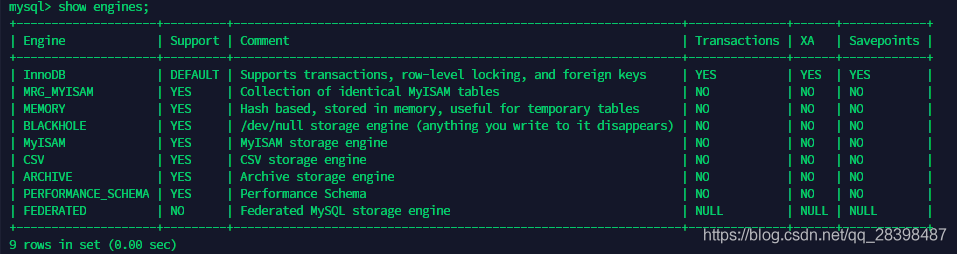

# MYSQL8在Ubuntu 18.04.3安装，索引，性能分析基本介绍


由 邮差的信 提交于 2020-10-07 00:57:59


# MYSQL


## MYSQL架构介绍


### MYSQL简介

MySQL是一个关系型数据库管理系统，由瑞典MySQL AB公司开发，目前属于Oracle公司。 MySQL是一种关联数据库管理系统，将数据保存在不同的表中，而不是将所有数据放在一个大仓库内，这就增加速度并提高了灵活性。


### MYSQL安装

安装

```
在 Ubuntu 18.04.3下安装mysql8
wget https://dev.mysql.com/get/mysql-apt-config_0.8.15-1_all.deb
sudo dpkg  -i mysql-apt-config_0.8.15-1_all.deb
sudo apt install mysql-server
mysql -u root -p
select host, user, authentication_string, plugin from mysql.user;
```


### MYSQL用户与权限管理


#### MYSQL用户管理

1.创建用户

```
创建hb用户，密码123
create user 'hbx'@'%' identified  with mysql_native_password by '123';
创建hb用户，ip:192.118.1.1,密码123
create user 'hb'@'192.118.1.1' identified by '123';
创建ip：192.118.1.开头的hb用户，密码123
create user 'hb'@'192.118.1.%' identified by '123';
```

2.了解user表

```
查看用户
select host,user,password,select_priv,insert_priv,drop_priv from mysql.user;
```


3.删除用户

```
drop user '用户名'@'IP地址';
```

4.修改用户

```
rename user '用户名'@'IP地址' to '新用户名'@'IP地址';
flush privileges; 
```

5.修改密码

```
set password for '用户名'@'IP地址'=Password('新密码');
flush privileges; 
```


#### MYSQL权限管理

1.查看权限

```
show grants for '用户'@'IP地址'
```

2.授权

```
授权命令 
grant 权限1,权限2,…权限n on 数据库名称.表名称 to 用户名@用户地址 ;
授权 hb用户仅对db1.t1文件有查询、插入和更新的操作
grant select ,insert,update on db1.t1 to "hb"@"%";
授权hb用户对db1下的t1文件有任意操作
grant all privileges  on db1.t1 to "hb"@'%';
授权hb用户对所有数据库中文件有任何操作
grant all privileges  on *.*  to "hb"@'%';
```

3.取消权限

```
收回权限命令： 
revoke  权限1,权限2,…权限n on 数据库名称.表名称  from  用户名@用户地址 ;
取消hb用户对db1的t1文件的任意操作
revoke all on db1.t1 from 'hb'@"%";  
取消来自远程服务器的hb用户对数据库db1的所有表的所有权限
revoke all on db1.* from 'hb'@"%";  
取消来自远程服务器的hb用户所有数据库的所有的表的权限
revoke all privileges on *.* from 'hb'@'%';
```


#### MYSQL存储引擎

1.查看指令

```
show  engines
```


2.各引擎介绍
1> InnoDB存储引擎
InnoDB是MySQL的默认事务型引擎，它被设计用来处理大量的短期(short-lived)事务。除非有非常特别的原因需要使用其他的存储引擎，否则应该优先考虑InnoDB引擎。
2> MyISAM存储引擎
MyISAM提供了大量的特性，包括全文索引、压缩、空间函数(GIS)等，但MyISAM不支持事务和行级锁，有一个毫无疑问的缺陷就是崩溃后无法安全恢复。
3> Archive引擎
Archive档案存储引擎只支持INSERT和SELECT操作，在MySQL5.1之前不支持索引。Archive表适合日志和数据采集类应用。根据英文的测试结论来看，Archive表比MyISAM表要小大约75%，比支持事务处理的InnoDB表小大约83%。
4> Blackhole引擎
Blackhole引擎没有实现任何存储机制，它会丢弃所有插入的数据，不做任何保存。但服务器会记录Blackhole表的日志，所以可以用于复制数据到备库，或者简单地记录到日志。但这种应用方式会碰到很多问题，因此并不推荐。
5> CSV引擎
CSV引擎可以将普通的CSV文件作为MySQL的表来处理，但不支持索引。CSV引擎可以作为一种数据交换的机制，非常有用。CSV存储的数据直接可以在操作系统里，用文本编辑器，或者excel读取。
6> Memory引擎
如果需要快速地访问数据，且数据不会被修改，重启以后丢失也没有关系，那么使用Memory表是非常有用。Memory表至少比MyISAM表要快一个数量级。
3.InnoDB和MyISAM区别


| 对比项         | MyISAM                                                   | InnoDB                                                       |
| :------------- | :------------------------------------------------------- | :----------------------------------------------------------- |
| 外键           | 不支持                                                   | 支持                                                         |
| 事务           | 不支持                                                   | 支持                                                         |
| 行表锁         | 表锁，即使操作一条记录也会锁住整个表，不适合高并发的操作 | 行锁,操作时只锁某一行，不对其它行有影响，适合高并发的操作    |
| 缓存           | 只缓存索引，不缓存真实数据                               | 不仅缓存索引还要缓存真实数据，对内存要求较高，而且内存大小对性能有决定性的影响 |
| 关注点         | 节省资源、消耗少、简单业务                               | 并发写、事务、更大资源                                       |
| 默认安装       | Y                                                        | Y                                                            |
| 默认使用       | N                                                        | Y                                                            |
| 自带系统表使用 | Y                                                        | N                                                            |


### 索引优化分析

性能下降SQL执行慢(执行时间长，等待时间长)原因：1.数据过多(分库分表)，2.关联太多表，太多join(sql优化)，3.没有充分利用索引(建立索引)


#### 索引简介

MySQL官方对索引的定义为：索引(Index)是帮助MySQL高效获取数据的数据结构。即索引的本质是数据结构。如下图就是一种索引方式。

图左边是数据表，一共有两列七条记录，最左边是数据记录的物理地址。为了加快Col2的查找，可以维护图右边所示的二叉查找树，每个节点分别包含索引键值和一个指向对应数据记录物理地址的指针，这样就可以运用二叉查找在一定的复杂度内获取到相应数据，从而快速检索出符合条件的记录。简而言之，数据库除数据本身之外，还维护着一个满足特定查找算法的数据结构，这些数据结构以某种方式指向数据，这种数据结构就是索引。
索引优势：一.可以提高数据检索的效率，降低数据库的IO成本。二.通过索引列对数据进行排序，可以降低数据排序的成本，降低CPU的消耗。
索引劣势：虽然索引大大提高了查询速度，但却会降低更新表的速度。如对表进行INSERT、UPDATE和DELETE操作，因更新表时MySQL不仅要保存数据，还要保存索引文件每次更新添加了索引列的字段，都会调整因为更新所带来的键值变化后的索引信息。实际上索引也是一张表，该表保存了主键与索引字段，并指向实体表的记录，所以索引列也是要占用空间的


#### 索引结构

系统从磁盘读取数据到内存是以磁盘块(block)为基本单位的，位于同一个磁盘块中的数据会被一次性读取出来，而不是需要什么取什么。InnoDB存储引擎中有页（Page）的概念，页是其磁盘管理的最小单位。InnoDB存储引擎中默认每个页的大小为16KB，可通过参数innodb_page_size将页的大小设置为4K、8K、16K。

```
查看页的大小
show variables like 'innodb_page_size';
```


B-Tree索引

如上图所示为一颗b树，浅蓝色的块我们称之为一个磁盘块，每个磁盘块包含几个数据项（深蓝色所示）和指针（黄色所示)。磁盘块1包含数据项17和35，包含指针P1、P2、P3，P1表示小于17的磁盘块，P2表示在17和35之间的磁盘块，P3表示大于35的磁盘块。
模拟查找关键字29的过程：
1.根据根节点找到磁盘块1，读入内存。【磁盘I/O操作第1次】
2.比较关键字29在区间（17,35），找到磁盘块1的指针P2。
3.根据P2指针找到磁盘块3，读入内存。【磁盘I/O操作第2次】
4.比较关键字29在区间（26,30），找到磁盘块3的指针P2。
5.根据P2指针找到磁盘块8，读入内存。【磁盘I/O操作第3次】
6.在磁盘块8中的关键字列表中找到关键字29。
分析上面过程，发现需要3次磁盘I/O操作，和3次内存查找操作。由于内存中的关键字是一个有序表结构，可以利用二分法查找提高效率。而3次磁盘I/O操作是影响整个B-Tree查找效率的决定因素。B-Tree相对于AVLTree缩减了节点个数，使每次磁盘I/O取到内存的数据都发挥了作用，从而提高了查询效率。


B+Tree索引

如上图所示B+Tree是在B-Tree基础上的一种优化，使其更适合实现外存储索引结构，InnoDB存储引擎就是用B+Tree实现其索引结构。从B-Tree结构图中可以看到每个节点包含数据项，而每一个页的存储空间是有限的，如果数据较大时将会导致每个节点（即一个页）能存储数量很小，当存储的数据量很大时同样会导致B-Tree的深度较大，增大查询时的磁盘I/O次数，进而影响查询效率。但在B+Tree中，所有数据记录节点都是按照键值大小顺序存放在同一层的叶子节点上，而非叶子节点上只存储key值信息，这样可以大大加大每个节点存储的key值数量，降低B+Tree的高度。
　1）B-Tree的关键字和记录是放在一起的，叶子节点可以看作外部节点，不包含任何信息；B+Tree的非叶子节点中只有关键字和指向下一个节点的索引，记录只放在叶子节点中。
　 2）B-Tree中，越靠近根节点的记录查找时间越快，只要找到关键字即可确定记录的存在；而B+Tree中每个记录的查找时间基本是一样的，都需要从根节点走到叶子节点，而且在叶子节点中还要再比较关键字。从这个角度看B-Tree的性能好像要比B+Tree好，而在实际应用中却是B+Tree的性能要好些。因为B+Tree的非叶子节点不存放实际的数据，这样每个节点可容纳的元素个数比B-Tree多，树高比B-Tree小，这样带来的好处是减少磁盘访问次数。尽管B+Tree找到一个记录所需的比较次数要比B-Tree多，但是一次磁盘访问的时间相当于成百上千次内存比较的时间，因此实际中B+Tree的性能可能还会好些，而且B+Tree的叶子节点使用指针连接在一起，方便顺序遍历（例如查看一个目录下的所有文件，一个表中的所有记录等），这也是很多数据库和文件系统使用B+Tree的缘故。


#### 索引分类

1.单值索引
一个索引只包含单个列，一个表可以有多个单值索引

```
单独建单值索引：
CREATE   INDEX [indexName] ON table_name(column)) 

删除索引：
DROP INDEX [indexName] ON table_name; 
```

2.唯一索引
索引列的值必须唯一，但允许有空值

```
单独建唯一索引：
CREATE  UNIQUE  INDEX [indexName] ON table_name(column)) 
 
删除索引：
DROP INDEX [indexName] ON table_name; 
```

3.主键索引
设定为主键后数据库会自动建立索引，innodb为聚簇索引

```
随表一起建索引：
CREATE TABLE customer 
(id INT(10) UNSIGNED  AUTO_INCREMENT ,
customer_no VARCHAR(200),
customer_name VARCHAR(200),
 PRIMARY KEY(id) 
);
单独建主键索引：
CREATE TABLE customer2 (
id INT(10) UNSIGNED   ,
customer_no VARCHAR(200),
customer_name VARCHAR(200),
 PRIMARY KEY(id) 
);

ALTER TABLE customer  add PRIMARY KEY customer(customer_no);  
 
删除建主键索引：
ALTER TABLE customer 
drop PRIMARY KEY ;  
 
修改建主键索引：
必须先删除掉(drop)原索引，再新建(add)索引
```

4.复合索引
即一个索引包含多个列

```
 随表一起建索引：
CREATE TABLE customer (
id INT(10) UNSIGNED  AUTO_INCREMENT ,
customer_no VARCHAR(200),
customer_name VARCHAR(200),
 PRIMARY KEY(id),
 KEY (customer_name),
 UNIQUE (customer_name),
 KEY (customer_no,customer_name)
);

单独建索引：
CREATE  INDEX idx_no_name ON customer(customer_no,customer_name); 

删除索引：
DROP INDEX idx_no_name  on customer ;
```


### 性能分析(explain)

使用EXPLAIN关键字可以模拟优化器执行SQL查询语句，从而知道MySQL是如何处理SQL语句的。从而分析查询语句或是表结构的性能瓶颈。

```
explain + sql语句
```


```
字段解释
id: select查询的序列号,包含一组数字，表示查询中执行select子句或操作表的顺序
select_type：查询的类型，主要是用于区别普通查询、联合查询、子查询等的复杂查询
table: 显示这一行的数据是关于哪张表
partitions: 显示这一行的数据是关于哪个分区
type: 显示查询使用了何种类型，从最好到最差依次是：system>const>eq_ref>ref>range>index>all
possible_keys: 显示可能应用在这张表中的索引，一个或多个。查询涉及到的字段上若存在索引，则该索引将被列出，但不一定被查询实际使用
key: 实际使用的索引。如果为NULL，则没有使用索引。
key_len： 表示索引中使用的字节数，可通过该列计算查询中使用的索引的长度
ref: 显示索引的哪一列被使用了
rows: 显示MySQL认为它执行查询时必须检查的行数
Extra: 其它重要的额外信息
```