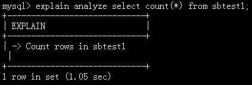
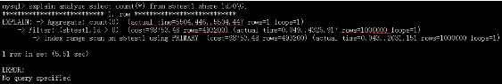
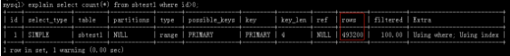
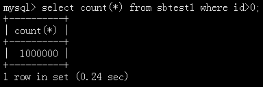

## MySQL 8.0与MariaDB 10.4，谁更易于填坑补锅？

贺春旸 2019-12-17 09:49:51

**作者介绍**

**贺春旸，**凡普金科DBA团队负责人，《MySQL管理之道：性能调优、高可用与监控》第一、二版作者，曾任职于中国移动飞信、安卓机锋网。致力于MariaDB、MongoDB等开源技术的研究，主要负责数据库性能调优、监控和架构设计。

 

本文我将列举一些MySQL 8.0和MariaDB 10.4关键新特性的对比，以便大家在今后的数据库版本升级维护中能根据自身情况更快更好地做出选择，其他新特性请参考官网：

 

- https://dev.mysql.com/doc/refman/8.0/en/mysql-nutshell.html
- https://mariadb.com/kb/en/library/changes-improvements-in-mariadb-104/

 

**Authentication**

 

**一、身份认证插件改变**

 

MySQL 8.0开始将caching_sha2_password作为默认的身份验证插件。如果你升级了数据库至8.0版本，对应用程序jdbc驱动兼容性不友好，让应用程序跑起来最快的方法需要将默认的caching_sha2_password改为之前的mysql_native_password。

 

例：

 

 

ALTER USER 'root'@'localhost' IDENTIFIED WITH mysql_native_password BY 'password';

 

或者直接写死在my.cnf，重启mysqld服务永久生效。

 

 

[mysqld]

default_authentication_plugin = mysql_native_password

（注：推荐用这种方法，方便快捷）

 

MariaDB 10.4身份验证插件仍为mysql_native_password，没有发生改变。

 

**二、增加身份验证插件 - Unix Socket**

 

unix_socket认证插件允许用户通过本地Unix套接字文件连接到MariaDB的时候使用操作系统的凭证。

 

通俗的讲就是用Linux操作系统的账号，去登录MariaDB/MySQL数据库。

 

这个功能是在MariaDB 10.4.6版本里添加的，目前也支持在MySQL 8.0.18版本中。

 

**1）MySQL 8.0.18使用方法**

 

**① 安装插件**

 

 

mysql> INSTALL PLUGIN auth_socket SONAME 'auth_socket.so';

Query OK, 0 rows affected (0.01 sec)

 

**② 创建数据库账号hechunyang**

 

 

mysql> CREATE USER 'hechunyang'@'localhost' IDENTIFIED WITH auth_socket;

Query OK, 0 rows affected (0.00 sec)

 

**③ 创建操作系统账号hechunyang**

 

 

\# useradd hechunyang

\# passwd hechunyang

以hechunyang用户登录操作系统。

 

**④ 登录MySQL 8.0.18**

 

 

[root@localhost soft]# su - hechunyang

Last login: Fri Nov 8 16:40:53 CST 2019>[hechunyang@localhost ~]$

 [hechunyang@localhost ~]$ /usr/local/mysql/bin/mysql -S /tmp/mysql_hcy.sock -uhechunyang -e "select version();"

+-----------+

| version() |

+-----------+

| 8.0.18  |

+-----------+

[hechunyang@localhost ~]$

 

在此示例中，用户hechunyang已登录操作系统并具有完全shell访问权限。他已经使用操作系统进行了身份验证，并且他的MySQL帐户已配置为使用unix_socket身份验证插件，因此他无需再次对数据库进行身份验证。MySQL接受他的操作系统凭证并允许他连接。

 

**2）MariaDB 10.4.10使用方法**

 

**① 创建数据库账号hechunyang**

 

 

MariaDB [(none)]> GRANT ALL ON *.* TO 'hechunyang' IDENTIFIED VIA unix_socket;

Query OK, 0 rows affected (0.001 sec)

 

后续操作和MySQL 8.0.18一样。

 

**InnoDB**

 

**一、数据字典改进支持原子DDL(atomic DDL)**

 

MySQL 8.0使用新的数据字典，废弃了MyISAM系统表。MySQL库元信息存储在数据目录中mysql.ibd的innodb表空间文件中（.frm表结构信息文件移除）。

 

新的数据字典支持原子DDL(atomic DDL)功能，这意味着，当执行DDL时，数据字典更新、存储引擎操作和二进制日志中的写入被组合成一个要么完全执行、要么不执行的单个原子事务。这提供了更好的可靠性，未完成的DDL不会留下任何不完整的数据。

 

比如当对大表做alter table modify变更时，kill -9 mysqld进程，在MySQL8.0之前的版本会留下临时数据文件（例#sql-22a4_17.ibd），而在MySQL 8.0版本里将直接回滚掉。

 

**二、instant ADD COLUMN亿级大表毫秒级加字段**

 

加字段是痛苦的，需要对表进行重建，尤其是对亿级别的大表，虽然Online DDL可以避免锁表，但如果在主库上执行耗时30分钟，那么再复制到从库上执行，主从复制就出现延迟。使用instant ADD COLUMN特性（只需要修改元数据），弹下烟灰的时间，字段就加好了，享受MongoDB那样的非结构化存储的灵活方便。

 

**限制**

 

1）如果指定了AFTER，字段必须是在最后一列，否则会重新建立表。

 

（注：MariaDB 10.4支持加字段在任何位置上使用algorithm=instant算法）

 

2）不适用于ROW_FORMAT = COMPRESSED

 

3）DROP COLUMN需要重建表。

 

（注：MariaDB 10.4支持对DROP删除字段使用algorithm=instant算法）

 

**三、安全执行Online DDL**

 

Online DDL从名字上看很容易误导新手，以为不论什么情况，修改表结构都不会锁表，理想很丰满，现实很骨感，注意这个坑！

 

有以下两种情况执行DDL操作会锁表的，Waiting for table metadata lock（元数据表锁）

 

1）增加、删除字段或索引不会锁全表，删除主键、更改字段属性会锁全表。

 

2）在添加字段alter table表时，对该表的增、删、改、查均不会锁表。而在这之前，该表有被访问时，需要等其执行完毕后，才可以执行alter table，例如在会话一，故意执行一条大结果的查询，然后在会话二执行增加字段age，此时还会出现表锁。

 

针对第二种情况，MariaDB 10.3 增补AliSQL补丁-DDL FAST FAIL，让其DDL操作快速失败。

 

语法为：

 

 

ALTER TABLE tbl_name [WAIT n|NOWAIT] ...

CREATE ... INDEX ON tbl_name (index_col_name, ...) [WAIT n|NOWAIT] ...

DROP INDEX ... [WAIT n|NOWAIT]

DROP TABLE tbl_name [WAIT n|NOWAIT] ...

LOCK TABLE ... [WAIT n|NOWAIT]

OPTIMIZE TABLE tbl_name [WAIT n|NOWAIT]

RENAME TABLE tbl_name [WAIT n|NOWAIT] ...

SELECT ... FOR UPDATE [WAIT n|NOWAIT]

SELECT ... LOCK IN SHARE MODE [WAIT n|NOWAIT]

TRUNCATE TABLE tbl_name [WAIT n|NOWAIT]

 

如果线上有某个慢SQL对该表进行操作，可以使用WAIT n（以秒为单位设置等待）或NOWAIT在语句中显式设置锁等待超时，在这种情况下，如果无法获取锁，语句将立即失败。WAIT 0相当于NOWAIT。

 

（注：MySQL 8.0目前不支持ALTER NOWAIT，仅仅支持SELECT FOR UPDATE NOWAIT）

 

**四、clone克隆插件**

 

从MySQL 8.0.17开始，MySQL提供了一个克隆插件，可以方便我们快速克隆出一个从库或者MGR的Secondary节点。

 

**1）克隆插件的安装和验证过程**

 

**① 安装克隆插件**

 

 

mysql> INSTALL PLUGIN CLONE SONAME 'mysql_clone.so'; 

 

**② 检查克隆插件是否处于活动状态**

 

 

mysql> SELECT PLUGIN_NAME, PLUGIN_STATUS FROM 

INFORMATION_SCHEMA.PLUGINS WHERE PLUGIN_NAME LIKE 'clone';

+-----------------------+--------------------------+

| PLUGIN_NAME | PLUGIN_STATUS |

+-----------------------+--------------------------+

| clone      | ACTIVE     |

+-----------------------+--------------------------+

1 row in set (0.00 sec)

 

**③ 创建clone克隆账号权限（所有节点都执行）**

 

 

CREATE USER 'clone_user'@'%' IDENTIFIED BY '123456';

GRANT BACKUP_ADMIN,CLONE_ADMIN ON *.* TO 'clone_user'@'%';

 

**2）克隆过程**

 

**① 设置提供数据的节点(捐赠者)**

 

 

set global clone_valid_donor_list = '192.168.137.11:3306';

 

**② 开始从远程MySQL(捐赠者)克隆数据并将其传输到当前的MySQL实例**

 

 

CLONE INSTANCE FROM clone_user@192.168.137.11:3306 IDENTIFIED BY '123456';

 

**③ 完成克隆后，新节点mysqld进程会自动重启（原有数据会被自动删除）**

 

**④ 状态查看**

 

 

select * from performance_schema.clone_status;

select * from performance_schema.clone_progress;

 

**⑤ 开启复制**

 

 

CHANGE MASTER TO MASTER_HOST = '192.168.137.11', MASTER_PORT = 

3306,MASTER_USER='repl',MASTER_PASSWORD='repl',MASTER_AUTO_POSITION = 1;

 

start slave;

 

**局限性**

 

- 仅支持InnoDB存储引擎。
- TRUNCATE TABLE在克隆期间为禁止状态。
- 如果DDL正在运行，则克隆操作将等待其执行完才能进行。

 

（注：MariaDB 10.4不支持clone克隆功能）

 

**General Features**

 

**一、MariaDB 10.3支持自动KILL掉未提交的空闲事务**

 

参数innodb_kill_idle_transaction（这个是Percona XtraDB引用的参数），意思为当一个事务长时间未提交，那么这个连接就不能关闭，内存就不释放，并发一大，导致DB连接数增多，就会对性能产生影响。

 

默认是0秒，你可以根据自己的情况设定阈值。超过这个阈值，服务端自动杀死未提交的空闲事务。

 

MariaDB在10.2.6版本里将其移除，因不再捆绑Percona XtraDB，分道扬镳。

 

MariaDB在10.3版本里，增加了3个参数，对标Percona的功能。

 

- idle_transaction_timeout（所有的事务）
- idle_write_transaction_timeout（写事务）
- idle_readonly_transaction_timeout（只读事务）

 

单位为秒。设置这个参数后只针对新的连接有效，正在执行的连接无效。

 

（注：Oralce MySQL 8.0不支持该功能）

 

**二、MariaDB 10.3 系统版本表有效防止数据丢失**

 

系统版本表是SQL:2011标准中首次引入的功能，它存储所有更改的历史数据，而不仅仅是当前时刻有效的数据。

 

举个例子，同一行数据一秒内被更改了10次，那么系统版本表就会保存10份不同时间的版本数据。就像电影《源代码》里的平行世界理论一样，你可以退回任意时间里，从而有效保障你的数据是安全的。也就是说，DBA手抖或是程序BUG引起的数据丢失，在MariaDB 10.3里已然成为过去。

 

具体操作详见：https://dbaplus.cn/news-11-2057-1.html

 

**三、MariaDB 10.3支持update多表ORDER BY and LIMIT**

 

**1）update连表更新，limit语句**

 

 

update t1 join t2 on t1.id=t2.id set t1.name='hechunyang' limit 3;

 

**2）update连表更新，ORDER BY and LIMIT语句**

 

 

update t1 join t2 on t1.id=t2.id set t1.name='hechunyang' order by t1.id DESC limit 3;

 

MySQL 8.0 直接报错

 

 

ERROR 1221 (HY000): Incorrect usage of UPDATE and LIMIT

 

**四、MariaDB 10.3 解决掉了UPDATE不支持同一张表的子查询更新**

 

案例：

 

 

CREATE TABLE t1 (c1 INT, c2 INT);

INSERT INTO t1 VALUES (10,10), (20,20);

UPDATE t1 SET c1=c1+1 WHERE c2=(SELECT MAX(c2) FROM t1);

 

MySQL 8.0 直接报错：

 

 

ERROR 1093 (HY000): You can't specify target table 't1' for update in FROM clause

 

MySQL目前只能改写SQL实现，即max那条语句让其产生衍生表就可以通过：

 

 

UPDATE t1 a, (SELECT MAX(c2) as m_c2 FROM t1) as b SET a.c1=a.c1+1 WHERE a.c2=b.m_c2;

 

**五、MySQL 8.0解决Too many connections数据库连接数被打满**

 

其实这个功能，MySQL增加的着实太晚了。在MariaDB 10.0和Percona5.6版本中，有个参数extra_port可以登录“后门”解决。

 

在MySQL 8.0版本中，有个类似的参数实现了该功能。

 

 

admin_address =  127.0.0.1

admin_port  =  13308

create_admin_listener_thread  =  ON

 

只需要指定13308端口号，就可以连接了。

 

（注：不支持动态修改，要写死在my.cnf配置文件里重启mysqld进程生效）

 

**六、MariaDB FLUSH TABLES命令只关闭未使用的表**

 

会话一

 

 

select id,sleep(60) from t1;

 

因未执行完，t1表持有METADATA LOCK(MDL)元数据锁。

 

会话二

 

 

FLUSH TABLES;

 

在MariaDB 10.4 版本以前，执行FLUSH TABLES会把所有的表强制关闭，因会话一持有MDL元数据锁，固FLUSH TABLES会等待Waiting for table metadata lock。

 

在MariaDB 10.4 GA版本，将只关闭未使用的表，正在使用中的表忽略不受影响。（除非你手工指定表，如FLUSH TABLES t1，将会强制关闭t1表）

 

场景：MHA在线切换调用master_ip_online_change脚本时，第一步会执行FLUSH NO_WRITE_TO_BINLOG TABLES关闭所有表，此时如果你的数据库有未执行完的慢SQL，FLUSH NO_WRITE_TO_BINLOG TABLES就会卡住，导致无法切换。

 

（注：MySQL 8.0.18版本不支持该功能）

 

**Optimizer**

 

**一、Descending Index降序索引**

 

MySQL 8.0开始支持降序索引（InnoDB引擎）。可以直接定义索引为DESC，这样在存储的时候就是降序的，在降序扫描时会大幅度提升性能。当然，最大的好处是我们可以用索引处理 order by a desc ，b asc，c desc混合排序的查询了，在之前的版本，排序的字段顺序必须一致，否则使用不到索引，explain的结果中会出现filesort。

 

 

CREATE TABLE t1 (a INT PRIMARY KEY, b INT, KEY a_idx(a DESC, b ASC));

 

（注：MariaDB 10.4不支持该功能）

 

**二、MySQL 8.0.18 Hash Join不支持left/right join左右连接**

 

在MySQL 8.0.18中，增加了Hash Join新功能，它适用于未创建索引的字段，做等值关联查询。在之前的版本里，如果连接的字段没有创建索引，查询速度会是非常慢的，优化器会采用BNL（块嵌套）算法。

 

Hash Join算法是把一张小表数据存储到内存中的哈希表里，并逐行去匹配大表中的数据，计算哈希值并把符合条件的数据，从内存中返回客户端。

 

我们用explain format=tree命令可以查看到已经使用到hash join算法。

 

但目前8.0.18版本，仅支持join。left join和right join失效，**explain执行计划会显示**，这里请注意。

 

（注：MariaDB 10.4不支持该功能）

 

**三、Explain Analyze在MySQL 8.0.18版本中的扩展使用**

 

在之前的版本里，我们是用explain命令来查看SQL的具体执行计划。在MySQL 8.0.18版本里新增了explain扩展，一个是explain format=tree，另一个是基于explain format=tree延伸扩展的Explain Analyze，今天我们查看下该命令是怎样执行的。

 

测试用例：

 

 

explain analyze select count(*) from sbtest1;

 

 

这个结果很让人奇怪，不加where条件，啥都不能显示出来，貌似是个BUG？

 

加个where id>0再试试。

 

 

explain analyze select count(*) from sbtest1 where id>0;

 

 

注意看红色划线部分，它内部会运行查询并测量执行时间。

 

含义解释：

 

1） cost部分的rows=4932000，是和explain生成的结果一致，都是估算读取的行数。

 

 

2）actual部分的rows=1000000，是执行这条SQL返回的真正结果，见如下图所示。

 

 

3）actual time=5504.446（单位ms毫秒），转换为秒是这条SQL执行的时间为5.5秒，但其实是有很大的误差的，你看上面的执行时间0.24秒，误差很大，因此我们不能真正相信这些数字。

 

MariaDB 10.4也实现了类似的功能，需要开启优化器跟踪，命令如下：

 

 

SET optimizer_trace='enabled=on';

 

然后查看select * from information_schema.optimizer_trace表即可。

 

**四、MySQL 8.0资源组有效解决慢SQL引发CPU告警**

 

资源组的作用是资源隔离（你可以理解为开通云主机时勾选的硬件配置），将线上的慢SQL线程id分配给CPU一个核，让它慢慢跑，从而不影响CPU整体性能。

 

创建一个资源组

 

 

mysql> create resource group slowsql_rg type=user vcpu=3 

thread_priority=19 enable;

 

- slowsql_rg为资源组名字
- type=user 来源是用户端的慢SQL
- vcpu=3 给它分配到哪个CPU核上（你可以用cat /proc/cpuinfo | grep processor查看CPU有多少核）
- thread_priority为优先级别，范围是0到19，19是最低优先级，0是最高优先级。

 

查看资源组信息：

 

 

mysql> select * from information_schema.resource_groups;

 

查找慢SQL的线程ID：

 

 

SELECT THREAD_ID,PROCESSLIST_INFO,RESOURCE_GROUP,PROCESSLIST_TIME FROM 

performance_schema.threads WHERE PROCESSLIST_INFO REGEXP 

'SELECT|INSERT|UPDATE|DELETE|ALTER' AND PROCESSLIST_TIME > 10;

 

把THREAD_ID取出来的值，放入资源组里做限制：

 

 

set resource group slowsql_rg for 379;

 

比如你想放宽的限制，也可以更改：

 

 

ALTER RESOURCE GROUP slowsql_rg VCPU = 3 

THREAD_PRIORITY = 0;

 

关闭资源组，解除限制：

 

 

ALTER RESOURCE GROUP slowsql_rg DISABLE FORCE;

 

（注：MariaDB 10.4不支持该功能）

 

**五、Query Rewrite支持SELECT INSERT UPDETE DELETE REPLACE语句重写**

 

这个功能要点赞，比如开发上线时，有个SQL查询字段索引忘记加了，直接把线上CPU打满，此时，你可以将SQL重写，让业务先报错，别打死数据库，然后马上通知开发回滚，等加完索引后再上线。

 

安装插件：

 

 

mysql -S /tmp/mysql_hcy.sock -p123456 <./install_rewriter.sql

 

查看是否生效：

 

 

SHOW GLOBAL VARIABLES LIKE 'rewriter_enabled';

 

编写重写规则：

 

 

insert into query_rewrite.rewrite_rules(pattern, replacement, 

pattern_database) values (

"SELECT * from sbtest1 limit ?",

"SELECT k,c from sbtest1 limit ?",

"test");

 

意思为将以下语句：

 

 

SELECT * from sbtest1 limit ?;

 

改写成：

 

 

SELECT k,c from sbtest1 limit ?;

 

（注：问号?为变量）

 

执行规则生效：

 

 

CALL query_rewrite.flush_rewrite_rules();

 

演示：

 

 

mysql> SELECT * from sbtest1 limit 1\G;

*************************** 1. row ***************************

k: 499284

c: 83868641912-28773972837-60736120486-75162659906-27563526494-20381887404-41576422241-93426793964-56405065102-33518432330

1 row in set, 1 warning (0.00 sec)

 

ERROR: 

No query specified

 

mysql> show warnings\G

*************************** 1. row ***************************

 Level: Note

  Code: 1105

Message: Query 'SELECT * from sbtest1 limit 1' rewritten to 'SELECT k,c from sbtest1 limit 1' by a query rewrite plugin

1 row in set (0.00 sec)

 

（注：MariaDB 10.4不支持该功能）

 

**Backup**

 

**一、Percona Xtrabackup 8.0备份MySQL 8.0**

 

随着Percona XtraBackup 8.0的推出，Percona XtraBackup 2.4将继续支持MySQL和Percona Server 5.6和5.7数据库。

 

由于MySQL 8.0在数据字典，重做日志和撤消日志中引入的更改与以前的版本不兼容，因此Percona XtraBackup 8.0 目前不支持8.0之前的版本。

 

**1）备份**

 

 

\# xtrabackup --defaults-file=/etc/my_hechunyang.cnf -S /tmp/mysql_hechunyang.sock 

--user='root' --password='123456' --slave-info --backup 

--compress --compress-threads=4 --target-dir=/data/bak/

 

（注：compress是开启压缩模式；compress-threads是开启压缩模式线程数）

 

压缩模式需要先安装Percona自研的qpress压缩工具。

 

 

\# yum install https://repo.percona.com/yum/percona-release-latest.noarch.rpm 

\# yum install qpress -y

 

**2）解压缩**

 

 

\# for bf in `find . -iname "*\.qp"`; do qpress -d $bf $(dirname $bf) && rm -f $bf; done

 

**3）恢复备份期间增量数据（这一步类似innobackupex --apply-log）**

 

 

\# xtrabackup --prepare --target-dir=/data/bak/

 

**4）恢复**

 

① 关闭mysqld进程

 

② 确保datadir目录为空，你可以把原目录改个名字，再创建一个新的

 

③ 恢复

 

 

\# xtrabackup --defaults-file=/etc/my_hechunyang.cnf --copy-back --target-dir=/data/bak/

 

④ 更改目录属性

 

 

\# chown -R mysql:mysql /var/lib/mysql/

 

⑤ 启动mysqld进程

 

**二、MariaDB - Mariabackup热备份工具**

 

自MariaDB10.2.7（含）以上版本，不再支持使用Percona XtraBackup工具在线物理热备份。

 

MariaDB 10.1引入了MariaDB独有的功能，例如InnoDB页面压缩和静态数据加密。这些独家功能在MariaDB用户中非常受欢迎。但是，来自MySQL生态系统的现有备份解决方案（如Percona XtraBackup）不支持这些功能的完全备份功能。

 

为了满足用户的需求，MariaDB官方决定开发一个完全支持MariaDB独有功能的备份解决方案。它基于Percona XtraBackup 2.3.8版本改写扩展。

 

mariabackup工具使用（包含在二进制tar包bin目录下）

 

**1）备份**

 

 

shell> mariabackup --defaults-file=/etc/my.cnf -S /tmp/mysql3306.sock --backup --target-dir=/data/bak/ --user=root --password=123456

 

**2）恢复备份期间增量数据（这一步类似innobackupex --apply-log）**

 

 

shell> mariabackup --prepare --target-dir=/data/bak/

 

（注：/data/bak/xtrabackup_binlog_pos_innodb文件，记录主库show master status的POS点）

 

**3）恢复**

 

步骤

 

① 关闭mysqld进程

 

② 确保datadir目录为空，你可以把原目录改个名字，再创建一个新的

 

③恢复

 

 

\# mariabackup --defaults-file=/etc/my.cnf --copy-back 

--target-dir=/data/bak/

 

④ 更改目录属性

 

 

\# chown -R mysql:mysql /var/lib/mysql/

 

⑤ 启动mysqld进程

 

如果你想在从库上备份，并且想记录从库的show slave status的POS点，以便后续再接一个从库，那么你可以这样搞：

 

 

mariabackup --defaults-file=/etc/my.cnf -S /tmp/mysql3306.sock 

--backup --slave-info --safe-slave-backup --target-dir=/data/bak/ 

--user=root --password=123456

 

（注：/data/bak/xtrabackup_slave_info文件，记录从库show slave status的POS点）