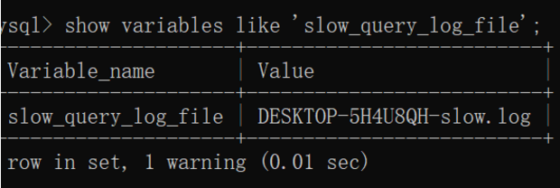
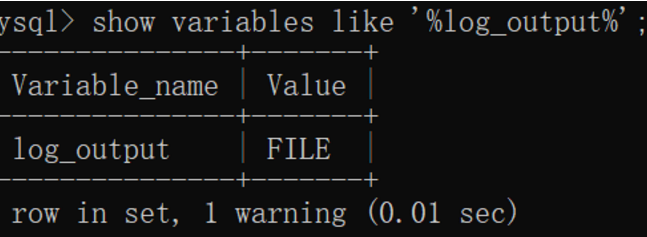

# [【mysql】慢查询SQL获取](https://segmentfault.com/a/1190000022838051)

[ mysql](https://segmentfault.com/t/mysql)

发布于 2020-06-04


##### **检测mysql中sql语句的效率的方法**

###### **（一）查看 ”慢查询日志“**

**slow_query_log**
这个参数设置为ON，可以捕获执行时间超过一定数值的SQL语句


**long_query_time**
当SQL语句执行时间超过此数值时，就会被记录到日志中，单位是秒,默认值是10。建议设置为1或者更短。


**slow_query_log_file**
慢查询日志的文件名


**log_queries_not_using_indexes**
这个参数设置为ON，可以捕获到所有未使用索引的SQL语句，尽管这个SQL语句有可能执行得挺快。（注意：如果只是将log_queries_not_using_indexes设置为ON，而将slow_query_log设置为OFF，此时该设置也不会生效，即该设置生效的前提是slow_query_log的值设置为ON）

**查询MySQL慢查询的输出日志格式为文件还是表，或者两者都有？**


------

###### （二）show processlist 命令

> show processlist 是显示用户正在运行的线程，需要注意的是，除了 root 用户能看到所有正在运行的线程外，其他用户都只能看到自己正在运行的线程，看不到其它用户正在运行的线程。除非单独个这个用户赋予了PROCESS 权限。

主要有两个作用：

(1)查看慢查询的sql是哪个

(2)查看出现锁的sql是哪个

show processlist 显示的信息都是来自MySQL系统库 information_schema 中的 processlist 表。所以使用下面的查询语句可以获得相同的结果：

```
select * from information_schema.processlist
```

- Id: 就是这个线程的唯一标识，当我们发现这个线程有问题的时候，可以通过 kill 命令，加上这个Id值将这个线程杀掉。前面我们说了show processlist 显示的信息时来自information_schema.processlist 表，所以这个Id就是这个表的主键。
- User: 就是指启动这个线程的用户。
- Host: 记录了发送请求的客户端的 IP 和 端口号。通过这些信息在排查问题的时候，我们可以定位到是哪个客户端的哪个进程发送的请求。
- DB: 当前执行的命令是在哪一个数据库上。如果没有指定数据库，则该值为 NULL 。
- Command: 是指此刻该线程正在执行的命令。这个很复杂，下面单独解释
- Time: 此这个状态持续的时间，单位是秒。
- State: 线程的状态，和 Command 对应，下面单独解释。
- Info: 一般记录的是线程执行的语句。默认只显示前100个字符，也就是你看到的语句可能是截断了的，要看全部信息，需要使用 `show full processlist`

下面我们单独看一下 Command 主要的值：

Sleep: 正在等待客户端向它发送执行语句（已经建立了connect，涉及到数据库连接池）

Query: 该线程正在执行一个语句

state列主要的值：

Locked：被其他查询锁住了。（存在Locked就说明当前读写操作存在被阻塞的情况）

例如：

```
| 124912 | hdpic_read  | 192.168.1.39:18862 | hdpic | Query | 845 | Locked | select * from a where ((ID = 16031) AND (STATE != 0))
```

应用场景

（1）找出所有执行时间超过 5 分钟的线程，拼凑出 kill 语句，方便后面查杀。time字段的单位是秒~~~~

```
select concat('kill ', id, ';') from information_schema.processlist where Command != 'Sleep' and Time > 300 order by Time desc;

select concat('kill ', id, ';’) from information_schema.processlist where COMMAND = 'query' and Time > 60*5 order by Time desc;
```

（2）查看死锁

```
#!/bin/bash
mysql -u root -e "show processlist" | grep -i "Locked" >> locked_log.txt

for line in `cat locked_log.txt | awk '{print $1}'
do

  echo "kill $line;" >> kill_thread_id.sql
done
```

现在kill_thread_id.sql的内容像这个样子 kill 66402982;

（3）查看正在锁的事务

```
SELECT * FROM INFORMATION_SCHEMA.INNODB_LOCKS;
```

（4）查看等待锁的事务

```
SELECT * FROM INFORMATION_SCHEMA.INNODB_LOCK_WAITS; 
```