# 极客时间mysql学习笔记

- [mysql](https://leokongwq.github.io/tags/mysql/)

## 前言

本文是对极客时间专栏[MySQL实战45讲](https://time.geekbang.org/column/139) 文章内容和讨论区内容的总结。

## 第一讲 基础架构：一条SQL查询语句是如何执行的？

### mysql 架构

[](https://leokongwq.github.io/2018/12/21/geektime-mysql-learn/mysql_arch.png)

1. MySQL 可以分为 Server 层和存储引擎层两部
2. Sever 层提供了大多数核心的功能， 例如：连接管理，权限验证，查询缓存，词法分析，语法分析，优化器，执行器等。
3. 存储引擎负责数据的存储，插件式设计。InnoDB， MyISAM, Memeory, Archive等。

#### 连接器

1. 负责为何和客户端的TCP连接， 权限获取，验证。
2. 连接器从权限表里面获取用户对应的权限，验证通过后保存在连接中（会话中）后续的所有操作不在查询权限表。 修改权限不影响已经已经存在的连接。
3. 通过`show processlits`查看当前所有的连接。[](https://leokongwq.github.io/2018/12/21/geektime-mysql-learn/show_processlist.png)
4. 如果连接在`wait_timeout`指定的时间内没有任何操作，则会被关闭。默认是8小时。
5. 长时间存活的连接会导致MySQL服务内存占用过大，原因是MySQL临时申请的内存保存在连接对象中，直到连接关闭才会释放。
   - 定时关闭连接 或 执行了大的查询语句后断开连接
   - MySQL5.7以后的版本可以通过`mysql_reset_connection`重新初始化连接（不会重新验证权限）。


#### 查询缓存

1. 查询缓存可以是一个简单的KV缓存，sql语句为key，缓存的内容为值
2. 只要查询语句中的表执行了更新，该表相关的所有查询缓存都会失效。
3. 对于频繁更新的表，不建议开启查询缓存。
4. 基础配置表建议使用查询缓存。
5. 将参数`query_cache_type`的值设置为`demand`，默认不启用查询缓存，除非显示指定：`select SQL_CACHE * from T where...`

#### 分析器

词法分析：识别出SQL中每个单词的含义，例如： `表名`,`字段名称`,`数据库名称`,`关键字`等。
语法分析：分析SQL语句的含义，是否满足SQL语法。

#### 优化器

对SQL语句进行改写优化。

- 索引选择
- 关联查询表的选择
- 优化器可能`选错索引`。

#### 执行器

1. 执行器执行SQL前会检查对应的权限。
2. 执行器调用引擎接口获取数据（取下一行，索引：取满足条件的下一行），并计数。该计数可能引擎真实扫描的数据行数不一致。

## 第二讲 日志系统：一条SQL更新语句是如何执行的？

### redo log

`redo log` 是提高MySQL写入性能的一种机制。否则每次更新都需要写磁盘，频繁写磁盘性能很差。`redo log` 减少磁盘写入次数，将单次写入转为批量顺序写入，提高性能。

`redo log` 可以配置个数和大小，并且是循环写入的。

[](https://leokongwq.github.io/2018/12/21/geektime-mysql-learn/msyql_redolog.jpg)

`redo log`保证MySQL的`Crash-Safe`能力。

InnoDB 必须配置至少一组 redo log。 每组下面至少两个文件， 每个文件大小一致。默认只有一组 redo log， 共2个文件，分别是： ib_logfile0, iblogfile1。

innodb_log_file_size : 指定每个文件的大小
innodb_log_files_in_group : 每组下面文件的个数
innodb_mirrored_log_groups : 指定日志镜像文件组的数量，默认是1. 如果磁盘做了高可用，可以保持不变。
innodb_log_group_home_dir : 指定日志文件所在路径。默认值`./`

### binlog

`binlog` 是MySQL Server层的日志，也称为归档日志。

`binlog` 有三种格式：statement, row, mix

通过`set sql_log_bin=0`来关闭binlog。

### redo log vs binlog

1. redo log 是InnoDB引擎特有的日志。binlog是MySQL Server层的日志，所有引擎共享。
2. redo log 是大小固定，循环写入的，会写满，binlog是追加写入的。
3. redo log 是物理日志，记录了`哪个数据页,做了哪些修改`；binlog是逻辑日志，记录了语句的原始逻辑。

### update语句执行流程

redo log 和 binlog使用了两阶段提交，以此来保证两个日志的逻辑一致。否则会导致数据不一致。

1. 先写redo log 后（crash）写 binlog， 通过binlog恢复数据，数据丢失更新。
2. 先写binlog 后写 redo log, 数据库扩容，通过binlog追主库的数据时，多了一次更新。
3. prepare 阶段，redo log 已经写入磁盘，只是状态是`prepare`。
4. commit 阶段，引擎会将redo log的状态改为`commit`。

### innodb_flush_log_at_trx_commit & sync_binlog

`innodb_flush_log_at_trx_commit`有三个取值：

- 0: 表示事务提交时并不将redo log 写入文件， 等待redo log刷新线程写入文件或其它触发条件。 不能保证是事务的持久性。
- 1: 该参数设置为1，表示每次事务提交，都将redo log写入磁盘（fsync调用）。
- 2: 异步写redo log， 写入操作系统page cache， 不能保证是事务的持久性。

`sync_binlog` 设置为 1 表示每次事务的binlog都写入磁盘。

### 优质问题：

1. 当redo log写满后，新来的事务会导致MySQL将已经更新但是未提交事务修改的内存页(脏页)写入到磁盘中。但因为这些数据其他事务不能读到，或者读到也会放弃。

## 第三讲 事务隔离：为什么你改了我还看不见？

多个事务并发执行时，可能出现`脏读`，`不可重复读`，`幻读`的现象，为了解决这些问题，出现两个隔离级别的概念，不同的隔离级别，解决不同的问题。

### 事务隔离级别

- 读未提交 ： 事务的修改还没有提及，其他事务能看到修改的结果
- 读提交：一个事务的变更只有提交后才能被其他事务看见。
- 可重复读： 一个事务执行过程中看到的数据，总是和事务启动时看到的数据一致。
- 串性化：所有事务串行执行。

### 事务视图

事务执行时会创建一个视图，数据访问时以该视图的逻辑结果为准。

- 读提交 ：这个视图是在每个SQL语句执行前创建的
- 可重复读 ：视图在事务开始时创建

### 事务隔离实现

MySQL中每个记录的更新都有会记录对应的回滚操作。

[](https://leokongwq.github.io/2018/12/21/geektime-mysql-learn/mysql_undo.png)

- 不同时刻启动的事务拥有不同的视图。
- MySQL中一条记录会存在多个不同的版本，这个就是数据库的多版本并发控制MVCC。
- 事务要获取自己视图的数据值，只需要将当前值依次应用回滚日志。
- 当前系统中没有比回滚日志更早的view时，回滚日志会被删除。
- 尽量不要使用长事务，会导致回滚日志占用大量内存；mysql5.5和之前的版本中，回滚日志和数据字典一起存放在ibdata文件中，即使事务提交，回滚日志被清理，但是文件不会缩小。极端情况下需要重建库。

### 事务启动方式

1. 通过 `begin` 或 `start transaction` 启动事务。
2. 通过`set autocommit = 1`启用自动提交，这样每个语句执行后，MySQL自动追加一个`commit`
3. `set autocommit = 0` 关闭自动提交功能。这样连接始终处于一个事务中，直到显式`commit`, `rollback`，或者断开连接事务才结束。但是显示提交事务后，MySQL有马上开启了一个事务。
4. 可以通过`infomation_schema`库中的`innodb_trx`表查询正在执行的事务。

## 第四五讲 深入浅出索引

所有索引的目的都是为了加速数据的查询。

### 索引分类

- 哈希索引 ， 适用与等值查询，不适用区间查询，查询最大值，最小值等
- 有序数组索引， 适用于等值查询，范围查询。因为是数组，插入，更新效率低，所以适用静态数据索引。
- 二叉搜素树索引，平衡二叉查找树查询时间复杂度：log(N)，适用于内存索引，不适合磁盘索引，因为会导致随机访问问题，并且随着数量的增大，树的高度很高，查询效率降低的很快。
- N叉搜素树索引, B树，B+树。适配磁盘访问模式，树的高度更低，查询一个数据需要更少的磁盘访问次数。

### InnoDB 索引模型

InnoDB中，表数据是按照`主键`顺序以索引的形式存放，这种方式称为`索引组织表`。InnoDB使用了B+树作为索引，也就是说数据是存放在B+树种的。

InnoDB中，每个索引都是一个B+树。

[](https://leokongwq.github.io/2018/12/21/geektime-mysql-learn/mysql_index_tree.png)

上图：左边是主键索引，右边是非主键索引。

主键索引的叶子节点保存了`整行`数据, 主键索引也称为`聚簇索引`，非主键索引的叶子节点的内容保存了主键ID。非主键索引也称为二级索引。

#### 主键索引和非主键索引的查询区别？

- 主键索引查询，只需要查询主键索引树。
- 非主键查询，需要先访问二级索引，获取主键索引的值，再访问主键索引树获取数据（这里不考虑覆盖索引）。

### 索引维护

插入，删除数据时，InnoDB需要维护主键索引非主键索引。

1. 插入数据时，如果叶子节点所在的页已经满了的话，需要开辟新的`页`，移动部分数据到新的`页`，该操作称为页分裂，会降低页的空间利用率。
2. 删除数据时，如果相邻的2个`页`里面数据很少，达到某个阈值，那么就会进行页合并，提高空间利用率。

### 索引总结

1. 尽量使用主键索引，因为少了一个查询索引树的操作，速度更快。
2. 建表时，尽量定义自增主键。这样插入数据时，是顺序写入。空间利用率和写入效率都很高。如果是业务主键，那么写入就是随机的，不能利用磁盘的特性（SSD 随机写入要好很多）。
3. 主键索引尽可能的小，这样普通二级索引的叶子节点也较小，整个二级索引树也很小。内存中也可以更多的缓存索引数据。
4. 在表只有一个索引，该索引必须是唯一索引的情况下，可以使用业务字段作为主键索引。

### 覆盖索引

覆盖索引其实是索引的一种特殊类型，指的是：查询返回的字段值全部在`二级索引`上都能满足，不需要再搜素主键索引树的一种情况。

### 最左前缀原则

B+树索引支持按索引的最左前缀来定位记录。

下图： (name, age)是联合索引

[](https://leokongwq.github.io/2018/12/21/geektime-mysql-learn/mysql_index_left_prefix.jpg)

索引项是按照索引定义中字段出现的顺序进行排序的。

1. 不只是索引定义的全部字段，只要满足最左前缀（联合索引的左前n个字段，N个字符）都可以加速查询。有了`(a,b)`就可以不定义索引:`a`， 但是如果有字段`b`的查询,可能需要单独建立字段`b`上的索引。
2. 联合索引，优先考虑索引的复用率，可通过调整字段的顺序来减少需要创建索引个个数。
3. 联合索引需要考虑空间。

### 索引下推

索引下推是mysql5.6新增的一个功能。指的是使用联合索引查询时，在满足最左前缀的条件下，查询语句同时使用了联合索引的其他字段作为条件时，首先使用索引中包含的字段进行条件过滤，减少通过主键ID进行回表查询的次数。

```
mysql> select * from tuser where name like '张 %' and age=10 and ismale=1;
```

该查询可以使用(name, age)这个联合索引，在判断`age=10`这个条件时，可以使用联合索引中age字段的值进行条件过滤。

### 课后问题

```
create table t (
    id int primary key,
    k int not null,
    name varchar(16),
    index (k)) engine = InnoDB;
```

如果要要重建索引`k`,SQL应该怎么写？

答案：

```
alter table t drop index k;
alter table t add index(k);
```

删除主键索引和创建主键索引都会导致表的重建。 如果要重建主键索引可以通过下面的语句来实现：

```
alter table engine = InnoDB;
```

下面的索引是否有问题？

```
CREATE TABLE `geek` (
  `a` int(11) NOT NULL,
  `b` int(11) NOT NULL,
  `c` int(11) NOT NULL,
  `d` int(11) NOT NULL,
  PRIMARY KEY (`a`,`b`),
  KEY `c` (`c`),
  KEY `ca` (`c`,`a`),
  KEY `cb` (`c`,`b`)
) ENGINE=InnoDB;
```

答案：（a, b）, (c) 索引都没有问题，能满足通过字段`a`,`a`和`b`，字段`c`的查询逻辑。

索引(c, a) 不需要（where c=x order by a），因为数据本身就是按照主键索引(a, b)排序的。

索引(c, b) 满足`where c=x order by b`的场景。

## 第六讲全局锁和表锁

数据库锁是用来协调数据库并发请求的。 根据锁范围分为：全局锁，表锁，行锁.

### 全局锁

可以使用`flush tables with read lock;`给整个数据库添加读锁。此后：数据更新语句（数据的增删改）、数据定义语句（包括建表、修改表结果），更新类事务的提交语句都会被阻塞。

全局锁的典型使用场景是：做整个数据库的逻辑备份。确保备份的数据满足一致性要求。

mysqldump 工具在备份数据库时，启动一个事务`添加参数：--single transaction`，确保拿到一致性视图，然后开启备份。但前提是存储引擎必须支持事务。

`set global readonly=true;` 也可以让整个数据库进入只读状态，但是有如下的问题，不建议使用。

1. 使用该命令，影响面积太大。一些系统根据该变量的值来判断数据库时主库还是从库。
2. `flush tables with read lock;`命令执行后，如果客户端断开连接，那么锁会被MySQL自动释放，然而`set global readonly=true;`不会自动释放锁，这样会导致业务不可用的时间变长。
3. 从库上，如果用户有SUPER权限，则read only是无效的。

### 表级锁

MySQL有2中表级锁，一个是表锁，一个是元数据锁MDL。

#### 表锁

表锁的语法是`lock tables a, b... read/write;` 通过 `unlock tables`释放锁，客户端断开连接也会释放锁。注意：`lock tables` 会同时限制本线程和其他线程的后续操作。

### MDL锁

MySQL5.5 引入。MDL表锁不需要显式加锁，它会在访问表时自动添加和释放。

- 当执行`CRUD`操作时，加MDL读锁。
- 当修改表结构时，加MDL写锁。
- 读锁直接不互斥，读写，写写直接互斥。
- 事务提交MDL锁才会释放。
- 获取MDL写锁时，添加超时控制。MariaDB和AliSQL支持该功能。

### 课后题

当备库用`–single-transaction` 做逻辑备份的时候，如果从主库的binlog传来一个DDL语句，从库会怎么样？

```
Q1:SET SESSION TRANSACTION ISOLATION LEVEL REPEATABLE READ;
Q2:START TRANSACTION  WITH CONSISTENT SNAPSHOT；
/* other tables */
Q3:SAVEPOINT sp;
/* 时刻 1 */
Q4:show create table `t1`;
/* 时刻 2 */
Q5:SELECT * FROM `t1`;
/* 时刻 3 */
Q6:ROLLBACK TO SAVEPOINT sp;
/* 时刻 4 */
/* other tables */
```

1. 为了确保RR隔离级别，再次设置了隔离级别。
2. 开启事务，获取一致性视图。
3. 设置保存点sp
4. 获取表结构
5. 获取数据
6. 回滚到保存点sp,释放MDL读锁

- 如果binlog在Q4语句执行前到达，则没有影响，后续获取的是最新的表结构
- 如果在时刻2前到达，则表结构被修改了。后续流程不会执行。mysqldump退出。
- 如果在时刻2和3之间到达，mysqldump占用了MDL锁，binlog被阻塞，现象就是主从延迟。直到Q6完成后才能恢复。
- 从时刻4开始，MDL锁已经释放。现象是没有影响，不过备份拿到的是DDL前的表结构。

## 第七讲 行锁功过：怎么减少行锁对性能的影响

MySQL的行锁是在引擎层实现的。不是所有的引擎都支持行锁，MyISAM就不支持。

InnoDB支持行锁。行锁是在需要时获取，事务提交时释放。这也就是是MySQL的：两阶段锁协议。加锁阶段和释放锁阶段，缩放锁阶段不会再获取锁。

在事务中，把最容易造成锁冲突，最可能影响并发度的操作尽可能放到事务靠后的位置。

### 死锁检测

[](https://leokongwq.github.io/2018/12/21/geektime-mysql-learn/mysql_deadlock.jpg)

高并发系统中，MySQL出现死锁几乎是不可避免的。幸运的是MySQL有死锁检测机制。

解决死锁有两种机制：

- 超时等待。innodb_lock_wait_timeout 参考来控制超时时间(默认50s)。
- 死锁检测。检测到发送死锁时，MySQL回滚权值较低的事务。`innodb_deadlock_detect`设置为 `on`表示开启死锁检测（默认是开启的）。

超时等待太长，业务不可接受。太短可能将简单的锁等待当做死锁处理。所以建议使用死锁检测机制。

死锁检测时，由于每个新来的请求不能获取锁时，都会检测是否因为自己的加入导致了锁等待。当并发量很大时，非常消耗CPU，结果却发现没有死锁。

有两种方法来解决该问题：

1. 如果你确认业务不会发生死锁，则可以临时关闭死锁检测。
2. 控制并发度。在MySQL服务端，针对相同行的更新，进行请求排队。
3. 业务优化，将热点数据行拆分为多行，减少并发度。

### 课后题

如果要删除一个数据表中的前10000行数据，有如下三种方式。哪种方式更合适。

1. `delete from t limit 10000;`
2. 一个连接中循环20次`delete from t limit 500`;
3. 20个连接同时执行`delete from t limit 500`;

答案是：方法二。 方法一：会导致获取多个行锁，事务提交时才释放锁，影响并发度。方法三：人为的增加并发度，因为死锁检测逻辑，导致更多的冲突。

## 第8讲：事务到底是隔离的还是不隔离的？

通常事务的起点并不是`begin/start transaction`, 而是在该语句后面执行第一个操作InnoDB表的语句是开始事务。如果想要立刻开始事务，可以通过`start transaction with consistent snapshot;`.

MySQL中有两个视图view概念：

1. 通过查询语句创建的虚拟表
2. InnoDB实现MVCC时定义的一致性读视图 consistent read view，用于支持实现RC, RR事务隔离级别。
3. 一致性读视图没有物理结构，它是用来定义事务执行期间每个事务能看到的数据规则。

### 快照在MVCC里如何工作

- 在可重复读隔离级别下，事务在启动的时候生产一个快照，并且是整个数据库的快照。
- InnoDB里，每个事务都有一个事务ID，事务ID是系统严格按照递增顺序生成的。
- 每行数据都有多个版本，每次数据更新时，都会生成新的数据版本，并把操作更新的事务id赋值给新版本数据的事务ID，通过新版本可以找到数据的旧版本。[](https://leokongwq.github.io/2018/12/21/geektime-mysql-learn/mysql_row_trx_id.png)
- 数据的其他版本可用通过每个事务的当前版本通过应用undo log来获取。
- 可重复读隔离级别下，一个事务启动时，获取了一个新的事务ID，它只认可在它之前生成的数据版本和它本身生成的数据版本。其它事务的更新生成的数据版本对它都是不可见的。
- 实现上InnoDB，在每个事务启动时，创建了一个数组，用来保存当前`活跃`的事务ID，这里活跃指的是已经启动，但是还未提交。
- 数组里面，事务ID的最小值记为`低水位`，当前系统已经创建过的事务ID的`最大值+1`记为`高水位`。这个视图数组和`高水位`共同构成事务的一致性视图。
- 数据版本的可见性规则，就是基于这个数据的row trx_id和该一致性视图的对比结果得到。

### 数据版本可见性规则

[](https://leokongwq.github.io/2018/12/21/geektime-mysql-learn/mysql_trx_array.png)

如上图：事务启动瞬间，一个数据版本的row trx_id可能的取值有一下几种：

1. 位于绿色区间，表示这个版本是已经提交的，或者当前事务自己生成的，对当前事务可见。
2. 位于红色区间，表示这个版本是未来的事务生成的，肯定不可见，这个容易理解。
3. 位于黄色区间，有2中情况，
   a. 如果row trx_id在数组中，表示该版本是未提交事务生成的。不可见。
   b. row trx_id 不在数组中，表示这个版本是已经提交了的事务生成。可见。（当前活跃事务的ID数组是有序的，但每个元素之间的步长不是1， 中间有漏洞，漏洞里面的事务就是已经提交了的事务）

一个事务视图中，除了自己的更新可见外，有其他三种情况：

1. 版本未提交，不可见。
2. 版本已提交，但是在事务视图创建后提交的，不可见。
3. 版本已提交，在事务视图创建前提交的，可见。

```
mysql> CREATE TABLE `t` (
  `id` int(11) NOT NULL,
  `k` int(11) DEFAULT NULL,
  PRIMARY KEY (`id`)
) ENGINE=InnoDB;
insert into t(id, k) values(1,1),(2,2);
```

### 一个例子

[](https://leokongwq.github.io/2018/12/21/geektime-mysql-learn/mysql_trx_analyze.png)

如上图所示，事务A最终读取到的K值是1， 事务B最终读取到的K值是3。（autocommit=1, 隔离级别是可重复读）

这里需要注意的是事务B。 因为事务B的update语句是`当前读`(所有的更新都是先读后写，update会加锁)，所以会读取到事务C已经提交后的结果，事务B是在C=2的基础上进行更新，否则就丢失了事务C的更新。

除了update语句，加锁的select与也是当前读。

`select ... for update` 或 `select .... lock in share mode`。

### 课后题

```
mysql> CREATE TABLE `t` (
  `id` int(11) NOT NULL,
  `c` int(11) DEFAULT NULL,
  PRIMARY KEY (`id`)
) ENGINE=InnoDB;
insert into t(id, c) values(1,1),(2,2),(3,3),(4,4);
```

[](https://leokongwq.github.io/2018/12/21/geektime-mysql-learn/mysql_trx_update_problem.png)

如果复现上图的问题，原因是什么？

答案：如何复现：其它事务在本事务执行更新语句前修改`c`的值并提交，因为隔离级别是RR, 那么本事务中进行select，结果还是更新前的值。但是update语句是当前读，读取的结果是其它事务更新后的值，已经不满足更新条件了，更新的结果就是上图所示的结果。如果在当前事务的update语句后面执行当前读(`for update`，`lock in share mode`)就能看到最新的值。

[](https://leokongwq.github.io/2018/12/21/geektime-mysql-learn/mysql_can_not_update.png)

## 第9讲：普通索引和唯一索引怎么选？

### 查询

在查询中，普通索引和唯一索引的性能消耗可以忽略不计。原因在于MySQL还按页读取和写入数据的（默认的页大小是16KB），在一个数据页中查找到满足条件的记录后，如果是唯一索引，则停止搜索；如果是普通索引，则继续搜索，因为此时数据页已经在内存中，再加上OS的磁盘预读机制，大概率剩下的满足条件的数据页在内存中，查找内存的效率是很高的。

### 更新

#### change buffer

MySQL更新数据时，如果记录所在的数据页在内存中，则直接更新。否则，在不影响数据一致性的前提下，InnoDB会将更新操作缓存在`change buffer`中，并不会立即读取磁盘上数据页然后进行更新。`change buffer`会同时保持在磁盘和内存中。后续查询需要访问这个数据页时，才会从磁盘读取数据页，然后使用`change buffer`里面的数据更新数据页的内容。将`change buffer`中的更新操作应用到原始数据页上的操作称为`merge`。

`change buffer` 减少了磁盘访问次数，间接减少了内存占用。

`change buffer` 使用的是`buffer pool`里面的内存。可以通过参数`innodb_change_buffer_max_size`来动态调整。

#### merge的触发时机

1. 访问数据页
2. 数据库正常停机
3. 后台线程周期性merge

#### change buffer 使用条件

普通索引才能使用`change buffer`。原因在于针对唯一索引，当数据页不在内存是，更新操作（insert, update）需要读取数据页才能进行唯一性判断。普通索引直接将更新操作添加到`change buffer`即可。针对普通索引，`change buffer`减少了磁盘的随机访问，唯一索引容易引起磁盘的随机访问，造成性能下降。

`change buffer`的作用是尽量缓存更新操作直到进行merge操作前。如果数据更新后，马上被读取，那么缓存效果会大打折扣。也就是说：`change buffer`对`写多读少`的应用更合适。相反，更新后马上读取，就会触发merge操作，随机I/O并没有减少，反而要维护`change buffer`，代价更高。

insert的时候，写主键是肯定不能用`change buffer`了，但是同时也会要写其它索引，而其它索引中的`非唯一索引`是可以用的这个机制的；

`change buffer`的前身是`insert buffer`,只能对insert 操作优化；后来升级了，增加了`update/delete`的支持，名字也改叫`change buffer`。

一个数据行的多次更新，会在change buffer中存在多个记录。

### 索引选择和实践

普通索引和唯一索引在查询能力上差别微乎其微，主要区别在于更新操作，所以建议使用普通索引。

如果更新后马上进行读取，则考虑关闭`change buffer`。

实践：在线库可以使用唯一索引满足业务需求，历史备份表可以将唯一索引改为普通索引，配合较大的`change buffer`设置，可以提高备份库的写入速度。

### change buffer 和 redo log

#### 带 change buffer 写入

```
mysql> insert into t(id,k) values(id1,k1),(id2,k2);
```

[](https://leokongwq.github.io/2018/12/21/geektime-mysql-learn/mysql_redolog_change_buffer.png)

上面的sql做了如下操作：

1. Page 1 在内存中，直接更新内存；
2. Page 2 没在内存中，记录insert操作到`change buffer`中。
3. 将上面2个操作记录到redo log。

#### 带 change buffer 读取

[](https://leokongwq.github.io/2018/12/21/geektime-mysql-learn/mysql_read_with_change_buffer.png)

读取时，如果数据页在内存中，直接返回。只有数据页不在内存中，才需要读取磁盘上的数据，然后应用`change buffer`里面的操作。

`redo log`节省的是随机写的性能消耗（转为顺序写），`change buffer`主要节省的是随机读的性能消耗。

### 课后题

`change buffer`的更新没有应用到磁盘数据页，掉电后，会不会导致`change buffer`丢失，也就是会不会导致丢失更新呢？

答案：不会。

1.`change buffer`有一部分在内存有一部分在`ibdata`.
做`purge`操作,应该就会把`change buffer`里相应的数据持久化到`ibdata`
2.`redo log`里记录了数据页的修改以及`change buffer`新写入的信息
如果掉电,持久化的`change buffer`数据已经`purge`,不用恢复。主要分析没有持久化的数据
情况又分为以下几种:
(1)`change buffer`写入,`redo log`虽然做了`fsync`但未`commit`,`binlog`未`fsync`到磁盘,这部分数据丢失
(2)`change buffer`写入,`redo log`写入但没有`commit`,`binlog`已经`fsync`到磁盘,先从`binlog`恢复`redo log`,再从`redo log`恢复`change buffer`。不会丢失
(3)`change buffer`写入,`redo log`和`binlog`都已经`fsync`, 那么直接从`redo log`里恢复。不会丢失。

## 第10讲 MySQL为什么有时候会选错索引？

通常查询语句使用哪个索引是由MySQL来决定的(优化器)。但我们也可以在SQL语句强制mysql使用指定的索引。

### force index

```
SELECT * FROM TABLE1 FORCE INDEX (FIELD1) …
```

### ignore index

```
SELECT * FROM TABLE1 IGNORE INDEX (FIELD1, FIELD2) …
```

### SQL_NO_CACHE

```
SELECT SQL_NO_CACHE field1, field2 FROM TABLE1;
```

### 选错索引例子

```
CREATE TABLE `t` (
  `id` int(11) NOT NULL,
  `a` int(11) DEFAULT NULL,
  `b` int(11) DEFAULT NULL,
  PRIMARY KEY (`id`),
  KEY `a` (`a`),
  KEY `b` (`b`)
) ENGINE=InnoDB；
# 插入数据的存储过程
delimiter ;;
create procedure idata()
begin
  declare i int;
  set i=1;
  while(i<=100000)do
    insert into t values(i, i, i);
    set i=i+1;
  end while;
end;;
delimiter ;
call idata();
```

分析索引使用情况。

```
mysql> explain select * from t where a between 10000 and 20000;
```

因为`a`字段上有索引，结果是使用索引。

如下操作显示MySQL选择的错误的索引：

[](https://leokongwq.github.io/2018/12/21/geektime-mysql-learn/mysql_select_error_index.png)

通过SQL进行验证：

```
set long_query_time=0;
select * from t where a between 10000 and 20000; /*Q1*/
select * from t force index(a) where a between 10000 and 20000;/*Q2*/
```

### 优化器的逻辑

优化器根据查询的扫描行数，是否使用临时表，是否排序等因素来综合判断，生成执行计划。

MySQL在执行语句前会根据统计信息来估算可能的扫描行数，这个统计信息就是索引的区分度。

一个索引上不同值得个数称为基数。可以通过语句`show index from table;`来查看。

优化器同时会考虑使用普通索引时，查询回表的代价。

#### 采样统计

MySQL默认选择N个数据页，统计N个页面上的不同值，得到一个平均值。平均值 * 索引的页面数 得到这个索引的基数。数据表一直更新，当变更的行数超过`1/M`时会触发一次新的索引统计计算。

`innodb_stats_persistent = on` 表示MySQL的统计信息会持久化保存（这时N=20,M=10），`off`表示仅保存在内存中(这时N=8,M=16)。

### 选错索引处理办法

1. 由于统计信息不及时和不准确，可以通过`analyze table table_name`来重新统计索引信息。
2. 通过`force index`语句来强制使用指定索引。
3. 修改SQL语句，引导MySQL使用正确索引（前提是不改变SQL语句的业务逻辑）。
4. 新增更合适的索引，或删除误用的索引。

### 课后题

如果没有`session A`的配合，只有`session B` 则会看到扫描行数还是`10000`左右，原因是什么?

答案：因为事务隔离级别是RR, 存在Session A的情况下，事务没有提交，原来插入的数据不能被删除。之前的每行数据有2个版本，旧版本是delete前的数据，新版本是标记为`deleted`的数据。session B又插入了10w上记录，这样索引a上就有2份数据。

主键索引扫描行数的估计值是通过`show table status like 'table_name'` 来获取的。

## 11讲 - 怎么给字符串字段加索引？

字符串字段添加索引有2中方式：

1. 整个字段的值都作为索引值。
2. 字符串的前N个字符作为索引值。

这两种做法各有利弊。整个字段作为索引，可以减少扫描行数，但是索引较大。
前缀索引索引占用空间小，但是扫描行数较多。所以在实践中，可以通过调节N的值，来平衡索引的大小和扫描的行数。

```
mysql> select count(distinct email) as L from SUser;
# 取不同的N值，计算前缀索引的区分度。
mysql> select 
  count(distinct left(email,4)）as L4,
  count(distinct left(email,5)）as L5,
  count(distinct left(email,6)）as L6,
  count(distinct left(email,7)）as L7,
from SUser;
```

使用前缀索引不能利用覆盖索引可以避免回表的优化机制，必须回表查询。

如果遇到前缀索引前N位区分度很小的情况下，有如下两种优化办法：

1. 倒序存储（例如身份证号，同一个地区，前6位都是相同的）。
2. 对字段值进行hash,保存hash后的值，建立索引。

```
mysql> alter table t add id_card_crc int unsigned, add index(id_card_crc);
```

缺点：

1. 倒序存储和hash，都不能进行范围查询。hash只能进行等值查询
2. 倒叙存储和hash存储，插入数据和查询数据，都需要进行额外的计算（reverse , crc）。
3. 和倒叙存储比较起来，hash存储方式查询效率更好。

## 12讲 - 为什么我的MySQL会“抖”一下？

通常的更新操作，只是更新内存数据页，写redo log，不会有大量的磁盘写入操作。这就导致磁盘数据页和内存数据页的数据不一致，这样的数据页称为`脏页`，MySQL会定时或被动触发将脏页刷新到磁盘中操作。

### 刷脏页的触发时机

场景一：当redo log写满了，也就是write pos 追上check point时, 如下图：

[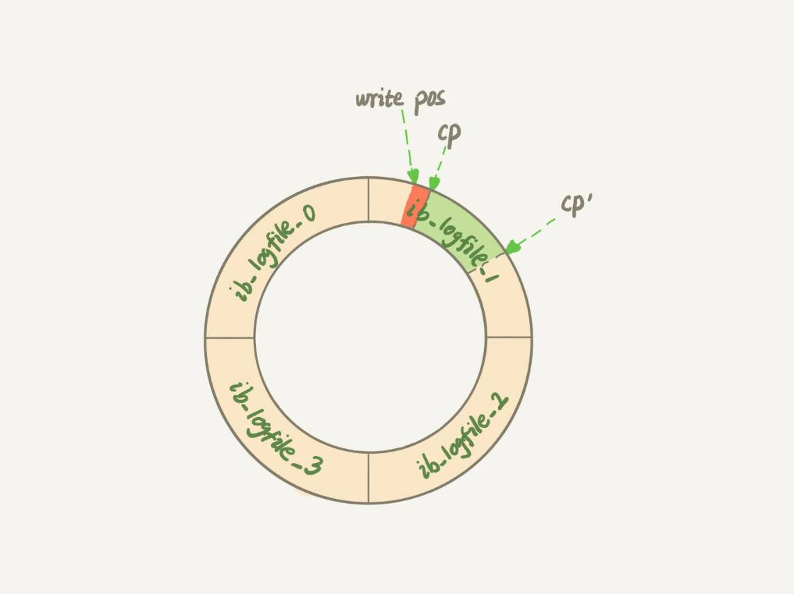](https://leokongwq.github.io/2018/12/21/geektime-mysql-learn/mysql_innodb_flush_dirty_page.jpg)

当check point 往前推进时，需要把推进区间内对应的脏页都写入磁盘。

场景二：当某个查询需要大量内存，但是内存空闲的干净页不足，此时需要把脏页写入磁盘来增加干净页。

场景三：系统空闲时，后台线程执行刷脏页操作。

场景四：MySQL停机。

我们在实践中需要尽量避免场景一的出现，因为此时MySQL不再执行任何更新操作。如果脏页积累的太多，会导致一次需要刷大量的脏页到磁盘，也是需要尽力避免。

### InnoDB刷脏页控制策略

获取磁盘的IOPS

```
fio -filename=$filename -direct=1 -iodepth 1 -thread -rw=randrw -ioengine=psync -bs=16k -size=500M -numjobs=10 -runtime=10 -group_reporting -name=mytest
```

告诉InnoDB磁盘的IOPS值：

```
innodb_io_capacity=IOPS
```

参数`innodb_max_dirty_pages_pct`控制脏页比例的上限。

InnoDB根据当前的脏页比例M计算出一个[0 - 100]间的数字。

```
F1(M)
{
  if M>=innodb_max_dirty_pages_pct then
      return 100;
  return 100*M/innodb_max_dirty_pages_pct;
}
```

InnoDB每次写入的redo log都有一个序号(LSN)，当前写入日志的序号和check point直接的差值记为`N`，InnoDB会根据`N`算出一个0-100间的数字，这公式记为F2(N)，算法比较复杂，`N`越大，则结果越大。

InnoDB根据`F1(M)`和`F2(N)`二者结果的 `最大值` * `innodb_io_capacity`的结果控制刷脏页的速度。

可以通过如下语句计算脏页比例：

```
mysql> select VARIABLE_VALUE into @a from global_status where VARIABLE_NAME = 'Innodb_buffer_pool_pages_dirty';
select VARIABLE_VALUE into @b from global_status where VARIABLE_NAME = 'Innodb_buffer_pool_pages_total';
select @a/@b;
```

> 注意：InnoDB刷脏页的过程中，如果相邻页也是脏页，那么相邻页也会被刷到磁盘上，如果相邻页的相邻页也是脏页，也会被刷。也就是说这个过程是级联的。这会导致雪上加霜的效果。`innodb_flush_neighbors`参数就是控制这个机制的。设置为`0`表示只刷自己，为`1`。MySQL8.0默认值为`0`;

### 课后题&讨论

#### 讨论

因内存不足导致刷脏页时，不会刷redo文件的。redo log 在重放时，如果一个数据页已经刷过的话，会被识别出来，并跳过。

#### 课后题

一个内存配置为 128GB、innodb_io_capacity=20000的高配实例，redo log设置为一个100MB的文件，会发生什么情况，原因是什么？

答案：因为redo log文件设置的比较小，那么redo log文件就容易写满，导致频繁刷脏页，由于磁盘的IOPS很大，监控上开起来磁盘压力不大，但是性能间歇性的不好，但是也不会降低很大，因为每次刷脏页的速度还是很快的。

## 13讲 - 为什么表数据删掉一半，表文件大小不变？

InnoDB 8.0以前，表结构保存在`.frm`文件中，从8.0开始运行把表结构保存到系统数据表中。因为表结构文件非常小心。

### innodb_file_per_table

`innodb_file_per_table`参考用来控制表数据是放到共享表空间还是独立的文件。

- on: 表示每个数据表独立保存一个后缀为`.ibd`的文件中。
- off: 表示数据放到系统共享表空间中，也就是和数据字典放在一起。

从MySQL5.6.6开始，默认值就是`on`。建议一直将该参数设置为`on`，除了好管理外，`drop table` 后MySQL会直接删除该文件，否则保存在共享表空间，表删除了，但是空间不会自动释放。

### 数据删除流程

[](https://leokongwq.github.io/2018/12/21/geektime-mysql-learn/mysql_innodb_delete.png)

innodb删除数据是`标记删除`。标记删除的记录占用的空间可以被复用，单记录空间的复用只限于特定范围。

如果一个数据页的所有数据都被标记为删除，则整个数据页都可以被复用，并可以复用到任何位置。

如果相邻的两个页的空间利用率都比较小，innodb会将相邻的页合并为一个页，另一个页标记为可复用。

由于是标记删除，所以占用的磁盘空间并不会自动释放，导致的结果就是文件很大，记录数很少，把这些可以复用而没有使用的空间称为`空洞`。

删除，插入记录（页分裂，分配了一个新的页，导致2个页的空间利用率很低), 更新索引上的值，都会导致空洞的产生。

[](https://leokongwq.github.io/2018/12/21/geektime-mysql-learn/mysql_innodb_page_split.png)

### 重建表

当你想要收缩表空间时，可以新建一个结构相同的表，将老表的数据导入新表，然后重命名，并删除旧表。

因为新表是按照索引递增的顺序插入数据记录，数据页的空间利用率很高，磁盘占用很少。

可以通过`alter table A engine=InnoDB`来实现这个操作。但是需要注意的是在MySQL5.5版本前，这个操作执行过程中，老的表不能有数据更新（不能进行DML操作），否则会导致丢失更新。也就是说这个操作不是Online的。而在MySQL5.6版本引入了Online DDL，优化了该流程（原理是：导数据的过程中记录老表的变更操作到文件中，数据导完后，再应用期间的变更），可以在放心使用。

注意：针对较大的表，导数据过程中需要大量的CPU和I/O资源，可以选择在业务低峰期进行。

```
# inplace 方式（server 层视角）
alter table t engine=innodb,ALGORITHM=inplace;
# copy 拷贝方式（MySQL老版本实现方式）
alter table t engine=innodb,ALGORITHM=copy;
```

### online vs inplace

1. DDL的过程是online的，那一定就是inplace的。
2. 反过来未必，也就是说inplace的DDL不一定是online的。截止到MySQL8.0，添加全文索引和空间索引就是这种情况。

### optimize table vs analyze table vs alter table engine=innodb

`optimize table` = recreate + analyze

`analyze table` 没有重建表，只是更新索引统计信息。

`alter table engine=innodb` 就是重建表recreate。

`truncate table` = drop + create

### 课后题

有没有可能执行完`alter table engine=innodb`后数据文件反而变大的情况？ 原因可能是什么？

答案：有的。

1. 刚进行完表的重建后再次进行重建，期间有DML操作，这些新的操作导致有空洞的产生。
2. 表的重建，每个数据页不是完全满的，InnoDB会预留一部分空间。但是在数据页的合并过程中每个数据页可能是完全满的。
3. 重建表后，插入一些数据占用预留空间，再次重建表，导致新增预留空间，数据文件会变大。

## 14讲 - count(*)这么慢，我该怎么办？

### count(*) 的实现方式

不同的存储引擎实现方式不同。下文讨论的都是不加`where`条件的。

- MyISAM 会把表的总数保存到磁盘上，执行count(*)时直接返回
- InnoDB 执行count(*)时，需要把数据从引擎中一行行读出来进行累加，速度较慢。

InnoDB由于MVCC的原因，每个事务查询时，返回的总数都不是确定的。

[](https://leokongwq.github.io/2018/12/21/geektime-mysql-learn/mysql_innodb_count.png)

InnoDB在执行`count(*)`时，也会做一点优化。主键索引树的叶子节点是数据，普通索引的叶子节点是主键值。索引普通索引比主键索引小很多。因此MySQL优化器会选择最小的索引树进行遍历获取`count(*)`的值。

`show table status` 显示的记录数是估值，官方文档说误差在40%到50%，因此也不准确。

### 如何快速计算表的记录总数

- 如果不需要完全准确的值，可以缓存表的记录数，动态更新 并 定时全表扫描更新缓存中的值。
- 通过数据库`独立计数表`进行统计，通过事务保证计数值和表记录总数的一致性。

### 不同的count用法

count是一个聚合函数（server层实现的，这个很重要），只要参数判断不为NULL，计数值就+1

count(*)， count(主键)， count(1)都表示满足条件的记录总数。

count(字段) 表示满足条件并且该字段不为null的记录总数。

性能差别：

1. server层要什么字段，引擎层就给什么字段
2. InnoDB只给必要的值
3. 现在的优化器只优化了`count(*)`的语义为`取行数`，其他`显而易见`的优化并没有做。

#### count(主键)

InnoDB遍历表，把每一行的主键取出来返回给Server层。

#### count(1)

InnoDB遍历表，但是不取值，server层对返回的每一行，放入。
一个数字`1`进行判断，判断是不肯能为空的，按行累加。

#### count(*)

`count(*)` 并不会把全部字段取出来，而是专门做了优化，不取值。`count(*)`肯定不为NULL，按行累加。

#### count(字段)

1. 如果字段定义为Not null， 从每一行中读取该字段，判断不能为null，按行累加。
2. 如果字段定义为可以为NULL，那么还是需要从行中读取该字段，并判断是否为NULL，不是NULL才进行累加。

综上，按照效率来说，count(字段) < count(主键) < count(1) ≈ count(*)

所以建议使用`count(*)`

## 15讲 - 日志和索引相关问题

MySQL在崩溃恢复时，是通过binlog和redo log共同判断事务应该提交还是回滚：

1. 如果redo log里面的事务是完整的，并且有commit标志，那么直接提交事务。
2. redo log里面的事务有完整的prepare，如果binlog完整，则提交事务，否则回滚事务。

### MySQL如何知道binlog的完整性？

一个事务的binlog是有完整格式的

- statement格式的binlog，最后会有`COMMMIT`.
- row格式的binlog，最后会有一个XID event.
- 5.6.2版本后，添加了binlog-checksum参数，用来验证binlog的完整性。

### redo log 如何和 binlog进行关联

redo log 和 binlog 有一个共同的数据字段`XID`。

### 处于 prepare 阶段的 redo log 加上完整 binlog，重启就能恢复，MySQL 为什么要这么设计?

binlog 写完以后 MySQL 发生崩溃，这时候 binlog 已经写入了，之后就会被从库（或者用这个 binlog 恢复出来的库）使用。所以，在主库上也要提交这个事务。采用这个策略，主库和备库的数据就保证了一致性。

### 如果这样的话，为什么还要两阶段提交呢？干脆先 redo log 写完，再写 binlog。崩溃恢复的时候，必须得两个日志都完整才可以。是不是一样的逻辑？

对于 InnoDB 引擎来说，如果 redo log 提交完成了，事务就不能回滚（如果这还允许回滚，就可能覆盖掉别的事务的更新）。而如果 redo log 直接提交，然后 binlog 写入的时候失败，InnoDB 又回滚不了，数据和 binlog 日志又不一致了。

### 不引入两个日志，也就没有两阶段提交的必要了。只用 binlog 来支持崩溃恢复，又能支持归档，不就可以了？

答案是不可以。binlog 没有能力恢复“数据页”。

[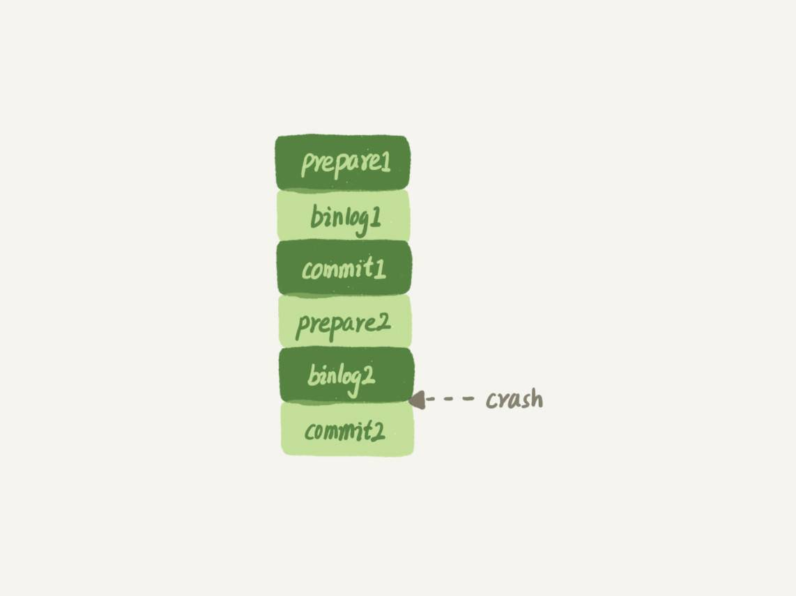](https://leokongwq.github.io/2018/12/21/geektime-mysql-learn/mysql_binlog_crash_safe.jpg)

### 那能不能反过来，只用 redo log，不要 binlog？

回答：如果只从崩溃恢复的角度来讲是可以的。你可以把 binlog 关掉，这样就没有两阶段提交了，但系统依然是 crash-safe 的。

但是，如果你了解一下业界各个公司的使用场景的话，就会发现在正式的生产库上，binlog 都是开着的。因为 binlog 有着 redo log 无法替代的功能。

一个是归档。redo log 是循环写，写到末尾是要回到开头继续写的。这样历史日志没法保留，redo log 也就起不到归档的作用。

一个就是 MySQL 系统依赖于 binlog。binlog 作为 MySQL 一开始就有的功能，被用在了很多地方。其中，MySQL 系统高可用的基础，就是 binlog 复制。

还有很多公司有异构系统（比如一些数据分析系统），这些系统就靠消费 MySQL 的 binlog 来更新自己的数据。关掉 binlog 的话，这些下游系统就没法输入了。

总之，由于现在包括 MySQL 高可用在内的很多系统机制都依赖于 binlog，所以“鸠占鹊巢”redo log 还做不到。你看，发展生态是多么重要。

### 追问 7：redo log 一般设置多大？

回答：redo log 太小的话，会导致很快就被写满，然后不得不强行刷 redo log，这样 WAL 机制的能力就发挥不出来了。

所以，如果是现在常见的几个 TB 的磁盘的话，就不要太小气了，直接将 redo log 设置为 4 个文件、每个文件 1GB 吧。

### 追问 8：正常运行中的实例，数据写入后的最终落盘，是从 redo log 更新过来的还是从 buffer pool 更新过来的呢？

回答：这个问题其实问得非常好。这里涉及到了，“redo log 里面到底是什么”的问题。

实际上，redo log 并没有记录数据页的完整数据，所以它并没有能力自己去更新磁盘数据页，也就不存在“数据最终落盘，是由 redo log 更新过去”的情况。

如果是正常运行的实例的话，数据页被修改以后，跟磁盘的数据页不一致，称为脏页。最终数据落盘，就是把内存中的数据页写盘。这个过程，甚至与 redo log 毫无关系。

在崩溃恢复场景中，InnoDB 如果判断到一个数据页可能在崩溃恢复的时候丢失了更新，就会将它读到内存，然后让 redo log 更新内存内容。更新完成后，内存页变成脏页，就回到了第一种情况的状态。

### 追问 9：redo log buffer 是什么？是先修改内存，还是先写 redo log 文件？

在一个事务的更新过程中，日志是要写多次的。比如下面这个事务：

```
begin;
insert into t1 ...
insert into t2 ...
commit;
```

这个事务要往两个表中插入记录，插入数据的过程中，生成的日志都得先保存起来，但又不能在还没 commit 的时候就直接写到 redo log 文件里。

所以，redo log buffer 就是一块内存，用来先存 redo 日志的。也就是说，在执行第一个 insert 的时候，数据的内存被修改了，redo log buffer 也写入了日志。

但是，真正把日志写到 redo log 文件（文件名是 ib_logfile+ 数字），是在执行 commit 语句的时候做的。（这里说的是事务执行过程中不会“主动去刷盘”，以减少不必要的 IO 消耗。但是可能会出现“被动写入磁盘”，比如内存不够、其他事务提交等情况。这个问题我们会在后面第 22 篇文章《MySQL 有哪些“饮鸩止渴”的提高性能的方法？》中再详细展开）。

单独执行一个更新语句的时候，InnoDB 会自己启动一个事务，在语句执行完成的时候提交。过程跟上面是一样的，只不过是“压缩”到了一个语句里面完成。

### 课后题

```
mysql> CREATE TABLE `t` (
`id` int(11) NOT NULL primary key auto_increment,
`a` int(11) DEFAULT NULL
) ENGINE=InnoDB;
insert into t values(1,2);
```

执行如下的语句：

```
mysql> update t set a=2 where id=1;
```

结果如下：
[](https://leokongwq.github.io/2018/12/21/geektime-mysql-learn/mysql_update_same_value.png)

仅从现象上看，MySQL 内部在处理这个命令的时候，可以有以下三种选择：

1. 更新都是先读后写的，MySQL 读出数据，发现 a 的值本来就是 2，不更新，直接返回，执行结束；
2. MySQL 调用了 InnoDB 引擎提供的“修改为 (1,2)”这个接口，但是引擎发现值与原来相同，不更新，直接返回；
3. InnoDB 认真执行了“把这个值修改成 (1,2)”这个操作，该加锁的加锁，该更新的更新。

答案：第三种。分析如下：

针对第一种假设：如果不更新，直接返回。那么就不会加行锁。因此可以通过如下步骤验证

1. SessionA 开启一个事务执行update语句，不提交事务。
2. SessionB 执行同样的更新语句，如果出现Block现象，那么说明SessionA对数据加了行锁，也就是说Server层调用了InnoDB的更新接口。(`行锁是在InnoDB中实现的`)

针对第二种假设：如果InnoDB没有进行数据更新，那么在RR事务隔离级别下，A和B两个事务执行同样的更新语句，B事务的更新对A事务不可见，在A事务中，更新语句前后执行查询语句，如果2次的查询结果都是2，说明InnoDB确实没有执行更新操作。如果第二次查询可以看到更新后的值，说明InnoDB执行了更新。

[](https://leokongwq.github.io/2018/12/21/geektime-mysql-learn/mysql_update_same_value_1.png)

如果InnoDB能肯定更新前后的值相同，它确实不会再执行更新的。

[](https://leokongwq.github.io/2018/12/21/geektime-mysql-learn/mysql_update_same_value_2.png)

where 语句有`k=3`这个条件，更新后还是3，InnoDB确实就不进行更新了。

注意：虽然InnoDB执行了更新，但是对MySQL Server层来说，前后的数据并没有变，row 格式下也不会产生binlog。

## 第16讲 - “order by”是怎么工作的？

```
CREATE TABLE `t` (
  `id` int(11) NOT NULL,
  `city` varchar(16) NOT NULL,
  `name` varchar(16) NOT NULL,
  `age` int(11) NOT NULL,
  `addr` varchar(128) DEFAULT NULL,
  PRIMARY KEY (`id`),
  KEY `city` (`city`)
) ENGINE=InnoDB;
```

查询排序语句：

```
select city,name,age from t where city='杭州' order by name limit 1000  ;
```

[](https://leokongwq.github.io/2018/12/21/geektime-mysql-learn/mysql_order_by.png)

### 全字段排序

MySQL给每个线程分配一个排序缓存(sort buffer)，针对上面的查询排序语句，MySQL从`city`索引树上查询满足条件的记录主键，回表查询`city,name,age`自动的值放入sort buffer。 最后对sort buffer中的记录按name字段进行快速排序，将排序结果的前1000条数据返回。

`sort buffer`有大小，如果满足条件的记录在`sort buffer`把放不下，则需要使用文件排序（归并排序）。

[](https://leokongwq.github.io/2018/12/21/geektime-mysql-learn/mysql_order_by_diagram.jpg)

参数：`sort_buffer_size` 可以控制 排序缓存的大小，增大该参数的值，可以加速排序。

通过下面的语句来验证查询是否使用了临时文件：

```
/* 打开 optimizer_trace，只对本线程有效 */
SET optimizer_trace='enabled=on'; 

/* @a 保存 Innodb_rows_read 的初始值 */
select VARIABLE_VALUE into @a from  performance_schema.session_status where variable_name = 'Innodb_rows_read';

/* 执行语句 */
select city, name,age from t where city='杭州' order by name limit 1000; 

/* 查看 OPTIMIZER_TRACE 输出 */
SELECT * FROM `information_schema`.`OPTIMIZER_TRACE`\G

/* @b 保存 Innodb_rows_read 的当前值 */
select VARIABLE_VALUE into @b from performance_schema.session_status where variable_name = 'Innodb_rows_read';

/* 计算 Innodb_rows_read 差值 */
select @b-@a;
```

### rowid排序

如果查询的结果需要返回记录的大部分字段或者或者所有字段，此时会占用大量内存，很容易导致采用文件排序，效率是低下的。MySQL针对这种情况进行了优化。

```
SET max_length_for_sort_data = 16;
```

这个参数是专门控制参与内存排序的数据行大小的，如果参与排序的数据行大小大于该值，那么MySQL将采用另一种排序算法：

1. 将满足条件的记录中需要参与排序的字段和主键放入sort buffer。
2. 对sort buffer中的记录按name进行排序。
3. 取出排序结果的前1000行，根据ID，查询主键索引树，获取要返回的字段值。

### 全字段排序 vs rowid排序

1. MySQL倾向于使用内存排序，所以尽量使用大内存机器，避免文件排序和rowid排序(需要回表，查询慢)
2. 查询语句尽量只返回需要的字段，不要`select *`
3. 适当调高`max_length_for_sort_data`的值。

### 避免排序

并不是所有的order by都会排序。如果从索引树上获取的结果集本身就是有序的就可以避免排序。

```
alter table t add index city_user(city, name);
```

有了这个索引，city相同，name本身就是有序的，就避免了排序。

[](https://leokongwq.github.io/2018/12/21/geektime-mysql-learn/mysql_order_by_not_need_sort.jpg)

explain:

[](https://leokongwq.github.io/2018/12/21/geektime-mysql-learn/mysql_order_by_using_index.png)

#### 覆盖索引

```
alter table t add index city_user_age(city, name, age);
```

有了覆盖索引的优化，避免了回表，性能进一步提高。

[](https://leokongwq.github.io/2018/12/21/geektime-mysql-learn/mysql_order_by_cover_index.jpg)

explain结果：

[](https://leokongwq.github.io/2018/12/21/geektime-mysql-learn/mysql_order_by_cover_index_explain.png)

### explain type

all : 全表扫描

index: 使用索引，如果是覆盖索引，可以不用回表，如果没有where条件，会扫描整个索引树。

range: 以范围的形式扫描索引树。

ref: 非唯一索引引用

eq_ref: 等值引用。 使用有唯一性索引查找（主键或唯一性索引）

const：（常量连接）被称为`常量`，这个词不好理解，不过出现 const 的话就表示发生下面两种情况：

1. 在整个查询过程中这个表最多只会有一条匹配的行，比如主键 id=1 就肯定只有一行，只需读取一次表数据便能取得所需的结果，且表数据在分解执行计划时读取。返回值直接放在 select 语句中，类似 select 1 AS f 。可以通过 extended 选择查看内部过程：

### explain extra

- `Using filesort` : 通常在使用到排序语句ORDER BY的时候，会出现该信息，表示一种排序算法，可能使用文件排序。
- `Using index` : 表示只使用了索引，不用回表，使用了覆盖索引。如果同时出现`Using where`，表示需要回表。
- `Using where`：表示条件查询，如果不读取表的所有数据，或不是仅仅通过索引就可以获取所有需要的数据，则会出现`Using where`。如果type列是`ALL`或`index`，而没有出现该信息，则有可能在执行错误的查询：返回所有数据。
- `Using temporary`：表示为了得到结果，使用了临时表，这通常是出现在多表联合查询，结果排序的场合。

## 课后题

```
select * from t where city in （'杭州','苏州'）order by name limit 100;
```

答案：拆为2次查询，应用内归并排序，取前100行。

如果是`limit 10000, 100`的话，解决思路也是类似的。但缺点是应用需要保存大量的数据，如果offset太大的话，客户端内存排序就不可行了（内存溢出）。

为了减少内存占用，可以只返回`id,name`字段数据，排序后，用ID再查询数据库获取数据。

## 第17讲 - 如何正确地显示随机消息？

```
mysql> CREATE TABLE `words` (
  `id` int(11) NOT NULL AUTO_INCREMENT,
  `word` varchar(64) DEFAULT NULL,
  PRIMARY KEY (`id`)
) ENGINE=InnoDB;

delimiter ;;
create procedure idata()
begin
  declare i int;
  set i=0;
  while i<10000 do
    insert into words(word) values(concat(char(97+(i div 1000)), char(97+(i % 1000 div 100)), char(97+(i % 100 div 10)), char(97+(i % 10))));
    set i=i+1;
  end while;
end;;
delimiter ;

call idata();
```

### 内存临时表

```
mysql> select word from words order by rand() limit 3;
```

随机排序，取前3个。

[](https://leokongwq.github.io/2018/12/21/geektime-mysql-learn/mysql_random_mem_temp.png)

上图表示使用了`内存临时表`，并且进行了排序。

由于内存临时表的回表速度非常快，MySQL此时优先选择排序是排序行越少越好，就是rowid排序。

上述语句的执行流程：

1. 创建一个临时表。这个临时表使用的是 memory 引擎，表里有两个字段，第一个字段是 double 类型，为了后面描述方便，记为字段 R，第二个字段是 varchar(64) 类型，记为字段 W。并且，这个表没有建索引。
2. 从 words 表中，按主键顺序取出所有的 word 值。对于每一个 word 值，调用 rand() 函数生成一个大于 0 小于 1 的随机小数，并把这个随机小数和 word 分别存入临时表的 R 和 W 字段中，到此，扫描行数是 10000。
3. 现在临时表有 10000 行数据了，接下来你要在这个没有索引的内存临时表上，按照字段 R 排序。
4. 初始化 sort_buffer。sort_buffer 中有两个字段，一个是 double 类型，另一个是整型。
5. 从内存临时表中一行一行地取出 R 值和位置信息（我后面会和你解释这里为什么是“位置信息”），分别存入 sort_buffer 中的两个字段里。这个过程要对内存临时表做全表扫描，此时扫描行数增加 10000，变成了 20000。
6. 在 sort_buffer 中根据 R 的值进行排序。注意，这个过程没有涉及到表操作，所以不会增加扫描行数。
7. 排序完成后，取出前三个结果的位置信息，依次到内存临时表中取出 word 值，返回给客户端。这个过程中，访问了表的三行数据，总扫描行数变成了 20003。

慢查询日志分析：

```
# Query_time: 0.900376  Lock_time: 0.000347 Rows_sent: 3 Rows_examined: 20003
SET timestamp=1541402277;
select word from words order by rand() limit 3;
```

[](https://leokongwq.github.io/2018/12/21/geektime-mysql-learn/mysql_random_sort_diag.png)

### 磁盘临时表

不是所有的临时表都是内存临时表（memory引擎）。

参数`tmp_table_size`限制内存临时表的大小，默认是16MB。大于该值就转为磁盘临时表（默认是InnoDB引擎，可以通过`internal_tmp_disk_storage_engine`来控制， 该临时表没有显示索引）。

MySQL5.6引入了一个新的排序算法，优先级队列排序，其实就是堆排序。用来处理TOP(n)的情况，可以避免对整个数据进行排序。

[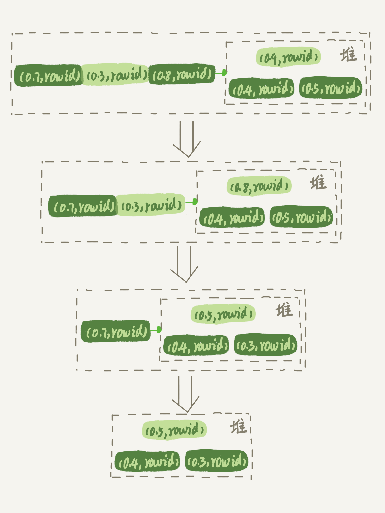](https://leokongwq.github.io/2018/12/21/geektime-mysql-learn/mysql_sort_heap.png)

但是使用优先级队列排序的前提是：待排序的数据集不能超过`sort_buffer_size`

### 随机排序方法

随机算法一：

生成一个ID最小值和最大值之间的随机数，取大于整个值的第一行。

```
mysql> select max(id),min(id) into @M,@N from t ;
set @X= floor((@M-@N+1)*rand() + @N);
select * from t where id >= @X limit 1;
```

这个方法效率很高，因为取 max(id) 和 min(id) 都是不需要扫描索引的，而第三步的 select 也可以用索引快速定位，可以认为就只扫描了 3 行。但实际上，这个算法本身并不严格满足题目的随机要求，因为 ID 中间可能有空洞，因此选择不同行的概率不一样，不是真正的随机。

随机算法二：

生成一个小于数据总行数C的随机数Y，`limit Y , 1`

```
mysql> select count(*) into @C from t;
set @Y = floor(@C * rand());
set @sql = concat("select * from t limit ", @Y, ",1");
prepare stmt from @sql;
execute stmt;
DEALLOCATE prepare stmt;
```

MySQL 处理 limit Y,1 的做法就是按顺序一个一个地读出来，丢掉前 Y 个，然后把下一个记录作为返回结果，因此这一步需要扫描 Y+1 行。再加上，第一步扫描的 C 行，总共需要扫描 C+Y+1 行，执行代价比随机算法 1 的代价要高。

随机算法三：

要获取N个随机数，只需要执行N次获取随机数第Y行的操作，再获取每次的行即可。

```
mysql> select count(*) into @C from t;
set @Y1 = floor(@C * rand());
set @Y2 = floor(@C * rand());
set @Y3 = floor(@C * rand());
select * from t limit @Y1，1； // 在应用代码里面取 Y1、Y2、Y3 值，拼出 SQL 后执行
select * from t limit @Y2，1；
select * from t limit @Y3，1；
```

注意：需要注意去重问题。

### 课后题

上面的随机算法 3 的总扫描行数是 C+(Y1+1)+(Y2+1)+(Y3+1)，实际上它还是可以继续优化，来进一步减少扫描行数的。

我的答案：

C的扫描过程可以通过单独的计数来避免，如何计数可以参考前面`count(*)`的内容。

Y1,Y2,Y3的扫描优化: 对Y1, Y2, Y3进行排序，假设排序后 Y1 < Y2 < Y3。 Y1的扫描不可避免，获取Y1+1的行ID记为min_id， 然后`where id > min_id_1 limit (Y2 - Y1), 1`;

其他答案：

1. 对有空洞的表进行整理，消除空洞后，利用算法一。
2. 老师的方法：取 Y1、Y2 和 Y3 里面最大的一个数，记为 M，最小的一个数记为 N，然后执行下面这条 SQL 语句：`mysql> select * from t limit N, M-N+1;`

## 18讲 - 为什么这些SQL语句逻辑相同，性能却差异巨大？

在 MySQL 中，有很多看上去逻辑相同，但性能却差异巨大的 SQL 语句。对这些语句使用不当的话，就会不经意间导致整个数据库的压力变大。

### 案例一：条件字段函数操作

```
mysql> CREATE TABLE `tradelog` (
  `id` int(11) NOT NULL,
  `tradeid` varchar(32) DEFAULT NULL,
  `operator` int(11) DEFAULT NULL,
  `t_modified` datetime DEFAULT NULL,
  PRIMARY KEY (`id`),
  KEY `tradeid` (`tradeid`),
  KEY `t_modified` (`t_modified`)
) ENGINE=InnoDB DEFAULT CHARSET=utf8mb4;
```

查询交易记录日志表，每年7月份的总数

```
mysql> select count(*) from tradelog where month(t_modified)=7;
```

这条语句会执行全表扫描或索引扫描。原因如下：

[](https://leokongwq.github.io/2018/12/21/geektime-mysql-learn/mysql_index_func.png)

month函数计算后导致无法使用索引。

推而广之：针对索引自动进行函数操作，结果可能破坏索引的有序性，导致不能使用索引。

针对该问题，下面的SQL可以解决。

```
mysql> select count(*) from tradelog where
    -> (t_modified >= '2016-7-1' and t_modified<'2016-8-1') or
    -> (t_modified >= '2017-7-1' and t_modified<'2017-8-1') or 
    -> (t_modified >= '2018-7-1' and t_modified<'2018-8-1');
```

优化器也有`偷懒`的行为, 即使是对于不改变有序性的函数，也不会考虑使用索引。比如，对于 `select * from tradelog where id + 1 = 10000` 这个 SQL 语句，这个加 1 操作并不会改变有序性，但是 MySQL 优化器还是不能用 id 索引快速定位到 9999 这一行。所以，需要你在写 SQL 语句的时候，手动改写成 `where id = 10000 - 1` 才可以(这也说明，优化器会先计算`10000 - 1`表达式，通结果作为条件)。

### 案例二：隐式类型转换

数字字符串和数字进行比较时，会先转为数字：

```
select "10" > 9 from dual;
# 结果是：1
mysql> select * from tradelog where tradeid=110717;
```

相当于

```
mysql> select * from tradelog where  CAST(tradid AS signed int) = 110717;
```

对索引字段执行了cast函数，优化器判断不能使用索引。

```
select * from tradelog where id="83126";
```

上面的SQL可以使用索引，原因是优化器可以先将”83126”转为数字83126，然后进行查询，此时可以利用索引。

### 案例三：隐式字符编码转换

```
mysql> CREATE TABLE `trade_detail` (
  `id` int(11) NOT NULL,
  `tradeid` varchar(32) DEFAULT NULL,
  `trade_step` int(11) DEFAULT NULL, /* 操作步骤 */
  `step_info` varchar(32) DEFAULT NULL, /* 步骤信息 */
  PRIMARY KEY (`id`),
  KEY `tradeid` (`tradeid`)
) ENGINE=InnoDB DEFAULT CHARSET=utf8;

insert into tradelog values(1, 'aaaaaaaa', 1000, now());
insert into tradelog values(2, 'aaaaaaab', 1000, now());
insert into tradelog values(3, 'aaaaaaac', 1000, now());

insert into trade_detail values(1, 'aaaaaaaa', 1, 'add');
insert into trade_detail values(2, 'aaaaaaaa', 2, 'update');
insert into trade_detail values(3, 'aaaaaaaa', 3, 'commit');
insert into trade_detail values(4, 'aaaaaaab', 1, 'add');
insert into trade_detail values(5, 'aaaaaaab', 2, 'update');
insert into trade_detail values(6, 'aaaaaaab', 3, 'update again');
insert into trade_detail values(7, 'aaaaaaab', 4, 'commit');
insert into trade_detail values(8, 'aaaaaaac', 1, 'add');
insert into trade_detail values(9, 'aaaaaaac', 2, 'update');
insert into trade_detail values(10, 'aaaaaaac', 3, 'update again');
insert into trade_detail values(11, 'aaaaaaac', 4, 'commit');
```

关联查询：

```
mysql> select d.* from tradelog l, trade_detail d where d.tradeid=l.tradeid and l.id=2; /* 语句 Q1*/
```

查询trade_detail时不能使用tradeid索引的原因是2个表的字符集不同。

tradelog表的字符集是utf8mb4, trade_detail表是utf8。

```
select * from trade_detail  where CONVERT(traideid USING utf8mb4)=$L2.tradeid.value;
```

有了前面的分析，我们提前将查询条件进行手动转换，这样就可以利用索引了。

```
mysql> select d.* from tradelog l , trade_detail d where d.tradeid=CONVERT(l.tradeid USING utf8) and l.id=2;
```

## 19讲 - 为什么我只查一行的语句，也执行这么慢？

### 等待MDL锁

```
mysql> CREATE TABLE `t` (
  `id` int(11) NOT NULL,
  `c` int(11) DEFAULT NULL,
  PRIMARY KEY (`id`)
) ENGINE=InnoDB;

delimiter ;;
create procedure idata()
begin
  declare i int;
  set i=1;
  while(i<=100000)do
    insert into t values(i,i)
    set i=i+1;
  end while;
end;;
delimiter ;

call idata();
```

查询语句：

```
mysql> select * from t where id=1;
```

这个查询为啥慢呢？ 如果还记得MDL元数据锁的话，你就理解了。

```
show processlist
```

[](https://leokongwq.github.io/2018/12/21/geektime-mysql-learn/mysql_wait_mdl.png)

如何复现(5.7)：

[](https://leokongwq.github.io/2018/12/21/geektime-mysql-learn/mysql_wait_mdl_case.png)

SessionA 持有表的MDL写锁， SessionB要获取MDL读锁，只能等待。

解决版本是kill掉持有MDL写锁的线程。

但是，由于在 show processlist 的结果里面，session A 的 Command 列是“Sleep”，导致查找起来很不方便。不过有了 `performance_schema` 和 `sys` 系统库以后，就方便多了。（MySQL 启动时需要设置 performance_schema=on，相比于设置为 off 会有 10% 左右的性能损失)

通过查询 `sys.schema_table_lock_waits` 这张表，我们就可以直接找出造成阻塞的 process id，把这个连接用 kill 命令断开即可。

### 等待flush

flush 表时，查询语句需要等待flush执行完才能继续执行。

MySQL 里面对表做 flush 操作的用法，一般有以下两个

```
flush tables t with read lock;
flush tables with read lock;
```

通常这2个语句都执行的很快，除非被其他语句阻塞。

[](https://leokongwq.github.io/2018/12/21/geektime-mysql-learn/mysql_flush_table.png)

flush被一个查询语句阻塞，进而导致我们的查询阻塞。

### 等行锁

```
mysql> select * from t where id=1 lock in share mode;
```

这个语句要获取一个读锁，如果这一行正在被更新，也就是说被加了写锁，那么该语句只能等待。

读写互斥，2个写操作也是互斥的。

在MySQL5.7版本，可以通过下面的语句查询锁的持有情况：

```
mysql> select * from t sys.innodb_lock_waits where locked_table=`'test'.'t'`\G
```

### 慢查询

在没有索引的字段执行查询，在数据量比较大时，查询就很慢。

```
mysql> select * from t where c=50000 limit 1;
```

字段c长没有建索引。

```
mysql> select * from t where id=1；
```

id字段有索引，而且是快照读，按理说应该很快。但有时候可能执行的非常慢。

原因在于：在一个事务中，这个查询语句2次执行期间，如果该行数据被频繁更新，这样就导致unlog非常大，
因为是快照读，所以第二次查询需要：`根据当前值逐一应用undo log，直到查询到自己事务开始的版本`。

这种情况下，加锁读反而很快。

[](https://leokongwq.github.io/2018/12/21/geektime-mysql-learn/mysql_slow_query_undolog.png)

应用undo log。

[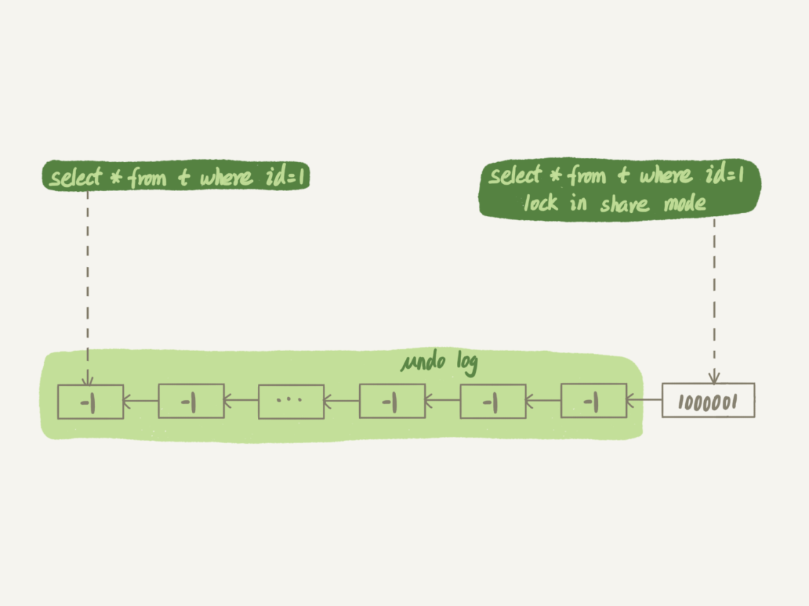](https://leokongwq.github.io/2018/12/21/geektime-mysql-learn/mysql_slow_query_undolog_1.png)

### 课后题

```
CREATE TABLE `t` (
  `id` int(11) NOT NULL,
  `c` int(11) DEFAULT NULL,
  `d` int(11) DEFAULT NULL,
  PRIMARY KEY (`id`),
  KEY `c` (`c`)
) ENGINE=InnoDB;

insert into t values(0,0,0),(5,5,5),
(10,10,10),(15,15,15),(20,20,20),(25,25,25);

begin;
select * from t where c=5 for update;
commit;
```

这个语句序列是怎么加锁的呢？加的锁又是什么时候释放呢？

答案：

RC隔离级别：

所有扫描到的行都需要加锁，在返回到Server层后，会`提前释放`不满足条件的行锁。
原因是不需要解决幻读问题。

RR隔离解绑：

所有扫描到的行都需要加锁，行之间会添加间隙锁(gap锁)

## 20讲 - 幻读是什么，幻读有什么问题？

## 数据准备

```
CREATE TABLE `t` (
  `id` int(11) NOT NULL,
  `c` int(11) DEFAULT NULL,
  `d` int(11) DEFAULT NULL,
  PRIMARY KEY (`id`),
  KEY `c` (`c`)
) ENGINE=InnoDB;

insert into t values(0,0,0),(5,5,5),
(10,10,10),(15,15,15),(20,20,20),(25,25,25);

begin;
select * from t where c=5 for update;
commit;
```

[](https://leokongwq.github.io/2018/12/21/geektime-mysql-learn/PhantomRead.png)

### 幻读定义

幻读指的是在一个事务中，前后2次查询同一个范围内的数据，第二次查询返回第一次查询没有看到的行的现象。

1. 在RR隔离级别下，普通的读是快照读，是不会看到别的事务插入的数据的。只有`当前读`才会出现幻读现象。
2. 幻读仅专指`新插入的行`。

### 幻读的问题

### 语义的问题

破坏了sql语句的语义。

#### 数据一致性的问题

[](https://leokongwq.github.io/2018/12/21/geektime-mysql-learn/PhantomReadConsitentProblem.png)

binlog总SQL语句时序如下：

```
-- session B
update t set d=5 where id=0; /*(0,0,5)*/
update t set c=5 where id=0; /*(0,5,5)*/
-- session C
insert into t values(1,1,5); /*(1,1,5)*/
update t set c=5 where id=1; /*(1,5,5)*/
-- session A
update t set d=100 where d=5;/* 所有 d=5 的行，d 改成 100*/
```

*注意*:事务提交时写入binlog。session A最后提交，所以最后写入binlog。

### 如何解决幻读？

为了解决幻读问题，MySQL引入了间隙锁(Gap Lock)， 间隙锁锁的是2个值之间的空隙。

> 跟间隙锁存在冲突关系的，是`往这个间隙中插入一个记录`这个操，两个间隙锁不冲突。
> 间隙锁和行锁合称:`next-key lock`, 每个 `next-key lock` 都是前开后闭区间
> 间隙锁的引入，导致锁定的范围更大，更容易引起死锁问题，同时影响并发度。
> 间隙锁只有在RR隔离级别下才生效，在生产环境中可以通过`RC`隔离级别 + `binlog format = row`的配置来解决数据不一致的问题。

### 课后题

session B 和 session C 都会阻塞，原因如下：

session A加的锁如下：

1. 由于是 order by c desc，第一个要定位的是索引 c 上“最右边的”c=20 的行，所以会加上间隙锁 (20,25) 和 next-key lock (15,20]。
2. 在索引 c 上向左遍历，要扫描到 c=10 才停下来，所以 next-key lock 会加到 (5,10]，这正是阻塞 session B 的 insert 语句的原因。
3. 在扫描过程中，c=20、c=15、c=10 这三行都存在值，由于是 `select *`，所以会在主键 id 上加三个行锁。

因此，session A 的 select 语句锁的范围就是：

1. 索引 c 上 (5, 25)；
2. 主键索引上 id=10、15、20 三个行锁。

## 21 讲 为什么我只改一行的语句，锁这么多？

### 加锁规则总结

#### 版本条件

5.x 系列 <=5.7.24，8.0 系列 <=8….

#### 加锁规则

原则 1：加锁的基本单位是 next-key lock。希望你还记得，next-key lock 是前开后闭区间。

原则 2：查找过程中访问到的对象才会加锁。

优化 1：索引上的等值查询，给唯一索引加锁的时候，next-key lock 退化为行锁。

优化 2：索引上的等值查询，向右遍历时且最后一个值不满足等值条件的时候，next-key lock 退化为间隙锁。

一个 bug：唯一索引上的范围查询会访问到不满足条件的第一个值为止。

### 案例分析

#### 案例一：等值查询间隙锁

[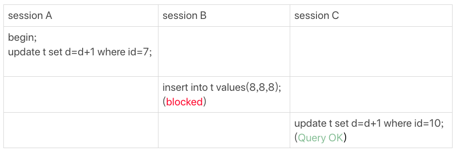](https://leokongwq.github.io/2018/12/21/geektime-mysql-learn/gap_lock_demo1.png)

由于表 t 中没有 id=7 的记录，所以用我们上面提到的加锁规则判断一下的话：

根据原则 1，加锁单位是 next-key lock，session A 加锁范围就是 (5,10]；

同时根据优化 2，这是一个等值查询 (id=7)，而 id=10 不满足查询条件，next-key lock 退化成间隙锁，因此最终加锁的范围是 (5,10)。

所以，session B 要往这个间隙里面插入 id=8 的记录会被锁住，但是 session C 修改 id=10 这行是可以的。

#### 案例二：非唯一索引等值锁

[](https://leokongwq.github.io/2018/12/21/geektime-mysql-learn/gap_lock_demo2.png)

根据原则 1，加锁单位是 next-key lock，因此会给 (0,5] 加上 next-key lock。

要注意 c 是普通索引，因此仅访问 c=5 这一条记录是不能马上停下来的，需要向右遍历，查到 c=10 才放弃。根据原则 2，访问到的都要加锁，因此要给 (5,10] 加 next-key lock。

但是同时这个符合优化 2：等值判断，向右遍历，最后一个值不满足 c=5 这个等值条件，因此退化成间隙锁 (5,10)。

根据原则 2 ，`只有访问到的对象才会加锁`，这个查询使用覆盖索引，并不需要访问主键索引，所以主键索引上没有加任何锁，这就是为什么 session B 的 update 语句可以执行完成。

但 session C 要插入一个 (7,7,7) 的记录，就会被 session A 的间隙锁 (5,10) 锁住。

> 需要注意，在这个例子中，`lock in share mode` 只锁覆盖索引，但是如果是 `for update` 就不一样了。 执行 `for update` 时，系统会认为你接下来要更新数据，因此会顺便给主键索引上满足条件的行加上行锁。

这个例子说明，`锁是加在索引上的`；同时，它给我们的指导是，如果你要用 `lock in share mode` 来给行加读锁避免数据被更新的话，就必须得绕过覆盖索引的优化，在查询字段中加入索引中不存在的字段。比如，将 session A 的查询语句改成 `select d from t where c=5 lock in share mode`。你可以自己验证一下效果。

### 案例三：主键索引范围锁

```
mysql> select * from t where id=10 for update;
mysql> select * from t where id>=10 and id<11 for update;
```

在逻辑上，这两条查语句肯定是等价的，但是它们的加锁规则不太一样。

[](https://leokongwq.github.io/2018/12/21/geektime-mysql-learn/gap_lock_demo3.png)

开始执行的时候，要找到第一个 id=10 的行，因此本该是 next-key lock(5,10]。 根据优化 1， 主键 id 上的等值条件，退化成行锁，只加了 id=10 这一行的行锁。

范围查找就往后继续找，找到 id=15 这一行停下来，因此需要加 next-key lock(10,15]。

### 案例四：非唯一索引范围锁

[](https://leokongwq.github.io/2018/12/21/geektime-mysql-learn/gap_lock_demo4.png)

这次 session A 用字段 c 来判断，加锁规则跟案例三唯一的不同是：在第一次用 c=10 定位记录的时候，索引 c 上加了 (5,10] 这个 next-key lock 后，由于索引 c 是非唯一索引，没有优化规则，也就是说不会蜕变为行锁，因此最终 sesion A 加的锁是，索引 c 上的 (5,10] 和 (10,15] 这两个 next-key lock。

所以从结果上来看，sesson B 要插入（8,8,8) 的这个 insert 语句时就被堵住了。

这里需要扫描到 c=15 才停止扫描，是合理的，因为 InnoDB 要扫到 c=15，才知道不需要继续往后找了。

### 案例五：唯一索引范围锁 bug

[](https://leokongwq.github.io/2018/12/21/geektime-mysql-learn/gap_lock_demo5.png)

session A 是一个范围查询，按照原则 1 的话，应该是索引 id 上只加 (10,15] 这个 next-key lock，并且因为 id 是唯一键，所以循环判断到 id=15 这一行就应该停止了。

但是实现上，InnoDB 会往前扫描到第一个不满足条件的行为止，也就是 id=20。而且由于这是个范围扫描，因此索引 id 上的 (15,20] 这个 next-key lock 也会被锁上。

### 案例六：非唯一索引上存在”等值”的例子

[](https://leokongwq.github.io/2018/12/21/geektime-mysql-learn/gap_lock_demo6.png)

可以看到，虽然有两个 c=10，但是它们的主键值 id 是不同的（分别是 10 和 30），因此这两个 c=10 的记录之间，也是有间隙的。

这次我们用 delete 语句来验证。注意，delete 语句加锁的逻辑，其实跟 select … for update 是类似的，也就是我在文章开始总结的两个“原则”、两个“优化”和一个“bug”。

[](https://leokongwq.github.io/2018/12/21/geektime-mysql-learn/gap_lock_demo6_1.png)

这个 delete 语句在索引 c 上的加锁范围，就是下图中蓝色区域覆盖的部分。

### 案例七：limit 语句加锁

[](https://leokongwq.github.io/2018/12/21/geektime-mysql-learn/gap_lock_demo7.png)

这个例子里，session A 的 delete 语句加了 limit 2。你知道表 t 里 c=10 的记录其实只有两条，因此加不加 limit 2，删除的效果都是一样的，但是加锁的效果却不同。可以看到，session B 的 insert 语句执行通过了，跟案例六的结果不同。

这是因为，案例七里的 delete 语句明确加了 limit 2 的限制，因此在遍历到 (c=10, id=30) 这一行之后，满足条件的语句已经有两条，循环就结束了。

因此，索引 c 上的加锁范围就变成了从（c=5,id=5) 到（c=10,id=30) 这个前开后闭区间，如下图所示：

[](https://leokongwq.github.io/2018/12/21/geektime-mysql-learn/bb0ad92483d71f0dcaeeef278f89cb24.png)

这个例子对我们实践的指导意义就是，`在删除数据的时候尽量加 limit` 。这样不仅可以控制删除数据的条数，让操作更安全，还可以减小加锁的范围。

### 案例八：一个死锁的例子

前面的例子中，我们在分析的时候，是按照 next-key lock 的逻辑来分析的，因为这样分析比较方便。最后我们再看一个案例，目的是说明：next-key lock 实际上是间隙锁和行锁加起来的结果。

session A 启动事务后执行查询语句加 lock in share mode，在索引 c 上加了 next-key lock(5,10] 和间隙锁 (10,15)；

session B 的 update 语句也要在索引 c 上加 next-key lock(5,10] ，进入锁等待；

然后 session A 要再插入 (8,8,8) 这一行，被 session B 的间隙锁锁住。由于出现了死锁，InnoDB 让 session B 回滚。

原因：session B 的“加 next-key lock(5,10] ”操作，实际上分成了两步，先是加 (5,10) 的间隙锁，加锁成功；然后加 c=10 的行锁，这时候才被锁住的。

也就是说，我们在分析加锁规则的时候可以用 next-key lock 来分析。但是要知道，具体执行的时候，是要分成间隙锁和行锁两段来执行的。

### 小结

> 在读提交隔离级别下还有一个优化，即：语句执行过程中加上的行锁，在语句执行完成后，就要把“不满足条件的行”上的行锁直接释放了，不需要等到事务提交。也就是说，读提交隔离级别下，锁的范围更小，锁的时间更短，这也是不少业务都默认使用读提交隔离级别的原因。

## 22讲 - MySQL有哪些“饮鸩止渴”提高性能的方法？

这些方案都是`剑走偏锋`的优化，或问题解决方案，紧急情况下可以使用。

### 短连接风暴

大量的执行很少逻辑就断开的连接。导致短时间内连接数暴涨。

`max_connections`控制总的连接数。MySQL负载很高时，再建立新的连接会加重负载，此时可以考虑下面的方法释放空闲的连接：

1. 通过`show processlist` + `infomation_schema.inno_trx`表查询空闲的连接，通过`kill connnection`关闭空闲连接。需要注意到是服务断开连接后，客户端不能马上感知，直到客户端执行下一个sql，客户端如果不进行重连就会导致问题。极端情况下可以kill掉处于事务中的空闲连接。
2. 减少连接建立过程中的消耗。跳过权限验证，重启数据库，添加参数`–skip-grant-tables`

### 慢查询性能问题

### 索引没有设计好

1. 关闭从库的binlog功能
2. 从库执行alter table, 添加索引，主从切换
3. 原来的主库变为从库，进行同样的操作。

平时的运维，应该优先使用`gh-ost`这个样的工具，紧急处理可以考虑上面的方案。

### SQL语句写的不好

mysql5.7提供了`query_rewrite`功能

```
-- 不能使用索引
select * from t where id + 1 = 10000;
mysql> insert into query_rewrite.rewrite_rules(pattern, replacement, pattern_database) values ("select * from t where id + 1 = ?", "select * from t where id = ? - 1", "db1");
-- 使新插入的规则生效
call query_rewrite.flush_rewrite_rules();
```

### 优化器选错索引

1. 通过上面提到的`query_rewrite`功能
2. 修改SQL语句, `force index`强制使用指定的索引。

### QPS 突增

1. 一种是由全新业务的 bug 导致的。假设你的 DB 运维是比较规范的，也就是说白名单是一个个加的。这种情况下，如果你能够确定业务方会下掉这个功能，只是时间上没那么快，那么就可以从数据库端直接把白名单去掉。
2. 如果这个新功能使用的是单独的数据库用户，可以用管理员账号把这个用户删掉，然后断开现有连接。这样，这个新功能的连接不成功，由它引发的 QPS 就会变成 0。
3. 如果这个新增的功能跟主体功能是部署在一起的，那么我们只能通过处理语句来限制。这时，我们可以使用上面提到的查询重写功能，把压力最大的 SQL 语句直接重写成”select 1”返回。

## 23讲 - MySQL是怎么保证数据不丢的？

### binlog写入机制

事务执行过程中，binlog先写入binlog cache, 事务提交时，写入binlog 文件。

一个事务的binlog不能被拆分写入，必须一次性写入。

`binlog_cache_size`设置每个线程占用的binlog缓存大小。

### sync_binlog

1. sync_binlog = 0 只写入文件page cache
2. sync_binlog = 1 每次事务提交都进行fsync操作
3. sync_binlog > 1(N) 每次事务提交都写文件，但是N次以后进行一次fsync

### redo log 写入机制

事务执行过程中，会不断的将redo log写入redo log cache中。

innodb的后台线程会每秒（`write + fsync`）或每10秒（`write + fsync`），或者当redo log cache的剩余空间小于50%时，将缓存中的日志写入文件（`write`）, 或者其他事务提交时，将未提交事务的redo log写入文件。

所以没有提交事务的redo log也会被写入文件, 由此可知：innodb在大事务下，提交也是非常快的。

`innodb_flush_log_at_trx_commit`参考控制事务提交时，redo log以哪种机制写入日志文件。

1. `innodb_flush_log_at_trx_commit=0` 事务提交时，redo log保存在缓存中。
2. `innodb_flush_log_at_trx_commit=1` 事务提交时，redo log写入刷新到文件。
3. `innodb_flush_log_at_trx_commit=2` 事务提交时，写入page cache。

redo log 和 binlog的文件写入操作遵循两阶段提交机制：当`innodb_flush_log_at_trx_commit=1`
时，redo log 的prepare阶段就会磁盘，当binglog写入后，提交事务时，innodb不会进行fsync。

### 组提交

#### LSN

LSN 是 log sequence number的缩写。它是单调递增的，用来表示redo log的一个个写入点，每次写入长度为length的redo log， LSN的值就会增加length。

组提交机制：三个事务都写完redo log处于prepare状态。

[](https://leokongwq.github.io/2018/12/21/geektime-mysql-learn/innodb_group_commit.png)

1. trx 1 第一个到达，被选为leader
2. trx 1 开始写磁盘是，组内已经有3个事务了，此时LSN=160
3. trx 1 写磁盘时，保存的LSN就是160, 所有小于160的LSN都被持久到磁盘了。
4. trx2, trx3提交时，就不用再写磁盘了，直接返回。

结论：

1. 一次组提交，组内成员越多，就能更好的节约磁盘IOPS。
2. 并发场景下，第一个事务（Leader）执行fsync越晚，组员就越多，节约的磁盘IOPS就越多。

[](https://leokongwq.github.io/2018/12/21/geektime-mysql-learn/innodb_group_commit_optimize.png)

`binlog_group_commit_sync_delay` 参数表示延迟多少微妙后才调用fsync。

`binlog_group_commit_sync_no_dely` 参数表示累积多少次后才调用fsync。

### 总结：

如果线上MySQL有I/O瓶颈，可以暂时修改这些参数，提高性能。但需要注意丢失数据的风险。

### 课后题 - 哪些场景可以将MySQL设置为非双1模式

1. 可知的业务高峰期。
2. 备库延迟
3. 用备份恢复主库的副本，应用binlog的过程。
4. 批量数据导入。

## 24讲 - MySQL是怎么保证主备一致的？

### MySQL主备基本原理

MySQL主备切换流程：

[](https://leokongwq.github.io/2018/12/21/geektime-mysql-learn/mysql_master_slave.png)

#### 备库设置为readonly建议

1. 运营的统计查询需要一半在备库执行，设置为readonly可以防止误操作。
2. 防止主从切换逻辑bug,导致双master。
3. 用readonly判断主从角色。

从库虽然是readonly，但是由于同步更新线程拥有super权限，所以readonly的设置对同步更新是无效的。

MySQL主备执行流程

[](https://leokongwq.github.io/2018/12/21/geektime-mysql-learn/mysql_master_slave_diagram.png)

1. 在备库 B 上通过 change master 命令，设置主库 A 的 IP、端口、用户名、密码，以及要从哪个位置开始请求 binlog，这个位置包含文件名和日志偏移量。
2. 在备库 B 上执行 start slave 命令，这时候备库会启动两个线程，就是图中的 io_thread 和 sql_thread。其中 io_thread 负责与主库建立连接。
3. 主库 A 校验完用户名、密码后，开始按照备库 B 传过来的位置，从本地读取 binlog，发给 B。
4. 备库 B 拿到 binlog 后，写到本地文件，称为中转日志（relay log）。
5. sql_thread 读取中转日志，解析出日志里的命令，并执行。

> 最新的版本：sql_thread 演化成为了多个线程。

### binlog三种格式

#### statement

记录的是原始的SQL语句。格式如下：

```
begin;
use database;
sql 语句;
commit /* xid = 123 */;
```

statement 有可能导致主从数据不一致。原因在于，同样的语句，在主从库上执行时，会因为索引选择不同，导致最终的执行结果不同。

#### row

```
begin;
use database;
sql 语句;
commit /* xid = 123 */;
```

#### mix = statement + row

statement 格式的binlog会导致主从数据不一致，优点是：占用空间小。row格式不会导致主从不一致，但是占用空间大。所有就有了mix这种格式。MySQL会自动判断SQL语句，不影响主从一致的SQL使用statement,其他的使用row格式。

### binlog 格式最佳实践

推荐使用`row`格式。

1. 数据恢复，binlog里面包含了所有的信息，可以恢复误操作影响的数据。
2. 基于binlog进行业务消息处理。

### 查看binlog

确定正在写入的binlog文件

```
-- 查询所有的binlog文件
show binary logs;

mysql> show master status\G;
*************************** 1. row ***************************
             File: mysql-bin.000607
         Position: 226668235
     Binlog_Do_DB:
 Binlog_Ignore_DB:
Executed_Gtid_Set:
1 row in set (0.01 sec)
```

查看指定binlog文件的内容语法：

> SHOW BINLOG EVENTS [IN ‘log_name’] [FROM pos] [LIMIT [offset,] row_count]

```
mysql> SHOW BINLOG EVENTS IN 'mysql-bin.000607'  limit 1 \G
*************************** 1. row ***************************
   Log_name: mysql-bin.000607
        Pos: 4
 Event_type: Format_desc
  Server_id: 132656183
End_log_pos: 120
       Info: Server ver: 5.6.26-log, Binlog ver: 4
1 row in set (0.01 sec)
```

查看远程服务器上的binlog

```
mysqlbinlog -ubosstest -p -P6183 -hbj.bosstest.w.qiyi.db --start-datetime='2019-01-15 16:38:00' --stop-datetime='2019-01-15 16:40:00' --read-from-remote-server -vv mysql-bin.000607 > row.sql
```

内容：

```
#190115 16:53:34 server id 132656183  end_log_pos 231732483 CRC32 0x2792c369 	Table_map: `autorenew`.`boss_dut_user_new_00` mapped to number 110965745
```

### 循环复制

循环复制指的是，双Master架构下，B库重放了主库A的binlog,同时产生了binlog，B库的binlog又被主库A执行的情况。

解决办法如下：

1. binlog中有server_id
2. 每个数据库的server_id都需要设置不同。
3. 当接收到和自己server_id相同的binlog，不执行。

## 25讲 - MySQL是如何保证高可用的？

### 查询主从延迟时间

```
show slave status;
```

### 主从延迟原因

1. 主从机器配置不对等。
2. 从库压力过大（大量的查询和统计查询）。可以通过多个从库和离线统计解决
3. 大事务。 事务的binlog不能拆分，大事务执行时间长，从库执行大事务耗费同样的时间，由于是单线程，主库最新的更新不能及时同步到从库。

### 主从切换 - 高可靠

因为主从可能存在延迟，所以直接进行切换就会导致数据不一致的情况发生。实践中为了保证数据的一致性，可以使用如下的步骤：

1. 判断从库的延迟时间小于一个阈值，例如5s.
2. 把主库改为readonly。
3. 等待2个库数据一致。
4. 从库改为可写。
5. 业务请求切换到新的主库。

### 主从切换 - 高可用

有时候主从的切换不是我们能计划的。例如主库突然down机。此时，为了尽快恢复业务，必须进行切换了。只能事后进行数据一致性恢复操作。

### 总结

MySQL的高可用，高度依赖主从的延迟。所以实践中尽力保证主从的延迟一直保持在一个非常小的时间范围内。

### 课后题

什么情况下，备库的主备延迟会表现为一个 45 度的线段？

原因是：备库的同步在这段时间完全被堵住了。

- 一种是大事务（包括大表 DDL、一个事务操作很多行）；

- 还有一种情况比较隐蔽，就是备库起了一个长事务，比如

  ```
  begin; 
  select * from t limit 1;
  ```

然后就不动了。(获取了MDL读锁)

这时候主库对表 t 做了一个加字段操作，即使这个表很小，这个 DDL 在备库应用的时候也会被堵住（获取MDL写锁时被阻塞），也能看到这个现象。

## 26讲 - 备库为什么会延迟好几个小时？

备库的延迟是机制上导致，主库是并发执行，从库只有一个线程进行重放，延迟可以说是不可避免的。为此各大公司和MySQL官方开发了并行复制功能。

[](https://leokongwq.github.io/2018/12/21/geektime-mysql-learn/mysql_parall_binlog.png)

1. 原来的SQL线程变为协调线程，服务事件的分发。
2. 多个SQL线程进行事件执行。

### coordinator 分发原则

1. 不能造成更新覆盖。更新同一行的事务必须分发到同一个worker线程。
2. 同一个事务不能被拆开，必须放到同一个worker线程中。

### 按表分发

按表分发事务的基本思路是，如果两个事务更新不同的表，它们就可以并行。因为数据是存储在表里的，所以按表分发，可以保证两个 worker 不会更新同一行。当然，如果有跨表的事务，还是要把两张表放在一起考虑的。如图 3 所示，就是按表分发的规则。

[](https://leokongwq.github.io/2018/12/21/geektime-mysql-learn/mysql_para_binlog_table.png)

可以看到，每个 worker 线程对应一个 hash 表，用于保存当前正在这个 worker 的“执行队列”里的事务所涉及的表。hash 表的 key 是`库名.表名`，value 是一个数字，表示队列中有多少个事务修改这个表。

在有事务分配给 worker 时，事务里面涉及的表会被加到对应的 hash 表中。worker 执行完成后，这个表会被从 hash 表中去掉。

#### 分配流程

1. 由于事务 T 中涉及修改表 t1，而 worker_1 队列中有事务在修改表 t1，事务 T 和队列中的某个事务要修改同一个表的数据，这种情况我们说事务 T 和 worker_1 是冲突的。
2. 按照这个逻辑，顺序判断事务 T 和`每个worker` 队列的冲突关系，会发现事务 T 跟 worker_2 也冲突。
3. 事务 T 跟多于一个 worker 冲突，coordinator 线程就进入等待。
4. 每个 worker 继续执行，同时修改 hash_table。假设 hash_table_2 里面涉及到修改表 t3 的事务先执行完成，就会从 hash_table_2 中把 db1.t3 这一项去掉。
5. 这样 coordinator 会发现跟事务 T 冲突的 worker 只有 worker_1 了，因此就把它分配给 worker_1。
6. coordinator 继续读下一个中转日志，继续分配事务。

也就是说，每个事务在分发的时候，跟所有 worker 的冲突关系包括以下三种情况：

1. 如果跟所有 worker 都不冲突，coordinator 线程就会把这个事务分配给最空闲的 woker;
2. 如果跟多于一个 worker 冲突，coordinator 线程就进入等待状态，直到和这个事务存在冲突关系的 worker 只剩下 1 个；
3. 如果只跟一个 worker 冲突，coordinator 线程就会把这个事务分配给这个存在冲突关系的 worker。

这个按表分发的方案，在多个表负载均匀的场景里应用效果很好。但是，如果碰到热点表，比如所有的更新事务都会涉及到某一个表的时候，所有事务都会被分配到同一个 worker 中，就变成单线程复制了。

### 按行分发策略

要解决热点表的并行复制问题，就需要一个按行并行复制的方案。按行复制的核心思路是：`如果两个事务没有更新相同的行，它们在备库上可以并行执行`。显然，这个模式要求 binlog 格式必须是 row。

这时候，我们判断一个事务 T 和 worker 是否冲突，用的就规则就不是“修改同一个表”，而是“修改同一行”。

按行复制和按表复制的数据结构差不多，也是为每个 worker，分配一个 hash 表。只是要实现按行分发，这时候的 key，就必须是`库名 + 表名 + 唯一键的值`。

但是，这个“唯一键”只有主键 id 还是不够的，我们还需要考虑下面这种场景，表 t1 中除了主键，还有唯一索引 a：

```
CREATE TABLE `t1` (
  `id` int(11) NOT NULL,
  `a` int(11) DEFAULT NULL,
  `b` int(11) DEFAULT NULL,
  PRIMARY KEY (`id`),
  UNIQUE KEY `a` (`a`)
) ENGINE=InnoDB;

insert into t1 values(1,1,1),(2,2,2),(3,3,3),(4,4,4),(5,5,5);
```

假设，接下来我们要在主库执行这两个事务：

[](https://leokongwq.github.io/2018/12/21/geektime-mysql-learn/mysql_para_row_conflict.png)

可以看到，这两个事务要更新的行的主键值不同，但是如果它们被分到不同的 worker，就有可能 session B 的语句先执行。这时候 id=1 的行的 a 的值还是 1，就会报唯一键冲突。

因此，基于行的策略，事务 hash 表中还需要考虑唯一键，即 key 应该是“库名 + 表名 + 索引 a 的名字 +a 的值”。

比如，在上面这个例子中，我要在表 t1 上执行 `update t1 set a=1 where id=2` 语句，在 binlog 里面记录了整行的数据修改前各个字段的值，和修改后各个字段的值。

因此，coordinator 在解析这个语句的 binlog 的时候，这个事务的 hash 表就有三个项:

1. key=hash_func(db1+t1+“PRIMARY”+2), value=2; 这里 value=2 是因为修改前后的行 id 值不变，出现了两次。
2. key=hash_func(db1+t1+“a”+2), value=1，表示会影响到这个表 a=2 的行。
3. key=hash_func(db1+t1+“a”+1), value=1，表示会影响到这个表 a=1 的行。

可见`相比于按表并行分发策略，按行并行策略在决定线程分发的时候，需要消耗更多的计算资源`。你可能也发现了，这两个方案其实都有一些约束条件：

1. 要能够从 binlog 里面解析出表名、主键值和唯一索引的值。也就是说，主库的 binlog 格式必须是 row；
2. 表必须有主键；
3. 不能有外键。表上如果有外键，级联更新的行不会记录在 binlog 中，这样冲突检测就不准确。

但，好在这三条约束规则，本来就是 DBA 之前要求业务开发人员必须遵守的线上使用规范，所以这两个并行复制策略在应用上也没有碰到什么麻烦。

对比按表分发和按行分发这两个方案的话，按行分发策略的并行度更高。不过，如果是要操作很多行的大事务的话，按行分发的策略有两个问题：

1. 耗费内存。比如一个语句要删除 100 万行数据，这时候 hash 表就要记录 100 万个项。
2. 耗费 CPU。解析 binlog，然后计算 hash 值，对于大事务，这个成本还是很高的。

所以，我在实现这个策略的时候会设置一个阈值，单个事务如果超过设置的行数阈值（比如，如果单个事务更新的行数超过 10 万行），就暂时退化为单线程模式，退化过程的逻辑大概是这样的：

1. coordinator 暂时先 hold 住这个事务；
2. 等待所有 worker 都执行完成，变成空队列；
3. coordinator 直接执行这个事务；
4. 恢复并行模式。

读到这里，你可能会感到奇怪，这两个策略又没有被合到官方，我为什么要介绍这么详细呢？其实，介绍这两个策略的目的是抛砖引玉，方便你理解后面要介绍的社区版本策略。

### MySQL 5.6 版本的并行复制策略

官方 MySQL5.6 版本，支持了并行复制，只是支持的粒度是按库并行。理解了上面介绍的按表分发策略和按行分发策略，你就理解了，用于决定分发策略的 hash 表里，key 就是数据库名。

这个策略的并行效果，取决于压力模型。如果在主库上有多个 DB，并且各个 DB 的压力均衡，使用这个策略的效果会很好。

相比于按表和按行分发，这个策略有两个优势：

1. 构造 hash 值的时候很快，只需要库名；而且一个实例上 DB 数也不会很多，不会出现需要构造 100 万个项这种情况。
2. 不要求 binlog 的格式。因为 statement 格式的 binlog 也可以很容易拿到库名。

但是，如果你的主库上的表都放在同一个 DB 里面，这个策略就没有效果了；或者如果不同 DB 的热点不同，比如一个是业务逻辑库，一个是系统配置库，那也起不到并行的效果。

理论上你可以创建不同的 DB，把相同热度的表均匀分到这些不同的 DB 中，强行使用这个策略。不过据我所知，由于需要特地移动数据，这个策略用得并不多。

### MariaDB 的并行复制策略

在 https://time.geekbang.org/column/article/76161 中，我给你介绍了 redo log 组提交 (group commit) 优化， 而 MariaDB 的并行复制策略利用的就是这个特性：

1. 能够在同一组里提交的事务，一定不会修改同一行；
2. 主库上可以并行执行的事务，备库上也一定是可以并行执行的。

在实现上，MariaDB 是这么做的：

1. 在一组里面一起提交的事务，有一个相同的 commit_id，下一组就是 commit_id+1；
2. commit_id 直接写到 binlog 里面；
3. 传到备库应用的时候，相同 commit_id 的事务分发到多个 worker 执行；
4. 这一组全部执行完成后，coordinator 再去取下一批。

当时，这个策略出来的时候是相当惊艳的。因为，之前业界的思路都是在“分析 binlog，并拆分到 worker”上。而 MariaDB 的这个策略，目标是“模拟主库的并行模式”。

但是，这个策略有一个问题，它并没有实现“真正的模拟主库并发度”这个目标。在主库上，一组事务在 commit 的时候，下一组事务是同时处于“执行中”状态的。

如图 5 所示，假设了三组事务在主库的执行情况，你可以看到在 trx1、trx2 和 trx3 提交的时候，trx4、trx5 和 trx6 是在执行的。这样，在第一组事务提交完成的时候，下一组事务很快就会进入 commit 状态。

[](https://leokongwq.github.io/2018/12/21/geektime-mysql-learn/8fec5fb48d6095aecc80016826efbfc3.png)

而按照 MariaDB 的并行复制策略，备库上的执行效果如图 6 所示。

[](https://leokongwq.github.io/2018/12/21/geektime-mysql-learn/8ac3799c1ff2f9833619a1624ca3e622.png)

可以看到，在备库上执行的时候，要等第一组事务完全执行完成后，第二组事务才能开始执行，这样系统的吞吐量就不够。

另外，这个方案很容易被大事务拖后腿。假设 trx2 是一个超大事务，那么在备库应用的时候，trx1 和 trx3 执行完成后，就只能等 trx2 完全执行完成，下一组才能开始执行。这段时间，只有一个 worker 线程在工作，是对资源的浪费。

不过即使如此，这个策略仍然是一个很漂亮的创新。因为，它对原系统的改造非常少，实现也很优雅。

### MySQL 5.7 的并行复制策略

在 MariaDB 并行复制实现之后，官方的 MySQL5.7 版本也提供了类似的功能，由参数 slave-parallel-type 来控制并行复制策略：

1. 配置为 DATABASE，表示使用 MySQL 5.6 版本的按库并行策略；
2. 配置为 LOGICAL_CLOCK，表示的就是类似 MariaDB 的策略。不过，MySQL 5.7 这个策略，针对并行度做了优化。这个优化的思路也很有趣儿。

你可以先考虑这样一个问题：同时处于“执行状态”的所有事务，是不是可以并行？

答案是，不能。

因为，这里面可能有由于锁冲突而处于锁等待状态的事务。如果这些事务在备库上被分配到不同的 worker，就会出现备库跟主库不一致的情况。

而上面提到的 MariaDB 这个策略的核心，是“所有处于 commit”状态的事务可以并行。事务处于 commit 状态，表示已经通过了锁冲突的检验了。

这时候，你可以再回顾一下两阶段提交:

[](https://leokongwq.github.io/2018/12/21/geektime-mysql-learn/5ae7d074c34bc5bd55c82781de670c28.png)

其实，不用等到 commit 阶段，只要能够到达 redo log prepare 阶段，就表示事务已经通过锁冲突的检验了。

因此，MySQL 5.7 并行复制策略的思想是：

1. 同时处于 prepare 状态的事务，在备库执行时是可以并行的；
2. 处于 prepare 状态的事务，与处于 commit 状态的事务之间，在备库执行时也是可以并行的。

我在第 23 篇文章，讲 binlog 的组提交的时候，介绍过两个参数：

1. binlog_group_commit_sync_delay 参数，表示延迟多少微秒后才调用 fsync;
2. binlog_group_commit_sync_no_delay_count 参数，表示累积多少次以后才调用 fsync。

这两个参数是用于故意拉长 binlog 从 write 到 fsync 的时间，以此减少 binlog 的写盘次数。在 MySQL 5.7 的并行复制策略里，它们可以用来制造更多的“同时处于 prepare 阶段的事务”。这样就增加了备库复制的并行度。

也就是说，这两个参数，既可以“故意”让主库提交得慢些，又可以让备库执行得快些。在 MySQL 5.7 处理备库延迟的时候，可以考虑调整这两个参数值，来达到提升备库复制并发度的目的。

### MySQL 5.7.22 的并行复制策略

在 2018 年 4 月份发布的 MySQL 5.7.22 版本里，MySQL 增加了一个新的并行复制策略，基于 WRITESET 的并行复制。

相应地，新增了一个参数 `binlog-transaction-dependency-tracking`，用来控制是否启用这个新策略。这个参数的可选值有以下三种。

1. COMMIT_ORDER，表示的就是前面介绍的，根据同时进入 prepare 和 commit 来判断是否可以并行的策略。
2. WRITESET，表示的是对于事务涉及更新的每一行，计算出这一行的 hash 值，组成集合 writeset。如果两个事务没有操作相同的行，也就是说它们的 writeset 没有交集，就可以并行。
3. WRITESET_SESSION，是在 WRITESET 的基础上多了一个约束，即在主库上同一个线程先后执行的两个事务，在备库执行的时候，要保证相同的先后顺序。

当然为了唯一标识，这个 hash 值是通过“库名 + 表名 + 索引名 + 值”计算出来的。如果一个表上除了有主键索引外，还有其他唯一索引，那么对于每个唯一索引，insert 语句对应的 writeset 就要多增加一个 hash 值。

你可能看出来了，这跟我们前面介绍的基于 MySQL 5.5 版本的按行分发的策略是差不多的。不过，MySQL 官方的这个实现还是有很大的优势：

因此，MySQL 5.7.22 的并行复制策略在通用性上还是有保证的。

当然，对于“表上没主键”和“外键约束”的场景，WRITESET 策略也是没法并行的，也会暂时退化为单线程模型。

### 课后题

如果主库都是单线程压力模式，在从库追主库的过程中，binlog-transaction-dependency-tracking 应该选用什么参数？

这个问题的答案是，应该将这个参数设置为 WRITESET。

由于主库是单线程压力模式，所以每个事务的 commit_id 都不同，那么设置为 COMMIT_ORDER 模式的话，从库也只能单线程执行。

同样地，由于 WRITESET_SESSION 模式要求在备库应用日志的时候，同一个线程的日志必须与主库上执行的先后顺序相同，也会导致主库单线程压力模式下退化成单线程复制。

所以，应该将 binlog-transaction-dependency-tracking 设置为 WRITESET。

## 27 - 主库出问题了，从库怎么办？

大多数的互联网应用场景都是读多写少，在发展过程中很可能先会遇到读性能的问题。而在数据库层解决读性能问题的常用架构是：一主多从。

下图是典型的一主多从架构：

[](https://leokongwq.github.io/2018/12/21/geektime-mysql-learn/aadb3b956d1ffc13ac46515a7d619e79.png)

图中，虚线箭头表示的是主备关系，也就是 A 和 A’互为主备， 从库 B、C、D 指向的是主库 A。一主多从的设置，一般用于读写分离，主库负责所有的写入和一部分读，其他的读请求则由从库分担。

如下图所示，就是主库发生故障，主备切换后的结果。

[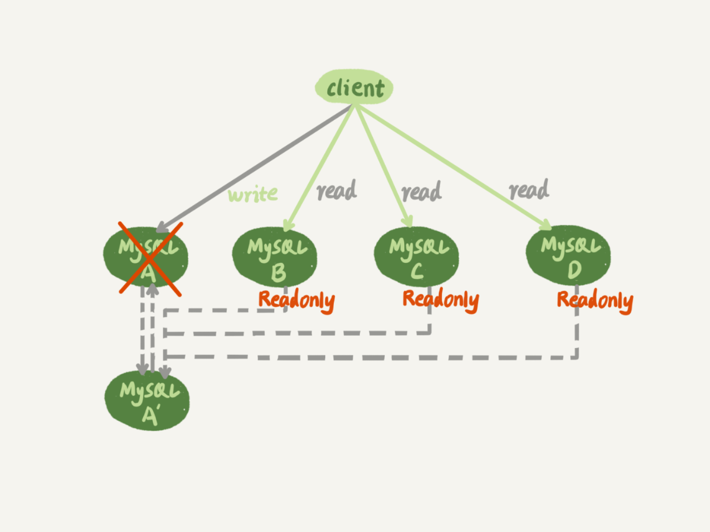](https://leokongwq.github.io/2018/12/21/geektime-mysql-learn/0014f97423bd75235a9187f492fb2453.png)

相比于一主一备的切换流程，一主多从结构在切换完成后，A’会成为新的主库，从库 B、C、D 也要改接到 A’。正是由于多了从库 B、C、D 重新指向的这个过程，所以主备切换的复杂性也相应增加了。

### 基于位点的主备切换

当我们把节点 B 设置成节点 A’的从库的时候，需要执行一条 change master 命令：

```
CHANGE MASTER TO 
MASTER_HOST=$host_name 
MASTER_PORT=$port 
MASTER_USER=$user_name 
MASTER_PASSWORD=$password 
MASTER_LOG_FILE=$master_log_name 
MASTER_LOG_POS=$master_log_pos
```

这条命令有这么 6 个参数：

1. MASTER_HOST、MASTER_PORT、MASTER_USER 和 MASTER_PASSWORD 四个参数，分别代表了主库 A’的 IP、端口、用户名和密码。
2. 最后两个参数 MASTER_LOG_FILE 和 MASTER_LOG_POS 表示，要从主库的 master_log_name 文件的 master_log_pos 这个位置的日志继续同步。而这个位置就是我们所说的同步位点，也就是主库对应的文件名和日志偏移量。

那么，这里就有一个问题了，节点 B 要设置成 A’的从库，就要执行 change master 命令，就不可避免地要设置位点的这两个参数，但是这两个参数到底应该怎么设置呢？

原来节点 B 是 A 的从库，本地记录的也是 A 的位点。但是相同的日志，`A 的位点和 A’的位点是不同的`。因此，从库 B 要切换的时候，就需要先经过`找同步位点`这个逻辑。

这个位点很难精确取到，只能取一个大概位置。为什么这么说呢？

我来和你分析一下看看这个位点一般是怎么获取到的，你就清楚其中不精确的原因了。

考虑到切换过程中不能丢数据，所以我们找位点的时候，总是要找一个`稍微往前`的，然后再通过判断`跳过那些在从库B上已经执行过的事务`。

一种取同步位点的方法是这样的：

1. 等待新主库 A’把中转日志（relay log）全部同步完成；
2. 在 A’上执行 show master status 命令，得到当前 A’上最新的 File 和 Position；
3. 取原主库 A 故障的时刻 T；
4. 用 mysqlbinlog 工具解析 A’的 File，得到 T 时刻的位点。

```
mysqlbinlog File --stop-datetime=T --start-datetime=T
```

[](https://leokongwq.github.io/2018/12/21/geektime-mysql-learn/3471dfe4aebcccfaec0523a08cdd0ddd.png)

图中，end_log_pos 后面的值“123”，表示的就是 A’这个实例，在 T 时刻写入新的 binlog 的位置。然后，我们就可以把 123 这个值作为 $master_log_pos ，用在节点 B 的 change master 命令里。

当然这个值并不精确。为什么呢？

你可以设想有这么一种情况，假设在 T 这个时刻，主库 A 已经执行完成了一个 insert 语句插入了一行数据 R，并且已经将 binlog 传给了 A’和 B，然后在传完的瞬间主库 A 的主机就掉电了。

那么，这时候系统的状态是这样的：

1. 在从库 B 上，由于同步了 binlog， R 这一行已经存在；
2. 在新主库 A’上， R 这一行也已经存在，日志是写在 123 这个位置之后的；
3. 我们在从库 B 上执行 change master 命令，指向 A’的 File 文件的 123 位置，就会把插入 R 这一行数据的 binlog 又同步到从库 B 去执行。

这时候，从库 B 的同步线程就会报告 Duplicate entry ‘id_of_R’ for key ‘PRIMARY’ 错误，提示出现了主键冲突，然后停止同步。

所以：通常情况下，我们在切换任务的时候，要先主动跳过这些错误，有两种常用的方法。

一种做法是，主动跳过一个事务。跳过命令的写法是：

```
set global sql_slave_skip_counter=1;
start slave;
```

因为切换过程中，可能会不止重复执行一个事务，所以我们需要在从库 B 刚开始接到新主库 A’时，持续观察，每次碰到这些错误就停下来，执行一次跳过命令，直到不再出现停下来的情况，以此来跳过可能涉及的所有事务。

另外一种方式是，通过设置 slave_skip_errors 参数，直接设置跳过指定的错误。

在执行主备切换时，有这么两类错误，是经常会遇到的：

- 1062 错误是插入数据时唯一键冲突；
- 1032 错误是删除数据时找不到行。

因此，我们可以把 slave_skip_errors 设置为 “1032,1062”，这样中间碰到这两个错误时就直接跳过。

这里需要注意的是，这种直接跳过指定错误的方法，针对的是主备切换时，由于找不到精确的同步位点，所以只能采用这种方法来创建从库和新主库的主备关系。

这个背景是，我们很清楚在主备切换过程中，直接跳过 1032 和 1062 这两类错误是无损的，所以才可以这么设置 slave_skip_errors 参数。等到主备间的同步关系建立完成，并稳定执行一段时间之后，我们还需要把这个参数设置为空，以免之后真的出现了主从数据不一致，也跳过了。

通过 sql_slave_skip_counter 跳过事务和通过 slave_skip_errors 忽略错误的方法，虽然都最终可以建立从库 B 和新主库 A’的主备关系，但这两种操作都很复杂，而且容易出错。所以，MySQL 5.6 版本引入了 GTID，彻底解决了这个困难。

那么，GTID 到底是什么意思，又是如何解决找同步位点这个问题呢？现在，我就和你简单介绍一下。

GTID 的全称是 Global Transaction Identifier，也就是全局事务 ID，是一个事务在提交的时候生成的，是这个事务的唯一标识。它由两部分组成，格式是：

```
GTID=server_uuid:gno
```

这里我需要和你说明一下，在 MySQL 的官方文档里，GTID 格式是这么定义的：

```
GTID=source_id:transaction_id
```

这里的 source_id 就是 server_uuid；而后面的这个 transaction_id，我觉得容易造成误导，所以我改成了 gno。为什么说使用 transaction_id 容易造成误解呢？

因为，在 MySQL 里面我们说 transaction_id 就是指事务 id，事务 id 是在事务执行过程中分配的，如果这个事务回滚了，事务 id 也会递增，而 gno 是在事务提交的时候才会分配。

从效果上看，GTID 往往是连续的，因此我们用 gno 来表示更容易理解。

GTID 模式的启动也很简单，我们只需要在启动一个 MySQL 实例的时候，加上参数 gtid_mode=on 和 enforce_gtid_consistency=on 就可以了。

在 GTID 模式下，每个事务都会跟一个 GTID 一一对应。这个 GTID 有两种生成方式，而使用哪种方式取决于 session 变量 gtid_next 的值。

1. 如果 gtid_next=automatic，代表使用默认值。这时，MySQL 就会把 server_uuid:gno 分配给这个事务。
   a. 记录 binlog 的时候，先记录一行 SET @@SESSION.GTID_NEXT=‘server_uuid:gno’;
   b. 把这个 GTID 加入本实例的 GTID 集合。
2. 如果 gtid_next 是一个指定的 GTID 的值，比如通过 set gtid_next=’current_gtid’指定为 current_gtid，那么就有两种可能：
   a. 如果 current_gtid 已经存在于实例的 GTID 集合中，接下来执行的这个事务会直接被系统忽略；
   b. 如果 current_gtid 没有存在于实例的 GTID 集合中，就将这个 current_gtid 分配给接下来要执行的事务，也就是说系统不需要给这个事务生成新的 GTID，因此 gno 也不用加 1。

注意，一个 current_gtid 只能给一个事务使用。这个事务提交后，如果要执行下一个事务，就要执行 set 命令，把 gtid_next 设置成另外一个 gtid 或者 automatic。

这样，每个 MySQL 实例都维护了一个 GTID 集合，用来对应“这个实例执行过的所有事务”。

这样看上去不太容易理解，接下来我就用一个简单的例子，来和你说明 GTID 的基本用法。

我们在实例 X 中创建一个表 t。

```
CREATE TABLE `t` (
  `id` int(11) NOT NULL,
  `c` int(11) DEFAULT NULL,
  PRIMARY KEY (`id`)
) ENGINE=InnoDB;

insert into t values(1,1);
```

[](https://leokongwq.github.io/2018/12/21/geektime-mysql-learn/28a5cab0079fb12fd5abecd92b3324c2.png)

可以看到，事务的 BEGIN 之前有一条 SET @@SESSION.GTID_NEXT 命令。这时，如果实例 X 有从库，那么将 CREATE TABLE 和 insert 语句的 binlog 同步过去执行的话，执行事务之前就会先执行这两个 SET 命令， 这样被加入从库的 GTID 集合的，就是图中的这两个 GTID。

假设，现在这个实例 X 是另外一个实例 Y 的从库，并且此时在实例 Y 上执行了下面这条插入语句：

```
insert into t values(1,1);
```

并且，这条语句在实例 Y 上的 GTID 是 “aaaaaaaa-cccc-dddd-eeee-ffffffffffff:10”。

那么，实例 X 作为 Y 的从库，就要同步这个事务过来执行，显然会出现主键冲突，导致实例 X 的同步线程停止。这时，我们应该怎么处理呢？

处理方法就是，你可以执行下面的这个语句序列：

```
set gtid_next='aaaaaaaa-cccc-dddd-eeee-ffffffffffff:10';
begin;
commit;
set gtid_next=automatic;
start slave;
```

其中，前三条语句的作用，是通过提交一个空事务，把这个 GTID 加到实例 X 的 GTID 集合中。如图 5 所示，就是执行完这个空事务之后的 show master status 的结果。

[](https://leokongwq.github.io/2018/12/21/geektime-mysql-learn/c8d3299ece7d583a3ecd1557851ed157.png)

可以看到实例 X 的 Executed_Gtid_set 里面，已经加入了这个 GTID。

这样，我再执行 start slave 命令让同步线程执行起来的时候，虽然实例 X 上还是会继续执行实例 Y 传过来的事务，但是由于“aaaaaaaa-cccc-dddd-eeee-ffffffffffff:10”已经存在于实例 X 的 GTID 集合中了，所以实例 X 就会直接跳过这个事务，也就不会再出现主键冲突的错误。

在上面的这个语句序列中，start slave 命令之前还有一句 set gtid_next=automatic。这句话的作用是“恢复 GTID 的默认分配行为”，也就是说如果之后有新的事务再执行，就还是按照原来的分配方式，继续分配 gno=3。

### 基于 GTID 的主备切换

现在，我们已经理解 GTID 的概念，再一起来看看基于 GTID 的主备复制的用法。

在 GTID 模式下，备库 B 要设置为新主库 A’的从库的语法如下：

```
CHANGE MASTER TO 
MASTER_HOST=$host_name 
MASTER_PORT=$port 
MASTER_USER=$user_name 
MASTER_PASSWORD=$password 
master_auto_position=1
```

其中，master_auto_position=1 就表示这个主备关系使用的是 GTID 协议。可以看到，前面让我们头疼不已的 MASTER_LOG_FILE 和 MASTER_LOG_POS 参数，已经不需要指定了。

我们把现在这个时刻，实例 A’的 GTID 集合记为 set_a，实例 B 的 GTID 集合记为 set_b。接下来，我们就看看现在的主备切换逻辑。

我们在实例 B 上执行 start slave 命令，取 binlog 的逻辑是这样的：

1. 实例 B 指定主库 A’，基于主备协议建立连接。
2. 实例 B 把 set_b 发给主库 A’。
3. 实例 A’算出 set_a 与 set_b 的差集，也就是所有存在于 set_a，但是不存在于 set_b 的 GITD 的集合，判断 A’本地是否包含了这个差集需要的所有 binlog 事务。
   a. 如果不包含，表示 A’已经把实例 B 需要的 binlog 给删掉了，直接返回错误；
   b. 如果确认全部包含，A’从自己的 binlog 文件里面，找出第一个不在 set_b 的事务，发给 B；
4. 之后就从这个事务开始，往后读文件，按顺序取 binlog 发给 B 去执行。

其实，这个逻辑里面包含了一个设计思想：在基于 GTID 的主备关系里，系统认为只要建立主备关系，就必须保证主库发给备库的日志是完整的。因此，如果实例 B 需要的日志已经不存在，A’就拒绝把日志发给 B。

这跟基于位点的主备协议不同。基于位点的协议，是由备库决定的，备库指定哪个位点，主库就发哪个位点，不做日志的完整性判断。

基于上面的介绍，我们再来看看引入 GTID 后，一主多从的切换场景下，主备切换是如何实现的。

由于不需要找位点了，所以从库 B、C、D 只需要分别执行 change master 命令指向实例 A’即可。

其实，严谨地说，主备切换不是不需要找位点了，而是找位点这个工作，在实例 A’内部就已经自动完成了。但由于这个工作是自动的，所以对 HA 系统的开发人员来说，非常友好。

之后这个系统就由新主库 A’写入，主库 A’的自己生成的 binlog 中的 GTID 集合格式是：server_uuid_of_A’:1-M。

如果之前从库 B 的 GTID 集合格式是 server_uuid_of_A:1-N， 那么切换之后 GTID 集合的格式就变成了 server_uuid_of_A:1-N, server_uuid_of_A’:1-M。

当然，主库 A’之前也是 A 的备库，因此主库 A’和从库 B 的 GTID 集合是一样的。这就达到了我们预期。

### GTID 和在线 DDL

在《MySQL 有哪些“饮鸩止渴”提高性能的方法？》中，我和你提到业务高峰期的慢查询性能问题时，分析到如果是由于索引缺失引起的性能问题，我们可以通过在线加索引来解决。但是，考虑到要避免新增索引对主库性能造成的影响，我们可以先在备库加索引，然后再切换。

当时我说，在双 M 结构下，备库执行的 DDL 语句也会传给主库，为了避免传回后对主库造成影响，要通过 set sql_log_bin=off 关掉 binlog。

评论区有位同学提出了一个问题：这样操作的话，数据库里面是加了索引，但是 binlog 并没有记录下这一个更新，是不是会导致数据和日志不一致？

这个问题提得非常好。当时，我在留言的回复中就引用了 GTID 来说明。今天，我再和你展开说明一下。

假设，这两个互为主备关系的库还是实例 X 和实例 Y，且当前主库是 X，并且都打开了 GTID 模式。这时的主备切换流程可以变成下面这样：

1. 在实例 X 上执行 stop slave。

2. 在实例 Y 上执行 DDL 语句。注意，这里并不需要关闭 binlog。

3. 执行完成后，查出这个 DDL 语句对应的 GTID，并记为 server_uuid_of_Y:gno。

4. 到实例 X 上执行以下语句序列：

   ```
   set GTID_NEXT="server_uuid_of_Y:gno";
   begin;
   commit;
   set gtid_next=automatic;
   start slave;
   ```

这样做的目的在于，既可以让实例 Y 的更新有 binlog 记录，同时也可以确保不会在实例 X 上执行这条更新。

- 接下来，执行完主备切换，然后照着上述流程再执行一遍即可。

### 课后题

你在 GTID 模式下设置主从关系的时候，从库执行 start slave 命令后，主库发现需要的 binlog 已经被删除掉了，导致主备创建不成功。这种情况下，你觉得可以怎么处理呢？

答案如下:

1. 如果业务允许主从不一致的情况，那么可以在主库上先执行 show global variables like ‘gtid_purged’，得到主库已经删除的 GTID 集合，假设是 gtid_purged1；然后先在从库上执行 reset master，再执行 set global gtid_purged =‘gtid_purged1’；最后执行 start slave，就会从主库现存的 binlog 开始同步。binlog 缺失的那一部分，数据在从库上就可能会有丢失，造成主从不一致。
2. 如果需要主从数据一致的话，最好还是通过重新搭建从库来做。
3. 如果有其他的从库保留有全量的 binlog 的话，可以把新的从库先接到这个保留了全量 binlog 的从库，追上日志以后，如果有需要，再接回主库。
4. 如果 binlog 有备份的情况，可以先在从库上应用缺失的 binlog，然后再执行 start slave。

## 28讲 - 读写分离有哪些坑？

读写分离主要是为了分担主库的压力。有下面2中场景的架构

客户端直连：

[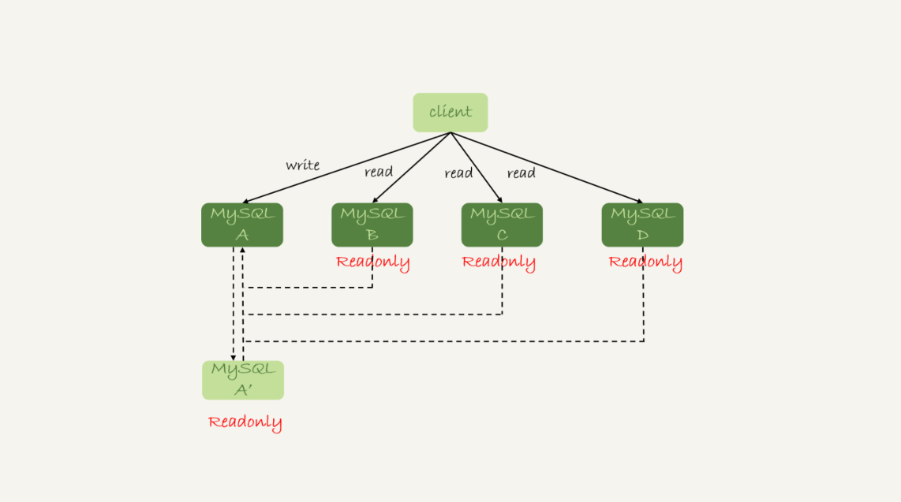](https://leokongwq.github.io/2018/12/21/geektime-mysql-learn/1334b9c08b8fd837832fdb2d82e6b0aa.png)

客户端通过proxy进行读写分离

[](https://leokongwq.github.io/2018/12/21/geektime-mysql-learn/065ef246c59019effc8384967d774318.png)

1. 客户端直连方案，因为少了一层 proxy 转发，所以查询性能稍微好一点儿，并且整体架构简单，排查问题更方便。但是这种方案，由于要了解后端部署细节，所以在出现主备切换、库迁移等操作的时候，客户端都会感知到，并且需要调整数据库连接信息。你可能会觉得这样客户端也太麻烦了，信息大量冗余，架构很丑。其实也未必，一般采用这样的架构，一定会伴随一个负责管理后端的组件，比如 Zookeeper，尽量让业务端只专注于业务逻辑开发。
2. 带 proxy 的架构，对客户端比较友好。客户端不需要关注后端细节，连接维护、后端信息维护等工作，都是由 proxy 完成的。但这样的话，对后端维护团队的要求会更高。而且，proxy 也需要有高可用架构。因此，带 proxy 架构的整体就相对比较复杂。

但是，不论使用哪种架构，你都会碰到我们今天要讨论的问题：由于主从可能存在延迟，客户端执行完一个更新事务后马上发起查询，如果查询选择的是从库的话，就有可能读到刚刚的事务更新之前的状态。

这种“在从库上会读到系统的一个过期状态”的现象，在这篇文章里，我们暂且称之为“过期读”。

前面我们说过了几种可能导致主备延迟的原因，以及对应的优化策略，但是主从延迟还是不能 100% 避免的。

处理过期读的方案汇总

- 强制走主库方案
- sleep 方案
- 判断主备无延迟方案
- 配合 semi-sync 方案
- 等主库位点方案
- 等 GTID 方案

### 强制走主库方案

强制走主库方案其实就是，将查询请求做分类。通常情况下，我们可以将查询请求分为这么两类：

- 对于必须要拿到最新结果的请求，强制将其发到主库上。比如，在一个交易平台上，卖家发布商品以后，马上要返回主页面，看商品是否发布成功。那么，这个请求需要拿到最新的结果，就必须走主库。
- 对于可以读到旧数据的请求，才将其发到从库上。在这个交易平台上，买家来逛商铺页面，就算晚几秒看到最新发布的商品，也是可以接受的。那么，这类请求就可以走从库。

### Sleep 方案

主库更新后，读从库之前先 sleep 一下。具体的方案就是，类似于执行一条 select sleep(1) 命令。

这个方案的假设是，大多数情况下主备延迟在 1 秒之内，做一个 sleep 可以有很大概率拿到最新的数据。

### 判断主备无延迟方案

要确保备库无延迟，通常有三种做法。

#### seconds_behind_master

我们知道 show slave status 结果里的 seconds_behind_master 参数的值，可以用来衡量主备延迟时间的长短。

[](https://leokongwq.github.io/2018/12/21/geektime-mysql-learn/00110923007513e865d7f43a124887c1.png)

每次从库执行查询请求前，先判断 seconds_behind_master 是否已经等于 0。如果还不等于 0 ，那就必须等到这个参数变为 0 才能执行查询请求。

seconds_behind_master 的单位是秒，如果你觉得精度不够的话，还可以采用对比位点和 GTID 的方法来确保主备无延迟，也就是我们接下来要说的第二和第三种方法。

#### 对比位点确保主备无延迟：

- Master_Log_File 和 Read_Master_Log_Pos，表示的是读到的主库的最新位点；
- Relay_Master_Log_File 和 Exec_Master_Log_Pos，表示的是备库执行的最新位点。

如果 Master_Log_File 和 Relay_Master_Log_File、Read_Master_Log_Pos 和 Exec_Master_Log_Pos 这两组值完全相同，就表示接收到的日志已经同步完成。

#### 对比 GTID 集合确保主备无延迟：

- Auto_Position=1 ，表示这对主备关系使用了 GTID 协议。
- Retrieved_Gtid_Set，是备库收到的所有日志的 GTID 集合；
- Executed_Gtid_Set，是备库所有已经执行完成的 GTID 集合。

如果这两个集合相同，也表示备库接收到的日志都已经同步完成。

可见，对比位点和对比 GTID 这两种方法，都要比判断 seconds_behind_master 是否为 0 更准确。

在执行查询请求之前，先判断从库是否同步完成的方法，相比于 sleep 方案，准确度确实提升了不少，但还是没有达到“精确”的程度。为什么这么说呢？

我们现在一起来回顾下，一个事务的 binlog 在主备库之间的状态：

1. 主库执行完成，写入 binlog，并反馈给客户端；
2. binlog 被从主库发送给备库，备库收到；
3. 在备库执行 binlog 完成。

我们上面判断主备无延迟的逻辑，是“备库收到的日志都执行完成了”。但是，从 binlog 在主备之间状态的分析中，不难看出还有一部分日志，处于客户端已经收到提交确认，而备库还没收到日志的状态。

[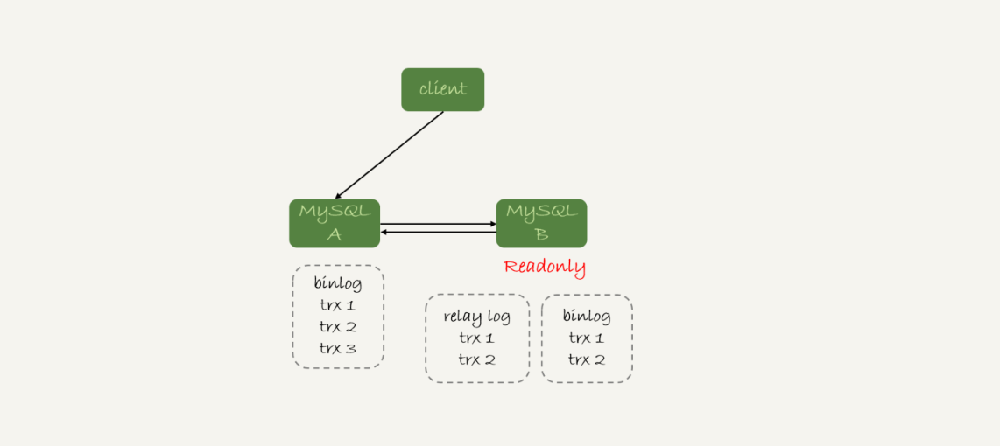](https://leokongwq.github.io/2018/12/21/geektime-mysql-learn/557445207b57d6c0f2747509d7d6619e.png)

这时，主库上执行完成了三个事务 trx1、trx2 和 trx3，其中：

- trx1 和 trx2 已经传到从库，并且已经执行完成了；
- trx3 在主库执行完成，并且已经回复给客户端，但是还没有传到从库中。

如果这时候你在从库 B 上执行查询请求，按照我们上面的逻辑，从库认为已经没有同步延迟，但还是查不到 trx3 的。严格地说，就是出现了过期读。

那么，这个问题有没有办法解决呢？

配合 semi-sync

要解决这个问题，就要引入半同步复制，也就是 semi-sync replication。

semi-sync 做了这样的设计：

1. 事务提交的时候，主库把 binlog 发给从库；
2. 从库收到 binlog 以后，发回给主库一个 ack，表示收到了；
3. 主库收到这个 ack 以后，才能给客户端返回“事务完成”的确认。

也就是说，如果启用了 semi-sync，就表示所有给客户端发送过确认的事务，都确保了备库已经收到了这个日志。

在 第 25 篇文章 的评论区，有同学问到：如果主库掉电的时候，有些 binlog 还来不及发给从库，会不会导致系统数据丢失？

答案是，如果使用的是普通的异步复制模式，就可能会丢失，但 semi-sync 就可以解决这个问题。

这样，semi-sync 配合前面关于位点的判断，就能够确定在从库上执行的查询请求，可以避免过期读。

但是，semi-sync+ 位点判断的方案，只对一主一备的场景是成立的。在一主多从场景中，主库只要等到一个从库的 ack，就开始给客户端返回确认。这时，在从库上执行查询请求，就有两种情况：

- 如果查询是落在这个响应了 ack 的从库上，是能够确保读到最新数据；
- 但如果是查询落到其他从库上，它们可能还没有收到最新的日志，就会产生过期读的问题。

其实，判断同步位点的方案还有另外一个潜在的问题，即：如果在业务更新的高峰期，主库的位点或者 GTID 集合更新很快，那么上面的两个位点等值判断就会一直不成立，很可能出现从库上迟迟无法响应查询请求的情况。

实际上，回到我们最初的业务逻辑里，当发起一个查询请求以后，我们要得到准确的结果，其实并不需要等到“主备完全同步”。

为什么这么说呢？我们来看一下这个时序图。

[](https://leokongwq.github.io/2018/12/21/geektime-mysql-learn/9cf54f3e91dc8f7b8947d7d8e384aa09.png)

图 5 所示，就是等待位点方案的一个 bad case。图中备库 B 下的虚线框，分别表示 relaylog 和 binlog 中的事务。可以看到，图 5 中从状态 1 到状态 4，一直处于延迟一个事务的状态。

备库 B 一直到状态 4 都和主库 A 存在延迟，如果用上面必须等到无延迟才能查询的方案，select 语句直到状态 4 都不能被执行。

但是，其实客户端是在发完 trx1 更新后发起的 select 语句，我们只需要确保 trx1 已经执行完成就可以执行 select 语句了。也就是说，如果在状态 3 执行查询请求，得到的就是预期结果了。

到这里，我们小结一下，semi-sync 配合判断主备无延迟的方案，存在两个问题：

- 一主多从的时候，在某些从库执行查询请求会存在过期读的现象；
- 在持续延迟的情况下，可能出现过度等待的问题。

接下来，我要和你介绍的等主库位点方案，就可以解决这两个问题。

### 等主库位点方案

要理解等主库位点方案，我需要先和你介绍一条命令：

```
select master_pos_wait(file, pos[, timeout]);
```

这条命令的逻辑如下：

- 它是在从库执行的；
- 参数 file 和 pos 指的是主库上的文件名和位置；
- timeout 可选，设置为正整数 N 表示这个函数最多等待 N 秒。

这个命令正常返回的结果是一个正整数 M，表示从命令开始执行，到应用完 file 和 pos 表示的 binlog 位置，执行了多少事务。

当然，除了正常返回一个正整数 M 外，这条命令还会返回一些其他结果，包括：

- 如果执行期间，备库同步线程发生异常，则返回 NULL；
- 如果等待超过 N 秒，就返回 -1；
- 如果刚开始执行的时候，就发现已经执行过这个位置了，则返回 0。

对于图 5 中先执行 trx1，再执行一个查询请求的逻辑，要保证能够查到正确的数据，我们可以使用这个逻辑：

- trx1 事务更新完成后，马上执行 show master status 得到当前主库执行到的 File 和 Position；
- 选定一个从库执行查询语句；
- 在从库上执行 select master_pos_wait(File, Position, 1)；
- 如果返回值是 >=0 的正整数，则在这个从库执行查询语句；
- 否则，到主库执行查询语句。

[](https://leokongwq.github.io/2018/12/21/geektime-mysql-learn/b20ae91ea46803df1b63ed683e1de357.png)

这里我们假设，这条 select 查询最多在从库上等待 1 秒。那么，如果 1 秒内 master_pos_wait 返回一个大于等于 0 的整数，就确保了从库上执行的这个查询结果一定包含了 trx1 的数据。

步骤 5 到主库执行查询语句，是这类方案常用的退化机制。因为从库的延迟时间不可控，不能无限等待，所以如果等待超时，就应该放弃，然后到主库去查。

你可能会说，如果所有的从库都延迟超过 1 秒了，那查询压力不就都跑到主库上了吗？确实是这样。

但是，按照我们设定不允许过期读的要求，就只有两种选择，一种是超时放弃，一种是转到主库查询。具体怎么选择，就需要业务开发同学做好限流策略了。

### GTID 方案

如果你的数据库开启了 GTID 模式，对应的也有等待 GTID 的方案。

MySQL 中同样提供了一个类似的命令：

```
select wait_for_executed_gtid_set(gtid_set, 1);
```

这条命令的逻辑是：

- 等待，直到这个库执行的事务中包含传入的 gtid_set，返回 0；
- 超时返回 1。

在前面等位点的方案中，我们执行完事务后，还要主动去主库执行 show master status。而 MySQL 5.7.6 版本开始，允许在执行完更新类事务后，把这个事务的 GTID 返回给客户端，这样等 GTID 的方案就可以减少一次查询。

这时，等 GTID 的执行流程就变成了：

- trx1 事务更新完成后，从返回包直接获取这个事务的 GTID，记为 gtid1；
- 选定一个从库执行查询语句；
- 在从库上执行 select wait_for_executed_gtid_set(gtid1, 1)；
- 如果返回值是 0，则在这个从库执行查询语句；
- 否则，到主库执行查询语句。

跟等主库位点的方案一样，等待超时后是否直接到主库查询，需要业务开发同学来做限流考虑。

[](https://leokongwq.github.io/2018/12/21/geektime-mysql-learn/d521de8017297aff59db2f68170ee739.png)

在上面的第一步中，trx1 事务更新完成后，从返回包直接获取这个事务的 GTID。问题是，怎么能够让 MySQL 在执行事务后，返回包中带上 GTID 呢？

你只需要将参数 session_track_gtids 设置为 OWN_GTID，然后通过 API 接口 mysql_session_track_get_first 从返回包解析出 GTID 的值即可。

在专栏的第一篇文章中，我介绍 mysql_reset_connection 的时候，评论区有同学留言问这类接口应该怎么使用。

这里我再回答一下。其实，MySQL 并没有提供这类接口的 SQL 用法，是提供给程序的 API https://dev.mysql.com/doc/refman/5.7/en/c-api-functions.html

比如，为了让客户端在事务提交后，返回的 GITD 能够在客户端显示出来，我对 MySQL 客户端代码做了点修改，如下所示：

[](https://leokongwq.github.io/2018/12/21/geektime-mysql-learn/973bdd8741f830acebe005cbf37a7663.png)

这样，就可以看到语句执行完成，显示出 GITD 的值。

当然了，这只是一个例子。你要使用这个方案的时候，还是应该在你的客户端代码中调用 mysql_session_track_get_first 这个函数。

### 课后题

假设你的系统采用了我们文中介绍的最后一个方案，也就是等 GTID 的方案，现在你要对主库的一张大表做 DDL，可能会出现什么情况呢？为了避免这种情况，你会怎么做呢？

答案：如果该DDL语句在主库执行了10min，那么提交后传到备库执行也需要10min。之后主库DDL后提交的事务的GTID，在备库查询时，需要等待10min才会出现，此时，所有的读请求都会路由到主库。

方法1：在业务低峰期进行，确保主库可以满足所有的查询压力，把所有的读请求都路由到主库上。等备库追上主库后切回来。
方法2：先在被库执行DDL，再将备库切换主库。

## 29讲-如何判断一个数据库是不是出问题了？

### 主备切换

- 主动切换
- 被动切换(HA系统发起)

### 主库健康检查

#### select 1

只能判断MySQL进程存在

- innodb_thread_concurrency 控制innodb并发线程上限，超过该值的请求进入等待状态。 默认该值为0，表示不限制。
- 并发连接 != 并发查询(`innodb_thread_concurrency`)， show processlist查询的是并发连接
- 进入锁等待的线程不占用`innodb_thread_concurrency`的值。

#### 查询表判断

创建一个表`health_check`，定时检查。

这种方法能检查因并发线程多导致系统不可用的情况。

#### 更新判断

执行update语句，来判断是否有足够的磁盘来保证系统的正常运行（更新会写binlog和redo log，磁盘空间不足会导致所有的更新都阻塞）。

主备都需要做健康检查：

双M架构下，为了防止主备之间的更新冲突，`mysql.health_check`表插入多行数据，以`server_id`作为主键。

```
mysql> CREATE TABLE `health_check` (
  `id` int(11) NOT NULL,
  `t_modified` timestamp NOT NULL DEFAULT CURRENT_TIMESTAMP,
  PRIMARY KEY (`id`)
) ENGINE=InnoDB;

/* 检测命令 */
insert into mysql.health_check(id, t_modified) values (@@server_id, now()) on duplicate key update t_modified=now();
```

### 外部检查的局限性

上面提到的都是外部检查的实现方案。有一定的缺点：

1. 随机性。轮询进行健康检查，不能及时发现问题。
2. 外部健康检查请求需要的资源少，能马上执行，但是其他业务请求不能正常处理。

### 内部检查

`performance_schema`里面有多个表，可以统计系统的健康状况。

## 30讲 - 用动态的观点看加锁

## 31讲 - 误删数据库处理

## 32讲 - 为什么还有kill不掉的语句

## 33讲 - 我查这么多数据会不会把数据库打爆

## 34讲 - 到底可不可以使用Join

## 35讲 - join语句怎么优化

## 36讲 - 为什么临时表可以重名

## 37讲 - 什么时候会使用内部临时表

### union 执行流程

初始化数据

```
create table t1(id int primary key, a int, b int, index(a));
delimiter ;;
create procedure idata()
begin
  declare i int;

  set i=1;
  while(i<=1000)do
    insert into t1 values(i, i, i);
    set i=i+1;
  end while;
end;;
delimiter ;
call idata();
```

然后执行：

```
(select 1000 as f) union (select id from t1 order by id desc limit 2);
```

意思是取2个子查询结果的并集。

[](https://leokongwq.github.io/2018/12/21/geektime-mysql-learn/402cbdef84eef8f1b42201c6ec4bad4e.png)

`using temporary` 表示使用了临时表。

该语句的执行流程如下：

1. 创建一个只有一个整形字段`f`，且`f`是主键的临时表。
2. 执行第一个子查询，得到1000这个值，插入到临时表中。
3. 执行第二个子查询，得到1000插入临时表时，违反唯一性约束，失败，然后继续执行。
4. 取第二行999，插入临时表成功。结束。
5. 从临时表获取数据，返回给客户端，并删除临时表。

可以看出：临时表使用来`暂存`数据的。

如果将`union`改为`union all`，没有去重语义，这样就依次执行子查询，将结果返回给客户端，不会使用到临时表。

[](https://leokongwq.github.io/2018/12/21/geektime-mysql-learn/c1e90d1d7417b484d566b95720fe3f6d.png)

### group by 执行流程

```
select id%10 as m, count(*) as c from t1 group by m;
```

该语句的逻辑是，将表中的数据按`1d%10`后的结果进行分组统计，然后按`m`的结果排序后输出。

[](https://leokongwq.github.io/2018/12/21/geektime-mysql-learn/3d1cb94589b6b3c4bb57b0bdfa385d98.png)

从explain的结果可以知道：

1. Using index, 表示使用了覆盖索引，选择了索引a， 不需要回表。
2. Using temporary，表示使用了临时表。
3. Using filesort，表示使用了文件排序。

语句执行流程如下：

1. 创建一个临时表，包含字段 `m` 和 `c`, 主键是`m`。
2. 扫描索引`a`，依次取出叶子节点上的id值，计算`id%10`的结果，记为x。
3. 如果临时表中没有主键为x的行，则插入(x, 1)；如果存在，则对x行的c列加一。
4. 遍历`索引a`完成后，对临时表按`m`进行排序，得到的结果输出给客户端。

[](https://leokongwq.github.io/2018/12/21/geektime-mysql-learn/0399382169faf50fc1b354099af71954.jpg)

内存临时表的排序如下：

[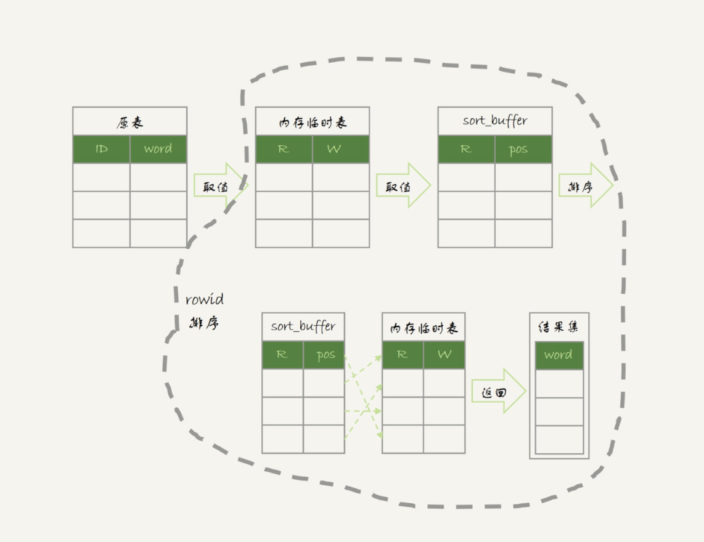](https://leokongwq.github.io/2018/12/21/geektime-mysql-learn/b5168d201f5a89de3b424ede2ebf3d68.jpg)

> 注意：如果不需要对结果进行排序，可以在语句后面添加`order by null`来取消排序过程。

```
select id%10 as m, count(*) as c from t1 group by m order by null;
```

内存临时表的大小由`tmp_table_size`来设置(默认是16M)，如果数据量很大，不能全部保存在内存临时表中，此时就会使用磁盘临时表。磁盘临时表使用的是Innodb存储引擎。

### group by的优化方法 - 索引

不论是内存临时表还是磁盘临时表，都需创建一个带有主键的临时表。

group by 的语义逻辑，是统计不同的值出现的个数。但是，由于每一行的 id%100 的结果是无序的，所以我们就需要有一个临时表，来记录并统计结果。

那么，如果扫描过程中可以保证出现的数据是有序的，是不是就简单了呢？

假设，现在有一个类似图 10 的这么一个数据结构，我们来看看 group by 可以怎么做。

[](https://leokongwq.github.io/2018/12/21/geektime-mysql-learn/5c4a581c324c1f6702f9a2c70acddd19.jpg)

可以看到，如果可以确保输入的数据是有序的，那么计算 `group by` 的时候，就只需要从左到右，顺序扫描，依次累加。

按照这个逻辑执行的话，扫描到整个输入的数据结束，就可以拿到 `group by` 的结果，不需要临时表，也不需要再额外排序。

InnoDB 的索引，就可以满足这个输入有序的条件。

在 MySQL 5.7 版本支持了 generated column 机制，用来实现列数据的关联更新。你可以用下面的方法创建一个列 z，然后在 z 列上创建一个索引（如果是 MySQL 5.6 及之前的版本，你也可以创建普通列和索引，来解决这个问题）。

```
alter table t1 add column z int generated always as(id % 100), add index(z);
```

这样，索引 z 上的数据就是类似图 10 这样有序的了。上面的 group by 语句就可以改成：

```
select z, count(*) as c from t1 group by z;
```

### group by 优化方法 – 直接排序

如果可以通过加索引来完成 group by 逻辑就再好不过了。但是，如果碰上不适合创建索引的场景，我们还是要老老实实做排序的。那么，这时候的 group by 要怎么优化呢？

如果我们明明知道，一个 group by 语句中需要放到临时表上的数据量特别大，却还是要按照“先放到内存临时表，插入一部分数据后，发现内存临时表不够用了再转成磁盘临时表”，看上去就有点儿傻。

在 group by 语句中加入 `SQL_BIG_RESULT` 这个提示（hint），就可以告诉优化器：这个语句涉及的数据量很大，请直接用磁盘临时表。

MySQL 的优化器一看，磁盘临时表是 B+ 树存储，存储效率不如数组来得高。所以，既然你告诉我数据量很大，那从磁盘空间考虑，还是直接用数组来存吧。

下面语句：

```
select SQL_BIG_RESULT id%100 as m, count(*) as c from t1 group by m;
```

执行流程：

- 初始化 sort_buffer，确定放入一个整型字段，记为 m；
- 扫描表 t1 的索引 a，依次取出里面的 id 值, 将 id%100 的值存入 sort_buffer 中；
- 扫描完成后，对 sort_buffer 的字段 m 做排序（如果 sort_buffer 内存不够用，就会利用磁盘临时文件辅助排序）；
- 排序完成后，就得到了一个有序数组。

### 小结

基于上面的 union、union all 和 group by 语句的执行过程的分析，我们来回答文章开头的问题：MySQL 什么时候会使用内部临时表？

- 如果语句执行过程可以一边读数据，一边直接得到结果，是不需要额外内存的，否则就需要额外的内存，来保存中间结果；
- join_buffer 是无序数组，sort_buffer 是有序数组，临时表是二维表结构；
- 如果执行逻辑需要用到二维表特性，就会优先考虑使用临时表。比如我们的例子中，union 需要用到唯一索引约束， group by 还需要用到另外一个字段来存累积计数。

## 38讲 - 都说InnoDB好，那还要不要使用Memory引擎？

Innodb引擎

[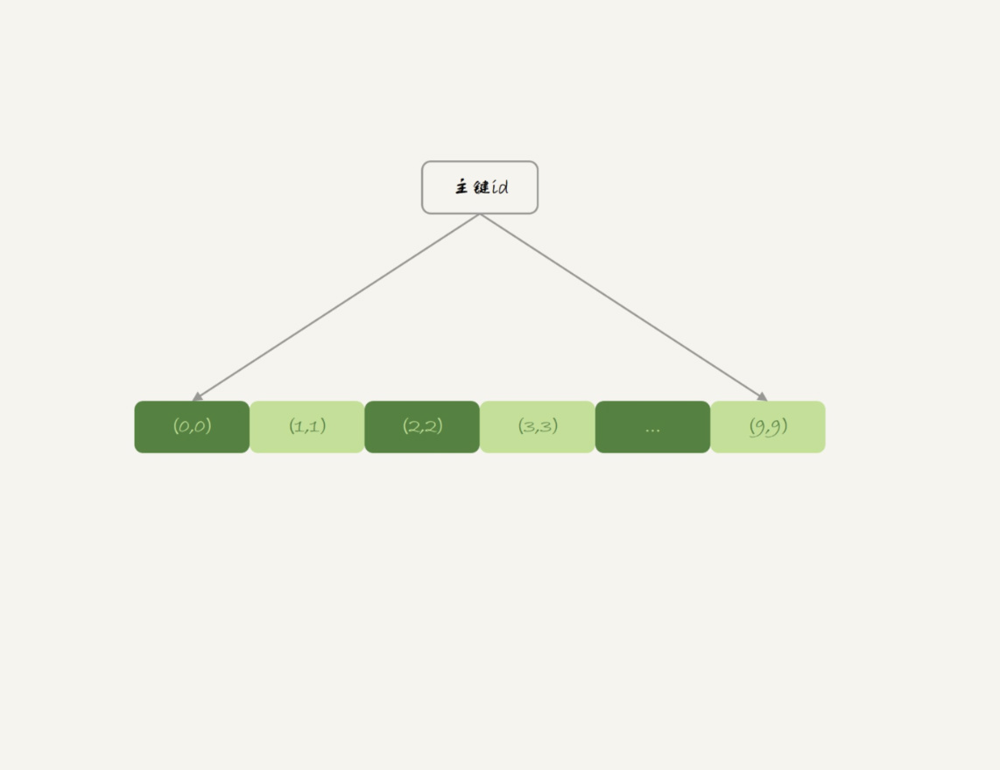](https://leokongwq.github.io/2018/12/21/geektime-mysql-learn/4e29e4f9db55ace6ab09161c68ad8c8d.jpg)

Memory引擎

与 InnoDB 引擎不同，Memory 引擎的数据和索引是分开的。我们来看一下表 t1 中的数据内容。

[](https://leokongwq.github.io/2018/12/21/geektime-mysql-learn/dde03e92074cecba4154d30cd16a9684.jpg)

可以看到，内存表的`数据部分以数组`的方式单独存放，而主键 id 索引里，存的是每个`数据的位置`。主键 id 是 `hash` 索引，可以看到索引上的 `key 并不是有序的`。

1. InnoDB 引擎把数据放在主键索引上，其他索引上保存的是主键 id。这种方式，我们称之为索引组织表（Index Organizied Table）。
2. 而 Memory 引擎采用的是把数据单独存放，索引上保存`数据位置`的数据组织形式，我们称之为堆组织表（Heap Organizied Table）。

从中我们可以看出，这两个引擎的一些典型不同：

1. InnoDB 表的数据总是有序存放的，而内存表的数据就是按照写入顺序存放的；
2. 当数据文件有空洞的时候，InnoDB 表在插入新数据的时候，为了保证数据有序性，只能在固定的位置写入新值，而内存表找到空位就可以插入新值；
3. 数据位置发生变化的时候，InnoDB 表只需要修改主键索引，而内存表需要修改所有索引；
4. InnoDB 表用主键索引查询时需要走一次索引查找，用普通索引查询的时候，需要走两次索引查找。而内存表没有这个区别，所有索引的“地位”都是相同的。
5. InnoDB 支持变长数据类型，不同记录的长度可能不同；内存表不支持 Blob 和 Text 字段，并且即使定义了 varchar(N)，实际也当作 char(N)，也就是固定长度字符串来存储，因此内存表的每行数据长度相同。

需要指出的是，表 t1 的这个主键索引是哈希索引，因此如果执行范围查询，比如

```
select * from t1 where id<5;
```

是用不上主键索引的，需要走全表扫描。

### hash 索引和 B-Tree 索引

实际上，内存表也是支 B-Tree 索引的。在 id 列上创建一个 B-Tree 索引，SQL 语句可以这么写：

```
alter table t1 add index a_btree_index using btree (id);
```

这时，表 t1 的数据组织形式就变成了这样：

[](https://leokongwq.github.io/2018/12/21/geektime-mysql-learn/1788deca56cb83c114d8353c92e3bde3.jpg)

不建议你在生产环境上使用内存表，原因如下：

- 锁粒度问题；
- 数据持久化问题。

### 内存表的锁

内存表不支持行锁，只支持表锁。因此，一张表只要有更新，就会堵住其他所有在这个表上的读写操作。

### 数据持久性问题

数据放在内存中，是内存表的优势，但也是一个劣势。因为，数据库重启的时候，所有的内存表都会被清空。

在高可用架构下，稳定性很差，可能发生主从库的数据都被情况的异常。

重启会丢数据，如果一个备库重启，会导致主备同步线程停止；如果主库跟这个备库是双 M 架构，还可能导致主库的内存表数据被删掉。

> 建议你把普通内存表都用 InnoDB 表来代替。
> 基于内存表的特性，它的一个适用场景，就是内存临时表。内存表支持 hash 索引，这个特性利用起来，对复杂查询的加速效果还是很不错的。

## 自增主键为什么不是连续的?

1. 不同引擎自增主键的值保存在不同的地方。
2. Memory 保存在数据文件中
3. MySQL8.0之前保存在内存中，重启会丢失。8.0开始保存在redo log 中。

### 自增值修改机制

1. 如果插入数据时 id 字段指定为 0、null 或未指定值，那么就把这个表当前的 AUTO_INCREMENT 值填到自增字段；
2. 如果插入数据时 id 字段指定了具体的值，就直接使用语句里指定的值。

根据要插入的值和当前自增值的大小关系，自增值的变更结果也会有所不同。假设，某次要插入的值是 X，当前的自增值是 Y。

1. 如果 X<Y，那么这个表的自增值不变；
2. 如果 X≥Y，就需要把当前自增值修改为新的自增值。

新的自增值生成算法是：

> 从 auto_increment_offset 开始，以 auto_increment_increment 为步长，持续叠加，直到找到第一个大于 X 的值，作为新的自增值。

其中，auto_increment_offset 和 auto_increment_increment 是两个系统参数，分别用来表示自增的初始值和步长，默认值都是 1。

> 备注：在一些场景下，使用的就不全是默认值。比如，双 M 的主备结构里要求双写的时候，我们就可能会设置成 auto_increment_increment=2，让一个库的自增 id 都是奇数，另一个库的自增 id 都是偶数，避免两个库生成的主键发生冲突。

当 auto_increment_offset 和 auto_increment_increment 都是 1 的时候，新的自增值生成逻辑很简单，就是：

- 如果准备插入的值 >= 当前自增值，新的自增值就是“准备插入的值 +1”；
- 否则，自增值不变。

### 自增值的修改时机

假设，表 t 里面已经有了 (1,1,1) 这条记录，这时我再执行一条插入数据命令：

```
insert into t values(null, 1, 1);
```

1. 执行器调用 InnoDB 引擎接口写入一行，传入的这一行的值是 (0,1,1);
2. InnoDB 发现用户没有指定自增 id 的值，获取表 t 当前的自增值 2；
3. 将传入的行的值改成 (2,1,1);
4. 将表的自增值改成 3；
5. 继续执行插入数据操作，由于已经存在 c=1 的记录，所以报 Duplicate key error，语句返回。

可以看到，这个表的自增值改成 3，是在真正执行插入数据的操作之前。这个语句真正执行的时候，因为碰到唯一键 c 冲突，所以 id=2 这一行并没有插入成功，`但也没有将自增值再改回去`。

> 唯一键冲突是导致自增主键 id 不连续的第一种原因。
> 事务回滚也会产生类似的现象，这就是第二种原因。

你可能会问，为什么在出现唯一键冲突或者回滚的时候，MySQL 没有把表 t 的自增值改回去呢？如果把表 t 的当前自增值从 3 改回 2，再插入新数据的时候，不就可以生成 id=2 的一行数据了吗？

其实，MySQL 这么设计是为了提升性能。接下来，我就跟你分析一下这个设计思路，看看

假设有两个并行执行的事务，在申请自增值的时候，为了避免两个事务申请到相同的自增 id，肯定要加锁，然后顺序申请。

1. 假设事务 A 申请到了 id=2， 事务 B 申请到 id=3，那么这时候表 t 的自增值是 4，之后继续执行。
2. 事务 B 正确提交了，但事务 A 出现了唯一键冲突。
3. 如果允许事务 A 把自增 id 回退，也就是把表 t 的当前自增值改回 2，那么就会出现这样的情况：表里面已经有 id=3 的行，而当前的自增 id 值是 2。
4. 接下来，继续执行的其他事务就会申请到 id=2，然后再申请到 id=3。这时，就会出现插入语句报错“主键冲突”。

而为了解决这个主键冲突，有两种方法：

1. 每次申请 id 之前，先判断表里面是否已经存在这个 id。如果存在，就跳过这个 id。但是，这个方法的成本很高。因为，本来申请 id 是一个很快的操作，现在还要再去主键索引树上判断 id 是否存在。
2. 把自增 id 的锁范围扩大，必须等到一个事务执行完成并提交，下一个事务才能再申请自增 id。这个方法的问题，就是锁的粒度太大，系统并发能力大大下降。

可见，这两个方法都会导致性能问题。造成这些麻烦的罪魁祸首，就是我们假设的这个“允许自增 id 回退”的前提导致的。

因此，InnoDB 放弃了这个设计，语句执行失败也不回退自增 id。也正是因为这样，所以才只保证了自增 id 是递增的，但不保证是连续的。

### 自增锁的优化

可以看到，自增 id 锁并不是一个事务锁，而是每次申请完就马上释放，以便允许别的事务再申请。其实，在 MySQL 5.1 版本之前，并不是这样的。

在 MySQL 5.0 版本的时候，自增锁的范围是语句级别。也就是说，如果一个语句申请了一个表自增锁，这个锁会等语句执行结束以后才释放。显然，这样设计会影响并发度。

MySQL 5.1.22 版本引入了一个新策略，新增参数 innodb_autoinc_lock_mode，默认值是 1。

1. 这个参数的值被设置为 0 时，表示采用之前 MySQL 5.0 版本的策略，即语句执行结束后才释放锁；
2. 这个参数的值被设置为 1 时：
   - 普通 insert 语句，自增锁在申请之后就马上释放；
   - 类似 insert … select 这样的批量插入数据的语句，自增锁还是要等语句结束后才被释放；
3. 这个参数的值被设置为 2 时，所有的申请自增主键的动作都是申请后就释放锁。

为什么默认设置下，insert … select 要使用语句级的锁？为什么这个参数的默认值不是 2？

答案是，这么设计还是为了数据的一致性。

我们一起来看一下这个场景：

[](https://leokongwq.github.io/2018/12/21/geektime-mysql-learn/e0a69e151277de54a8262657e4ec89df.png)

你可以设想一下，如果 session B 是申请了自增值以后马上就释放自增锁，那么就可能出现这样的情况：

- session B 先插入了两个记录，(1,1,1)、(2,2,2)；
- 然后，session A 来申请自增 id 得到 id=3，插入了（3,5,5)；
- 之后，session B 继续执行，插入两条记录 (4,3,3)、 (5,4,4)。

你可能会说，这也没关系吧，毕竟 session B 的语义本身就没有要求表 t2 的所有行的数据都跟 session A 相同。

是的，从数据逻辑上看是对的。但是，如果我们现在的 binlog_format=statement，你可以设想下，binlog 会怎么记录呢？

由于两个 session 是同时执行插入数据命令的，所以 binlog 里面对表 t2 的更新日志只有两种情况：要么先记 session A 的，要么先记 session B 的。

但不论是哪一种，这个 binlog 拿去从库执行，或者用来恢复临时实例，备库和临时实例里面，session B 这个语句执行出来，生成的结果里面，id 都是连续的。这时，这个库就发生了数据不一致。

原因在于原库 session B 的 insert 语句，生成的 id 不连续。这个不连续的 id，用 statement 格式的 binlog 来串行执行，是执行不出来的。

而要解决这个问题，有两种思路：

1. 一种思路是，让原库的批量插入数据语句，固定生成连续的 id 值。所以，自增锁直到语句执行结束才释放，就是为了达到这个目的。
2. 另一种思路是，在 binlog 里面把插入数据的操作都如实记录进来，到备库执行的时候，不再依赖于自增主键去生成。这种情况，其实就是 innodb_autoinc_lock_mode 设置为 2，同时 binlog_format 设置为 row。

因此，在生产上，尤其是有 insert … select 这种批量插入数据的场景时，从并发插入数据性能的角度考虑，我建议你这样设置：innodb_autoinc_lock_mode=2 ，并且 binlog_format=row. 这样做，既能提升并发性，又不会出现数据一致性问题。

需要注意的是，我这里说的，批量插入数据，包含的语句类型是 insert … select、replace … select 和 load data 语句。

但是，在普通的 insert 语句里面包含多个 value 值的情况下，即使 innodb_autoinc_lock_mode 设置为 1，也不会等语句执行完成才释放锁。因为这类语句在申请自增 id 的时候，是可以精确计算出需要多少个 id 的，然后一次性申请，申请完成后锁就可以释放了。

也就是说，批量插入数据的语句，之所以需要这么设置，是因为`不知道要预先申请多少个 id`。

既然预先不知道要申请多少个自增 id，那么一种直接的想法就是需要一个时申请一个。但如果一个 select … insert 语句要插入 10 万行数据，按照这个逻辑的话就要申请 10 万次。显然，这种申请自增 id 的策略，在大批量插入数据的情况下，不但速度慢，还会影响并发插入的性能。

因此，对于批量插入数据的语句，MySQL 有一个批量申请自增 id 的策略：

- 语句执行过程中，第一次申请自增 id，会分配 1 个；
- 1 个用完以后，这个语句第二次申请自增 id，会分配 2 个；
- 2 个用完以后，还是这个语句，第三次申请自增 id，会分配 4 个；
- 依此类推，同一个语句去申请自增 id，每次申请到的自增 id 个数都是上一次的两倍。

```
insert into t values(null, 1,1);
insert into t values(null, 2,2);
insert into t values(null, 3,3);
insert into t values(null, 4,4);
create table t2 like t;
insert into t2(c,d) select c,d from t;
insert into t2 values(null, 5,5);
```

insert…select，实际上往表 t2 中插入了 4 行数据。但是，这四行数据是分三次申请的自增 id，第一次申请到了 id=1，第二次被分配了 id=2 和 id=3， 第三次被分配到 id=4 到 id=7。

由于这条语句实际只用上了 4 个 id，所以 id=5 到 id=7 就被浪费掉了。之后，再执行 insert into t2 values(null, 5,5)，实际上插入的数据就是（8,5,5)。

> 这是主键 id 出现自增 id 不连续的第三种原因。

### 课后题

在最后一个例子中，执行 insert into t2(c,d) select c,d from t; 这个语句的时候，如果隔离级别是可重复读（repeatable read），binlog_format=statement。这个语句会对表 t 的所有记录和间隙加锁。

答案：

## 40 讲 insert语句的锁为什么这么多？

## 41讲 - 怎么快速复制一张表？

如果可以控制对源表的扫描行数和加锁范围很小的话，可以简单的使用`insert select` 语句实现。

如果需要避免对源表加锁，稳妥的解决办法是将数据保存到临时文件中，然后再写入目标表。此时有两种办法如下：

创建表 db1.t:

```
create database db1;
use db1;

create table t(id int primary key, a int, b int, index(a))engine=innodb;
delimiter ;;
  create procedure idata()
  begin
    declare i int;
    set i=1;
    while(i<=1000)do
      insert into t values(i,i,i);
      set i=i+1;
    end while;
  end;;
delimiter ;
call idata();

create database db2;
create table db2.t like db1.t
```

### mysqldump

将db1.t表中的>900的数据导出到文件：

```
mysqldump -h$host -P$port -u$user --add-locks --no-create-info --single-transaction  --set-gtid-purged=OFF db1 t --where="a>900" --result-file=/client_tmp/t.sql
```

参数解析：

1. –single-transaction 意思是导出数据的是，不需要对db1.t加表锁，而是使用`start transaction with consitent snapshot`方法。
2. –add-locks 设置为0，表示在输出的文件中，不增加`lock tables t write`
3. –no-create-info 表示不要导出表结构
4. –set-gtid-purged=OFF 表示不要输出和gtid相关的信息
5. –result-file 指定数据文件的路径，client表示文件位于客户端机器上。

输出的文件内存是`insert values (...),(...)`格式，目的是为了加快执行速度。

可以通过参数`--skip-extended-insert`变为一个个的insert语句。

通过下面的语句将数据导入：

```
mysql -h127.0.0.1 -P13000  -uroot db2 -e "source /client_tmp/t.sql"
```

### 导出csv文件

```
select * from db1.t where a>900 into outfile '/server_tmp/t.csv';
```

注意事项：

1. 该语句的结果是保存在服务端的。
2. into outfile指定了文件的位置，这个位置必须受参数`secure_file_priv`限制。1，设置为empty表示不限制(不安全)。2,如果是一个表示路径的字符串，表示只能保存在这个目录。3,设置为NULL表示禁止执行该操作。
3. 该命令不会帮你覆盖已经存在的文件。
4. 原则上一行数据对应文本中的一行，但是字段值有换行符，文本中也会包含换行符，但是会被转义。

```
load data infile '/server_tmp/t.csv' into table db2.t;
```

执行流程如下：

1. 打开文件，以制表符`\t`作为字段值得分隔符，以换行符`\n`作为记录之间的分隔符进行数据读取。
2. 启动事务。
3. 判断每一行的字段数和目标表是否相同，不相同就会报错，事务回滚。相同，构造一行数据，调用存储引擎接口写入表中。
4. 重复步骤3，直到读完整个文件。提交事务。

从库：

1. 主库执行完成后，将导出的文件`/server_tmp/t.csv`内容直接写入binlog。
2. 往 binlog 文件中写入语句 load data local infile ‘/tmp/SQL_LOAD_MB-1-0’ INTO TABLE `db2`.`t`。
3. 把这个 binlog 日志传到备库。
4. 备库的 apply 线程在执行这个事务日志时：
   a. 先将 binlog 中 t.csv 文件的内容读出来，写入到本地临时目录 /tmp/SQL_LOAD_MB-1-0 中；
   b. 再执行 load data 语句，往备库的 db2.t 表中插入跟主库相同的数据。

整个执行流程：

[](https://leokongwq.github.io/2018/12/21/geektime-mysql-learn/3a6790bc933af5ac45a75deba0f52cfd.jpg)

注意，这里备库执行的 load data 语句里面，多了一个“local”。它的意思是“将执行这条命令的客户端所在机器的本地文件 /tmp/SQL_LOAD_MB-1-0 的内容，加载到目标表 db2.t 中”。

也就是说，load data 命令有两种用法

- 不加“local”，是读取服务端的文件，这个文件必须在 secure_file_priv 指定的目录或子目录下；
- 加上“local”，读取的是客户端的文件，只要 mysql 客户端有访问这个文件的权限即可。这时候，MySQL 客户端会先把本地文件传给服务端，然后执行上述的 load data 流程。

另外需要注意的是，select …into outfile 方法不会生成表结构文件, 所以我们导数据时还需要单独的命令得到表结构定义。mysqldump 提供了一个–tab 参数，可以同时导出表结构定义文件和 csv 数据文件。这条命令的使用方法如下：

```
mysqldump -h$host -P$port -u$user ---single-transaction  --set-gtid-purged=OFF db1 t --where="a>900" --tab=$secure_file_priv
```

这条命令会在 `$secure_file_priv` 定义的目录下，创建一个 t.sql 文件保存建表语句，同时创建一个 t.txt 文件保存 CSV 数据。

### 物理拷贝方法

前面我们提到的 mysqldump 方法和导出 CSV 文件的方法，都是逻辑导数据的方法，也就是将数据从表 db1.t 中读出来，生成文本，然后再写入目标表 db2.t 中。

你可能会问，有物理导数据的方法吗？比如，直接把 db1.t 表的.frm 文件和.ibd 文件拷贝到 db2 目录下，是否可行呢？

答案是不行的。

因为，一个 InnoDB 表，除了包含这两个物理文件外，还需要在数据字典中注册。直接拷贝这两个文件的话，因为数据字典中没有 db2.t 这个表，系统是不会识别和接受它们的。

不过，在 MySQL 5.6 版本引入了可传输表空间(transportable tablespace) 的方法，可以通过导出 + 导入表空间的方式，实现物理拷贝表的功能。

假设我们现在的目标是在 db1 库下，复制一个跟表 t 相同的表 r，具体的执行步骤如下：

1. 执行 create table r like t，创建一个相同表结构的空表；
2. 执行 alter table r discard tablespace，这时候 r.ibd 文件会被删除；
3. 执行 flush table t for export，这时候 db1 目录下会生成一个 t.cfg 文件；
4. 在 db1 目录下执行 cp t.cfg r.cfg; cp t.ibd r.ibd；这两个命令；
5. 执行 unlock tables，这时候 t.cfg 文件会被删除；
6. 执行 alter table r import tablespace，将这个 r.ibd 文件作为表 r 的新的表空间，由于这个文件的数据内容和 t.ibd 是相同的，所以表 r 中就有了和表 t 相同的数据。

流程如下：

[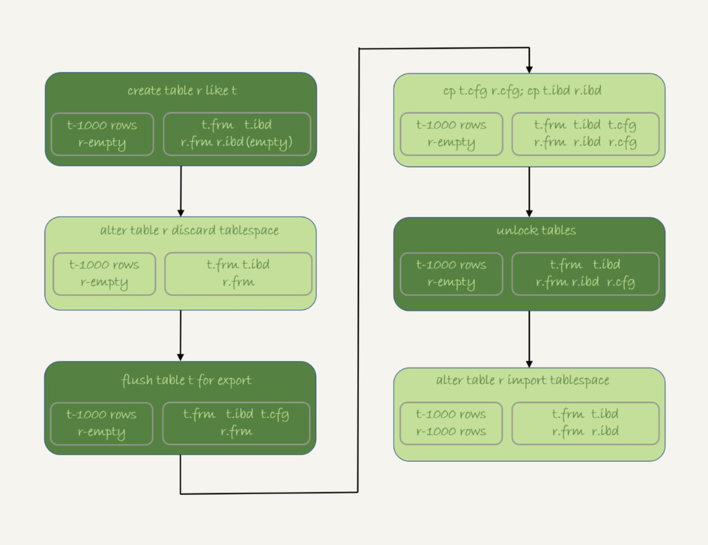](https://leokongwq.github.io/2018/12/21/geektime-mysql-learn/2407737651cdc1f5d6ade4d8907e7c05.jpg)

关于拷贝表的这个流程，有以下几个注意点：

1. 在第 3 步执行完 flsuh table 命令之后，db1.t 整个表处于只读状态，直到执行 unlock tables 命令后才释放读锁；
2. 在执行 import tablespace 的时候，为了让文件里的表空间 id 和数据字典中的一致，会修改 t.ibd 的表空间 id。而这个表空间 id 存在于每一个数据页中。因此，如果是一个很大的文件（比如 TB 级别），每个数据页都需要修改，所以你会看到这个 import 语句的执行是需要一些时间的。当然，如果是相比于逻辑导入的方法，import 语句的耗时是非常短的。

**本文标题:**[极客时间mysql学习笔记](https://leokongwq.github.io/2018/12/21/geektime-mysql-learn.html)

**文章作者:**[kongwenqiang](https://leokongwq.github.io/)

**发布时间:**2018-12-21, 13:48:17

**最后更新:**2019-03-12, 20:02:32

**原始链接:**https://leokongwq.github.io/2018/12/21/geektime-mysql-learn.html 

**许可协议:** ["署名-非商用-相同方式共享 4.0"](http://creativecommons.org/licenses/by-nc-sa/4.0/) 转载请保留原文链接及作者。