**作者介绍**

**蒋健，**薄冰科技创始人，Oracle ACE，11g OCM，多年Oracle设计、管理及实施经验，精通数据库优化。

 

在众多的SQL审核产品中，几乎都会提到一个审核规则，即`select *`，规则描述几乎一致：`禁止使用select *，必须明确选择所需的列`。而这个规则其实有着很多真实的生产故障案例，下面介绍几个比较常见的案例：

 

 

##  

**案例 1**

 

用户反馈生产环境有两条SQL语句，可以确认区别只有表名的不同（实际参数相同），但性能上却有10倍以上的差距。

 

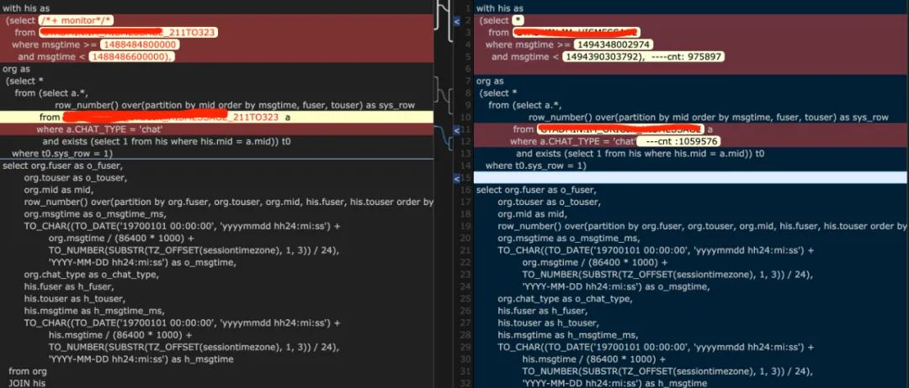

 

通过生成的监视报告可发现SQL1执行时间8s，IO 403MB，如下图：

 

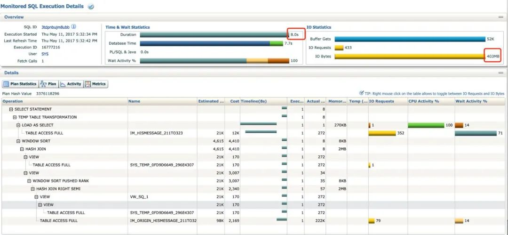

 

SQL2 执行时间2.1m，IO则有15GB，如下图：

 

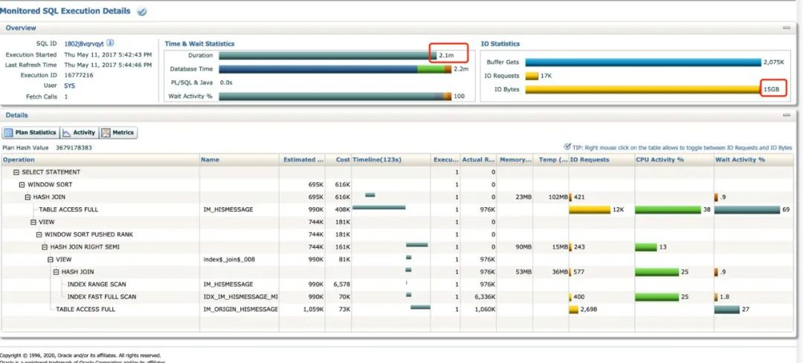

 

根据业务反馈，SQL1中表是影子表，数据量，表结构跟对应表几乎相同，那么为什么执行时间差距这么大呢？

 

DBA在此之前已经在准生产环境多次通过`DBMS_SHARED_POOL.PURGE`删除对应的执行计划，换参数多次重复解析，均没获得正确的执行计划。

 

通过分析对比监视报告发现，SQL1中with语句正常物化，执行计划中存在临时表转化操作，即`TEMP TABLE TRANSFORMATION`，而SQL2中由于没做临时表转化操作，`IM_HISMESSAGE`表被访问多次，效率低下。

 

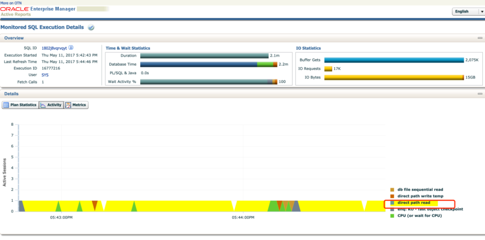

 

通过再次观察整个SQL运行期间的等待事件，我们可以快速发现，其实SQL慢了10倍的原因并非是执行计划引起的（主要等待事件为直接路径读，读写临时表比例很低，而且并没有出现经典的大表作为NL被驱动表的情况），对比运行数据，可以发现IO的增量主要来源于对`IM_HISMESSAGE`表的扫描。

 

###  

 

**影子表的差异**

 

通过逐行对比号返回列的详细信息，我们终于发现了谜底：

 

原始表是有LOB字段的，影子表没有LOB字段，IO量小了很多。同时由于存在LOB字段，with语句无法进行临时表转化。

 

而SQL文本中经典的 select 则完美的掩盖了这一差异，开发人员图方便写出来的 select * 查询了根本不需要的LOB字段，导致了性能的急剧下降。

 

##  

 

**案例 2**

 

客户生产环境的AWR报告上有一条夸张的TOPSQL，占全天DBTIME的84%

 

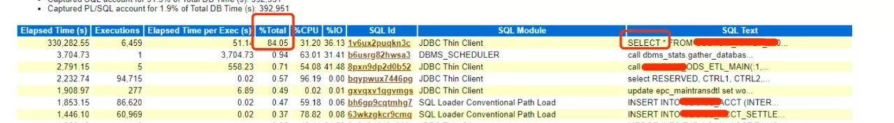

 

原始SQL不展示了，SQL本身其实比较简单，模拟下来如下：

 

 

select * from test_a where object_id =11;

 

执行计划也很简单，所以很快也能发现问题，`TABLE ACCESS BY INDEX ROWID`的COST相对异常的高，排查下表的统计信息时，惊奇的发现，这是张宽表，有400+列，当宽表遇上`select *`时，性能就急剧下降了。

 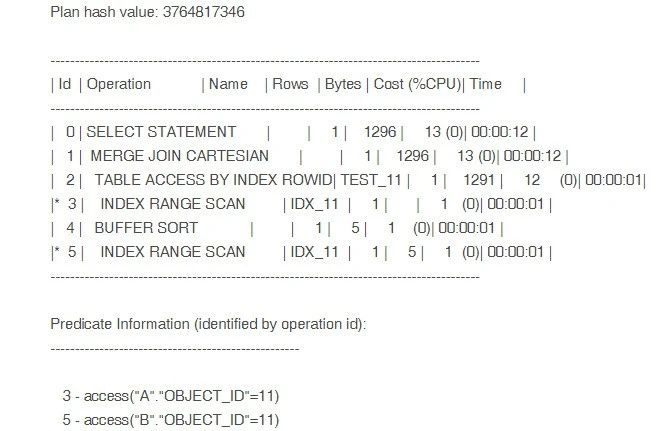

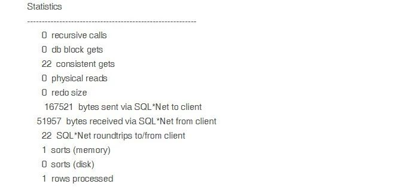

 

问题定位虽然很快，但处理起来却并不方便，毕竟需要找到开发改SQL，这快不了。当然没什么疑问的是，系统的性能问题出在SQL代码的质量。

 

##  

 

**案例 3**

 

准备环境如下：从`dba_objects`中复制两张表t1，t2作为测试环境表。

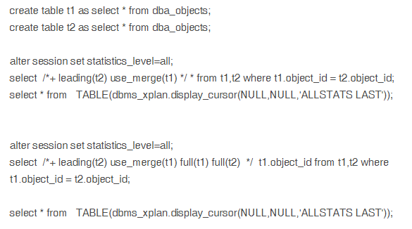

 

准备了两个查询，相同的条件，区别主要在于一个只查单列，另外一个查询全列。

 

通过模拟，可以发现，`use_merge`这种表连接方式情况下，排序操作的内存消耗有较大的差距，这种差距会在有索引情况下，且指定查询列也能命中索引走索引快速全扫描时被大幅放大。

 

查询全列，`SORT JOIN`内存消耗 1810K：

 

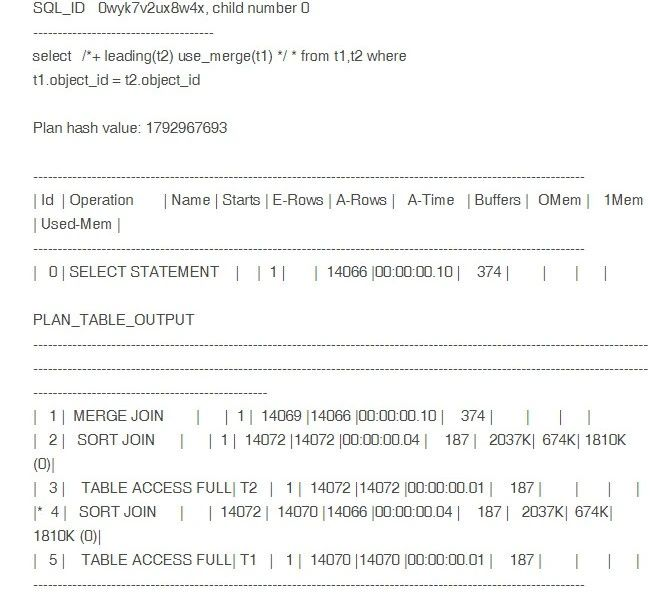

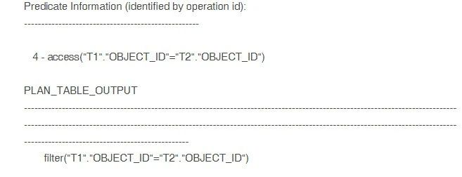

 

查询id，`SORT JOIN`内存消耗 424K：

 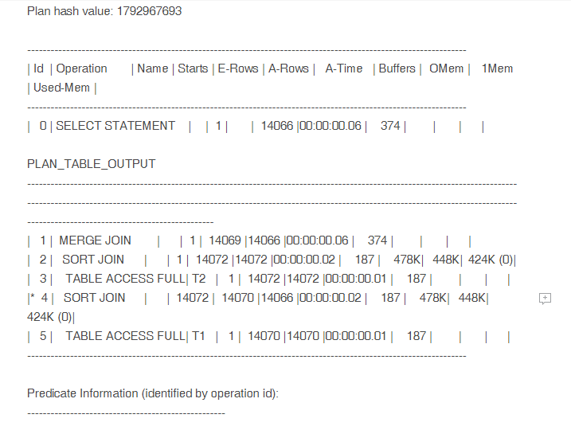

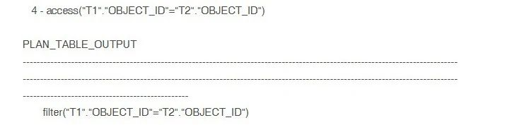

 

如果是HASH JOIN的话，join操作影响相对较小，可以换hint再测试看看。

 

##  

**案例 4**

 

有些场景，SQL查询的表数据量较大，查询字段也较多（无法全部走索引）的时候，这里暂时不考虑`*`增加的不需要使用的列在数据库返回数据到应用时网络层的消耗。

 

如果你的机器刚好是EXADATA，那么`smart scan`也会让`select *`与指定列的查询有明显的性能差异。

 

这个限于篇幅推荐直接参考Oracle官方技术博客：

https://blogs.oracle.com/exadatacn/exadata-v5

 

##  

 

**总结**

 

通过这些案例，`select *`这个规则，变得立体了许多。

 

`select *`写法方便快捷，但带来的问题却藏得很深，这种问题在上线后，随着系统的维护，都将变成修复成本极高的隐患。