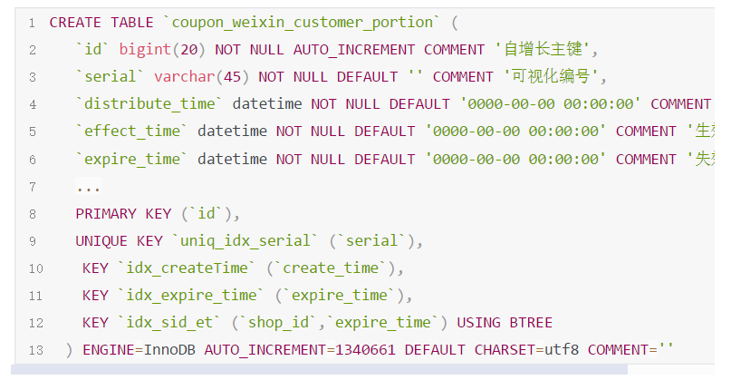
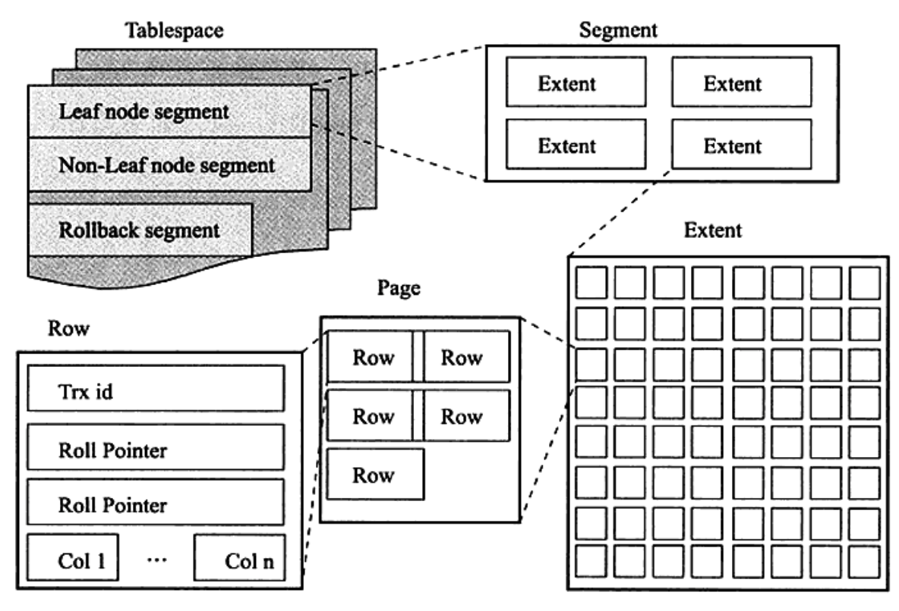
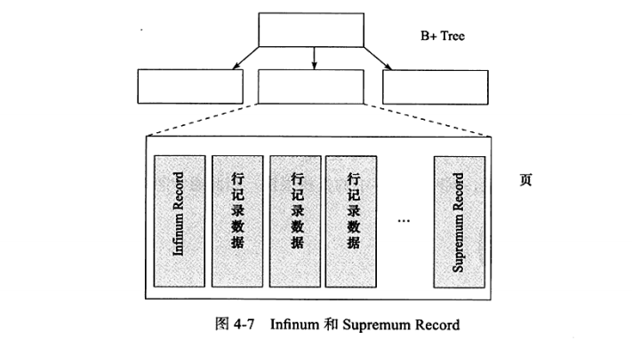
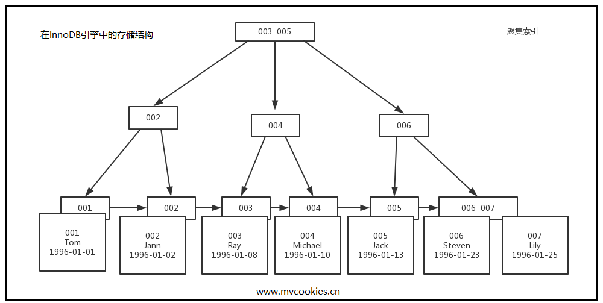

查询。在监控中，我们也没发现任何锁表的情况。这让我产生的疑惑。接着，我翻看了这个老代码的实现，存在的delete 的操作。这让我有些惊愕。查了一下当前表的碎片化程度，发现很高，经过一番查找资料和验证，让我确信了是系统长年的delete 导致表的碎片化高导致db 在查表的时候 cpu 性能会大幅下滑。

```
SELECT table_schema db, table_name, data_free, ENGINE   
FROM information_schema.tables 
WHERE table_schema NOT IN ('information_schema', 'mysql') AND data_free > 0 ORDER BY data_free DESC;`
```

好了，问题已经知道，先处理问题，后面再深入探究： 处理碎片化一般有几种方法：

- 1）全表truncate ，把全表数据清掉，mysql 就会回收表空间（单表的碎片化高，主要集中再表空间，而不是公共空间）。
- 2）OPTIMIZE TABLE，OPTIMIZE TABLE 会重组表和索引的物理存储，减少对存储空间使用和提升访问表时的IO效率。OPTIMIZE TABLE的支持表类型：INNODB,MYISAM, ARCHIVE，NDB；它会重组表数据和索引的物理页，对于减少所占空间和在访问表时优化IO有效果。OPTIMIZE 操作会暂时锁住表,而且数据量越大,耗费的时间也越长。所以需要在业务闲时处理。
- 3）建一张新表，改表名，改为业务表名（旧表当然也改名啦），然后就OPTIMIZE TABLE。
- 3）为了减少碎片，代码实现加个del_flag，用update 删除。

深入分析：[MySQL表的碎片整理和空间回收小结](https://www.cnblogs.com/kerrycode/p/10943122.html) 这个写的很透彻了。

在处理完，这次的问题后，可以留下以下几个反思：

1. 碎片化是怎么导致 ？
2. 什么原因导致I/O 飙升，导致CPU 高负载？

首先我们的表结构：



首先，我们要深入了解这个问题，先了解一下MySQL的储值结构。 从InnoDB存储引擎的逻辑结构看，所有数据都被逻辑地存放在一个空间内，称为表空间，而表空间由段（sengment）、区（extent）、页（page）组成。ps：页在一些文档中又称块（block）。



## 一、表空间（table space）

表空间分为了两种，这里简单的概括一下：

1. 独立表空间：每一个表都将会生成以独立的文件方式来进行存储，每一个表都有一个.frm表描述文件，还有一个.ibd文件。 其中这个文件包括了单独一个表的数据内容以及索引内容，默认情况下它的存储位置也是在表的位置之中。
2. 共享表空间： Innodb的所有数据保存在一个单独的表空间里面，而这个表空间可以由很多个文件组成，一个表可以跨多个文件存在，所以其大小限制不再是文件大小的限制，而是其自身的限制。从Innodb的官方文档中可以看到，其表空间的最大限制为64TB，也就是说，Innodb的单表限制基本上也在64TB左右了，当然这个大小是包括这个表的所有索引等其他相关数据。 InnoDB把数据保存在表空间内，表空间可以看作是InnoDB存储引擎逻辑结构的最高层。本质上是一个由一个或多个磁盘文件组成的虚拟文件系统。InnoDB用表空间并不只是存储表和索引，还保存了回滚段、双写缓冲区等。

## 二、段（segment）

表空间是由各个段组成的，常见的段有数据段、索引段、回滚段等。

## 三、区（extent）

区是由连续的页（Page）组成的空间，在任何情况下每个区大小都为1MB，为了保证页的连续性，InnoDB存储引擎每次从磁盘一次申请4-5个区。默认情况下，InnoDB存储引擎的页大小为16KB，即一个区中有64个连续的页。 （1MB／16KB=64） InnoDB1.0.x版本开始引入压缩页，每个页的大小可以通过参数KEY_BLOCK_SIZE设置为2K、4K、8K，因此每个区对应的页尾512、256、128. InnpDB1.2.x版本新增了参数innodb_page_size，通过该参数可以将默认页的大小设置为4K、8K，但是页中的数据不是压缩的。 但是有时候为了节约磁盘容量的开销，创建表默认大小是96KB，区中是64个连续的页。（对于一些小表）

## 四、页（Page）

页是InnoDB存储引擎磁盘管理的最小单位，每个页默认16KB；InnoDB存储引擎从1.2.x版本碍事，可以通过参数innodb_page_size将页的大小设置为4K、8K、16K。若设置完成，则所有表中页的大小都为innodb_page_size，不可以再次对其进行修改，除非通过mysqldump导入和导出操作来产生新的库。 innoDB存储引擎中，常见的页类型有：

- 1. 数据页（B-tree Node)
- 1. undo页（undo Log Page）
- 1. 系统页 （System Page）
- 1. 事物数据页 （Transaction System Page）
- 1. 插入缓冲位图页（Insert Buffer Bitmap）
- 1. 插入缓冲空闲列表页（Insert Buffer Free List）
- 1. 未压缩的二进制大对象页（Uncompressed BLOB Page）
- 1. 压缩的二进制大对象页 （compressed BLOB Page）

ps：同一个数据库实例的所有表空间都有相同的页大小；默认情况下，表空间中的页大小都为 16KB，当然也可以通过改变 innodb_page_size 选项对默认大小进行修改，需要注意的是不同的页大小最终也会导致区大小的不同：

五、行（row） InnoDB存储引擎是面向列的（row-oriented)，也就是说数据是按行进行存放的（如下图），每个页存放的行记录也是有硬性定义的，最多允许存放16KB/2-200，即7992行记录。 

案例：假设有一张学生表，id为主键

| id   | name    | birthday   |
| ---- | ------- | ---------- |
| 1    | Tom     | 1996-01-01 |
| 2    | Jann    | 1996-01-04 |
| 3    | Ray     | 1996-01-08 |
| 4    | Michael | 1996-01-10 |
| 5    | Jack    | 1996-01-13 |
| 6    | Steven  | 1996-01-23 |
| 7    | Lily    | 1996-01-25 |

数据存储就是这样，整个树状图 就是一个 page 

好了，了解到MySQL是怎么存储数据的，我们看看接下来，MySQL 是如何读取数据的。


MySQL 读取数据的逻辑图，就是这样，I/O 消耗主要在 磁盘缓冲区 --> 磁盘 读取数据这里。他的读取是按MySQL 的最小读取单位 Page 读取的。即是，你读取 1行数据 和 读取 一个Page 最大的行数据 7992行，没区别。

我们必须记住一个页包含了多条记录，我们可能需要该页上的所有行，也可能是其中一部分，或者是一行，但所花费的成本都是相同的，读取一个页，需要一次随机I/O,大约需要10ms的时间。

当然，众所周知，虽然索引可以提高查询速度，但是它们也会导致数据库系统更新数据的性能下降，因为大部分数据更新需要同时更新索引。

 具体的耗时，大概是这样的：


回到原问题：delete from table_name where 条件删除数据后，数据表占用的空间大小不会变。

假设，我们要删掉 003 Ray 这个记录，InnoDB 引擎只会把 003 这个记录标记为删除。如果之后要再插入一个 ID 在 003 和 005 之间的记录时，可能会复用这个位置。但是，磁盘文件的大小并不会缩小。但是， 我们采用的是主键自增，so, 这个碎片空间基本不会被复用。

这就是我们“空洞”碎片的产生，整个情况可以参考这篇文：[<为什么表数据删掉一半，表文件大小不>](https://blog.csdn.net/qq_41936805/article/details/98436924)

看到这里，也应该差不多了，我基本猜到 I/O 导致CPU 高负载的 点 就是读Page 了， 因为碎片太多，读取Page 的时候伴随着读取了大量的无用的碎片Page 导致I/O 高，磁盘缓冲区的预读，也就失效了。（查询是带了，时间参数的，同时时间参数也有索引）

ps: 如果pk非自增的, insert 在 Page 分裂的时候，也是会产生 碎片的。

1. drop table table_name 立刻释放磁盘空间 ，不管是 Innodb和MyISAM ；
2. truncate table table_name立刻释放磁盘空间 ，不管是 Innodb和MyISAM;
3. delete from table_name 删除表的全部数据，对于MyISAM 会立刻释放磁盘空间 ，而InnoDB 不会释放磁盘空间；
4. delete from table_name where xx 带条件的删除, 不管是innodb还是MyISAM都不会释放磁盘空间；

**思考**：这里还有一个问题，碎片化到什么程度，才能开始才会导致I/O 性能急剧下降，这个还没对DB 做个测试。希望有做过这方面测试的分享一下。

# 参考

- 【1】[MySQL表的碎片整理和空间回收小结](https://www.cnblogs.com/kerrycode/p/10943122.html)
- 【2】[8G内存下MySQL的优化详细方案](https://www.cnblogs.com/52php/p/5675350.html)
- 【3】[MySQL InnoDB 逻辑存储结构](https://www.cnblogs.com/wilburxu/p/9429014.html)
- 【4】[MySQL索引原理及BTree（B-/+Tree）结构详解](https://blog.csdn.net/u013967628/article/details/84305511)
- 【5】[图解MySQL索引--B-Tree（B+Tree）](https://www.cnblogs.com/liqiangchn/p/9060521.html)
- 【6】[MySQL是怎样运行的(一) ——数据页](https://blog.csdn.net/itguangit/article/details/100932004?depth_1-utm_source=distribute.pc_relevant.none-task&utm_source=distribute.pc_relevant.none-task)
- 【7】[MySQL内核InnoDB存储引擎详解](https://www.linuxidc.com/Linux/2019-01/156387.htm)
- 【8】[为什么表数据删掉一半，表文件大小不变？](https://blog.csdn.net/qq_41936805/article/details/98436924)
- 【9】[漫谈数据库索引(推荐)](https://kb.cnblogs.com/page/45712/)